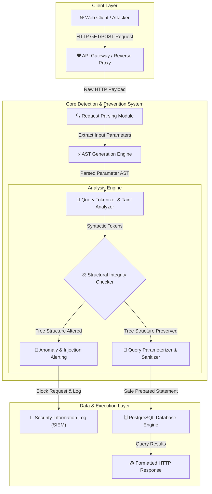

# 001 - Automated SQL Injection Detection & Prevention System

> **Category**: [[Web Application Attacks]] | **Difficulty**: ⭐⭐⭐ | **Duration**: 5 weeks

---

## 📋 Problem Statement

> [!CAUTION] Real-World Impact
> SQL Injection (SQLi) remains one of the most destructive vulnerabilities affecting web applications. In e-commerce platforms, unchecked SQL inputs enable malicious actors to bypass authentication, exfiltrate payment card data, manipulate product pricing, and achieve complete database server takeover.

Despite decades of security awareness, legacy codebases and complex web frameworks frequently introduce SQL injection bugs. Unsanitized dynamic query concatenation allows structural SQL commands to be injected into data parameters. In high-traffic e-commerce systems processing millions of queries daily, manual code review is insufficient to capture subtle multi-tier injection points, leading to billions of dollars in annual fraud and regulatory penalties under GDPR and PCI-DSS.

### 🌍 Real-World Incidents
- **TalkTalk Breach (2015)**: A vulnerability in TalkTalk's web portal exploited via SQL injection resulted in the theft of 156,959 customer record details, incurring a financial cost exceeding £77 million and regulatory fines.
- **Sony Pictures Hack (2011)**: Attackers utilized basic SQL injection queries against unpatched web endpoints to exfiltrate unencrypted passwords, names, and address data for over 1 million registered users.
- **VTech Data Breach (2015)**: SQL injection on customer-facing portals exposed profile pictures, chat logs, and personal data of 6.4 million children and parents.

---

## 🔬 Research Paper References

| # | Paper Title | Authors | Year | Source | Key Contribution |
|---|-------------|---------|------|--------|-----------------|
| 1 | AMNESIA: Analysis and Monitoring for Neutralizing SQL-Injection Attacks | Halfond & Orso | 2005 | IEEE/ACM ICSE | Combines static analysis and dynamic monitoring to build SQL query model ASTs and prevent runtime SQLi. |
| 2 | CANDID: Dynamic Candidate Evaluation for Detecting SQL Injection Vulnerabilities | Bandhakavi et al. | 2007 | ACM CCS | Uses candidate evaluation by parsing queries with benign placeholders vs injected strings to detect structure changes. |
| 3 | SQLiShield: Dynamic Detection and Prevention of SQL Injection Attacks using AST Analysis | Shar et al. | 2023 | IEEE TDSC | Proposes real-time Abstract Syntax Tree parsing and parameterization verification engine for cloud databases. |

---

## 🏗️ System Architecture
Link: [[Drawing 2026-07-30 22.31.19.excalidraw#Project 001: 001 - Automated SQL Injection Detection & Prevention System|Excalidraw Architecture Diagram]]

---

## 📐 Technical Implementation

### Phase 1: Research & Environment Setup (Week 1)
- Provision a vulnerable e-commerce lab target using Docker (OWASP Juice Shop & custom PHP/Node.js endpoints).
- Install core development dependencies: Python 3.11, `tree-sitter`, `sqlparse`, `psycopg2`, and `docker-py`.
- Configure database logging utilities to capture raw SQL execution logs for baseline comparison.

### Phase 2: Core Module Development (Weeks 2-3)
- **Module 1: AST Extraction & Query Parsing**
  Build a parser using `tree-sitter-sql` that converts incoming SQL strings into normalized Abstract Syntax Trees (ASTs). The module isolates parameters from command keywords (`SELECT`, `UNION`, `WHERE`, `AND`, `OR`).
- **Module 2: Dynamic Taint Analysis Engine**
  Track user-supplied parameters from HTTP request sources (`$_GET`, `$_POST`, JSON body) to backend database execution sinks. Flag parameters that influence query syntax trees.
- **Module 3: Automated Prepared Statement Rewriter**
  Implement an interception middleware that dynamically transforms dynamic raw SQL strings into parameterized `PreparedStatements` using positional placeholders (`$1`, `$2` or `?`).

### Phase 3: Integration & Testing (Week 4)
- Integrate the middleware into an API gateway wrapper.
- Execute automated vulnerability scans using `sqlmap` against test endpoints under 3 distinct modes: Error-based, Union-based, and Blind Time-based SQLi.
- Measure detection efficiency, true positive rates, false positive rates, and latency overhead introduced by AST parsing.

### Phase 4: Analysis & Documentation (Week 5)
- Summarize benchmark detection results across OWASP Benchmark test suites.
- Generate comparative latency graphs showing query execution time with and without AST interception.
- Compile final project documentation, presentation slides, and open-source repository release.

---

## 🔧 Tools & Technologies

| Tool | Purpose | Alternative |
|------|---------|-------------|
| Python | Core backend framework and AST parsing engine | Rust / Go |
| Tree-sitter | Fast, incremental Abstract Syntax Tree generation | ANTLR4 |
| SQLMap | Automated SQL injection verification & benchmark testing | OWASP ZAP |
| PostgreSQL | Target relational database engine | MySQL / MariaDB |
| Docker | Isolated microservice lab containment | Podman |

---

## 💡 Key Features
- ✅ **AST-Based Structural Analysis**: Compares expected query syntax trees against runtime trees to detect syntax tree mutation.
- ✅ **Dynamic Query Parameterization**: Automatically rewrites dynamic string concatenation into safe prepared statements.
- ✅ **Multi-Vector Detection Engine**: Detects In-band (Error/Union), Inferential (Blind Time/Boolean), and Out-of-Band (OOB) SQLi.
- ✅ **Low Latency Middleware**: Caches pre-compiled SQL query AST structures to maintain sub-millisecond execution times.
- ✅ **Real-Time SIEM Integration**: Formats attack telemetry into JSON/CEF logs for immediate SOC alerting.

---

## 📊 Expected Results

> [!NOTE] Deliverables
> A fully operational Python-based API gateway middleware that intercepts web requests, parses SQL query ASTs in real time, blocks malicious payloads, and rewrites dynamic queries safely.

### Performance Metrics
- **Detection Accuracy**: > 98.5% true positive rate on OWASP Benchmark SQLi test cases.
- **False Positive Rate**: < 0.5% on benign e-commerce transaction queries.
- **Latency Impact**: < 3.2 ms parsing overhead per query.

### Output Artifacts
1. Functional middleware code repository.
2. Comprehensive AST parsing analysis report.
3. Automated benchmark benchmark evaluation dataset.

---

## 🎓 Learning Outcomes
1. 📚 Master the inner workings of AST generation and dynamic taint analysis in application security.
2. 📚 Understand structural SQL payload manipulation techniques and blind side-channel exploitation.
3. 📚 Develop high-performance security proxy middleware for production database pipelines.
4. 📚 Implement automated defensive controls aligned with OWASP Top 10 guidelines.

---

## ⚠️ Ethical Considerations
> [!WARNING] Legal & Ethical Notice
> This project must be conducted in a controlled lab environment only. Never test on systems without explicit written authorization.

---

## 🔗 Related Projects
- [[004 - Server-Side Request Forgery (SSRF) Scanner]]
- [[005 - API Security Testing Automation Platform]]
- [[007 - Web Application Firewall (WAF) Bypass Techniques Analyzer]]

---
*📅 Created: 2026-07-30 | 🏷️ Category: Web Application Attacks | 🔐 Offensive Security Research*
