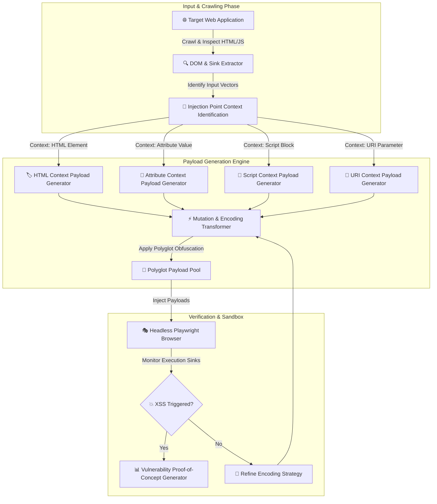

# 002 - XSS Payload Generator with Context-Aware Encoding

> **Category**: [[Web Application Attacks]] | **Difficulty**: ⭐⭐ | **Duration**: 4 weeks

---

## 📋 Problem Statement

> [!CAUTION] Real-World Impact
> Cross-Site Scripting (XSS) allows attackers to inject malicious scripts into trusted web applications. In financial portals and online banking interfaces, XSS vulnerabilities allow adversaries to steal session tokens, manipulate DOM elements to spoof transaction confirmations, and perform silent wire transfers.

Standard sanitization mechanisms often fail when security developers apply generic HTML entity encoding to parameters rendered inside specialized JavaScript blocks, inline event handlers, dynamic URLs, or CSS attributes. Context-aware payload generation demonstrates how context mismatch vulnerabilities can be systematically uncovered and neutralized by testing browsers against complex polyglot encodings.

### 🌍 Real-World Incidents
- **Yahoo Mail XSS (2015)**: A stored XSS flaw in Yahoo Mail allowed attackers to execute script code whenever a user opened a specially crafted email, compromising session cookies for over 300 million users.
- **Samy Worm on MySpace (2005)**: The fastest-spreading web worm in history utilized a polyglot XSS payload in user profiles to force 1+ million users to add the author as a friend within 20 hours.
- **British Airways Magecart Attack (2018)**: Malicious JavaScript injected via third-party web script dependencies skimmed payment card data of 380,000 customers over a 2-week period.

---

## 🔬 Research Paper References

| # | Paper Title | Authors | Year | Source | Key Contribution |
|---|-------------|---------|------|--------|-----------------|
| 1 | ScriptGard: Automatic Context-Sensitive Sanitization for Large Scale Web Applications | Saxena et al. | 2011 | ACM CCS | Introduces dynamic context analysis to automatically repair improper sanitization functions in web apps. |
| 2 | DOMXSS Step-by-step: Precise and Automated Detection of DOM-based XSS | Lekies et al. | 2013 | USENIX Security | Utilizes taint tracking in web browser engines to trace data flows from HTML sinks to executable JS sinks. |
| 3 | Context-Aware Automated XSS Payload Generation and Sanitization Validation | Melicher et al. | 2021 | IEEE S&P | Analyzes context boundaries in modern web frameworks and presents automated polyglot test generation algorithms. |

---

## 🏗️ System Architecture
Link: [[Drawing 2026-07-30 22.31.19.excalidraw#Project 002: 002 - XSS Payload Generator with Context-Aware Encoding|Excalidraw Architecture Diagram]]

---

## 📐 Technical Implementation

### Phase 1: Research & Environment Setup (Week 1)
- Set up a testbed featuring various XSS injection sinks (Node.js/Express app rendering inputs in 6 distinct contexts).
- Install core tools: Python 3.11, Node.js, `playwright`, `jsbeautifier`, and `DOMPurify`.
- Study browser parsing behaviors across HTML tokenizer, CSS parser, and JavaScript engine transition boundaries.

### Phase 2: Core Module Development (Weeks 2-3)
- **Module 1: Context Detection Engine**
  Develop a parser that evaluates where an input lands inside a target DOM template: HTML Body, Double-quoted Attribute, Single-quoted Attribute, Inline JS Variable, CSS Property, or URL Scheme.
- **Module 2: Context-Aware Payload Mutator**
  Construct targeted payloads tailored to escape specific syntactic boundaries (e.g., `</script><script>...`, `" autofocus onfocus=...`, `javascript:...`).
- **Module 3: Polyglot Payload Generator**
  Generate multi-context polyglot strings capable of executing across multiple parser states simultaneously.
- **Module 4: Headless Execution Validator**
  Automate browser sandbox testing via Playwright to verify `alert()`, `console.log()`, or `fetch()` callback triggers.

### Phase 3: Integration & Testing (Week 4)
- Run payload generator against standard sanitization libraries (OWASP Java Encoder, DOMPurify, custom regex replacements).
- Evaluate bypass efficacy against incomplete regex filters and mismatched entity encoders.

### Phase 4: Analysis & Documentation (Week 5)
- Document context escaping techniques and compile an encoding matrix for application developers.
- Prepare guidelines for implementing context-aware output encoding using modern template engines (React JSX, Angular templates).

---

## 🔧 Tools & Technologies

| Tool | Purpose | Alternative |
|------|---------|-------------|
| Python | Payload generation & mutation logic | TypeScript |
| Playwright | Headless browser execution verification | Selenium / Puppeteer |
| DOMPurify | Benchmark client-side sanitization evaluation | Sanitizer API |
| CyberChef | Payload encoding and obfuscation analysis | Burp Suite Encoder |

---

## 💡 Key Features
- ✅ **Dynamic Context Recognition**: Identifies 6 distinct DOM rendering contexts automatically.
- ✅ **Polyglot Payload Synthesis**: Constructs minimal payloads capable of triggering across HTML, attribute, and JS states.
- ✅ **Automated Browser Proofing**: Uses Playwright to confirm code execution without manual browser interaction.
- ✅ **Filter Bypass Heuristics**: Generates obfuscated payloads (Unicode, Hex, HTML Entities, String concatenation) to evade simple filters.
- ✅ **Remediation Recommendation**: Maps identified context flaws directly to correct encoding methods.

---

## 📊 Expected Results

> [!NOTE] Deliverables
> A tool that dynamically scans target web parameters, determines DOM injection context, generates custom context-escaped polyglots, and verifies execution safely inside a headless browser.

### Performance Metrics
- **Context Classification Accuracy**: > 99% across standard HTML5/JS templates.
- **Payload Verification Speed**: < 1.5 seconds per payload attempt via headless pool.
- **Bypass Detection Rate**: Identifies > 90% of mismatched sanitization implementations.

### Output Artifacts
1. Executable Python/Playwright test engine.
2. Matrix of XSS contexts and corresponding sanitization rules.
3. Detailed experimental benchmarking report.

---

## 🎓 Learning Outcomes
1. 📚 Understand browser HTML/JS/CSS parser state transitions and boundary breaks.
2. 📚 Master context-aware output encoding principles across modern web architectures.
3. 📚 Build automated headless browser verification pipelines for application security.
4. 📚 Differentiate between Reflected, Stored, and DOM-based Cross-Site Scripting.

---

## ⚠️ Ethical Considerations
> [!WARNING] Legal & Ethical Notice
> This project must be conducted in a controlled lab environment only. Never test on systems without explicit written authorization.

---

## 🔗 Related Projects
- [[003 - CSRF Token Analyzer & Bypass Framework]]
- [[011 - Browser Extension Security Analyzer]]
- [[012 - Content Security Policy (CSP) Bypass Research Tool]]

---
*📅 Created: 2026-07-30 | 🏷️ Category: Web Application Attacks | 🔐 Offensive Security Research*
