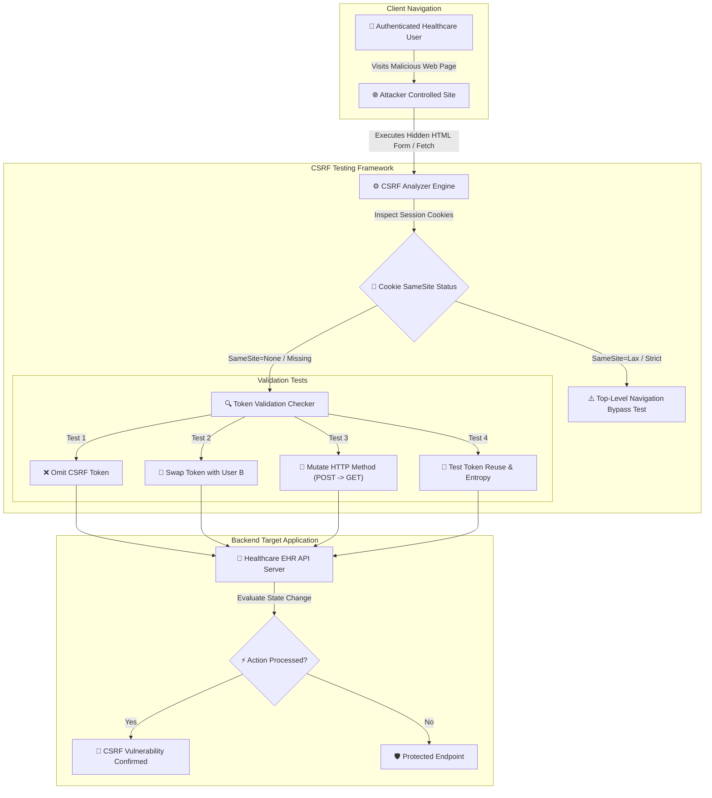

# 003 - CSRF Token Analyzer & Bypass Framework

> **Category**: [[Web Application Attacks]] | **Difficulty**: ⭐ | **Duration**: 3 weeks

---

## 📋 Problem Statement

> [!CAUTION] Real-World Impact
> Cross-Site Request Forgery (CSRF) forces an authenticated end user to execute unwanted actions on a trusted web application. In healthcare management platforms, CSRF attacks allow malicious third-party sites to silently modify patient electronic health records (EHR), alter prescriptions, or transfer sensitive medical profiles without the user's awareness.

While CSRF tokens and `SameSite` cookie attributes are standard mitigations, flawed implementations—such as static tokens, missing validation on specific HTTP methods, token reuse across sessions, or misconfigured CORS headers—leave web applications vulnerable to request forgery attacks.

### 🌍 Real-World Incidents
- **Netflix CSRF Bug (2006)**: Vulnerabilities in Netflix allowed attackers to issue CSRF requests that added DVDs to user rental queues, changed shipping addresses, and compromised account credentials.
- **ING Direct Banking CSRF (2008)**: Flaws in ING Direct's transactional workflow enabled attackers to initiate unauthorized funds transfers between accounts using forced HTTP POST requests.
- **YouTube CSRF Vulnerability (2008)**: Attackers exploited CSRF flaws to perform actions on behalf of logged-in YouTube users, including adding videos to favorites, subscribing to channels, and sending messages.

---

## 🔬 Research Paper References

| # | Paper Title | Authors | Year | Source | Key Contribution |
|---|-------------|---------|------|--------|-----------------|
| 1 | Robust Defenses for Cross-Site Request Forgery | Barth et al. | 2008 | ACM CCS | Evaluates Origin header validation and secret token patterns for anti-CSRF defenses. |
| 2 | De-anonymizing Web Users Through CSRF Attacks | De Ryck et al. | 2012 | IEEE S&P | Demonstrates cross-site timing and state-changing request techniques for user tracking. |
| 3 | Evaluating SameSite Cookie Attribute Effectiveness Against CSRF | Calzavara et al. | 2022 | NDSS | Analyzes real-world deployment challenges and bypass vectors of SameSite cookie policies. |

---

## 🏗️ System Architecture
Link: [[Drawing 2026-07-30 22.31.19.excalidraw#Project 003: 003 - CSRF Token Analyzer & Bypass Framework|Excalidraw Architecture Diagram]]

---

## 📐 Technical Implementation

### Phase 1: Research & Environment Setup (Week 1)
- Build a Python Flask lab target hosting healthcare EHR operations (e.g., `POST /patient/update-prescription`).
- Set up proxy utilities (Burp Suite API / OWASP ZAP) to intercept session traffic.
- Study SameSite cookie rules (`Strict`, `Lax`, `None`), Chrome top-level GET navigation exceptions, and CORS Preflight rules.

### Phase 2: Core Module Development (Weeks 2-3)
- **Module 1: Cookie & Header Policy Assessor**
  Extract session cookie attributes and check for `SameSite`, `HttpOnly`, and `Secure` flags alongside CORS `Access-Control-Allow-Origin` values.
- **Module 2: Token Entropy & Freshness Analyzer**
  Measure randomness in generated CSRF tokens using Shannon entropy metrics and check if tokens change across authentication sessions.
- **Module 3: Method & Payload Bypass Fuzzer**
  Automate structural variations: omitting token parameters, converting `POST` requests to `GET`, substituting tokens from different active user sessions, and stripping custom headers (`X-Requested-With`).
- **Module 4: Automated PoC Form Generator**
  Generate ready-to-run HTML proof-of-concept auto-submitting forms and JavaScript `fetch()` payloads.

### Phase 3: Integration & Testing (Week 4)
- Run the framework against vulnerable healthcare scenarios in local Docker containers.
- Evaluate CSRF mitigation effectiveness across Double-Submit Cookie patterns vs Synchronizer Token patterns.

### Phase 4: Analysis & Documentation (Week 5)
- Document anti-CSRF implementation guidelines for modern single-page applications (SPAs).
- Provide architectural recommendations for combining `SameSite=Lax` cookies with custom header verification (`X-CSRF-Token`).

---

## 🔧 Tools & Technologies

| Tool | Purpose | Alternative |
|------|---------|-------------|
| Python | Automated HTTP interceptor and analyzer | Node.js |
| Flask | Vulnerable target API development framework | Django / Express |
| Burp Suite | Session interception and manual validation | OWASP ZAP |
| SameSite Inspector | Browser cookie behavior analysis | Chrome DevTools |

---

## 💡 Key Features
- ✅ **Automated Token Flaw Detection**: Tests for token omission, parameter tampering, and token swapping across user accounts.
- ✅ **SameSite Policy Inspector**: Analyzes cookie flags and identifies edge-case top-level navigation vectors.
- ✅ **Token Entropy Metrics**: Evaluates cryptographic randomness to detect predictable token generation algorithms.
- ✅ **HTTP Method Switch Verification**: Identifies backends that validate tokens on `POST` but ignore validation on `GET` or `PUT`.
- ✅ **Auto-PoC Generator**: Creates standalone HTML files demonstrating exploit feasibility for security reports.

---

## 📊 Expected Results

> [!NOTE] Deliverables
> A Python-based assessment framework that inspects web application session flows, evaluates anti-CSRF protections, tests bypass vectors, and outputs security posture reports.

### Performance Metrics
- **Assessment Speed**: Scans an endpoint authorization flow in under 3 seconds.
- **Bypass Flaw Identification**: 100% detection rate on standard CSRF misconfiguration benchmarks.
- **PoC Accuracy**: Generates functional HTML exploit proofs for confirmed vulnerable endpoints.

### Output Artifacts
1. Python CSRF assessment tool.
2. Auto-generated HTML exploit proof-of-concept templates.
3. Remediation guide for Double-Submit Cookie and SameSite implementation.

---

## 🎓 Learning Outcomes
1. 📚 Gain a detailed understanding of cross-site request forgery mechanics and browser cookie scope.
2. 📚 Analyze SameSite cookie policies, CORS interaction, and browser security models.
3. 📚 Implement robust anti-CSRF protections using Synchronizer Tokens and Custom Request Headers.
4. 📚 Conduct state-change vulnerability assessments on REST APIs and traditional web applications.

---

## ⚠️ Ethical Considerations
> [!WARNING] Legal & Ethical Notice
> This project must be conducted in a controlled lab environment only. Never test on systems without explicit written authorization.

---

## 🔗 Related Projects
- [[002 - XSS Payload Generator with Context-Aware Encoding]]
- [[006 - JWT Token Vulnerability Assessment Tool]]
- [[008 - Broken Access Control Detection Engine]]

---
*📅 Created: 2026-07-30 | 🏷️ Category: Web Application Attacks | 🔐 Offensive Security Research*
