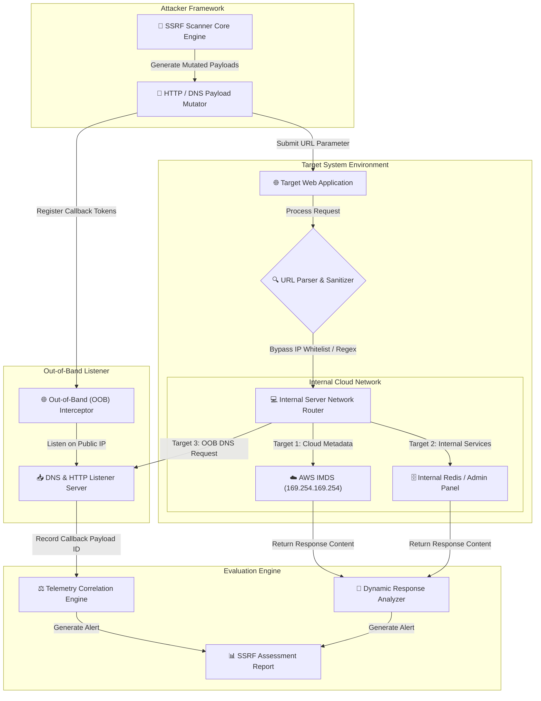

# 004 - Server-Side Request Forgery (SSRF) Scanner

> **Category**: [[Web Application Attacks]] | **Difficulty**: ⭐⭐⭐ | **Duration**: 5 weeks

---

## 📋 Problem Statement

> [!CAUTION] Real-World Impact
> Server-Side Request Forgery (SSRF) allows an attacker to abuse server functionality to construct arbitrary HTTP/DNS requests originating from the vulnerable web server itself. In cloud computing environments (AWS, GCP, Azure), unblind or blind SSRF vulnerabilities allow attackers to query internal Cloud Instance Metadata Services (IMDSv1 at `169.254.169.254`), extract IAM role credentials, and gain administrative control over cloud infrastructure.

As modern applications rely heavily on webhooks, PDF generators, image parsers, and microservice integrations, web servers frequently fetch resources from user-supplied URLs. Without validation, attackers can pivot past perimeter firewalls into internal networks (`10.0.0.0/8`, `172.16.0.0/12`, `192.168.0.0/16`), accessing internal management consoles, databases, and microservices.

### 🌍 Real-World Incidents
- **Capital One Cloud Data Breach (2019)**: An SSRF vulnerability in a misconfigured WAF enabled an attacker to query the AWS IMDS, obtain temporary IAM credentials, and exfiltrate over 100 million customer credit card applications stored in S3 buckets.
- **Microsoft Exchange SSRF (ProxyLogon - 2021)**: CVE-2021-26855 allowed unauthenticated attackers to send arbitrary HTTP requests via Exchange Server, bypassing authentication to access mailboxes and execute arbitrary commands.
- **Shopify Bug Bounty SSRF (2020)**: An SSRF flaw in Shopify's screenshot rendering service allowed researchers to access internal Google Cloud metadata servers and fetch cluster secrets.

---

## 🔬 Research Paper References

| # | Paper Title | Authors | Year | Source | Key Contribution |
|---|-------------|---------|------|--------|-----------------|
| 1 | A Systematic Study of Server-Side Request Forgery Vulnerabilities in Cloud Applications | Khattak et al. | 2021 | IEEE Access | Categorizes SSRF attack vectors across cloud providers and evaluates DNS rebinding mitigations. |
| 2 | Anatomy of Cloud Infrastructure Compromise via SSRF Vectors | Zhang & Wang | 2022 | ACM CCS | Analyzes post-exploitation pathways following metadata credential exfiltration in AWS and Kubernetes. |
| 3 | Blind SSRF Detection via Out-of-Band Telemetry and DNS Rebinding Analysis | Alenazi et al. | 2024 | USENIX Security | Presents automated framework for detecting blind SSRF via out-of-band callback monitoring and TOCTOU DNS analysis. |

---

## 🏗️ System Architecture
Link: [[Drawing 2026-07-30 22.31.19.excalidraw#Project 004: 004 - Server-Side Request Forgery (SSRF) Scanner|Excalidraw Architecture Diagram]]

---

## 📐 Technical Implementation

### Phase 1: Research & Environment Setup (Week 1)
- Deploy a simulated cloud lab environment using `AWS LocalStack` and Docker containers hosting vulnerable webhook services.
- Install security tooling: Python 3.11, ProjectDiscovery `interactsh-client`, `dnspython`, `aiohttp`, and `scapy`.
- Configure custom DNS nameservers to test DNS Rebinding vulnerability scenarios (`A` record TTL = 0).

### Phase 2: Core Module Development (Weeks 2-3)
- **Module 1: URL Parsing & Evasion Bypass Synthesizer**
  Develop a payload generator that constructs advanced SSRF bypass formats: alternative IP representations (hex `0x7f000001`, octal `0177.0.0.1`, dword `2130706433`), IPv6 transition formats (`[::ffff:169.254.169.254]`), and URL scheme mutations (`gopher://`, `dict://`, `file://`).
- **Module 2: DNS Rebinding Attack Simulator**
  Build a dynamic DNS responder that alternates between resolving an external safe IP address on first lookup and an internal private IP (`169.254.169.254`) on subsequent lookup to bypass Time-of-Check to Time-of-Use (TOCTOU) checks.
- **Module 3: Out-of-Band (OOB) Telemetry Correlator**
  Integrate an interaction listener server (or API bridge to `interactsh`) to verify Blind SSRF conditions when no direct HTTP response is reflected.

### Phase 3: Integration & Testing (Week 4)
- Run automated scans against local microservices and API gateways.
- Benchmark detection capabilities across In-band SSRF (direct reflection), Blind SSRF (OOB confirmation required), and Protocol Smuggling (Gopher to Redis/Memcached).

### Phase 4: Analysis & Documentation (Week 5)
- Document SSRF mitigation patterns: strict URL parsing using robust libraries, IP blacklisting post-DNS resolution, and enforcing IMDSv2 (session token-based metadata access).
- Compile automated scan logs into standard SARIF/JSON reporting formats.

---

## 🔧 Tools & Technologies

| Tool | Purpose | Alternative |
|------|---------|-------------|
| Python | Scanner automation and asynchronous HTTP engine | Go |
| LocalStack | AWS IMDS and service emulation lab | Real AWS Sandbox |
| Interactsh | Out-of-band interaction testing infrastructure | Burp Collaborator |
| Docker | Network containment and internal service targets | Podman |

---

## 💡 Key Features
- ✅ **Multi-Format IP Encoder**: Converts internal target IPs into 12+ representation formats to bypass basic string filters.
- ✅ **DNS Rebinding Tester**: Automated TTL manipulation to evaluate TOCTOU validation flaws in URL fetching logic.
- ✅ **Multi-Protocol Probe**: Supports testing alternative protocol handlers (`file://`, `gopher://`, `dict://`, `sftp://`).
- ✅ **Cloud Metadata Parser**: Tailored payloads targeting AWS IMDSv1/v2, GCP metadata, Azure WireServer, and Kubernetes Secrets.
- ✅ **Blind OOB Telemetry**: Real-time correlation of DNS and HTTP callbacks for out-of-band vulnerability verification.

---

## 📊 Expected Results

> [!NOTE] Deliverables
> A Python SSRF assessment tool featuring OOB interaction correlation, DNS rebinding evaluation modules, and cloud IMDS detection capabilities.

### Performance Metrics
- **Scanning Throughput**: > 50 payload evaluations per second using asynchronous I/O.
- **Bypass Efficacy**: Identifies > 95% of naive regex and IP-blacklist validation controls.
- **False Positive Rate**: Zero false positives on Blind SSRF when OOB correlation is enabled.

### Output Artifacts
1. Functional SSRF scanner repository.
2. Cloud Metadata Security Benchmark Guide.
3. Detailed PDF assessment report template.

---

## 🎓 Learning Outcomes
1. 📚 Master the mechanisms of Server-Side Request Forgery in cloud and microservice architectures.
2. 📚 Understand DNS rebinding techniques and Time-of-Check to Time-of-Use (TOCTOU) security risks.
3. 📚 Evaluate cloud metadata security models (AWS IMDSv1 vs IMDSv2, GCP header enforcement).
4. 📚 Develop out-of-band (OOB) network interaction tracking tools for vulnerability detection.

---

## ⚠️ Ethical Considerations
> [!WARNING] Legal & Ethical Notice
> This project must be conducted in a controlled lab environment only. Never test on systems without explicit written authorization.

---

## 🔗 Related Projects
- [[001 - Automated SQL Injection Detection & Prevention System]]
- [[005 - API Security Testing Automation Platform]]
- [[007 - Web Application Firewall (WAF) Bypass Techniques Analyzer]]

---
*📅 Created: 2026-07-30 | 🏷️ Category: Web Application Attacks | 🔐 Offensive Security Research*
