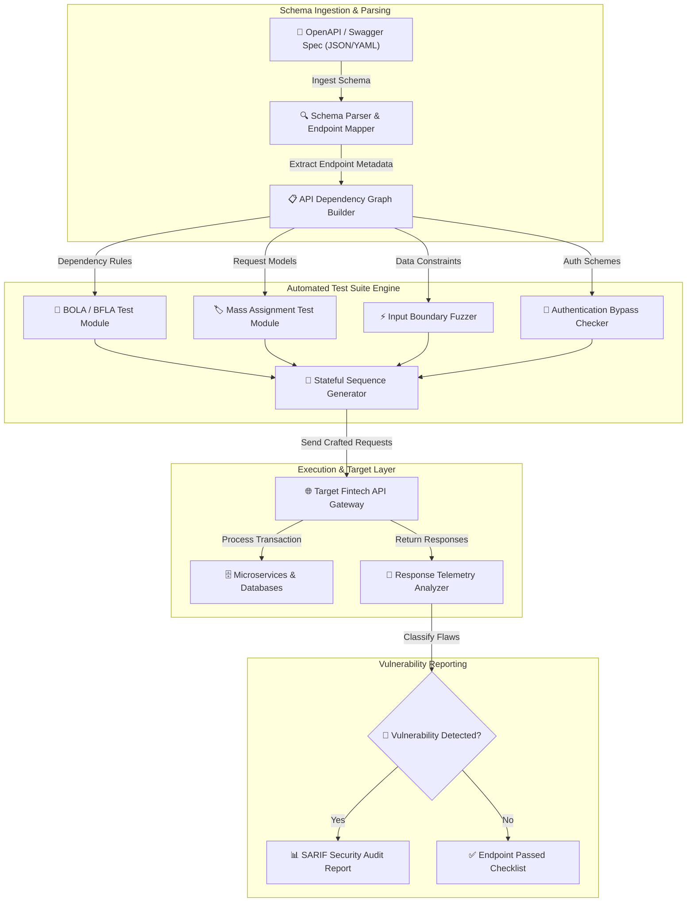

# 005 - API Security Testing Automation Platform

> **Category**: [[Web Application Attacks]] | **Difficulty**: ⭐⭐⭐ | **Duration**: 5 weeks

---

## 📋 Problem Statement

> [!CAUTION] Real-World Impact
> Modern fintech platforms rely extensively on RESTful APIs and microservices to enable rapid digital transactions. Unlike traditional web applications with monolithic frontends, APIs expose raw application logic and data structures directly to client applications. Security flaws such as BOLA (Broken Object Level Authorization), Mass Assignment, and Rate Limit omissions expose sensitive financial databases to massive automated exfiltration attacks.

Manual API penetration testing often fails to cover complex stateful workflows across hundreds of microservice endpoints defined in OpenAPI/Swagger documentation. Automated security testing platforms bridge this gap by dynamically parsing API schemas and executing structured fuzzing campaigns.

### 🌍 Real-World Incidents
- **Optus Data Breach (2022)**: An unauthenticated API endpoint left publicly exposed allowed attackers to iterate through customer account IDs, exfiltrating personal identity records of 9.8 million Australian citizens.
- **Coinbase API Vulnerability (2022)**: A security researcher discovered a flaw in Coinbase's Advanced Trading API where missing validation allowed trading between arbitrary account pairs, enabling unauthorized asset manipulation.
- **T-Mobile API Exploitation (2021)**: Unprotected API endpoints were repeatedly targeted by adversaries to scrape names, phone numbers, IMEI codes, and social security numbers of 54 million customers.

---

## 🔬 Research Paper References

| # | Paper Title | Authors | Year | Source | Key Contribution |
|---|-------------|---------|------|--------|-----------------|
| 1 | Automated API Security Testing via OpenAPI Specification Parsing and Stateful Fuzzing | Viglianisi et al. | 2020 | ACM ISSTA | Proposes automated generation of executable security test cases derived from OpenAPI schemas. |
| 2 | Empirical Study of API Security Flaws in Modern Financial Infrastructure | Shah et al. | 2022 | IEEE S&P | Analyzes OWASP API Security Top 10 vulnerabilities across 150 commercial fintech APIs. |
| 3 | RESTler: Stateful REST API Fuzzing Engine | Atlidakis et al. | 2019 | IEEE/ACM ICSE | Introduces grammar-based stateful API fuzzing to discover security bugs across interdependent request sequences. |

---

## 🏗️ System Architecture
Link: [[Drawing 2026-07-30 22.31.19.excalidraw#Project 005: 005 - API Security Testing Automation Platform|Excalidraw Architecture Diagram]]

---

## 📐 Technical Implementation

### Phase 1: Research & Environment Setup (Week 1)
- Build a simulated fintech API lab using Node.js/Express, Docker, and PostgreSQL (endpoints for account balance, fund transfers, user profiles).
- Install testing tools: Python 3.11, `schemathesis`, `openapi-spec-validator`, `requests`, and `pytest`.
- Define OpenAPI 3.0 specification documents covering authentication, user management, and transactional endpoints.

### Phase 2: Core Module Development (Weeks 2-3)
- **Module 1: OpenAPI Schema Parser & Dependency Graph Builder**
  Parse OpenAPI JSON/YAML specifications to dynamically map out paths, HTTP methods, authorization requirements, and parameter types. Maintain sequence dependency maps (e.g., `POST /auth/login` -> `POST /accounts` -> `GET /accounts/{id}`).
- **Module 2: Broken Object Level Authorization (BOLA) Fuzzer**
  Execute dual-token testing by swapping authorization tokens between User A and User B to test if User A can access `GET /accounts/{userB_ID}`.
- **Module 3: Mass Assignment Detection Module**
  Inject unexpected administrative properties (e.g., `"is_admin": true`, `"role": "superuser"`) into HTTP POST/PUT payloads to evaluate backend property binding safeguards.
- **Module 4: Rate Limiting & Resource Exhaustion Assessor**
  Send bursts of asynchronous HTTP requests to sensitive API endpoints to check for rate-limiting headers (`X-RateLimit-Remaining`, HTTP 429 status codes).

### Phase 3: Integration & Testing (Week 4)
- Integrate all testing modules into a unified command-line automation framework.
- Execute automated vulnerability sweeps against the target fintech API lab.

### Phase 4: Analysis & Documentation (Week 5)
- Generate benchmark report comparing schema coverage, vulnerability detection rates, and execution runtime.
- Produce remediation documentation detailing OWASP API Security Top 10 defenses (custom DTO binding, strict RBAC, API gateway rate-limiting).

---

## 🔧 Tools & Technologies

| Tool | Purpose | Alternative |
|------|---------|-------------|
| Python | Platform development & asynchronous API testing engine | TypeScript |
| Schemathesis | Property-based API testing & schema validation framework | RESTler |
| OpenAPI Spec | Standardization format for API schema ingestion | Postman Collections |
| Docker | Microservices containment for local lab testing | Podman |

---

## 💡 Key Features
- ✅ **OpenAPI Spec Parsing**: Automatically ingests OpenAPI v2/v3 specifications to construct test cases.
- ✅ **Automated BOLA Testing**: Dual-account token swapping engine for authorization flaw identification.
- ✅ **Mass Assignment Discovery**: Injects hidden administrative parameters into request bodies to detect unsafe object binding.
- ✅ **Stateful Request Sequencing**: Tracks dependency variables (e.g., token IDs, dynamic resource UUIDs) across multi-step API calls.
- ✅ **Standardized SARIF Reporting**: Exports vulnerability findings directly into CI/CD security dashboard formats.

---

## 📊 Expected Results

> [!NOTE] Deliverables
> An end-to-end Python platform that parses API schemas, builds stateful test sequences, executes OWASP API Top 10 security checks, and generates SARIF audit reports.

### Performance Metrics
- **Schema Coverage**: > 95% path and parameter coverage on OpenAPI v3 specs.
- **Test Speed**: Conducts 100+ stateful endpoint tests per minute.
- **BOLA Detection Accuracy**: 100% detection rate on insecure direct object reference benchmarks.

### Output Artifacts
1. API Security Testing Platform repository.
2. Sample OpenAPI specification and test dataset.
3. API Security Best Practices Remediation Guide.

---

## 🎓 Learning Outcomes
1. 📚 Understand the OWASP API Security Top 10 framework and root causes of API vulnerabilities.
2. 📚 Master automated parsing of OpenAPI/Swagger schemas for security test generation.
3. 📚 Build stateful HTTP request engines capable of maintaining session variables and authentication context.
4. 📚 Implement authorization controls preventing Broken Object Level Authorization (BOLA).

---

## ⚠️ Ethical Considerations
> [!WARNING] Legal & Ethical Notice
> This project must be conducted in a controlled lab environment only. Never test on systems without explicit written authorization.

---

## 🔗 Related Projects
- [[001 - Automated SQL Injection Detection & Prevention System]]
- [[006 - JWT Token Vulnerability Assessment Tool]]
- [[008 - Broken Access Control Detection Engine]]

---
*📅 Created: 2026-07-30 | 🏷️ Category: Web Application Attacks | 🔐 Offensive Security Research*
