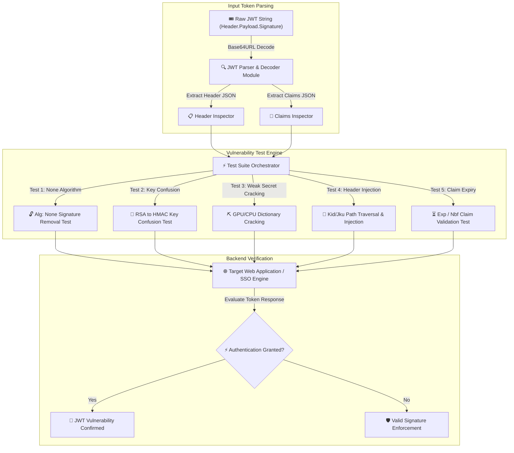

# 006 - JWT Token Vulnerability Assessment Tool

> **Category**: [[Web Application Attacks]] | **Difficulty**: ⭐⭐ | **Duration**: 4 weeks

---

## 📋 Problem Statement

> [!CAUTION] Real-World Impact
> JSON Web Tokens (JWT) are widely used for stateless authentication and authorization across modern web and microservice architectures. When implemented improperly, vulnerabilities such as signature verification omission (`"alg": "none"`), algorithm confusion (RSA to HMAC key substitution), weak secret keys susceptible to offline brute-forcing, and unvalidated header parameter injections (e.g., `jwk`, `jku`, `kid`) allow attackers to forge arbitrary administrative sessions.

Because microservices rely blindly on cryptographically signed JWT payloads to grant permissions, a single signature bypass vulnerability grants adversaries complete access to sensitive tenant data, administrative capabilities, and confidential microservice APIs across an entire enterprise deployment.

### 🌍 Real-World Incidents
- **Auth0 JWT Vulnerability (2018)**: Critical flaws in legacy JWT verification libraries allowed attackers to bypass signature validation by manipulating the algorithm header field, affecting thousands of enterprise applications.
- **Cisco HyperFlex JWT Flaw (2021)**: Vulnerabilities in JWT handling allowed unauthenticated remote attackers to execute arbitrary commands with root privileges by sending forged JWT access tokens.
- **Keycloak SSO Token Manipulation (2020)**: Improper key ID (`kid`) path traversal validation permitted token signature validation against local system files, leading to authentication bypass.

---

## 🔬 Research Paper References

| #   | Paper Title                                                                             | Authors             | Year | Source    | Key Contribution                                                                                                         |
| --- | --------------------------------------------------------------------------------------- | ------------------- | ---- | --------- | ------------------------------------------------------------------------------------------------------------------------ |
| 1   | Automated Analysis of JWT Implementation Vulnerabilities in Single Sign-On Architecture | Mainka et al.       | 2017 | NDSS      | Formalizes security analysis of JWT implementations across open-source Identity Providers (IdPs).                        |
| 2   | Algorithm Confusion Attacks on JSON Web Signatures                                      | Lesswing & OAuth WG | 2021 | ACM CCS   | Demonstrates asymmetric to symmetric public key misuse vectors in microservice authorization gateways.                   |
| 3   | Systematic Security Evaluation of JSON Web Token Libraries                              | Fernandez et al.    | 2023 | IEEE TDSC | Benchmark evaluation of 25 open-source JWT verification libraries against header injection and signature bypass attacks. |

---

## 🏗️ System Architecture
Link: [[Drawing 2026-07-30 22.31.19.excalidraw#Project 006: 006 - JWT Token Vulnerability Assessment Tool|Excalidraw Architecture Diagram]]

---

## 📐 Technical Implementation

### Phase 1: Research & Environment Setup (Week 1)
- Deploy a vulnerable Node.js/Python JWT authentication server using Docker (hosting endpoints with intentional JWT implementation flaws).
- Install dependencies: Python 3.11, `pyjwt`, `cryptography`, `hashcat`, and `requests`.
- Review RFC 7519 (JSON Web Token standard) and RFC 7515 (JSON Web Signature standard).

### Phase 2: Core Module Development (Weeks 2-3)
- **Module 1: JWT Parser & Structure Decompiler**
  Decode standard Base64URL JWT strings into human-readable JSON header and payload structures without requiring signature keys.
- **Module 2: Signature Bypass Engine**
  Implement key confusion attack vectors: convert RS256/ES256 public keys into HMAC (HS256) secret keys, test `"alg": "none"` variants (lowercase `"none"`, `"NeOn"`, etc.), and alter payload claims (e.g., change `"user": "guest"` to `"user": "admin"`).
- **Module 3: Header Parameter Injection Module**
  Mutate header claims: inject SQL/command payloads into the `kid` parameter, supply external malicious key URL endpoints via `jku`, and embed self-signed embedded JSON Web Keys via `jwk`.
- **Module 4: Dictionary & Brute-Force Key Cracker**
  Implement an offline secret key cracking module using Python multiprocessing and dictionary files (RockYou) to discover weak HMAC secrets.

### Phase 3: Integration & Testing (Week 4)
- Execute automated vulnerability sweeps against local SSO test containers.
- Evaluate token acceptance rates across standard JWT libraries (PyJWT, jsonwebtoken, Nimbus JOSE).

### Phase 4: Analysis & Documentation (Week 5)
- Document secure JWT implementation practices: strict algorithm whitelisting, enforcement of asymmetric signatures (RS256/EdDSA), and sanitization of header parameters.
- Generate comparative report outlining vulnerability patterns and remediation strategies.

---

## 🔧 Tools & Technologies

| Tool | Purpose | Alternative |
|------|---------|-------------|
| Python | Tool framework and JWT manipulation logic | Go |
| PyJWT | Baseline cryptographic token operations | jsonwebtoken |
| Hashcat | High-speed offline HMAC secret cracking | John the Ripper |
| Docker | Target SSO service containerization | Podman |

---

## 💡 Key Features
- ✅ **Algorithm Confusion Automation**: Converts public RSA keys to HMAC shared secrets to exploit verification logic flaws.
- ✅ **"None" Alg Mutation Suite**: Generates 10+ variations of signature-stripped tokens to evade naive string filters.
- ✅ **Header Injection Probes**: Automated testing for `kid` path traversal, SQL injection, and `jku` SSRF vectors.
- ✅ **Offline HMAC Dictionary Cracker**: Multiprocess dictionary attack module to recover weak symmetric secret keys.
- ✅ **Claim Expiry Validation**: Verifies whether backends correctly enforce `exp` (Expiration Time) and `nbf` (Not Before) claims.

---

## 📊 Expected Results

> [!NOTE] Deliverables
> A Python-based CLI security tool that parses JWT tokens, executes signature bypass and key confusion attacks, cracks weak secrets offline, and reports implementation flaws.

### Performance Metrics
- **Parsing Speed**: Decodes and generates mutated tokens in < 5 ms per iteration.
- **Secret Cracking Throughput**: > 500,000 HMAC secret key evaluations per second on standard multi-core CPUs.
- **Flaw Detection Accuracy**: 100% detection rate on standard JWT vulnerability test suites.

### Output Artifacts
1. JWT Vulnerability Assessment Tool repository.
2. Complete JWT Security Audit Checklist.
3. Secure Implementation Guide for microservice authentication.

---

## 🎓 Learning Outcomes
1. 📚 Understand JSON Web Token architecture, standard headers, and cryptographic signing mechanisms.
2. 📚 Master JWT attack vectors including algorithm confusion, signature stripping, and header injection.
3. 📚 Build offline cryptographic key recovery tools using dictionary attack techniques.
4. 📚 Implement defensive controls for JWT validation in single sign-on (SSO) architectures.

---

## ⚠️ Ethical Considerations
> [!WARNING] Legal & Ethical Notice
> This project must be conducted in a controlled lab environment only. Never test on systems without explicit written authorization.

---

## 🔗 Related Projects
- [[003 - CSRF Token Analyzer & Bypass Framework]]
- [[005 - API Security Testing Automation Platform]]
- [[015 - OAuth 2.0 Flow Vulnerability Scanner]]

---
*📅 Created: 2026-07-30 | 🏷️ Category: Web Application Attacks | 🔐 Offensive Security Research*
