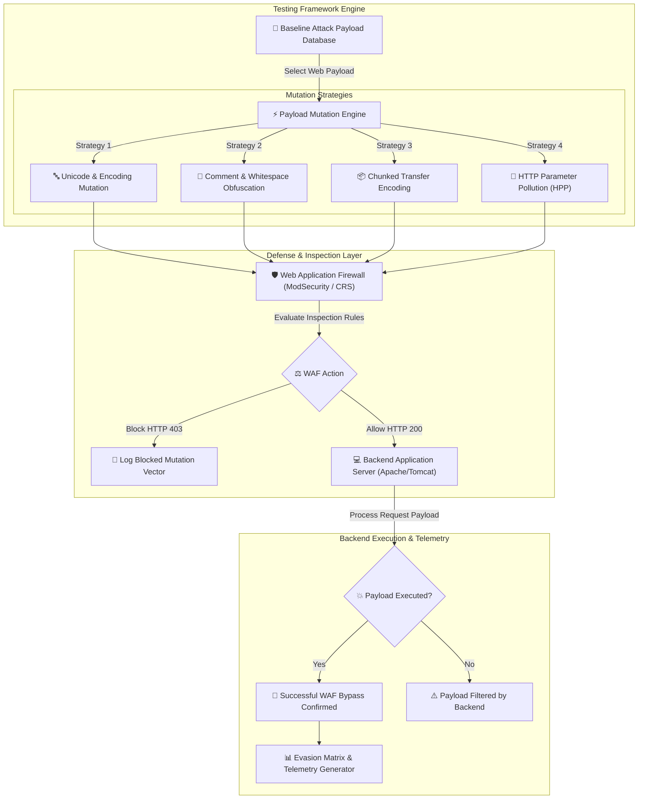

# 007 - Web Application Firewall (WAF) Bypass Techniques Analyzer

> **Category**: [[Web Application Attacks]] | **Difficulty**: ⭐⭐⭐ | **Duration**: 5 weeks

---

## 📋 Problem Statement

> [!CAUTION] Real-World Impact
> Web Application Firewalls (WAFs) act as the primary perimeter defense line for web infrastructures, filtering malicious HTTP payloads targeting underlying web applications. However, Advanced Persistent Threat (APT) groups frequently evade signature-based WAF rule engines by exploiting protocol parsing mismatches, character encoding anomalies, HTTP request smuggling, chunked transfer encoding, and payload obfuscation.

When a WAF inspects an incoming HTTP payload differently than the backend application server (e.g., NGINX + ModSecurity vs Apache Tomcat), an attacker can craft payloads that appear benign to the WAF rule engine but are interpreted as executable attacks by the backend web framework.

### 🌍 Real-World Incidents
- **Equifax Data Breach (2017)**: Attackers bypassed perimeter defenses to exploit an Apache Struts vulnerability (CVE-2017-5638), resulting in the exfiltration of personal data of 147 million consumers.
- **Log4Shell WAF Evasions (2021)**: Following the disclosure of CVE-2021-44228, security researchers identified hundreds of string obfuscation permutations (e.g., `${jndi:${lower:m}ldap://...}`) that easily bypassed initial vendor WAF signature rules.
- **Capital One WAF SSRF Evasion (2019)**: Misconfigured WAF inspection rules permitted SSRF requests targeting the internal AWS Cloud Instance Metadata Service.

---

## 🔬 Research Paper References

| # | Paper Title | Authors | Year | Source | Key Contribution |
|---|-------------|---------|------|--------|-----------------|
| 1 | WAF-A-MoLE: Evading Web Application Firewalls using Adversarial Mutation | Demetrio et al. | 2020 | IEEE Transactions on Information Forensics and Security | Uses reinforcement learning to mutate web attack payloads to bypass machine-learning-based WAF classifiers. |
| 2 | Impedance Mismatch in HTTP Request Processing: A Study of WAF Evasion | Anley & Stuttard | 2019 | ACM CCS | Analyzes parsing discrepancies between WAF reverse proxies and backend application containers. |
| 3 | Systematic Payload Mutation and Syntax Obfuscation for WAF Evasion | Chen et al. | 2023 | USENIX Security | Evaluates comment insertion, character set transformation, and chunked transfer encoding for payload evasion. |

---

## 🏗️ System Architecture
Link: [[Drawing 2026-07-30 22.31.19.excalidraw#Project 007: 007 - Web Application Firewall (WAF) Bypass Techniques Analyzer|Excalidraw Architecture Diagram]]

---

## 📐 Technical Implementation

### Phase 1: Research & Environment Setup (Week 1)
- Set up a test lab using Docker containing NGINX with ModSecurity v3 and OWASP Core Rule Set (CRS v3.3).
- Deploy vulnerable backend targets (PHP SQLi/XSS endpoints, Node.js command injection handlers).
- Install development tools: Python 3.11, `scapy`, `requests`, `mitmproxy`, and `sqlmap`.

### Phase 2: Core Module Development (Weeks 2-3)
- **Module 1: Encoding & String Mutation Synthesizer**
  Develop a payload mutator capable of applying double URL encoding, mixed-case transformations, UTF-8 overlong encoding, null byte insertions, and inline SQL/HTML comment injection (e.g., `UN/**/ION SELECT`).
- **Module 2: HTTP Parameter Pollution (HPP) Generator**
  Construct requests with duplicated query keys (e.g., `?id=1&id=UNION SELECT`) to evaluate how the WAF concatenates parameters compared to the backend application server.
- **Module 3: Chunked Transfer & Protocol Smuggling Probe**
  Implement custom HTTP socket handlers to split attack payloads across fragmented `Transfer-Encoding: chunked` HTTP request frames, testing for parsing impedance mismatches.
- **Module 4: Automated Evasion Matrix Analyzer**
  Build a test runner that executes mutated payloads, tracks WAF HTTP response codes (403 vs 200), and checks for backend payload execution.

### Phase 3: Integration & Testing (Week 4)
- Run automated mutation sweeps against standard WAF installations (ModSecurity OWASP CRS, AWS WAF rulesets).
- Map evasion success rates across different attack categories (SQLi, XSS, RCE, LFI).

### Phase 4: Analysis & Documentation (Week 5)
- Document effective WAF rule tuning methodologies to eliminate impedance mismatches.
- Produce technical guide on configuring strict HTTP protocol validation and normalizers in proxy layers.

---

## 🔧 Tools & Technologies

| Tool | Purpose | Alternative |
|------|---------|-------------|
| Python | Payload mutation engine & HTTP socket framework | Go |
| ModSecurity | Target Web Application Firewall engine | AWS WAF / Cloudflare |
| OWASP CRS | Benchmark threat detection ruleset | Custom WAF Rules |
| Mitmproxy | Interception and request header modification | Burp Suite |

---

## 💡 Key Features
- ✅ **Automated Payload Mutation Engine**: Applies 15+ encoding and obfuscation transformations automatically.
- ✅ **HTTP Parameter Pollution Testing**: Assesses backend concatenation behavior across multi-valued parameters.
- ✅ **Chunked Transfer Evasion Probe**: Sends fragmented HTTP request chunks to test WAF inspection bounds.
- ✅ **Parsing Impedance Detector**: Flags discrepancy vectors between proxy inspection engines and backend parsers.
- ✅ **Interactive Evasion Matrix**: Generates visual matrices detailing which mutations successfully bypassed active WAF rules.

---

## 📊 Expected Results

> [!NOTE] Deliverables
> A Python payload mutation framework that tests WAF deployment rulesets against obfuscation techniques, identifies parsing impedance gaps, and provides rule hardening recommendations.

### Performance Metrics
- **Mutation Generation Speed**: > 200 payload permutations per minute.
- **Bypass Identification Accuracy**: 100% verification based on backend payload execution telemetry.
- **Rule Hardening Precision**: Generates specific regex tuning suggestions for ModSecurity rules.

### Output Artifacts
1. WAF Bypass Techniques Analyzer repository.
2. OWASP CRS Hardening and Normalization Guide.
3. Comparative WAF Evasion Benchmark Report.

---

## 🎓 Learning Outcomes
1. 📚 Understand Web Application Firewall rule evaluation mechanisms and inspection limitations.
2. 📚 Master character encoding anomalies, HTTP request smuggling, and parameter pollution techniques.
3. 📚 Identify parsing impedance mismatches between reverse proxies and backend application engines.
4. 📚 Configure robust WAF normalizers and tune detection rulesets to mitigate evasion techniques.

---

## ⚠️ Ethical Considerations
> [!WARNING] Legal & Ethical Notice
> This project must be conducted in a controlled lab environment only. Never test on systems without explicit written authorization.

---

## 🔗 Related Projects
- [[001 - Automated SQL Injection Detection & Prevention System]]
- [[002 - XSS Payload Generator with Context-Aware Encoding]]
- [[004 - Server-Side Request Forgery (SSRF) Scanner]]

---
*📅 Created: 2026-07-30 | 🏷️ Category: Web Application Attacks | 🔐 Offensive Security Research*
