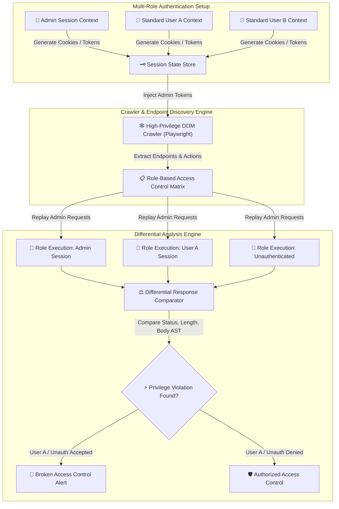

# 008 - Broken Access Control Detection Engine

> **Category**: [[Web Application Attacks]] | **Difficulty**: ⭐⭐⭐ | **Duration**: 5 weeks

---

## 📋 Problem Statement

> [!CAUTION] Real-World Impact
> Broken Access Control ranks as the #1 vulnerability on the OWASP Top 10. Access control policies enforce authorization constraints ensuring users cannot act outside their intended permissions. In real-world web applications, failure to enforce server-side access controls leads to Insecure Direct Object References (IDOR), horizontal privilege escalation (accessing another user's data), and vertical privilege escalation (ordinary user executing admin functions).

Because access control logic is highly application-specific, automated scanners frequently fail to detect authorization flaws. Automated engines capable of crawling application endpoints using multiple role-based session states are critical to uncovering hidden authorization bypass vulnerabilities.

### 🌍 Real-World Incidents
- **US Postal Service (USPS) API IDOR (2018)**: An IDOR vulnerability in an authenticated API endpoint allowed any registered user to view account details, email addresses, and phone numbers of 60 million registered accounts.
- **Facebook Access Token Flaw (2018)**: A combination of three distinct bugs in the "View As" feature permitted unauthorized access token harvesting, compromising 29 million user accounts.
- **Instagram Direct Messages IDOR (2020)**: Security researchers discovered an IDOR flaw allowing attackers to view private Instagram direct messages and media attachments by altering endpoint resource identifiers.

---

## 🔬 Research Paper References

| # | Paper Title | Authors | Year | Source | Key Contribution |
|---|-------------|---------|------|--------|-----------------|
| 1 | Automated Discovery of Access Control Vulnerabilities in Web Applications | Dynamic & Static Auth Group | 2021 | USENIX Security | Presents role-based state graph crawling to detect broken access control logic across enterprise apps. |
| 2 | Analyzing Access Control Vulnerabilities in Web Applications via Dual-Role Differential Testing | Sun et al. | 2022 | ACM CCS | Proposes differential response analysis between high-privileged and low-privileged user session execution. |
| 3 | Detecting Broken Object-Level Authorization in REST APIs | Meng et al. | 2024 | IEEE S&P | Develops automated schema inference and IDOR detection techniques for modern single-page applications. |

---

## 🏗️ System Architecture
Link: [[Drawing 2026-07-30 22.31.19.excalidraw#Project 008: 008 - Broken Access Control Detection Engine|Excalidraw Architecture Diagram]]

---

## 📐 Technical Implementation

### Phase 1: Research & Environment Setup (Week 1)
- Deploy a multi-role web application target (Node.js/Express, PostgreSQL) featuring Admin, Manager, and Standard User roles.
- Install dependencies: Python 3.11, `playwright`, `requests`, `beautifulsoup4`, and `jsondiff`.
- Configure environment to support session cookie and JWT bearer token extraction.

### Phase 2: Core Module Development (Weeks 2-3)
- **Module 1: Multi-Role Crawler & Endpoint Mapper**
  Build a headless crawler using Playwright that logs into the target app as an Administrator, identifies all navigable paths, dynamic API routes (`/api/v1/users/{id}`), and state-changing actions (`POST`, `PUT`, `DELETE`).
- **Module 2: Differential HTTP Test Relayer**
  Replay extracted HTTP requests across alternate session identities: User A (horizontal test against User B's resources), Standard User (vertical test against Admin endpoints), and Unauthenticated guest.
- **Module 3: Response Comparative Analyzer**
  Compare response HTTP status codes, response length deltas, JSON key structure similarity, and DOM tree structures to differentiate between real data exposure and generic error pages (e.g., HTTP 200 with "Access Denied" message).
- **Module 4: IDOR Parameter Mutator**
  Detect sequential numeric IDs (`/user/1001`), UUIDs, and encoded parameters, mutating them across active session contexts to detect Insecure Direct Object References.

### Phase 3: Integration & Testing (Week 4)
- Execute automated scans against vulnerable benchmark environments (OWASP Juice Shop, custom multi-role target).
- Benchmark accuracy across horizontal IDOR, vertical privilege escalation, and unauthenticated endpoint exposure.

### Phase 4: Analysis & Documentation (Week 5)
- Document authorization design patterns: centralized role-based access control (RBAC), attribute-based access control (ABAC), and indirect object references.
- Produce comprehensive security report outlining detected authorization flaws and code remediation diffs.

---

## 🔧 Tools & Technologies

| Tool | Purpose | Alternative |
|------|---------|-------------|
| Python | Core detection engine & differential logic | Node.js / Go |
| Playwright | Multi-role headless web crawling & state extraction | Selenium |
| Burp Suite | Manual verification & session interception | OWASP ZAP |
| PostgreSQL | Target relational database engine | MySQL |

---

## 💡 Key Features
- ✅ **Multi-Role Session Matrix**: Simultaneous execution of test sequences across multiple user identity contexts.
- ✅ **Automated IDOR Detection**: Identifies and mutates resource identifiers to detect cross-account data exposure.
- ✅ **Differential Response Engine**: Evaluates JSON structural equality and content deltas to prevent false positives.
- ✅ **Headless DOM Crawler**: Discovers dynamic Single Page Application (SPA) endpoints rendered via client-side JS.
- ✅ **Detailed Matrix Reporting**: Generates visual matrices showing permitted vs denied endpoints per role.

---

## 📊 Expected Results

> [!NOTE] Deliverables
> A Python access control scanner that crawls web applications under high-privilege sessions, replays requests across lower-privileged contexts, detects IDOR/privilege escalation flaws, and reports findings.

### Performance Metrics
- **Crawl Efficiency**: Discovers > 90% of dynamic application endpoints automatically.
- **Differential Precision**: < 2% false positive rate via AST response matching.
- **Execution Speed**: Evaluates 50+ authorization routes per minute.

### Output Artifacts
1. Broken Access Control Detection Engine repository.
2. Role-Based Access Control Audit Report.
3. Access Control Remediation Patterns Guide.

---

## 🎓 Learning Outcomes
1. 📚 Master authorization models: Role-Based Access Control (RBAC) and Attribute-Based Access Control (ABAC).
2. 📚 Understand horizontal and vertical privilege escalation mechanics and IDOR vulnerabilities.
3. 📚 Build differential response analysis engines for web application testing.
4. 📚 Implement robust server-side authorization checks in modern web frameworks.

---

## ⚠️ Ethical Considerations
> [!WARNING] Legal & Ethical Notice
> This project must be conducted in a controlled lab environment only. Never test on systems without explicit written authorization.

---

## 🔗 Related Projects
- [[003 - CSRF Token Analyzer & Bypass Framework]]
- [[005 - API Security Testing Automation Platform]]
- [[006 - JWT Token Vulnerability Assessment Tool]]

---
*📅 Created: 2026-07-30 | 🏷️ Category: Web Application Attacks | 🔐 Offensive Security Research*
