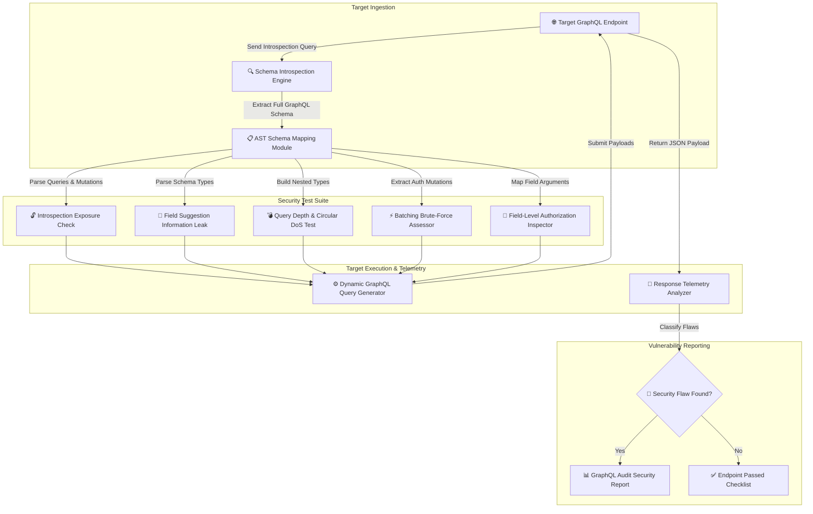

# 009 - GraphQL API Security Audit Framework

> **Category**: [[Web Application Attacks]] | **Difficulty**: ⭐⭐ | **Duration**: 4 weeks

---

## 📋 Problem Statement

> [!CAUTION] Real-World Impact
> GraphQL APIs have gained widespread adoption due to their flexibility, allowing clients to request exact data schemas in a single HTTP request. However, this flexibility introduces unique attack vectors: enabled introspection queries reveal entire database schemas, query batching enables high-speed brute-force attacks, nested recursive queries cause Denial of Service (DoS), and field suggestion features leak private property names.

In enterprise applications, unhardened GraphQL endpoints expose administrative queries and mutations that lack proper field-level authorization checks, allowing attackers to exfiltrate database records or execute unauthorized administrative operations.

### 🌍 Real-World Incidents
- **GitLab GraphQL DoS Vulnerability (2021)**: Unrestricted nested GraphQL queries allowed remote attackers to consume server CPU and memory resources, causing complete service denial.
- **Shopify GraphQL Privilege Escalation (2020)**: Security researchers exploited missing authorization checks on specific GraphQL mutation fields to access private store analytics and billing settings.
- **Clara Healthcare GraphQL Introspection Leak (2022)**: Publicly enabled GraphQL introspection exposed hidden developer endpoints and patient PII schema models to unauthorized external clients.

---

## 🔬 Research Paper References

| # | Paper Title | Authors | Year | Source | Key Contribution |
|---|-------------|---------|------|--------|-----------------|
| 1 | GraphQL Security: Vulnerabilities, Attacks, and Defensive Strategies | Vulnerability Research Team | 2021 | ACM Computing Surveys | Comprehensive survey of structural attack vectors unique to GraphQL protocols. |
| 2 | Automated Vulnerability Detection in GraphQL Schemas via Fuzzing | Dynamic API Security Lab | 2022 | IEEE Access | Introduces dynamic query generator for detecting query complexity DoS and field authorization flaws. |
| 3 | Empirical Evaluation of GraphQL Adoption and Security Misconfigurations | Software Security Group | 2023 | USENIX Security | Evaluates 500 production GraphQL endpoints, documenting rates of enabled introspection and batching abuse. |

---

## 🏗️ System Architecture
Link: [[Drawing 2026-07-30 22.31.19.excalidraw#Project 009: 009 - GraphQL API Security Audit Framework|Excalidraw Architecture Diagram]]

---

## 📐 Technical Implementation

### Phase 1: Research & Environment Setup (Week 1)
- Deploy a vulnerable GraphQL server using Apollo Server, Node.js, and PostgreSQL (hosting endpoints for user accounts, products, and admin settings).
- Install testing tools: Python 3.11, `graphql-core`, `requests`, `InQL`, and `graphql-cop`.
- Study GraphQL specification features: Schema Introspection, Directives, Mutations, Subscriptions, and Query Complexity calculations.

### Phase 2: Core Module Development (Weeks 2-3)
- **Module 1: Introspection & Schema Extractor**
  Issue full introspection queries (`__schema { types { name fields { name type { name } } } }`) to dump all available Query, Mutation, and Subscription objects.
- **Module 2: Circular Dependency & Depth DoS Fuzzer**
  Construct deeply nested circular queries (e.g., `user { friends { friends { friends { ... } } } }`) to measure server response latency and detect missing query depth limiting.
- **Module 3: Query Batching & Array Amplification Assessor**
  Send HTTP POST requests containing arrays of 100+ duplicate queries to test whether the backend executes batched queries sequentially without rate limits.
- **Module 4: Field-Level Authorization Engine**
  Automate token-swapping tests on sensitive fields (e.g., `user { ssn creditCard }`) to verify if field-level resolvers enforce role-based access control.

### Phase 3: Integration & Testing (Week 4)
- Run automated security sweeps against Apollo Server, Hasura, and GraphQL Yoga test instances.
- Benchmark vulnerability detection rates across Introspection, Query Depth DoS, and Batching vectors.

### Phase 4: Analysis & Documentation (Week 5)
- Document GraphQL hardening guidelines: disabling introspection in production, implementing max query depth limits, enabling query cost analysis, and enforcing field-level resolvers.
- Publish complete GraphQL Security Audit Framework codebase and user guide.

---

## 🔧 Tools & Technologies

| Tool | Purpose | Alternative |
|------|---------|-------------|
| Python | Audit framework & query generation logic | Node.js |
| Apollo Server | Target GraphQL backend engine | Hasura / GraphQL Yoga |
| InQL | Burp Suite extension for GraphQL schema extraction | Clairvoyance |
| GraphQL-Cop | Lightweight security auditor for GraphQL APIs | Custom Scripts |

---

## 💡 Key Features
- ✅ **Automated Introspection Dumper**: Extracts and visualizes complete GraphQL schema structures automatically.
- ✅ **Query Depth & Complexity DoS Suite**: Tests for resource exhaustion vulnerabilities via nested circular queries.
- ✅ **Batching Abuse Detector**: Assesses backend susceptibility to multi-query array batching attacks.
- ✅ **Field Suggestion Harvester**: Exploits error messaging to discover hidden schema field names when introspection is disabled.
- ✅ **Field-Level Authorization Tester**: Verifies resolver-level RBAC controls across sensitive data fields.

---

## 📊 Expected Results

> [!NOTE] Deliverables
> A Python-based CLI tool that ingests a GraphQL endpoint, extracts schema models, runs depth/batching/auth test suites, and outputs a security audit report.

### Performance Metrics
- **Schema Extraction Speed**: Dumps full GraphQL schemas in < 2 seconds.
- **DoS Boundary Detection**: Accurately determines query depth limit thresholds.
- **Authorization Coverage**: Tests 100% of discovered query and mutation resolvers.

### Output Artifacts
1. GraphQL API Security Audit Framework repository.
2. Hardening Guide for Apollo and Hasura GraphQL engines.
3. Sample Security Audit Report format.

---

## 🎓 Learning Outcomes
1. 📚 Master GraphQL protocol architecture, schema definition language (SDL), and resolver execution models.
2. 📚 Identify GraphQL-specific attack vectors including Introspection leaks, Query Depth DoS, and Batching abuse.
3. 📚 Build automated tools to parse GraphQL ASTs and construct dynamic security payloads.
4. 📚 Implement defensive controls: Query Cost Analysis, Max Depth Validation, and Resolver Authorization.

---

## ⚠️ Ethical Considerations
> [!WARNING] Legal & Ethical Notice
> This project must be conducted in a controlled lab environment only. Never test on systems without explicit written authorization.

---

## 🔗 Related Projects
- [[005 - API Security Testing Automation Platform]]
- [[006 - JWT Token Vulnerability Assessment Tool]]
- [[008 - Broken Access Control Detection Engine]]

---
*📅 Created: 2026-07-30 | 🏷️ Category: Web Application Attacks | 🔐 Offensive Security Research*
