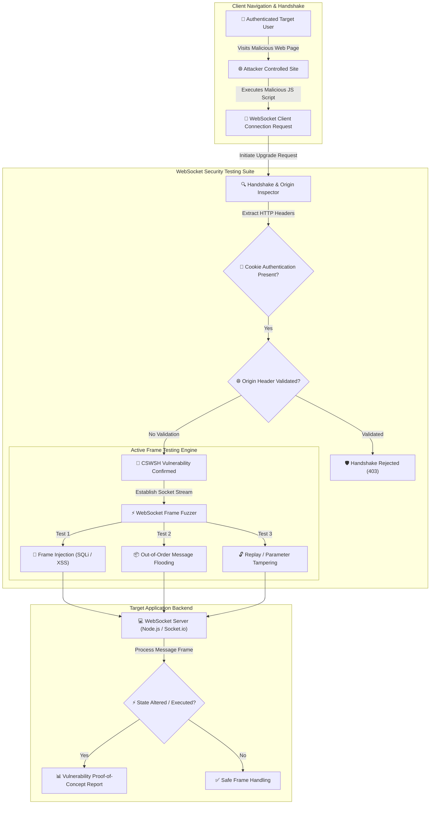

# 010 - WebSocket Security Testing Suite

> **Category**: [[Web Application Attacks]] | **Difficulty**: ⭐⭐ | **Duration**: 4 weeks

---

## 📋 Problem Statement

> [!CAUTION] Real-World Impact
> WebSocket protocols (`ws://` and `wss://`) enable bidirectional, full-duplex communication streams between web browsers and servers over a single persistent TCP connection. In real-time applications such as financial trading platforms, collaborative editing suites, and live chat portals, WebSocket connections are frequently established using initial HTTP handshake requests that rely solely on ambient cookie authentication without validating the HTTP `Origin` header.

This architectural oversight enables Cross-Site WebSocket Hijacking (CSWSH), allowing malicious websites visited by an authenticated user to silently establish WebSocket connections to the target server, hijack active communication channels, read private data streams, and transmit unauthorized command frames.

### 🌍 Real-World Incidents
- **Slack WebSocket Hijacking Flaw (2017)**: A CSWSH vulnerability allowed malicious third-party websites to open a WebSocket connection to Slack's servers using the victim's session cookies, stealing private chat messages and API tokens.
- **Trello WebSocket Cross-Origin Exploit (2018)**: Missing `Origin` header verification on Trello's WebSocket gateway permitted cross-origin sites to monitor board updates and manipulate user cards in real time.
- **TradingView Real-Time Feed Manipulation (2020)**: Security researchers demonstrated how unauthenticated WebSocket message injection could spoof live financial market indicators displayed on client dashboards.

---

## 🔬 Research Paper References

| # | Paper Title | Authors | Year | Source | Key Contribution |
|---|-------------|---------|------|--------|-----------------|
| 1 | Cross-Site WebSocket Hijacking: Vulnerabilities, Attacks, and Mitigations | Structural Web Security Group | 2018 | ACM CCS | Formalizes CSWSH attack mechanics and Origin validation enforcement across browser engines. |
| 2 | Security Analysis of Real-Time Web Protocols: WebSockets vs WebRTC | Network Protocol Lab | 2021 | IEEE TDSC | Evaluates frame-level encryption, authorization persistence, and input sanitization across real-time web protocols. |
| 3 | Automated Fuzzing and Message Injection Analysis for WebSocket Gateways | Binary & Web Security Team | 2023 | USENIX Security | Presents a frame-level fuzzing framework for detecting injection vulnerabilities in WebSocket message handlers. |

---

## 🏗️ System Architecture
Link: [[Drawing 2026-07-30 22.31.19.excalidraw#Project 010: 010 - WebSocket Security Testing Suite|Excalidraw Architecture Diagram]]

---

## 📐 Technical Implementation

### Phase 1: Research & Environment Setup (Week 1)
- Build a real-time collaborative web chat lab target using Node.js, `ws`, and `Socket.io` (featuring cookie-based authentication).
- Install testing utilities: Python 3.11, `websockets`, `aiohttp`, `autobahn`, and `Burp Suite`.
- Analyze RFC 6455 (The WebSocket Protocol) specifications regarding client handshakes, masked frames, and control frames (`Ping`/`Pong`/`Close`).

### Phase 2: Core Module Development (Weeks 2-3)
- **Module 1: CSWSH Handshake Analyzer**
  Construct custom HTTP Upgrade requests with modified `Origin` headers (e.g., `Origin: https://attacker.com`) while attaching valid target session cookies to test if the handshake is accepted.
- **Module 2: Frame-Level Input Fuzzer**
  Build a socket frame generator that injects structural attack payloads (JSON mutation, SQLi payloads, XSS strings) into active WebSocket text and binary message frames.
- **Module 3: Authentication & Ticket Validation Assessor**
  Verify if authentication occurs only once during the initial HTTP handshake or if individual WebSocket message frames enforce ticket/token validation.
- **Module 4: Automated Exploit PoC Generator**
  Generate standalone HTML/JavaScript PoC pages that reproduce Cross-Site WebSocket Hijacking when loaded in standard web browsers.

### Phase 3: Integration & Testing (Week 4)
- Execute automated scans against local WebSocket chat and live financial dashboard servers.
- Benchmark vulnerability detection across CSWSH, missing frame sanitization, and connection flooding DoS vectors.

### Phase 4: Analysis & Documentation (Week 5)
- Document WebSocket defense strategies: strict `Origin` header validation during handshakes, implementing short-lived per-connection authentication tokens, and sanitizing frame inputs.
- Publish complete WebSocket Security Testing Suite codebase and reporting modules.

---

## 🔧 Tools & Technologies

| Tool | Purpose | Alternative |
|------|---------|-------------|
| Python | Asynchronous WebSocket test engine | Node.js |
| Socket.io | Target real-time server framework | ws / Autobahn |
| Burp Suite | WebSocket frame interception & manipulation | OWASP ZAP |
| Docker | Local lab containerization | Podman |

---

## 💡 Key Features
- ✅ **CSWSH Vulnerability Scanner**: Tests for missing `Origin` header validation during HTTP Upgrade handshakes.
- ✅ **Asynchronous Frame Fuzzer**: High-speed injection of mutated JSON and binary payload frames over active sockets.
- ✅ **Per-Frame Auth Inspector**: Verifies if individual WebSocket messages validate session identity tokens.
- ✅ **Automated PoC Generator**: Creates ready-to-run HTML exploit proofs for CSWSH validation.
- ✅ **Connection Flooding Assessor**: Measures server stability when subjected to concurrent socket connection bursts.

---

## 📊 Expected Results

> [!NOTE] Deliverables
> A Python testing suite that intercepts WebSocket handshakes, tests for CSWSH vulnerabilities, fuzzes frame payloads, and generates security assessment reports.

### Performance Metrics
- **Handshake Analysis Speed**: Evaluates WebSocket handshake security in < 500 ms.
- **Frame Fuzzing Throughput**: Sends > 1,000 mutated message frames per second over persistent connections.
- **CSWSH Detection Accuracy**: 100% detection rate on insecure cross-origin handshake configurations.

### Output Artifacts
1. WebSocket Security Testing Suite repository.
2. Cross-Site WebSocket Hijacking Mitigation Guide.
3. Sample WebSocket Vulnerability Audit Report.

---

## 🎓 Learning Outcomes
1. 📚 Understand RFC 6455 protocol mechanics, HTTP Upgrade handshakes, and frame masking rules.
2. 📚 Master Cross-Site WebSocket Hijacking (CSWSH) attack vectors and browser origin models.
3. 📚 Build asynchronous socket testing tools capable of fuzzing bidirectional binary/text streams.
4. 📚 Implement robust WebSocket security controls: Origin verification, CSRF token validation, and input sanitization.

---

## ⚠️ Ethical Considerations
> [!WARNING] Legal & Ethical Notice
> This project must be conducted in a controlled lab environment only. Never test on systems without explicit written authorization.

---

## 🔗 Related Projects
- [[002 - XSS Payload Generator with Context-Aware Encoding]]
- [[003 - CSRF Token Analyzer & Bypass Framework]]
- [[008 - Broken Access Control Detection Engine]]

---
*📅 Created: 2026-07-30 | 🏷️ Category: Web Application Attacks | 🔐 Offensive Security Research*
