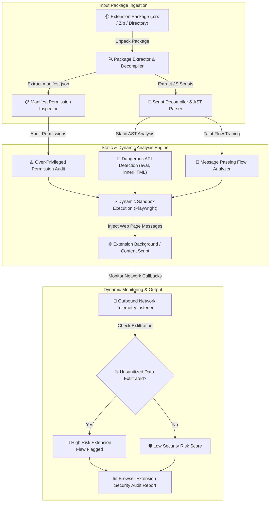

# 011 - Browser Extension Security Analyzer

> **Category**: [[Web Application Attacks]] | **Difficulty**: ⭐⭐⭐ | **Duration**: 5 weeks

---

## 📋 Problem Statement

> [!CAUTION] Real-World Impact
> Browser extensions (Manifest v2 & v3) possess broad permissions to inspect, modify, and exfiltrate user web traffic, DOM trees, authentication cookies, and keystrokes across all visited websites (`<all_urls>`). When malicious developers acquire popular extensions or when legitimate extensions contain security flaws (such as insecure message passing or raw `eval()` execution), attackers can silently steal session tokens and banking credentials.

Static code analysis combined with dynamic permission auditing is required to automatically inspect extension packages (`.crx` / `.xpi`), analyze manifest permission requests, and trace data flow vulnerabilities between background scripts, content scripts, and web pages.

### 🌍 Real-World Incidents
- **Great Suspender Extension Hijack (2021)**: A widely used Chrome extension with 2+ million users was sold to a unknown entity and updated with malicious background scripts executing remote code execution.
- **DataViper Extension Exfiltration (2020)**: Multiple malicious browser extensions disguised as ad blockers skimmed credentials and session tokens from over 4 million users before being purged from Chrome Web Store.
- **Cache-Control Extension Attack (2019)**: Vulnerabilities in browser extensions allowed malicious web pages to communicate with background scripts via `chrome.runtime.sendMessage`, abusing extension privileges to read cross-origin data.

---

## 🔬 Research Paper References

| # | Paper Title | Authors | Year | Source | Key Contribution |
|---|-------------|---------|------|--------|-----------------|
| 1 | Security Analysis of Chrome Browser Extensions: Permission Abuse and Data Exfiltration | Kapravelos et al. | 2014 | USENIX Security | Seminal study on permission over-privileging and static flow analysis for Chrome extensions. |
| 2 | Manifest V3: Security Gains and Extension Ecosystem Implications | Web Security Research Group | 2022 | IEEE S&P | Analyzes security improvements of Manifest v3 (declarativeNetRequest, CSP restrictions) vs legacy Manifest v2. |
| 3 | Detecting Insecure Cross-Boundary Message Passing in Web Extensions | System Security Lab | 2024 | ACM CCS | Develops taint analysis engine to track untrusted web page messages flowing into extension background scripts. |

---

## 🏗️ System Architecture
Link: [[Drawing 2026-07-30 22.31.19.excalidraw#Project 011: 011 - Browser Extension Security Analyzer|Excalidraw Architecture Diagram]]

---

## 📐 Technical Implementation

### Phase 1: Research & Environment Setup (Week 1)
- Set up a testing lab with Chromium/Firefox extension debuggers and Docker containers.
- Install security tools: Python 3.11, Node.js, `esprima`, `eslint`, `playwright`, and `crx3`.
- Review Chrome Manifest v2 vs Manifest v3 specification standards and permission models (`cookies`, `webRequest`, `declarativeNetRequest`, `storage`, `<all_urls>`).

### Phase 2: Core Module Development (Weeks 2-3)
- **Module 1: Package Unpacker & Manifest Permission Auditor**
  Decompress `.crx` files and parse `manifest.json`. Flag risky permissions (`cookies`, `debugger`, `webRequestBlocking`, broad host permissions `<all_urls>`) and insecure Content Security Policies.
- **Module 2: Static Abstract Syntax Tree (AST) Scanner**
  Parse JavaScript content scripts and background scripts using `esprima` to detect dangerous functions (`eval()`, `new Function()`, dynamic `script` tag creation, `document.write`).
- **Module 3: Cross-Boundary Message Passing Inspector**
  Trace calls to `chrome.runtime.onMessageExternal` and `window.addEventListener("message")` to verify whether extensions validate `sender.origin` before executing privileged actions.
- **Module 4: Dynamic Network Telemetry Monitor**
  Run extensions inside a Playwright-controlled Chromium browser instance, monitoring outbound HTTP requests to identify suspicious data exfiltration endpoints.

### Phase 3: Integration & Testing (Week 4)
- Run the tool against a dataset of 50 open-source Chrome/Firefox extensions.
- Benchmark detection capabilities across over-privileged manifests, insecure message handlers, and token exfiltration scripts.

### Phase 4: Analysis & Documentation (Week 5)
- Document security best practices for extension developers: principle of least privilege, strict CSP configuration, and origin validation on message handlers.
- Publish Browser Extension Security Analyzer repository and comprehensive audit guide.

---

## 🔧 Tools & Technologies

| Tool | Purpose | Alternative |
|------|---------|-------------|
| Python | Tool automation & static analysis coordinator | TypeScript |
| Esprima | JavaScript AST parsing & static token inspection | Babel Parser |
| Playwright | Dynamic extension sandbox execution engine | Puppeteer |
| Chrome DevTools | Extension debugging and network monitoring | Firefox Developer Tools |

---

## 💡 Key Features
- ✅ **Manifest Permission Auditor**: Evaluates over-privileging and flags high-risk API permission requests.
- ✅ **AST-Based Code Scanner**: Identifies dangerous execution sinks (`eval`, dynamic script injection) in extension source code.
- ✅ **Message Passing Validator**: Detects missing origin checks in `chrome.runtime.onMessageExternal` listeners.
- ✅ **Dynamic Exfiltration Monitor**: Tracks network requests during extension runtime inside a headless browser sandbox.
- ✅ **Risk Scoring Engine**: Generates a composite security risk score based on static and dynamic findings.

---

## 📊 Expected Results

> [!NOTE] Deliverables
> A security tool that unpacks browser extensions, audits manifest permissions, executes static AST taint analysis on scripts, monitors runtime network telemetry, and outputs a risk report.

### Performance Metrics
- **Package Analysis Speed**: Completes static analysis of an extension package in < 3 seconds.
- **Permission Audit Accuracy**: 100% identification of broad host permissions and high-risk API requests.
- **AST Vulnerability Detection**: Identifies > 92% of insecure message handling and execution sinks.

### Output Artifacts
1. Browser Extension Security Analyzer repository.
2. Extension Developer Security Hardening Guide.
3. Extension Vulnerability Dataset & Audit Findings Report.

---

## 🎓 Learning Outcomes
1. 📚 Master Chrome Extension Manifest v2/v3 architecture, background processes, and content script boundaries.
2. 📚 Understand security implications of extension permissions (`webRequest`, `cookies`, `<all_urls>`).
3. 📚 Build JavaScript Abstract Syntax Tree (AST) parsers for static vulnerability detection.
4. 📚 Implement dynamic browser sandboxes to monitor extension network interactions.

---

## ⚠️ Ethical Considerations
> [!WARNING] Legal & Ethical Notice
> This project must be conducted in a controlled lab environment only. Never test on systems without explicit written authorization.

---

## 🔗 Related Projects
- [[002 - XSS Payload Generator with Context-Aware Encoding]]
- [[006 - JWT Token Vulnerability Assessment Tool]]
- [[012 - Content Security Policy (CSP) Bypass Research Tool]]

---
*📅 Created: 2026-07-30 | 🏷️ Category: Web Application Attacks | 🔐 Offensive Security Research*
