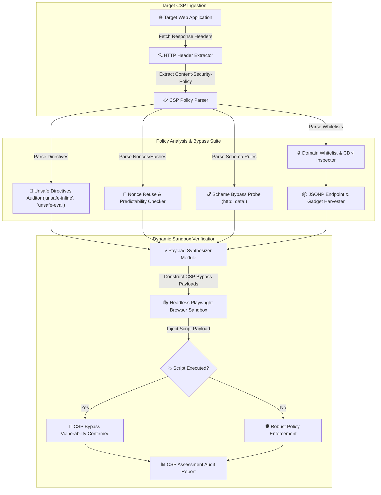

# 012 - Content Security Policy (CSP) Bypass Research Tool

> **Category**: [[Web Application Attacks]] | **Difficulty**: ⭐⭐⭐ | **Duration**: 4 weeks

---

## 📋 Problem Statement

> [!CAUTION] Real-World Impact
> Content Security Policy (CSP) is an HTTP header defense mechanism designed to mitigate Cross-Site Scripting (XSS) and data injection attacks by restricting the origins from which scripts, stylesheets, images, and frame objects can be loaded. However, real-world CSP implementations frequently contain flaws: unsafe directives (`'unsafe-inline'`, `'unsafe-eval'`), over-broad domain whitelists (`*.googleapis.com`, `cdn.jsdelivr.net`), missing directive definitions, and JSONP endpoint abuse vectors.

These misconfigurations allow attackers who uncover an XSS payload vector to bypass CSP restrictions, load malicious external scripts, execute inline code, and exfiltrate confidential user data.

### 🌍 Real-World Incidents
- **Google Services CSP Bypass (2017)**: Security researchers demonstrated how standard CSP domain whitelists including Google JSONP endpoints (`www.google.com/complete/search?client=chrome&jsonp=...`) enabled arbitrary XSS payload execution.
- **Twitter CSP Bypass Flaw (2018)**: Improperly structured fallback directives allowed attackers to load third-party scripts from whitelisted legacy CDN endpoints.
- **US Bank CSP Misconfiguration (2020)**: Inclusion of `'unsafe-inline'` in script-src directives negated CSP protections, permitting injected script tags to execute.

---

## 🔬 Research Paper References

| # | Paper Title | Authors | Year | Source | Key Contribution |
|---|-------------|---------|------|--------|-----------------|
| 1 | CSP Is Dead, Long Live CSP: On the Insecurity of Whitelist-Based CSP in the Wild | Weichselbaum et al. | 2016 | ACM CCS | Benchmark study evaluating 1 million domains, proving 95%+ of domain whitelist CSPs are trivially bypassable. |
| 2 | Strict CSP: A Robust, Deployable Defense Against Cross-Site Scripting | Google Security Team | 2019 | IEEE Security & Privacy | Introduces Nonce-based and Hash-based CSP architectures as superior alternatives to domain whitelists. |
| 3 | Automated Discovery of JSONP and Gadget Bypass Vectors in CSP Whitelists | System Security Research | 2022 | USENIX Security | Presents automated crawler for identifying script gadget endpoints within whitelisted CDN domains. |

---

## 🏗️ System Architecture
Link: [[Drawing 2026-07-30 22.31.19.excalidraw#Project 012: 012 - Content Security Policy (CSP) Bypass Research Tool|Excalidraw Architecture Diagram]]

---

## 📐 Technical Implementation

### Phase 1: Research & Environment Setup (Week 1)
- Deploy a vulnerable web application target featuring 8 distinct misconfigured CSP HTTP headers (Express.js backend).
- Install development tools: Python 3.11, `playwright`, `beautifulsoup4`, `tldextract`, and `requests`.
- Review W3C Content Security Policy Level 3 specification standards (`script-src`, `object-src`, `base-uri`, `default-src`, `'strict-dynamic'`).

### Phase 2: Core Module Development (Weeks 2-3)
- **Module 1: CSP Header Parser & Structure Decompiler**
  Parse raw `Content-Security-Policy` header strings into structured JSON object representations mapping all directives and fallback inheritances (`default-src`).
- **Module 2: Static Misconfiguration Auditor**
  Audit policy structure for known weaknesses: presence of `'unsafe-inline'`, `'unsafe-eval'`, wildcards (`*`), missing `object-src` / `base-uri` directives, and HTTP scheme fallbacks.
- **Module 3: Whitelisted Domain JSONP & Gadget Finder**
  Cross-reference whitelisted domains (`cdn.example.com`, `cdnjs.cloudflare.com`) against a database of known JSONP endpoints and Angular/React script gadgets capable of executing arbitrary code.
- **Module 4: Headless Sandbox Bypass Validator**
  Inject crafted payloads into a Playwright browser context enforcing the target CSP header to confirm whether execution occurs.

### Phase 3: Integration & Testing (Week 4)
- Execute automated scans against top web domains and local misconfigured CSP containers.
- Benchmark detection accuracy across domain-whitelist bypasses, Nonce reuse flaws, and missing directive fallbacks.

### Phase 4: Analysis & Documentation (Week 5)
- Document modern Strict CSP deployment guidelines: utilizing cryptographically random Nonces (`'nonce-rAnd0m'`) and `'strict-dynamic'`.
- Publish complete CSP Bypass Research Tool repository and technical documentation.

---

## 🔧 Tools & Technologies

| Tool | Purpose | Alternative |
|------|---------|-------------|
| Python | CSP parser & bypass engine coordinator | TypeScript |
| Playwright | Headless browser execution verification | Selenium |
| Google CSP Evaluator | Benchmark CSP policy analysis reference | Laboratory Analysis |
| CyberChef | Payload encoding & polyglot construction | Burp Suite |

---

## 💡 Key Features
- ✅ **Automated Policy Parsing**: Converts complex CSP header strings into structured directive ASTs.
- ✅ **JSONP Endpoint Harvester**: Identifies whitelisted CDN domains that host bypassable JSONP endpoints.
- ✅ **Script Gadget Integrator**: Maps AngularJS, React, and Bootstrap script gadgets that execute code within whitelisted origins.
- ✅ **Headless Verification Engine**: Uses Playwright to empirically confirm payload execution under target CSP headers.
- ✅ **Strict CSP Generator**: Generates recommended Nonce-based replacement headers tailored for target web apps.

---

## 📊 Expected Results

> [!NOTE] Deliverables
> A Python-based security tool that parses CSP headers, identifies structural flaws and whitelist bypass vectors, validates payload execution via headless browsers, and suggests hardened Strict CSP configurations.

### Performance Metrics
- **Policy Audit Speed**: Evaluates and parses CSP headers in < 200 ms.
- **JSONP Bypass Discovery**: Matches whitelisted domains against 100+ known JSONP bypass endpoints.
- **Verification Accuracy**: Zero false positives via dynamic browser execution confirmation.

### Output Artifacts
1. CSP Bypass Research Tool repository.
2. Strict CSP Implementation Best Practices Guide.
3. Comparative CSP Audit Report and Remediation Templates.

---

## 🎓 Learning Outcomes
1. 📚 Master W3C Content Security Policy (CSP Level 2 & 3) directives and fallback logic.
2. 📚 Identify CSP bypass vectors including JSONP execution, script gadgets, and missing fallback directives.
3. 📚 Understand the security superiority of Nonce-based Strict CSP over traditional domain whitelists.
4. 📚 Build dynamic browser verification pipelines for client-side security mechanisms.

---

## ⚠️ Ethical Considerations
> [!WARNING] Legal & Ethical Notice
> This project must be conducted in a controlled lab environment only. Never test on systems without explicit written authorization.

---

## 🔗 Related Projects
- [[002 - XSS Payload Generator with Context-Aware Encoding]]
- [[007 - Web Application Firewall (WAF) Bypass Techniques Analyzer]]
- [[011 - Browser Extension Security Analyzer]]

---
*📅 Created: 2026-07-30 | 🏷️ Category: Web Application Attacks | 🔐 Offensive Security Research*
