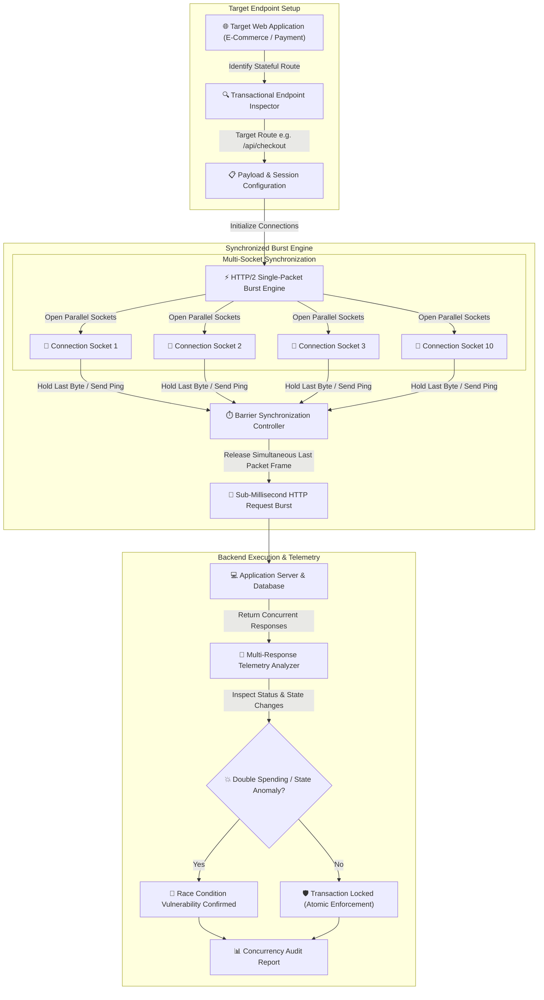

# 013 - Race Condition Vulnerability Detector for Web Apps

> **Category**: [[Web Application Attacks]] | **Difficulty**: ⭐⭐⭐ | **Duration**: 5 weeks

---

## 📋 Problem Statement

> [!CAUTION] Real-World Impact
> Race condition vulnerabilities occur when multi-threaded web applications process concurrent requests without enforcing proper transactional locking mechanisms (Time-of-Check to Time-of-Use / TOCTOU flaws). In financial portals, e-commerce checkouts, and digital wallet systems, sending simultaneous concurrent HTTP requests allows attackers to execute double-spending attacks, redeem single-use discount coupons multiple times, or withdraw funds exceeding account balances.

Traditional sequential web scanners fail to detect race conditions because they issue single requests sequentially. Detecting concurrency bugs requires specialized HTTP engine engines capable of synchronizing and bursting concurrent TCP frames to reach the target backend within narrow sub-millisecond execution windows.

### 🌍 Real-World Incidents
- **Flexcoin Bitcoin Exchange Insolvency (2014)**: Attackers exploited a concurrency race condition in the withdrawal processing logic, sending simultaneous cashout requests that drained 896 Bitcoins ($600,000+ at the time), forcing the exchange into bankruptcy.
- **Revolut Payment System Race Condition (2022)**: Exploitation of payment sync race conditions between US and European transaction gateways enabled malicious actors to steal $20+ million before systems were paused.
- **Steam Market Currency Exploitation (2015)**: Concurrency race conditions in Steam's community market allowed attackers to purchase virtual inventory items multiple times simultaneously using a single wallet balance.

---

## 🔬 Research Paper References

| # | Paper Title | Authors | Year | Source | Key Contribution |
|---|-------------|---------|------|--------|-----------------|
| 1 | Smashing the State Machine: The Server-Side Race Condition | James Kettle | 2023 | Black Hat USA / PortSwigger | Introduces single-packet HTTP/2 synchronization for sub-millisecond race condition exploitation. |
| 2 | Automated Detection of Concurrency Bugs in Web Applications | Software Reliability Lab | 2020 | ACM ISSTA | Presents dynamic race detection for web servers using thread interleaving and database lock analysis. |
| 3 | Concurrency Vulnerabilities in E-Commerce and Financial Web APIs | Financial Cybersecurity Group | 2022 | IEEE S&P | Analyzes TOCTOU flaws across 50 commercial payment gateways and digital wallet microservices. |

---

## 🏗️ System Architecture
Link: [[Drawing 2026-07-30 22.31.19.excalidraw#Project 013: 013 - Race Condition Vulnerability Detector for Web Apps|Excalidraw Architecture Diagram]]

---

## 📐 Technical Implementation

### Phase 1: Research & Environment Setup (Week 1)
- Deploy a vulnerable e-commerce lab target using Node.js, Express, and PostgreSQL (endpoints for gift card redemption and wallet balance transfer without database transactions).
- Install development tools: Python 3.11, `httpx`, `asyncio`, `h2` (HTTP/2 library), and `docker-py`.
- Study concurrency synchronization mechanics: HTTP/1.1 Last-Byte Sync vs HTTP/2 Single-Packet Attack techniques.

### Phase 2: Core Module Development (Weeks 2-3)
- **Module 1: Target Route & Session Mapper**
  Configure request parameters, target headers, authentication cookies, and resource parameters for stateful transactional endpoints (e.g., `POST /redeem-coupon`).
- **Module 2: HTTP/2 Single-Packet Synchronization Engine**
  Construct an asynchronous socket engine using Python `asyncio` and `h2`. Prepare 10-30 parallel HTTP requests over a single TCP connection, withholding the final ping frame until all requests are queued, then releasing them in a single network packet to ensure sub-millisecond arrival at the target backend.
- **Module 3: Dynamic State Anomaly Detector**
  Analyze the set of returned HTTP responses. Identify anomalies such as multiple successful HTTP 200 responses for single-use operations, negative account balance states, or duplicate database records.
- **Module 4: Database Isolation Assessor**
  Evaluate whether backend database engines enforce proper transaction isolation levels (`SERIALIZABLE` vs `READ COMMITTED`) and mutex locks (`SELECT ... FOR UPDATE`).

### Phase 3: Integration & Testing (Week 4)
- Execute concurrency sweeps against local test containers under varying latency parameters.
- Benchmark detection accuracy across gift card redemption, account fund transfers, and password reset token generation.

### Phase 4: Analysis & Documentation (Week 5)
- Document concurrency remediation guidelines: applying database row locks (`FOR UPDATE`), atomic database updates (`UPDATE wallet SET balance = balance - X WHERE balance >= X`), and redis mutex locks.
- Publish Race Condition Vulnerability Detector codebase and complete audit report.

---

## 🔧 Tools & Technologies

| Tool | Purpose | Alternative |
|------|---------|-------------|
| Python | Asynchronous network engine & sync controller | Go |
| HTTPX / H2 | Low-level HTTP/2 single-packet socket engine | Custom Sockets |
| Burp Suite | Turbo Intruder reference testing | OWASP ZAP |
| PostgreSQL | Target database with transactional locking | MySQL |

---

## 💡 Key Features
- ✅ **HTTP/2 Single-Packet Burst Engine**: Delivers concurrent requests in a single TCP packet for sub-millisecond backend arrival.
- ✅ **Barrier Synchronization**: Coordinates multi-socket connections to eliminate network jitter during testing.
- ✅ **State Anomaly Analyzer**: Automatically detects duplicate successful responses for single-use transactions.
- ✅ **Database Isolation Tester**: Verifies whether backend queries utilize atomic row locks or flawed non-atomic checks.
- ✅ **Comprehensive Telemetry**: Measures time deltas between response arrivals to confirm execution overlap.

---

## 📊 Expected Results

> [!NOTE] Deliverables
> A Python concurrency testing tool capable of executing HTTP/2 single-packet synchronization attacks, detecting TOCTOU race conditions in transactional web apps, and outputting audit reports.

### Performance Metrics
- **Packet Synchronization Precision**: Delivers 20+ HTTP requests to backend within a < 1 ms window.
- **Race Condition Detection Rate**: 100% detection rate on un-locked transactional test endpoints.
- **Execution Speed**: Completes a full multi-packet concurrency test in < 3 seconds.

### Output Artifacts
1. Race Condition Vulnerability Detector repository.
2. E-Commerce Concurrency Defense & Transactional Locking Guide.
3. Concurrency Vulnerability Audit Report Format.

---

## 🎓 Learning Outcomes
1. 📚 Understand Time-of-Check to Time-of-Use (TOCTOU) flaws and multi-threaded race conditions in web applications.
2. 📚 Master HTTP/2 single-packet synchronization mechanisms and TCP window frame control.
3. 📚 Build asynchronous network engines capable of microsecond request coordination.
4. 📚 Implement atomic database queries, Redis distributed mutexes, and row-level locking controls.

---

## ⚠️ Ethical Considerations
> [!WARNING] Legal & Ethical Notice
> This project must be conducted in a controlled lab environment only. Never test on systems without explicit written authorization.

---

## 🔗 Related Projects
- [[001 - Automated SQL Injection Detection & Prevention System]]
- [[003 - CSRF Token Analyzer & Bypass Framework]]
- [[008 - Broken Access Control Detection Engine]]

---
*📅 Created: 2026-07-30 | 🏷️ Category: Web Application Attacks | 🔐 Offensive Security Research*
