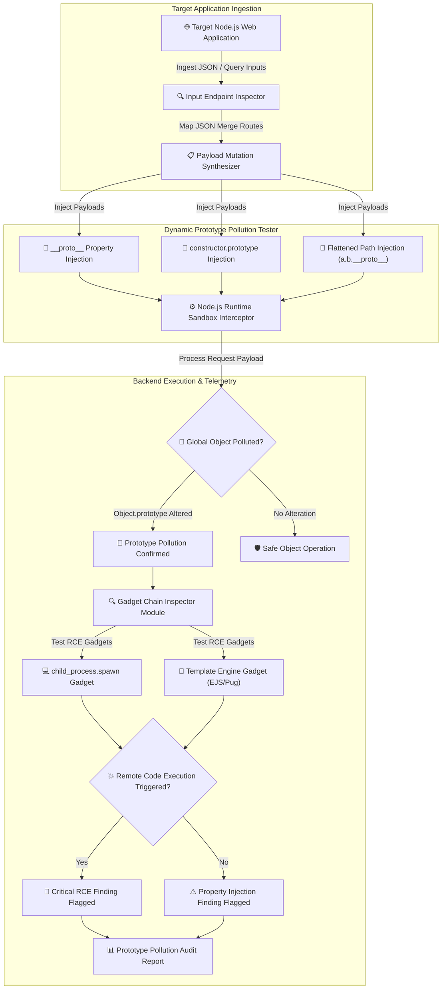

# 014 - Prototype Pollution Attack Detection System

> **Category**: [[Web Application Attacks]] | **Difficulty**: ⭐⭐⭐ | **Duration**: 5 weeks

---

## 📋 Problem Statement

> [!CAUTION] Real-World Impact
> Prototype Pollution is a vulnerability specific to prototype-based programming languages like JavaScript (Node.js & browser runtimes). By recursively merging unsanitized user-controlled JSON objects into existing object prototypes (`Object.prototype`), attackers can inject arbitrary properties (`__proto__.isAdmin = true`, `__proto__.shell = "/bin/sh"`) into all JavaScript objects across the entire application runtime.

In Node.js backend servers, polluting global object prototypes bypasses access control checks, tampers with application configuration parameters, and triggers Remote Code Execution (RCE) when polluted properties are consumed by child processes (`child_process.fork`, `exec`).

### 🌍 Real-World Incidents
- **Lodash Prototype Pollution (CVE-2019-10744)**: A critical flaw in the popular `lodash` library's `defaultsDeep` function allowed attackers to pollute `Object.prototype`, affecting millions of dependent Node.js applications.
- **Kibana Remote Code Execution (CVE-2019-7609)**: Prototype pollution in Kibana's visualization engine enabled unauthenticated attackers to pollute environmental variables and spawn reverse shell processes.
- **Express.js Query Parser Flaw (2020)**: Misconfigured query string parsers (`qs` extended mode) allowed attackers to pass `__proto__` parameters in URL query strings, polluting global server objects.

---

## 🔬 Research Paper References

| # | Paper Title | Authors | Year | Source | Key Contribution |
|---|-------------|---------|------|--------|-----------------|
| 1 | Silent Spring: Prototype Pollution Leads to Remote Code Execution in Node.js | Shcherbakov et al. | 2021 | USENIX Security | Identifies gadget chains in Node.js core libraries that elevate prototype pollution into RCE. |
| 2 | Server-Side Prototype Pollution: Finding and Exploiting Gadget Chains | Olivier Arteau | 2020 | ACM CCS | Seminal research on server-side prototype pollution detection and property injection payloads. |
| 3 | Static and Dynamic Analysis for Detecting Prototype Pollution in JavaScript Ecosystems | Node.js Security Group | 2023 | IEEE S&P | Develops CodeQL queries and dynamic taint analysis engines for identifying vulnerable JSON merge routines. |

---

## 🏗️ System Architecture
Link: [[Drawing 2026-07-30 22.31.19.excalidraw#Project 014: 014 - Prototype Pollution Attack Detection System|Excalidraw Architecture Diagram]]

---

## 📐 Technical Implementation

### Phase 1: Research & Environment Setup (Week 1)
- Deploy a vulnerable Node.js/Express target app featuring nested object merge routines (`lodash.merge`, custom recursive copy functions).
- Install development tools: Python 3.11, Node.js 18, `codeql`, `playwright`, and `requests`.
- Study JavaScript inheritance models: `Object.prototype`, `Object.assign()`, `Object.create(null)`, and Freeze mechanisms (`Object.freeze()`).

### Phase 2: Core Module Development (Weeks 2-3)
- **Module 1: Dynamic Property Injection Probe**
  Construct JSON payloads targeting `__proto__`, `constructor.prototype`, and nested JSON keys (e.g., `{"__proto__": {"polluted": true}}`) sent via POST body, query strings, and cookies.
- **Module 2: Server-Side Pollution Verifier**
  Check whether injected properties reflect globally across unpolluted endpoints (e.g., send `GET /api/status` and verify if the response JSON includes `"polluted": true`).
- **Module 3: CodeQL Static AST Inspector**
  Develop custom CodeQL query rules to scan Node.js source code repositories for unsafe recursive object assignment loops lacking property sanitization checks.
- **Module 4: RCE Gadget Chain Inspector**
  Test known Node.js gadget chains (`env`, `NODE_OPTIONS`, `execPath` injection into `child_process.fork`) to determine if a prototype pollution vulnerability can be escalated into Remote Code Execution.

### Phase 3: Integration & Testing (Week 4)
- Execute automated sweeps against vulnerable npm packages and test microservice containers.
- Benchmark detection capabilities across Client-Side (DOM) Prototype Pollution and Server-Side Prototype Pollution.

### Phase 4: Analysis & Documentation (Week 5)
- Document Node.js defense strategies: utilizing `Object.create(null)` for dictionary objects, schema validation via `AJV`, applying `Object.freeze(Object.prototype)`, and updating vulnerable dependencies.
- Publish Prototype Pollution Attack Detection System codebase and audit report.

---

## 🔧 Tools & Technologies

| Tool | Purpose | Alternative |
|------|---------|-------------|
| Python | Test automation controller & HTTP probe engine | Node.js |
| CodeQL | Static code analysis & prototype flow discovery | ESLint Plugin |
| Node.js | Target backend runtime environment | Deno / Bun |
| Playwright | Client-side DOM prototype pollution detector | Selenium |

---

## 💡 Key Features
- ✅ **Dynamic Payload Mutator**: Constructs `__proto__` and `constructor.prototype` payloads across JSON and query string vectors.
- ✅ **Global Object Reflection Verifier**: Confirms whether property injections affect unpolluted backend routes.
- ✅ **CodeQL Rule Suite**: Static analysis queries to identify unsanitized recursive merge functions in JS codebases.
- ✅ **RCE Gadget Chain Detector**: Evaluates escalation pathways targeting Node.js `child_process` and template engines.
- ✅ **Client & Server-Side Dual Auditing**: Tests both client-side DOM prototype pollution and backend Node.js runtimes.

---

## 📊 Expected Results

> [!NOTE] Deliverables
> A detection system that combines dynamic payload probing with static CodeQL AST analysis to identify prototype pollution vulnerabilities in Node.js applications and assess RCE escalation paths.

### Performance Metrics
- **Dynamic Probe Speed**: Evaluates endpoint merge routines in < 1 second per request.
- **Static Analysis Accuracy**: Identifies > 90% of unsafe object merge patterns in source code.
- **False Positive Rate**: Zero false positives via reflection-based state verification.

### Output Artifacts
1. Prototype Pollution Attack Detection System repository.
2. CodeQL Prototype Pollution Query Suite.
3. Node.js Prototype Hardening and Remediation Guide.

---

## 🎓 Learning Outcomes
1. 📚 Master JavaScript object inheritance, prototype chains, and global object properties.
2. 📚 Understand Server-Side and Client-Side Prototype Pollution attack mechanics.
3. 📚 Build CodeQL queries for static code taint tracking in JavaScript projects.
4. 📚 Implement defensive programming practices: `Object.create(null)`, `Map` objects, and schema validation.

---

## ⚠️ Ethical Considerations
> [!WARNING] Legal & Ethical Notice
> This project must be conducted in a controlled lab environment only. Never test on systems without explicit written authorization.

---

## 🔗 Related Projects
- [[002 - XSS Payload Generator with Context-Aware Encoding]]
- [[005 - API Security Testing Automation Platform]]
- [[008 - Broken Access Control Detection Engine]]

---
*📅 Created: 2026-07-30 | 🏷️ Category: Web Application Attacks | 🔐 Offensive Security Research*
