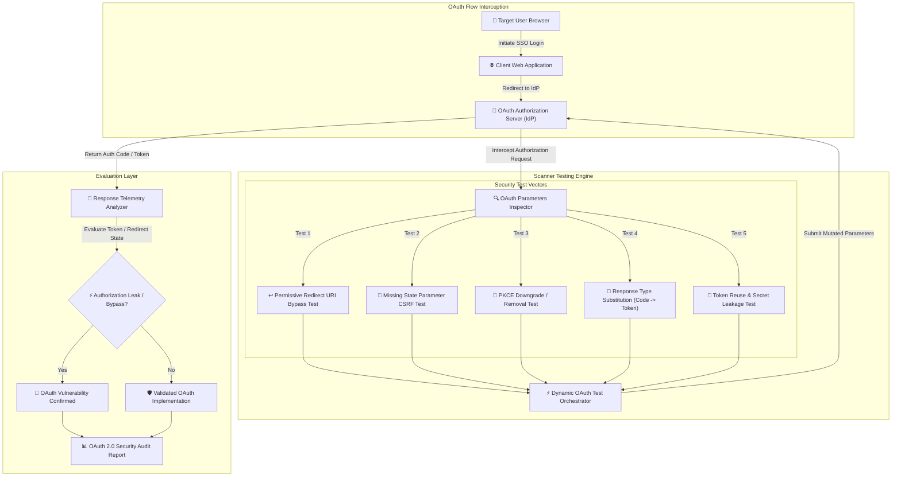

# 015 - OAuth 2.0 Flow Vulnerability Scanner

> **Category**: [[Web Application Attacks]] | **Difficulty**: ⭐⭐⭐ | **Duration**: 5 weeks

---

## 📋 Problem Statement

> [!CAUTION] Real-World Impact
> OAuth 2.0 and OpenID Connect (OIDC) are the foundational framework standards for federated single sign-on (SSO) authentication across modern web and mobile applications. However, implementation oversights—such as permissive redirect URI validation (path traversal, open redirectors), missing state parameter verification (enabling OAuth CSRF account linking), PKCE code verifier downgrade attacks, and implicit grant token leaks—allow attackers to intercept authorization codes and access tokens, leading to full account takeover.

Because OAuth flows involve complex redirect chains between Client Applications, User Browsers, and Authorization Servers, automated security tools must trace state variables and token exchanges across multi-domain authorization sequences.

### 🌍 Real-World Incidents
- **Facebook OAuth Redirect URI Token Leak (2014)**: Security researchers discovered that open redirect flaws in trusted client domains permitted authorization codes to be leaked via the HTTP `Referer` header to attacker sites.
- **GitHub OAuth Account Linking CSRF (2019)**: Missing `state` parameter verification during third-party integration allowed attackers to force victims to link their accounts to the attacker's identity.
- **Sign in with Apple OAuth Flaw (2020)**: A critical flaw in Apple's OIDC implementation allowed attackers to forge JWT identity tokens for any email address, achieving full authentication bypass.

---

## 🔬 Research Paper References

| # | Paper Title | Authors | Year | Source | Key Contribution |
|---|-------------|---------|------|--------|-----------------|
| 1 | Formal Security Analysis of OAuth 2.0 and OpenID Connect Implementation Flaws | Fett et al. | 2016 | ACM CCS | Provides formal security model verifying attack vectors in OAuth 2.0 authorization code and implicit flows. |
| 2 | Analyzing Redirect URI Security Restrictions in Commercial OAuth 2.0 Identity Providers | Sun & Beznosov | 2021 | IEEE S&P | Evaluates wildcard matching and open redirect vectors across 30 major Identity Providers (IdPs). |
| 3 | Automated Security Auditing of PKCE and Token Binding Implementations in Mobile & Web Apps | Identity Security Group | 2023 | USENIX Security | Demonstrates proof-key downgrade and authorization code interception attacks in OIDC clients. |
| 4 | Federated Identity Vulnerabilities: Lessons from OAuth and OpenID Connect Exploitation | Mainka et al. | 2024 | NDSS | Comprehensive taxonomy of real-world implementation vulnerabilities across cloud single sign-on providers. |

---

## 🏗️ System Architecture
Link: [[Drawing 2026-07-30 22.31.19.excalidraw#Project 015: 015 - OAuth 2.0 Flow Vulnerability Scanner|Excalidraw Architecture Diagram]]

---

## 📐 Technical Implementation

### Phase 1: Research & Environment Setup (Week 1)
- Deploy a vulnerable OAuth 2.0 authorization lab target using Python Flask and `authlib` (featuring endpoints for Authorization Server, Client App, and Resource Server).
- Install development tools: Python 3.11, `authlib`, `requests`, `playwright`, and `pyjwt`.
- Study RFC 6749 (OAuth 2.0 Authorization Framework), RFC 7636 (PKCE), and OpenID Connect Core 1.0 standards.

### Phase 2: Core Module Development (Weeks 2-3)
- **Module 1: OAuth Flow Parameter Extractor**
  Parse authorization request URLs to extract parameters (`client_id`, `redirect_uri`, `response_type`, `scope`, `state`, `code_challenge`).
- **Module 2: Redirect URI Evasion Probe**
  Mutate `redirect_uri` parameter using path traversal (`/oauth/callback/../../attacker`), wildcard subdomains (`https://attacker.client.com`), and open redirectors to test if the authorization code is dispatched to an untrusted domain.
- **Module 3: State Parameter CSRF & Pre-Assigned Code Assessor**
  Test authorization flows with omitted or static `state` parameters to evaluate vulnerability to OAuth account linking CSRF attacks.
- **Module 4: PKCE Enforcement & Response Type Mutator**
  Remove `code_challenge` and `code_challenge_method` parameters from authorization requests to check if the server forces Proof Key for Code Exchange (PKCE). Test substituting `response_type=code` with `response_type=token` (Implicit flow downgrade).

### Phase 3: Integration & Testing (Week 4)
- Execute automated scans against local Flask OAuth containers and open-source Identity Provider instances (Keycloak, Hydra).
- Benchmark detection capabilities across Redirect URI leaks, State parameter flaws, and PKCE bypass vectors.

### Phase 4: Analysis & Documentation (Week 5)
- Document OAuth security best practices: exact redirect URI string matching, mandatory PKCE enforcement for all clients, and cryptographically secure state tokens tied to user sessions.
- Publish complete OAuth 2.0 Flow Vulnerability Scanner repository and documentation.

---

## 🔧 Tools & Technologies

| Tool | Purpose | Alternative |
|------|---------|-------------|
| Python | Scanner automation & HTTP protocol test engine | Go |
| Authlib | Target OAuth 2.0 server & client library | Keycloak / Hydra |
| Playwright | Headless browser for multi-redirect flow tracing | Selenium |
| PyJWT | Decoding identity tokens and verifying claims | CyberChef |

---

## 💡 Key Features
- ✅ **Redirect URI Evasion Suite**: Tests path traversal, open redirectors, and subdomain bypass vectors.
- ✅ **OAuth CSRF State Validator**: Assesses whether `state` parameters are properly generated, bound, and verified.
- ✅ **PKCE Downgrade Detector**: Tests authorization servers for missing Proof Key for Code Exchange enforcement.
- ✅ **Flow Downgrade Inspector**: Attempts to downgrade Authorization Code flows to vulnerable Implicit flows.
- ✅ **Automated Redirect Chain Tracker**: Traces multi-domain HTTP redirects using headless browser automation.

---

## 📊 Expected Results

> [!NOTE] Deliverables
> A Python security tool that intercepts OAuth 2.0 and OIDC authentication flows, executes redirect URI and state parameter bypass tests, verifies PKCE enforcement, and outputs a security audit report.

### Performance Metrics
- **Flow Scan Speed**: Completes a full OAuth flow vulnerability assessment in < 4 seconds.
- **Redirect Evasion Detection**: 100% detection rate on loose redirect URI whitelist matching rules.
- **State Validation Accuracy**: Zero false positives on OAuth CSRF identification.

### Output Artifacts
1. OAuth 2.0 Flow Vulnerability Scanner repository.
2. Identity Provider (IdP) OAuth Hardening Guide.
3. OAuth 2.0 Vulnerability Audit Report Format.

---

## 🎓 Learning Outcomes
1. 📚 Master OAuth 2.0 and OpenID Connect (OIDC) protocols, authorization flows, and identity grant types.
2. 📚 Understand OAuth attack vectors including Redirect URI leaks, OAuth CSRF, and PKCE downgrades.
3. 📚 Build multi-domain HTTP redirect tracking tools using headless browsers and proxy engines.
4. 📚 Implement robust security controls for OAuth client and authorization server architectures.

---

## ⚠️ Ethical Considerations
> [!WARNING] Legal & Ethical Notice
> This project must be conducted in a controlled lab environment only. Never test on systems without explicit written authorization.

---

## 🔗 Related Projects
- [[003 - CSRF Token Analyzer & Bypass Framework]]
- [[005 - API Security Testing Automation Platform]]
- [[006 - JWT Token Vulnerability Assessment Tool]]

---
*📅 Created: 2026-07-30 | 🏷️ Category: Web Application Attacks | 🔐 Offensive Security Research*
