# 🎯 016 - Automated Network Reconnaissance Framework

> **Category**: [[Network Penetration Testing]] | **Difficulty**: ⭐⭐ | **Duration**: 5 weeks

---

## 📋 Problem Statement

> [!CAUTION] Real-World Impact
> Advanced Persistent Threat (APT) actors routinely spend 75% of their attack lifecycle performing covert network reconnaissance prior to weaponization and delivery. Undetected mapping of internal topologies, unpatched external assets, and exposed administration services enables adversaries to construct high-precision attack graphs, leading to devastating network intrusions such as the SolarWinds supply chain breach.

Automated network reconnaissance is a critical phase in both offensive security assessments and proactive cyber defense. Manual host discovery, port scanning, service enumeration, and vulnerability correlation across large, distributed corporate IP spaces is slow, prone to human error, and difficult to standardize. Modern enterprise networks dynamically alter their attack surfaces through cloud deployments, remote access gateways, and ephemeral microservices, creating perimeter blind spots. 

This project addresses the challenge of building a modular, multi-threaded, and high-performance network reconnaissance framework. By orchestrating both passive open-source intelligence (OSINT) gathering and active network probing (leveraging low-level raw socket manipulation and asynchronous port scanning), the framework systematically maps enterprise attack surfaces, fingerprints operating systems, identifies exposed protocols, and cross-references discovered service banners against known vulnerability databases (NVD/CVE).

### 🌍 Real-World Incidents
- **SolarWinds Supply Chain Breach (2020)**: APT29 conducted months of passive and active internal network reconnaissance across victim networks, mapping Active Directory structures and internal build servers prior to deploying secondary payloads.
- **Equifax Data Breach (2017)**: Attackers scanned public IP ranges, identifying an unpatched Apache Struts vulnerability on an external customer portal that served as the initial breach vector.
- **Singtel Telecom Breach (2024)**: State-sponsored actors utilized automated scanning scripts to identify exposed edge routers and unmanaged VPN concentrators, leveraging them for persistent access.

---

## 🔬 Research Paper References

| # | Paper Title | Authors | Year | Source | Key Contribution |
|---|-------------|---------|------|--------|-----------------|
| 1 | ZMap: Fast Network Scan at Internet Scale | Durumeric et al. | 2013 | USENIX Security | Introduced asynchronous connectionless probing allowing full IPv4 network scanning in under 45 minutes. |
| 2 | Nmap Network Scanning | Lyon, G. | 2009 | Insecure.org | Documented TCP/IP stack fingerprinting methodologies and OS detection using raw socket responses. |
| 3 | How to 0wn the Internet in Your Spare Time | Staniford et al. | 2002 | USENIX Security | Modeled automated scanning worm propagation, highlighting the speed and threat of automated network discovery. |

---

## 🏗️ System Architecture
Link: [[Drawing 2026-07-30 22.31.19.excalidraw#Project 016: 016 - Automated Network Reconnaissance Framework|Excalidraw Architecture Diagram]]

```mermaid
graph TD
    subgraph Input_Scope ["1. Input & Target Scope"]
        A[Target Specification: CIDR / Domain / IP List] --> B[Scope Validator & Excluder]
    end

    subgraph Passive_Recon ["2. Passive Intelligence Layer"]
        B --> C[Shodan API Engine]
        B --> D[Censys & PassiveDNS Query Module]
        B --> E[WHOIS & Reverse DNS Lookups]
    end

    subgraph Active_Recon ["3. Active Probing Engine"]
        B --> F[Asynchronous SYN Scanner - Masscan]
        F --> G[TCP/UDP Port Discovery]
        G --> H[Service Banner Grabber - Scapy]
        H --> I[TCP/IP Stack OS Fingerprinting]
    end

    subgraph Analysis_Engine ["4. Processing & Correlation"]
        C --> J[Data Aggregator & Deduplicator]
        D --> J
        E --> J
        I --> J
        J --> K[CVE / NVD Vulnerability Mapper]
        K --> L[Network Topology Graph Generator]
    end

    subgraph Output_Layer ["5. Reporting & Export"]
        L --> M[Interactive HTML/JSON Dashboard]
        L --> N[Graphviz Network Map Export]
    end

    style Input_Scope fill:#1f2937,stroke:#3b82f6,stroke-width:2px;
    style Passive_Recon fill:#1e293b,stroke:#06b6d4,stroke-width:2px;
    style Active_Recon fill:#111827,stroke:#ef4444,stroke-width:2px;
    style Analysis_Engine fill:#0f172a,stroke:#10b981,stroke-width:2px;
    style Output_Layer fill:#18181b,stroke:#8b5cf6,stroke-width:2px;
```

---

## 📐 Technical Implementation

### Phase 1: Research & Environment Setup (Week 1)
- Install Python 3.11+, Scapy, Nmap development libraries, and libpcap bindings.
- Configure isolated lab subnet (192.168.56.0/24) containing Linux, Windows, and Metasploitable targets.
- Set up API credentials for passive reconnaissance providers (Shodan, Censys, SecurityTrails).
- Establish raw socket permissions (`CAP_NET_RAW` capabilities) for non-root execution in Linux environments.

### Phase 2: Core Module Development (Weeks 2-3)
- **Passive Subsystem**: Develop Python modules to query domain registries, passive DNS databases, and search engine indices to build an initial target profile without sending packets to the target IP range.
- **Active Scanning Subsystem**: Implement an asynchronous TCP SYN port scanner using raw sockets (`Scapy`/`socket` library) capable of probing thousands of ports per second.
- **Banner Grabbing & OS Detection**: Write custom protocol probes for HTTP, SSH, FTP, SMTP, and SMB to capture service responses; implement TCP window size and TTL analysis for OS identification.
- **Vulnerability Correlation Engine**: Build an SQLite/JSON offline database of CVEs and match service banner string patterns against known vulnerability signatures.

### Phase 3: Integration & Testing (Week 4)
- Integrate passive and active modules into a centralized CLI pipeline using `asyncio` for multi-threading.
- Execute scan benchmarks against lab targets to evaluate scanning speed, bandwidth utilization, and detection rates.
- Test stealth scanning techniques (ACK scanning, FIN scanning, packet fragmentation) against Snort IDS to evaluate evasion capabilities.
- Validate output data formatting (JSON schema verification, NetworkX topology graph generation).

### Phase 4: Analysis & Documentation (Week 5)
- Conduct performance trade-off analysis between high-speed asynchronous probing (Masscan style) and deep stateful scanning (Nmap style).
- Generate comprehensive technical reports detailing attack surface findings, high-risk open services, and missing security patches.
- Finalize BTech project report, code documentation, and prepare demonstration slides for viva evaluation.

---

## 🔧 Tools & Technologies

| Tool | Purpose | Alternative |
|------|---------|-------------|
| Python 3.11 | Core orchestration and asynchronous logic | Go / Rust |
| Scapy | Raw packet creation, banner grabbing, stack manipulation | Libpcap / Pyroute2 |
| Masscan | High-speed asynchronous SYN port scanning | ZMap |
| Nmap | Stateful service fingerprinting and script verification | Rustscan |
| Shodan API | Passive OSINT asset discovery | Censys API |
| NetworkX | Topology graph construction and visualization | Graphviz |

---

## 💡 Key Features
- ✅ **Hybrid Reconnaissance Architecture**: Combines zero-touch passive OSINT with active network probing for total attack surface visibility.
- ✅ **Asynchronous Probing Engine**: Leverages non-blocking I/O socket events to scan /24 subnets in under 30 seconds.
- ✅ **Intelligent OS & Service Fingerprinting**: Analyzes IP TTL, TCP Window Size, and banner header strings to accurately identify target systems.
- ✅ **Automated CVE Mapping**: Automatically correlates discovered application banners against the National Vulnerability Database (NVD).
- ✅ **Interactive Topology Rendering**: Generates dynamic network topology diagrams visualizing host relationships and vulnerability density.

---

## 📊 Expected Results

> [!NOTE] Deliverables
> Complete Python-based automated network reconnaissance framework, vulnerability correlation database, interactive HTML dashboard generator, and benchmark report comparing scanning speed and accuracy against commercial security tools.

### Performance Metrics
- **Port Scanning Speed**: > 5,000 ports/second on standard 1Gbps network interface.
- **OS Fingerprinting Accuracy**: > 92% match rate across standard Linux/Windows distributions.
- **False Positive CVE Rate**: < 8% when performing banner-based vulnerability correlation.

### Output Artifacts
1. Functional Python Reconnaissance Engine CLI (`recon_framework.py`).
2. JSON/XML structured scan report containing asset inventory and vulnerability severity scores.
3. Interactive HTML visualizer with embedded Graphviz network topology.

---

## 🎓 Learning Outcomes
1. 📚 **Network Protocol Dynamics**: Deep understanding of TCP/IP handshake mechanisms, ICMP control messages, and raw socket programming.
2. 📚 **Asynchronous Programming**: Mastery of Python `asyncio` and multi-threaded socket operations for high-throughput network tools.
3. 📚 **Vulnerability Management**: Knowledge of CVE scoring, CPE identifiers, and automated attack surface analysis.
4. 📚 **Offensive Evasion Techniques**: Practical experience in firewall traversal, packet fragmentation, and rate-limiting evasion.

---

## ⚠️ Ethical Considerations
> [!WARNING] Legal & Ethical Notice
> Active network scanning can saturate network links, trigger Intrusion Prevention Systems (IPS), and disrupt critical infrastructure. This tool MUST ONLY be executed against IP ranges explicitly authorized in writing. Unauthorized scanning against external networks is illegal under cybercrime legislation (e.g., Computer Fraud and Abuse Act, IT Act 2000).

---

## 🔗 Related Projects
- [[017 - ARP Spoofing Detection & Prevention System]]
- [[025 - Active Directory Penetration Testing Automation]]
- [[026 - SMB-CIFS Vulnerability Scanner & Exploit Chain Builder]]

---
*📅 Created: 2026-07-30 | 🏷️ Category: Network Penetration Testing | 🔐 Offensive Security Research*
