# 🎯 017 - ARP Spoofing Detection & Prevention System

> **Category**: [[Network Penetration Testing]] | **Difficulty**: ⭐ | **Duration**: 4 weeks

---

## 📋 Problem Statement

> [!CAUTION] Real-World Impact
> Address Resolution Protocol (ARP) lacks inherent authentication mechanisms, leaving local area networks (LANs) highly vulnerable to ARP cache poisoning. Attackers exploiting this flaw can seamlessly insert themselves between network endpoints to intercept unencrypted traffic, modify data in transit, hijack sessions, or launch Denial-of-Service (DoS) attacks across corporate environments.

The fundamental design of ARP assumes all participating hosts within a Ethernet broadcast domain are trusted. Consequently, a malicious actor can transmit unsolicited ARP reply messages (gratuitous ARP) to map an arbitrary IP address (such as the default gateway) to their own network interface MAC address. Once established, all outbound traffic from victim machines routes directly through the adversary's system. 

This project details the design and implementation of an automated, real-time ARP Spoofing Detection and Prevention System (ASDPS). Operating at Layer 2 of the OSI model, the system inspects incoming ARP packet headers, maintains a dynamic state table cross-referencing IP-to-MAC associations with DHCP lease logs and ICMP ping probes, detects anomalous duplicate MAC mappings, and triggers automated active counter-measures (such as issuing corrective static ARP entries, injecting anti-spoofing packets, or dynamically altering firewall rules via `iptables`).

### 🌍 Real-World Incidents
- **Standard Chartered Bank LAN Attack (2018)**: Insiders deployed malicious hardware devices on local office subnets, utilizing ARP spoofing to intercept internal communication and scrape unencrypted credentials.
- **University Campus Network Hijacking (2021)**: Rogue devices on a university Wi-Fi network executed widespread ARP poisoning, redirecting administrative traffic to phishing portals.
- **Industrial Control System LAN Compromise (2023)**: Threat actors bridged an IT network to an OT network segment, using ARP redirection to manipulate Modbus PLC communication traffic.

---

## 🔬 Research Paper References

| #   | Paper Title                                         | Authors             | Year | Source                  | Key Contribution                                                                                                     |
| --- | --------------------------------------------------- | ------------------- | ---- | ----------------------- | -------------------------------------------------------------------------------------------------------------------- |
| 1   | ARP Cache Poisoning Prevention Techniques           | Ramachandran et al. | 2006 | IEEE Security & Privacy | Formulated active probing strategies for validating ARP binding authenticity in enterprise LANs.                     |
| 2   | Detection and Mitigation of ARP Poisoning Attacks   | Lootah et al.       | 2007 | IEEE Communications     | Designed cryptographic ticket-based extensions for ARP to prevent unauthorized binding updates.                      |
| 3   | Dynamic ARP Inspection (DAI) in Enterprise Networks | Cisco Systems       | 2015 | Whitepaper              | Defined industry-standard switch hardware mitigation policies matching ARP bindings against DHCP snooping databases. |

---

## 🏗️ System Architecture
Link: [[Drawing 2026-07-30 22.31.19.excalidraw#Project 017: 017 - ARP Spoofing Detection & Prevention System|Excalidraw Architecture Diagram]]

```mermaid
graph TD
    subgraph LAN_Environment ["Local Area Network (OSI Layer 2)"]
        Victim[Victim Workstation] <--> Router[Default Gateway]
        Attacker[Attacker / MitM Node] -. ARP Poisoning Packet .-> Victim
        Attacker -. Gratuitous ARP .-> Router
    end

    subgraph Monitoring_Engine ["1. ASDPS Packet Sniffer"]
        Sensor[Promiscuous Packet Sensor] --> PacketParser[Scapy ARP Header Parser]
    end

    subgraph Detection_Logic ["2. Detection & Analysis Pipeline"]
        PacketParser --> BindingLookup{IP-to-MAC State Table Check}
        BindingLookup -- Match Found --> StateValid[Legitimate Traffic - Pass]
        BindingLookup -- MAC Mismatch / Conflict --> AnomalyTrigger[Anomaly Detector]
        AnomalyTrigger --> ActiveProbe[Active ICMP/ARP Request Probe]
        ActiveProbe --> VerifyHost{Is Dual-MAC Claim Real?}
        VerifyHost -- Single Host Responding --> ConfirmedAttack[Spoofing Confirmed!]
    end

    subgraph Prevention_Engine ["3. Prevention & Mitigation Action"]
        ConfirmedAttack --> StaticARP[Inject Corrective Static ARP Entries]
        ConfirmedAttack --> BlockRule[Trigger iptables MAC Block Rule]
        ConfirmedAttack --> AlertSys[Send Syslog / Email Alert]
    end

    Victim -. Packet Traffic .-> Sensor
    Attacker -. Packet Traffic .-> Sensor

    style LAN_Environment fill:#1e1e2e,stroke:#f38ba8,stroke-width:2px;
    style Monitoring_Engine fill:#181825,stroke:#89b4fa,stroke-width:2px;
    style Detection_Logic fill:#11111b,stroke:#fab387,stroke-width:2px;
    style Prevention_Engine fill:#313244,stroke:#a6e3a1,stroke-width:2px;
```

---

## 📐 Technical Implementation

### Phase 1: Research & Environment Setup (Week 1)
- Provision a virtualized test network using VirtualBox/VMware containing three virtual machines: Gateway Router (Linux), Victim Workstation (Windows/Ubuntu), and Attacker Node (Kali Linux with Ettercap/Arpspoof).
- Install Python 3.11+, Scapy, NetfilterQueue, and `pcap` capture utilities on the monitoring node.
- Configure network adapters to Internal Network mode to isolate Layer 2 broadcast traffic.

### Phase 2: Core Module Development (Weeks 2-3)
- **Layer 2 Sniffer Module**: Build a low-level packet capture daemon using Scapy filtering for `eth.type == 0x0806` (ARP packets).
- **State Engine & Database**: Construct an in-memory IP-to-MAC mapping cache initialized via standard gateway ARP table discovery and dynamic passive monitoring.
- **Anomaly Detection Algorithms**: Implement threshold-based rules to detect:
  1. Excessive Gratuitous ARP broadcasts within a short time window.
  2. MAC address changes for existing IP table mappings.
  3. Mismatches between IP network prefixes and hardware vendor OUI codes.
- **Active Probe Validator**: When an anomaly is detected, construct targeted unicast ARP requests to confirm if multiple physical devices respond to the same IP.

### Phase 3: Integration & Testing (Week 4)
- **Active Mitigation Logic**: Implement automated dynamic response handlers:
  - Broadcast legitimate ARP replies to restore correct MAC caching on victim nodes.
  - Execute Linux `ip neighbor` commands to force static ARP entries.
  - Automatically add malicious MAC addresses to `iptables` / `ebtables` drop rules.
- Test against common offensive toolsets (`arpspoof`, `Ettercap`, `Bettercap`) to evaluate response latency and detection rates.

### Phase 4: Analysis & Documentation (Week 5)
- Measure network overhead added by active probe validation.
- Evaluate system efficacy across varying network loads and high-frequency legitimate DHCP renewal scenarios.
- Complete the formal project documentation, flowcharts, and demonstration video.

---

## 🔧 Tools & Technologies

| Tool | Purpose | Alternative |
|------|---------|-------------|
| Python Scapy | Packet crafting, sniffing, and ARP header inspection | PyPcap / Libpcap |
| Arpspoof / Ettercap | Offensive ARP poisoning simulation tools | Bettercap |
| iptables / ebtables | Operating system level packet filtering and MAC blocking | nftables |
| Wireshark | Visual inspection of network frames and PCAP validation | Tshark |
| SQLite | Local storage of historical MAC-to-IP association logs | Redis |

---

## 💡 Key Features
- ✅ **Real-Time Packet Inspection**: Sniffs and decodes raw ARP request and reply frames on local interfaces without noticeable latency.
- ✅ **Dual-Stage Detection Engine**: Combines passive heuristic monitoring (MAC change detection) with active ICMP/ARP probing for zero false positives.
- ✅ **Automated Self-Healing (Anti-Poisoning)**: Continuously transmits corrective ARP responses to cleanse corrupted ARP caches on victim systems.
- ✅ **Dynamic Firewall Isolation**: Communicates directly with OS kernel firewall tables (`iptables`/`ebtables`) to quarantine attacking MAC addresses instantly.
- ✅ **Syslog & Event Logging**: Exports SIEM-compatible JSON event logs recording attack start times, attacker MAC, victim IP, and remediation actions.

---

## 📊 Expected Results

> [!NOTE] Deliverables
> Functional Python-based ASDPS tool, comprehensive test dataset of PCAP files containing various ARP attack scenarios, and performance metric charts highlighting mitigation speed.

### Performance Metrics
- **Detection Latency**: < 250 milliseconds from initial attack frame transmission.
- **Mitigation Speed**: Corrective ARP packet broadcast triggered within 500 milliseconds.
- **Detection Accuracy**: 100% detection rate against standard automated tools (`arpspoof`, `Ettercap`) with 0% false positives in static IP environments.

### Output Artifacts
1. Python Detection Engine (`arp_detector.py`).
2. Automated Mitigation Script (`arp_mitigator.py`).
3. Captured PCAP proof-of-concept dataset demonstrating attack, detection, and remediation steps.

---

## 🎓 Learning Outcomes
1. 📚 **Layer 2 Networking Mechanics**: Detailed understanding of Ethernet frames, ARP request/reply flags, and hardware addressing schemes.
2. 📚 **Low-Level Socket Programming**: Hands-on experience capturing, parsing, and crafting Ethernet protocol headers in Python.
3. 📚 **Network Security Defense**: Understanding active defense strategies, automated incident containment, and kernel-level packet filtering.
4. 📚 **Intrusion Analysis**: Proficiency in using Wireshark to analyze ARP broadcast storms, duplicate IP conflicts, and spoofing signatures.

---

## ⚠️ Ethical Considerations
> [!WARNING] Legal & Ethical Notice
> ARP spoofing disrupts network traffic and intercepts data of all hosts on the broadcast domain. Testing must strictly be restricted to dedicated virtual environments or isolated physical lab subnets. Launching ARP poisoning on production corporate or university networks without authorization is a violation of law.

---

## 🔗 Related Projects
- [[016 - Automated Network Reconnaissance Framework]]
- [[020 - Man-in-the-Middle Attack Detection for TLS-SSL]]
- [[024 - VPN Tunnel Leak Detection Analyzer]]

---
*📅 Created: 2026-07-30 | 🏷️ Category: Network Penetration Testing | 🔐 Offensive Security Research*
