# 🎯 018 - DNS Tunneling Detection Using ML Classifiers

> **Category**: [[Network Penetration Testing]] | **Difficulty**: ⭐⭐⭐ | **Duration**: 6 weeks

---

## 📋 Problem Statement

> [!CAUTION] Real-World Impact
> Domain Name System (DNS) traffic is rarely blocked by corporate firewalls or strict egress filtering rules. Sophisticated threat actors (e.g., APT28, APT34) exploit this implicit trust by constructing covert communication channels—encapsulated inside standard DNS query structures (e.g., TXT, CNAME, A records)—to bypass perimeter defenses, execute Command & Control (C2) instructions, and exfiltrate sensitive enterprise data.

DNS tunneling relies on encoding binary or ASCII data into subdomains of attacker-controlled authoritative DNS servers (e.g., `[encoded_data].attacker-domain.com`). Traditional signature-based Intrusion Detection Systems (IDS) frequently fail to detect modern tunneling frameworks like `dnscat2` or `iodine` because queries are dynamically generated, randomized, and encrypted.

This project focuses on building an advanced, machine learning-driven DNS traffic analyzer capable of identifying covert tunneling channels in real-time. By extracting statistical, lexical, structural, and temporal features from live DNS request logs (such as Shannon entropy of subdomain strings, query frequency, label lengths, character distribution, and record type frequencies), the system trains Random Forest, Support Vector Machine (SVM), and XGBoost classifiers to differentiate between benign enterprise DNS query streams and malicious data exfiltration channels with high precision and low latency.

### 🌍 Real-World Incidents
- **OilRig (APT34) DNSExfiltrator Campaign (2020)**: The threat group utilized custom DNS tunneling tools to bypass corporate firewalls and exfiltrate credentials from Middle Eastern government targets.
- **SUNBURST Backdoor / SolarWinds (2020)**: The Trojanized SolarWinds update disguised its C2 communications using dynamic DGA-like subdomains transmitted over standard DNS queries.
- **FIN7 POS Malware Exfiltration (2019)**: FIN7 embedded scraped payment card data inside DNS TXT query payloads to evade endpoint protection and perimeter firewalls.

---

## 🔬 Research Paper References

| # | Paper Title | Authors | Year | Source | Key Contribution |
|---|-------------|---------|------|--------|-----------------|
| 1 | Detecting DNS Tunnels Using Machine Learning | Farnham, G. | 2013 | SANS Institute | Established foundational lexical features (entropy, character distribution) for DNS tunnel classification. |
| 2 | High-Speed Detection of DNS Tunnels | Das et al. | 2019 | IEEE Transactions on Network Science | Evaluated ensemble learning models on large-scale ISP DNS traffic for real-time tunneling detection. |
| 3 | Feasibility of DNS Tunneling for C2 and Exfiltration | Born et al. | 2010 | IEEE CISO | Analyzed bandwidth capacity and statistical anomalies inherent in DNS TXT and CNAME payload encapsulation. |

---

## 🏗️ System Architecture
Link: [[Drawing 2026-07-30 22.31.19.excalidraw#Project 018: 018 - DNS Tunneling Detection Using ML Classifiers|Excalidraw Architecture Diagram]]

```mermaid
graph TD
    subgraph Capture_Layer ["1. Packet Capture & Logging Engine"]
        PCAP[Live Network Interface / PCAP File] --> DNSFilter[DNS Packet Sniffer - Scapy/Tshark]
        DNSFilter --> RawExtractor[Extract Query Name, Type, TTL, Payload]
    end

    subgraph Feature_Engineering ["2. Feature Extraction Subsystem"]
        RawExtractor --> F1[Shannon Entropy Calculation]
        RawExtractor --> F2[Lexical Metrics: Length, Consonant Ratio]
        RawExtractor --> F3[N-Gram Frequency & Character Distribution]
        RawExtractor --> F4[Temporal Query Frequency & Volume Metrics]
        RawExtractor --> F5[Record Type Distribution - TXT/NULL/CNAME]
    end

    subgraph ML_Pipeline ["3. Machine Learning Classification Core"]
        F1 --> VectorAssembler[Feature Vector Construction]
        F2 --> VectorAssembler
        F3 --> VectorAssembler
        F4 --> VectorAssembler
        F5 --> VectorAssembler
        VectorAssembler --> Preprocessor[Scaler & Standardizer]
        Preprocessor --> MLModel{Trained Ensemble Classifier - XGBoost / Random Forest}
    end

    subgraph Output_Action ["4. Threat Detection & Alerting"]
        MLModel -- Probability > 0.85 --> Malicious[Malicious DNS Tunnel Detected]
        MLModel -- Probability <= 0.85 --> Benign[Legitimate DNS Traffic]
        Malicious --> SIEMAlert[JSON SIEM Alert Generation]
        Malicious --> FirewallDrop[Trigger Automated Domain/IP Blocking]
    end

    style Capture_Layer fill:#1e1e2e,stroke:#89b4fa,stroke-width:2px;
    style Feature_Engineering fill:#181825,stroke:#fab387,stroke-width:2px;
    style ML_Pipeline fill:#11111b,stroke:#a6e3a1,stroke-width:2px;
    style Output_Action fill:#313244,stroke:#f38ba8,stroke-width:2px;
```

---

## 📐 Technical Implementation

### Phase 1: Research & Environment Setup (Week 1)
- Set up an isolated network lab containing a DNS Tunnel server (`dnscat2`, `iodine`, `cobalt strike DNS C2`) and legitimate clients running automated web browsing scripts.
- Capture baseline dataset: 100,000 benign DNS queries (Alexa Top 1M domains, enterprise traffic) and 50,000 malicious DNS tunneling queries.
- Prepare Python environment with `scikit-learn`, `xgboost`, `pandas`, `numpy`, and `scapy`.

### Phase 2: Core Module Development (Weeks 2-3)
- **Feature Extraction Module (`feature_extractor.py`)**:
  - Calculate **Shannon Entropy** of query subdomains:
    $$H(X) = -\sum_{i=1}^{n} P(x_i) \log_2 P(x_i)$$
  - Measure lexical properties: subdomain length, uppercase/number ratios, max label length, vowel-to-consonant ratios.
  - Compute N-Gram distributions (bigrams/trigrams) to score randomness against standard English/domain patterns.
  - Track time-series aggregations per query domain: query volume per minute, distinct subdomain count per domain.
- **Model Training Pipeline (`train_classifier.py`)**:
  - Perform dataset normalization and split (70% train, 15% validation, 15% test).
  - Train multiple ML algorithms: Logistic Regression, Random Forest, SVM, XGBoost.
  - Perform hyperparameter tuning via Grid Search with Cross-Validation.

### Phase 3: Integration & Real-Time Engine (Week 4-5)
- Construct a real-time detection daemon that hooks into Linux `iptables` / `tshark` stream to parse live DNS traffic.
- Load pre-trained serialization model (`model.pkl`) to evaluate incoming DNS queries within milliseconds.
- Implement an automated alert trigger that exports JSON security logs to SIEM frameworks (Elasticsearch/Splunk) and updates local firewall blocklists.

### Phase 4: Analysis & Documentation (Week 6)
- Evaluate model performance using ROC-AUC curves, Precision-Recall metrics, and Confusion Matrices.
- Benchmark detection speed (queries processed per second).
- Finalize BTech dissertation report and present live lab demonstration.

---

## 🔧 Tools & Technologies

| Tool | Purpose | Alternative |
|------|---------|-------------|
| Python 3.11 | ML pipeline development and packet extraction | Go / Rust |
| Scikit-learn / XGBoost | Machine learning model training and inference | PyTorch / TensorFlow |
| Dnscat2 & Iodine | DNS tunneling tools for generating malicious datasets | Cobalt Strike / Sleight |
| Scapy / Tshark | Live DNS packet parsing and PCAP processing | Pyshark |
| Pandas / Numpy | Data cleaning, transformation, and feature engineering | Polars |

---

## 💡 Key Features
- ✅ **Real-Time Tunneling Detection**: Processes incoming DNS queries and classifies traffic in under 5 milliseconds per query.
- ✅ **Advanced Feature Extraction Engine**: Computes 18 distinct statistical, lexical, and temporal attributes per DNS request.
- ✅ **Multi-Model Classifier Pipeline**: Compares performance across Random Forest, Support Vector Machines, and XGBoost algorithms.
- ✅ **Evasion Resistance**: Detects low-throughput, slow-drip exfiltration channels using temporal aggregation metrics.
- ✅ **Automated Mitigation Hook**: Automatically generates dynamic firewall rules (`iptables`/`nftables`) to block C2 domains upon detection.

---

## 📊 Expected Results

> [!NOTE] Deliverables
> Complete machine learning detection code base, pre-trained model files, labeled benchmark dataset of benign vs. malicious DNS PCAPs, and evaluation report.

### Performance Metrics
- **Detection Accuracy**: > 98.5% on held-out test datasets.
- **False Positive Rate**: < 0.5% against benign corporate DNS traffic.
- **Inference Speed**: > 2,000 DNS queries processed per second on standard CPU.

### Output Artifacts
1. Feature Extraction & Parsing Script (`dns_feature_extractor.py`).
2. Model Training & Validation Pipeline (`dns_ml_trainer.py`).
3. Real-Time Security Daemon (`dns_tunnel_guardian.py`).

---

## 🎓 Learning Outcomes
1. 📚 **Covert Channel Analysis**: Understanding DNS protocol structure, custom data encoding, and C2 tunnel dynamics.
2. 📚 **Applied Machine Learning in Cybersecurity**: Proficiency in feature engineering, dataset balancing, and model evaluation for network security.
3. 📚 **Packet Processing Pipelines**: Hands-on experience developing real-time network stream parsers using Python.
4. 📚 **Threat Mitigation Tactics**: Experience automating perimeter firewall blocks in response to real-time ML detection events.

---

## ⚠️ Ethical Considerations
> [!WARNING] Legal & Ethical Notice
> Executing DNS tunneling utilities against external, unauthorized DNS servers can cause severe network pollution, trigger security alarms, and violate ISP terms of service. All malicious dataset generation must occur exclusively within isolated lab subnets pointing to self-hosted authoritative nameservers.

---

## 🔗 Related Projects
- [[016 - Automated Network Reconnaissance Framework]]
- [[021 - Network Traffic Anomaly Detection using Autoencoders]]
- [[024 - VPN Tunnel Leak Detection Analyzer]]

---
*📅 Created: 2026-07-30 | 🏷️ Category: Network Penetration Testing | 🔐 Offensive Security Research*
