# 🎯 020 - Man-in-the-Middle Attack Detection for TLS-SSL

> **Category**: [[Network Penetration Testing]] | **Difficulty**: ⭐⭐ | **Duration**: 5 weeks

---

## 📋 Problem Statement

> [!CAUTION] Real-World Impact
> Transport Layer Security (TLS/SSL) provides foundational privacy and data integrity for internet communications. However, active Man-in-the-Middle (MitM) positioning—achieved through rogue root CA installation, ARP/DNS spoofing, or compromised intermediate certificate authorities—allows attackers to decrypt, inspect, and modify sensitive financial transactions, credentials, and API payloads in transit without raising obvious user alerts.

TLS interception attacks bypass standard end-to-end encryption by terminating encrypted client connections at an intermediary proxy (which presents a dynamically re-signed SSL certificate) and establishing a secondary TLS session with the target destination server. While legitimate enterprise SSL inspection firewalls utilize this pattern for malware analysis, malicious actors use identical techniques to compromise corporate networks, banking portals, and sensitive internal APIs.

This project covers the development of an automated TLS/SSL Man-in-the-Middle Detection System (TLS-Guard). Operating as both a host-based agent and a network-level passive monitor, the system evaluates incoming TLS handshakes, verifies SSL certificate chain signatures against official Certificate Transparency (CT) logs, analyzes Server Hello cipher suite anomalies, detects SSL strip downgrades (HTTP fallback), and validates HTTP Strict Transport Security (HSTS) and X.509 Public Key Pinning compliance.

### 🌍 Real-World Incidents
- **Superfish Visual Discovery Compromise (2015)**: Pre-installed adware on Lenovo laptops installed a self-signed root CA with a shared private key, allowing attackers on local Wi-Fi networks to intercept all user HTTPS traffic.
- **Kazakhstan National HTTPS Interception Attempt (2019)**: The Kazakh government mandated citizens install a government-issued root certificate, enabling state-level MitM decryption of social media and banking traffic.
- **eBanking TLS Stripping Campaign (2021)**: Cybercriminals deployed ARP poisoning and SSL stripping tools against public Wi-Fi users, intercepting unencrypted login tokens from users accessing financial institutions.

---

## 🔬 Research Paper References

| # | Paper Title | Authors | Year | Source | Key Contribution |
|---|-------------|---------|------|--------|-----------------|
| 1 | Analyzing HTTPS Interception Infrastructure | Durumeric et al. | 2017 | NDSS | Conducted large-scale internet measurements revealing widespread security flaws in commercial TLS inspection products. |
| 2 | Certificate Transparency: Loud and Proud | Laurie, B. | 2014 | ACM Queue | Outlined the design and cryptographic auditability of append-only Certificate Transparency logs to prevent rogue CA issuing. |
| 3 | Practical Attacks Against TLS/SSL | SSL Labs | 2019 | Technical Report | Documented TLS renegotiation vulnerabilities, SSL stripping mechanics, and protocol downgrade vectors. |

---

## 🏗️ System Architecture
Link: [[Drawing 2026-07-30 22.31.19.excalidraw#Project 020: 020 - Man-in-the-Middle Attack Detection for TLS-SSL|Excalidraw Architecture Diagram]]

```mermaid
graph TD
    subgraph Client_Network ["1. Network Endpoint / Client Environment"]
        ClientApp[Browser / Client Application] --> TLSHandshake[Initiate TLS Client Hello]
    end

    subgraph MitM_Interception ["2. Potential Interception Layer"]
        TLSHandshake --> Interceptor{Active Interceptor Present?}
        Interceptor -- Yes: Rogue CA / Proxy --> FakeCert[Fake Re-signed X.509 Certificate]
        Interceptor -- No: Direct Route --> RealCert[Legitimate Server X.509 Certificate]
    end

    subgraph Detection_Engine ["3. TLS-Guard Detection Core"]
        FakeCert --> PacketSniffer[Live TLS Handshake Sniffer - Scapy]
        RealCert --> PacketSniffer
        PacketSniffer --> CertExtractor[Extract Server Hello & X.509 Certificate]
        
        CertExtractor --> Module1[Root CA Trust Store Validator]
        CertExtractor --> Module2[Certificate Transparency Log Lookup]
        CertExtractor --> Module3[Public Key Fingerprint Pinning Matcher]
        CertExtractor --> Module4[JA3 / Server Cipher Suite Anomaly Detector]
    end

    subgraph Alert_Remediation ["4. Threat Mitigation Output"]
        Module1 --> DecisionEngine{MitM Anomaly Score}
        Module2 --> DecisionEngine
        Module3 --> DecisionEngine
        Module4 --> DecisionEngine
        
        DecisionEngine -- Anomaly Detected --> Alert[Trigger Security Alert & Terminate Connection]
        DecisionEngine -- Valid Certificate --> Safe[Establish Secure Tunnel]
    end

    style Client_Network fill:#1e1e2e,stroke:#89b4fa,stroke-width:2px;
    style MitM_Interception fill:#181825,stroke:#f38ba8,stroke-width:2px;
    style Detection_Engine fill:#11111b,stroke:#fab387,stroke-width:2px;
    style Alert_Remediation fill:#313244,stroke:#a6e3a1,stroke-width:2px;
```

---

## 📐 Technical Implementation

### Phase 1: Research & Environment Setup (Week 1)
- Construct a lab environment using Docker containing a Web Client, a legitimate HTTPS Web Server (Nginx with Let's Encrypt / self-signed certificate), and an active MitM proxy server (`mitmproxy` / `Burp Suite`).
- Install Python 3.11, Scapy, PyOpenSSL, Cryptography library, and `requests`.
- Configure local host trust stores to simulate both trusted enterprise proxies and untrusted rogue root certificates.

### Phase 2: Core Module Development (Weeks 2-3)
- **TLS Handshake Sniffer (`tls_sniffer.py`)**: Intercept TCP traffic on port 443; extract `Client Hello` and `Server Hello` records, X.509 leaf certificates, and intermediate CA chains using Scapy.
- **Certificate Transparency Verifier (`ct_verifier.py`)**: Query Google/Cloudflare Certificate Transparency (CT) APIs (e.g., `crt.sh`) to verify whether the intercepted leaf certificate exists in public Merkle tree logs.
- **Certificate Fingerprint Pinning Engine (`cert_pinner.py`)**: Maintain a cryptographic hash database (SHA-256) of target server Subject Public Key Info (SPKI); flag any certificate presenting unexpected public keys.
- **JA3S Fingerprinting Module (`ja3_analyzer.py`)**: Compute JA3S (Server) fingerprints based on chosen cipher suites, TLS version, and extension arrays to detect proxy substitution anomalies.

### Phase 3: Integration & Testing (Week 4)
- Combine verification modules into a real-time defense service.
- Simulate various attack scenarios:
  1. SSL Stripping (HTTP downgrade via `sslstrip`).
  2. Rogue Root CA Interception (`mitmproxy` auto-generated certs).
  3. Expired / Untrusted Intermediate Certificate Injection.
  4. Diffie-Hellman Cipher Suite Weakening.
- Test detection speed and false-positive rates during standard user web browsing sessions.

### Phase 4: Analysis & Documentation (Week 5)
- Document detection accuracy across different operating systems and proxy configurations.
- Formulate enterprise TLS hardening guidelines (HSTS Preloading, Certificate Pinning implementation, CAA DNS records).
- Complete final project report and code delivery.

---

## 🔧 Tools & Technologies

| Tool | Purpose | Alternative |
|------|---------|-------------|
| Python Scapy / PyOpenSSL | Low-level TLS packet extraction and X.509 certificate parsing | Cryptography library |
| Mitmproxy | Simulated active TLS interception proxy for testing | Burp Suite / Charles |
| crt.sh API | Querying public Certificate Transparency logs | Google CT API |
| Wireshark | Visual inspection of TLS handshakes and alert validation | Tshark |
| Docker | Virtualized multi-container test topology | Vagrant |

---

## 💡 Key Features
- ✅ **Real-Time Handshake Inspection**: Extracts and parses X.509 certificates directly from raw network frames during the initial TLS handshake.
- ✅ **Certificate Transparency Correlation**: Verifies certificate legitimacy against global append-only CT logs in real-time.
- ✅ **SPKI Public Key Pinning**: Enforces explicit public key hash verification to defeat unauthorized CA re-signing.
- ✅ **JA3S Anomaly Detection**: Fingerprints server cipher suites and TLS extensions to identify proxy interception tools.
- ✅ **SSL Strip Detection**: Monitors HTTP-to-HTTPS redirect chains and flags unencrypted protocol downgrades.

---

## 📊 Expected Results

> [!NOTE] Deliverables
> Complete Python-based TLS MitM detection system, test suite scripts for simulating certificate spoofing, CT log query client, and technical evaluation report.

### Performance Metrics
- **Handshake Verification Overhead**: < 35 milliseconds per new TLS session.
- **Detection Rate**: 100% detection of untrusted CAs, rogue intermediate certificates, and SSL stripping attempts.
- **False Positive Rate**: < 1% when integrated with valid corporate root trust stores.

### Output Artifacts
1. TLS Handshake Sniffer & Analyzer (`tls_mitm_detector.py`).
2. Certificate Transparency Checker (`ct_log_checker.py`).
3. Simulated Attack Validation Test Suite (`run_mitm_tests.py`).

---

## 🎓 Learning Outcomes
1. 📚 **Applied Cryptography**: Deep understanding of Public Key Infrastructure (PKI), X.509 certificate chains, and TLS 1.2/1.3 handshakes.
2. 📚 **Certificate Transparency Mechanics**: Practical knowledge of Merkle cryptographic tree proofs and CT log auditing.
3. 📚 **Network Packet Forensics**: Ability to analyze encrypted protocol negotiations, cipher suite selections, and JA3 fingerprints.
4. 📚 **Defensive Security Engineering**: Expertise in designing endpoint and perimeter controls to protect against active interception attacks.

---

## ⚠️ Ethical Considerations
> [!WARNING] Legal & Ethical Notice
> Intercepting and inspecting encrypted communications of third-party network users without explicit authorization violates wiretapping and privacy laws (e.g., ECPA, GDPR). Testing must be restricted exclusively to synthetic traffic in authorized laboratory environments.

---

## 🔗 Related Projects
- [[017 - ARP Spoofing Detection & Prevention System]]
- [[018 - DNS Tunneling Detection Using ML Classifiers]]
- [[024 - VPN Tunnel Leak Detection Analyzer]]

---
*📅 Created: 2026-07-30 | 🏷️ Category: Network Penetration Testing | 🔐 Offensive Security Research*
