# 🎯 023 - Port Knocking Authentication System with Stealth Mode

> **Category**: [[Network Penetration Testing]] | **Difficulty**: ⭐⭐ | **Duration**: 4 weeks

---

## 📋 Problem Statement

> [!CAUTION] Real-World Impact
> Leaving administrative services (such as SSH, RDP, or management web consoles) publicly accessible on standard network ports invites relentless automated brute-force attacks, port scanning enumeration, and zero-day exploitation attempts. Traditional firewall configurations either leave these management ports continuously exposed or require complex static IP whitelist maintenance.

Port knocking is a stealthy authentication method where protected network ports remain completely closed by default to all incoming traffic. A client requests access by transmitting a specific, pre-determined sequence of closed-port connection attempts (a "knock sequence"). Once the server detects the correct sequence within a strict time window, it dynamically updates its firewall rules to temporarily open the requested service port for the client's IP address.

However, classic legacy port knocking implementations suffer from critical vulnerabilities: sequence replay attacks, vulnerability to passive network sniffing, and susceptibility to port scan interference (where an attacker's port scan disrupts an legitimate user's knock sequence). 

This project implements a Cryptographic Single Packet Authorization (SPA) & Dynamic Port Knocking System (StealthKnock). SPA replaces multi-packet TCP sequences with a single, highly encrypted UDP datagram containing HMAC signatures, client timestamps, nonces, and requested access ports. The server verifies the encrypted payload using raw socket inspection prior to opening dynamic kernel firewall rules (`iptables`/`nftables`), ensuring zero port visibility to unauthorized scanners.

### 🌍 Real-World Incidents
- **Automated SSH Brute-Force Campaigns (Ongoing)**: Internet-wide botnets (e.g., Mirai, Mozi) constantly scan IPv4 space for exposed SSH port 22, executing dictionary attacks that consume system resources and compromise weak credentials.
- **SolarWinds Internal Management Exposure (2020)**: Internal administrative interfaces exposed to corporate subnets allowed attackers to move laterally after initial perimeter intrusion.
- **Zero-Day Remote Code Execution on Exposed VPN Concentrators (2023)**: Vulnerabilities in perimeter gateways (e.g., Citrix Bleed, Ivanti RCE) were exploited because management ports were reachable from the public internet.

---

## 🔬 Research Paper References

| # | Paper Title | Authors | Year | Source | Key Contribution |
|---|-------------|---------|------|--------|-----------------|
| 1 | Single Packet Authorization with Fwknop | Rash, M. | 2006 | Linux Journal | Designed authenticated, replay-resistant single-packet authorization using symmetric and asymmetric encryption. |
| 2 | Port Knocking: Network Authentication Across Closed Ports | Krywaniuk et al. | 2003 | SysAdmin Magazine | Formalized multi-port sequence state machines for stealth network authentication. |
| 3 | Cryptographic Analysis of Knocking Protocols | Operational Security Group | 2018 | IEEE Trans | Evaluated replay attack vulnerabilities and nonces in raw payload network knocking schemes. |

---

## 🏗️ System Architecture
Link: [[Drawing 2026-07-30 22.31.19.excalidraw#Project 023: 023 - Port Knocking Authentication System with Stealth Mode|Excalidraw Architecture Diagram]]

```mermaid
graph TD
    subgraph Client_Side ["1. StealthKnock Client App"]
        User[Admin User] --> KnockGen[Construct Payload: IP, Port, Timestamp, Nonce]
        KnockGen --> EncryptEngine[Encrypt Payload: AES-256-GCM + HMAC-SHA256]
        EncryptEngine --> SPASender[Send Single UDP Packet to Closed Port 62201]
    end

    subgraph Passive_Daemon ["2. Server Packet Sniffer (Zero Listening Ports)"]
        SPASender -. Encrypted UDP Packet .-> RawSocket[Raw Libpcap / Kernel Sniffer]
        RawSocket --> PacketValidator[Extract UDP Data Payload]
    end

    subgraph Cryptographic_Validation ["3. Verification Engine"]
        PacketValidator --> DecryptEngine[Decrypt Payload using Shared AES Key]
        DecryptEngine -- Decryption Failed --> Drop[Silently Drop Packet - Log Nothing]
        DecryptEngine -- Decrypted OK --> ReplayCheck{Check Nonce & Timestamp < 30s}
        ReplayCheck -- Stale / Replayed --> Drop
        ReplayCheck -- Valid & Fresh --> AuthSuccess[Authentication Successful!]
    end

    subgraph Firewall_Control ["4. Dynamic Firewall Management"]
        AuthSuccess --> IPTablesManager[Execute Linux iptables Rule Injector]
        IPTablesManager --> DynamicRule[Add Rule: Allow Client IP to SSH Port 22 for 60s]
        DynamicRule --> TimerDaemon[Start Auto-Close Countdown Timer]
        TimerDaemon -- 60s Elapsed --> CloseRule[Remove Allow Rule - Port Closed Again]
    end

    style Client_Side fill:#1e1e2e,stroke:#89b4fa,stroke-width:2px;
    style Passive_Daemon fill:#181825,stroke:#fab387,stroke-width:2px;
    style Cryptographic_Validation fill:#11111b,stroke:#a6e3a1,stroke-width:2px;
    style Firewall_Control fill:#313244,stroke:#f38ba8,stroke-width:2px;
```




---

## 📐 Technical Implementation

### Phase 1: Research & Environment Setup (Week 1)
- Provision a Linux Server VM (Ubuntu 22.04 LTS) and a Client VM.
- Configure `iptables` default policy on the server to `DROP` all incoming TCP connection requests to SSH (port 22) and administrative interfaces.
- Prepare Python 3.11 environment with `PyCryptodome`, `Scapy`, and `netifaces`.

### Phase 2: Core Module Development (Weeks 2-3)
- **SPA Client Payload Generator (`stealth_client.py`)**:
  - Construct binary JSON packet payload:
    ```json
    {
      "client_ip": "192.168.1.50",
      "target_port": 22,
      "timestamp": 1722384000,
      "nonce": "a8f9b2c41d9e"
    }
    ```
  - Encrypt payload using AES-256 in GCM mode with a pre-shared master key (PSK) and generate an HMAC-SHA256 signature for message integrity verification.
  - Transmit as a single connectionless UDP packet to an arbitrary closed destination port (e.g., UDP 62201).
- **Server Passive Sniffing Daemon (`stealth_server.py`)**:
  - Open a raw socket (`socket.AF_INET, socket.SOCK_RAW`) listening passively on the network interface.
  - Inspect incoming UDP frames without binding an open listening port (appearing completely dark to Nmap scans).

### Phase 3: Validation & Dynamic Firewall Integration (Week 4)
- **Cryptographic Verifier**:
  - Decrypt the SPA packet; verify HMAC signature.
  - Reject packets if the embedded timestamp differs from server time by > 30 seconds (preventing replay attacks).
  - Verify nonce against an in-memory Bloom filter/cache to ensure single-use validity.
- **Dynamic Firewall Controller (`iptables_controller.py`)**:
  - Upon successful verification, execute shell invocation:
    `iptables -I INPUT 1 -s 192.168.1.50 -p tcp --dport 22 -j ACCEPT`
  - Spawn an asynchronous background timer thread to automatically remove the `ACCEPT` rule after 60 seconds (allowing established TCP sessions to persist while re-locking port 22 for new connections).

### Phase 4: Analysis & Documentation (Week 5)
- Perform Nmap SYN scans (`nmap -p 1-65535`) against the server to prove all ports report as `CLOSED` or `FILTERED` despite the server actively listening for SPA knocks.
- Test replay resistance using Wireshark packet capture retransmission.
- Finalize project thesis, code architecture diagrams, and demonstration video.

---

## 🔧 Tools & Technologies

| Tool | Purpose | Alternative |
|------|---------|-------------|
| Python PyCryptodome | AES-256-GCM encryption and HMAC signature generation | Cryptography library |
| Linux iptables / nftables | Kernel firewall management for dynamic port opening | UFW / Firewalld |
| Scapy / Raw Sockets | Passive packet capturing on closed ports | Libpcap / Fwknop |
| Nmap | Security audit tool to verify complete port stealthiness | Masscan |
| Wireshark | Packet inspection to verify cipher text payload secrecy | Tshark |

---

## 💡 Key Features
- ✅ **Zero-Port Visibility**: The server runs no open listening sockets; Nmap port scans report 100% of ports as closed or filtered.
- ✅ **Cryptographic Single Packet Authorization (SPA)**: Uses AES-256-GCM encryption to prevent sequence guessing and eavesdropping.
- ✅ **Anti-Replay Protection**: Incorporates microsecond timestamps and cryptographic nonces to neutralize packet replay attacks.
- ✅ **Scan-Interference Immunity**: Single UDP packet processing prevents network port scanners from disrupting authentication sequences.
- ✅ **Automated Firewall Self-Closing**: Automatically purges temporary firewall rules after a configurable timeout window.

---

## 📊 Expected Results

> [!NOTE] Deliverables
> Complete Client CLI tool, Server passive daemon, dynamic iptables integration script, Nmap audit proof-of-concept logs, and formal BTech report.

### Performance Metrics
- **Authentication Latency**: < 150 milliseconds from SPA packet transmission to firewall rule creation.
- **Port Stealthiness Rating**: 100% closed ports reported during full Nmap `-p 1-65535` TCP/UDP port scans.
- **Replay Rejection Rate**: 100% rejection of duplicate or delayed SPA payloads.

### Output Artifacts
1. SPA Authenticator Client (`stealth_knock_cli.py`).
2. Server Passive Firewall Daemon (`stealth_knock_daemon.py`).
3. Port Stealth Verification Audit Script (`audit_stealth.sh`).

---

## 🎓 Learning Outcomes
1. 📚 **Stealth Defensive Architecture**: Understanding perimeter hiding techniques, passive socket monitoring, and port scan obfuscation.
2. 📚 **Applied Cryptography**: Experience constructing secure, replay-resistant authenticated messaging protocols using AES-GCM and HMACs.
3. 📚 **Kernel Network Manipulation**: Practical skills programmatically altering Linux `iptables` and `nftables` state tables.
4. 📚 **Offensive Evasion & Penetration Resistance**: Ability to design infrastructure immune to automated botnet scanning and brute-force discovery.

---

## ⚠️ Ethical Considerations
> [!WARNING] Legal & Ethical Notice
> While port knocking is a defensive stealth technique, threat actors occasionally employ hidden port-knocking backdoors to maintain covert access to compromised servers. This software must be deployed strictly for legitimate administrative server hardening and authorized research.

---

## 🔗 Related Projects
- [[016 - Automated Network Reconnaissance Framework]]
- [[020 - Man-in-the-Middle Attack Detection for TLS-SSL]]
- [[027 - Zero-Trust Network Architecture Validator]]

---
*📅 Created: 2026-07-30 | 🏷️ Category: Network Penetration Testing | 🔐 Offensive Security Research*
