# 🎯 024 - VPN Tunnel Leak Detection Analyzer

> **Category**: [[Network Penetration Testing]] | **Difficulty**: ⭐ | **Duration**: 4 weeks

---

## 📋 Problem Statement

> [!CAUTION] Real-World Impact
> Users, remote corporate employees, and privacy-sensitive organizations rely on Virtual Private Networks (VPNs) to encrypt internet traffic and mask IP origin. However, misconfigured routing tables, operating system protocol fallbacks, IPv6 dual-stack oversights, and unhandled DNS resolution queries frequently leak unencrypted traffic outside the secure VPN tunnel directly onto local ISPs—exposing confidential enterprise activity and physical user locations to eavesdroppers.

VPN tunnel leaks occur when an operating system bypasses the virtual network interface (`tun0`/`wg0`) and routes network traffic directly across the physical interface (`eth0`/`wlan0`). The three most prevalent leak vectors are:
1. **DNS Leaks**: The OS sends domain name resolution requests to local ISP DNS servers rather than through the VPN's encrypted DNS tunnel.
2. **IPv6 Leaks**: The VPN client tunnels IPv4 traffic but ignores IPv6 traffic, allowing IPv6-enabled dual-stack websites to capture the user's true public IPv6 address.
3. **WebRTC & Tunnel Disconnect Leaks**: Browser WebRTC APIs query local network interfaces directly, or sudden VPN connection drops momentarily expose cleartext traffic before kill-switch rules apply.

This project covers the development of an automated VPN Tunnel Leak Detection Analyzer (VPN-LeakGuard). The tool actively initiates synthetic network probes across multiple protocols while passively monitoring all physical and virtual interfaces using Scapy, catching and categorizing traffic leaks in real time.

### 🌍 Real-World Incidents
- **Enterprise Remote Worker Data Exposure (2022)**: Corporate remote employees utilizing split-tunnel OpenVPN setups accidentally leaked internal web traffic over public hotel Wi-Fi connections due to unconstrained IPv6 DNS resolution.
- **Commercial VPN Privacy Scandal (2020)**: An academic audit of 80 top Android VPN applications revealed that over 35% leaked user traffic via IPv6 or DNS queries due to lack of IPv6 kill-switch implementation.
- **Journalist Anonymity Compromise (2021)**: An investigative reporter's true geographic location was exposed when a WebRTC STUN request bypassed their desktop VPN client during an unencrypted connection fallback.

---

## 🔬 Research Paper References

| # | Paper Title | Authors | Year | Source | Key Contribution |
|---|-------------|---------|------|--------|-----------------|
| 1 | An Empirical Analysis of Privacy and Security in VPN Apps | Ikram et al. | 2016 | ACM IMC | Conducted comprehensive empirical analysis of DNS, IPv6, and traffic leakage in commercial VPN systems. |
| 2 | A Guarded Look at VPN Leaks | Khan et al. | 2018 | IEEE Security & Privacy | Formulated experimental frameworks for capturing transient connection leaks during tunnel initialization. |
| 3 | WebRTC Security & Privacy Vulnerabilities | Rescorla et al. | 2019 | IETF RFC 8828 | Analyzed IP address disclosure risks associated with WebRTC ICE candidate discovery. |

---

## 🏗️ System Architecture
Link: [[Drawing 2026-07-30 22.31.19.excalidraw#Project 024: 024 - VPN Tunnel Leak Detection Analyzer|Excalidraw Architecture Diagram]]

```mermaid
graph TD
    subgraph Test_Environment ["1. Endpoint Workstation Environment"]
        App[Applications / Probe Generator] --> RoutingTable{Operating System Routing Table}
        RoutingTable -- Tunneled IPv4 --> VirtIntf[Virtual VPN Interface: tun0 / wg0]
        RoutingTable -- Direct / Leaked Traffic --> PhysIntf[Physical Interface: eth0 / wlan0]
    end

    subgraph Sensor_Layer ["2. Multi-Interface Packet Sensor"]
        VirtIntf --> SensorVirt[Scapy Sniffer - Virtual Interface]
        PhysIntf --> SensorPhys[Scapy Sniffer - Physical Interface]
    end

    subgraph Analysis_Engine ["3. Leak Classifier & Correlation Engine"]
        SensorPhys --> Module1[DNS Leak Detector: Port 53 Non-VPN IP Destination]
        SensorPhys --> Module2[IPv6 Leak Detector: Unencrypted EtherType 0x86DD]
        SensorPhys --> Module3[WebRTC STUN Probe Interceptor]
        SensorPhys --> Module4[Kill-Switch Failure Analyzer: Disconnect Window]
    end

    subgraph Reporting_Output ["4. Assessment Dashboard & Remediation"]
        Module1 --> LeakAggregator[Leak Risk Assessment Core]
        Module2 --> LeakAggregator
        Module3 --> LeakAggregator
        Module4 --> LeakAggregator
        
        LeakAggregator --> Report[Detailed Audit Report: JSON / HTML Dashboard]
        LeakAggregator --> Remediation[Auto-Generate iptables Kill-Switch Rules]
    end

    style Test_Environment fill:#1e1e2e,stroke:#89b4fa,stroke-width:2px;
    style Sensor_Layer fill:#181825,stroke:#fab387,stroke-width:2px;
    style Analysis_Engine fill:#11111b,stroke:#f38ba8,stroke-width:2px;
    style Reporting_Output fill:#313244,stroke:#a6e3a1,stroke-width:2px;
```

---

## 📐 Technical Implementation

### Phase 1: Research & Environment Setup (Week 1)
- Set up a Linux testing environment with OpenVPN and WireGuard client configurations.
- Configure physical interfaces (`eth0`) alongside virtual tunnel interfaces (`tun0` or `wg0`).
- Install Python 3.11, Scapy, `tshark`, `netifaces`, and `dnspython`.

### Phase 2: Core Module Development (Weeks 2-3)
- **Multi-Interface Sniffer (`leak_sniffer.py`)**:
  - Spawn concurrent packet sniffers using Scapy bound to both physical (`eth0`) and virtual (`tun0`) interfaces.
- **DNS Leak Detection Subsystem (`dns_leak_checker.py`)**:
  - Resolve dynamic test subdomains (e.g., `[uuid].leak-test.com`) using system resolvers.
  - Inspect packets leaving the physical interface: if DNS queries to UDP port 53 originate from the physical IP to an external, non-VPN DNS server, flag as a **Critical DNS Leak**.
- **IPv6 Leak Detection Subsystem (`ipv6_leak_checker.py`)**:
  - Send IPv6 HTTP requests (`curl -6`) to an external dual-stack server.
  - Monitor `eth0` for outgoing ICMPv6 Neighbor Discovery or IPv6 TCP/UDP traffic bypassing the IPv4-only VPN tunnel.
- **WebRTC STUN Probe Subsystem (`webrtc_checker.py`)**:
  - Craft STUN Binding Request packets (`UDP port 3478`) to determine whether local physical IP addresses are returned outside the tunnel.

### Phase 3: Integration & Kill-Switch Validation (Week 4)
- Integrate probes into a unified CLI tool (`vpn_leak_guard.py`).
- Implement a **Kill-Switch Tester**: Programmatically terminate the VPN daemon process (`pkill openvpn`) while generating continuous HTTP traffic to measure how many milliseconds of cleartext traffic leak before OS firewall rules block egress packets.
- Develop an automated script that outputs hardened `iptables` / `ufw` kill-switch rules blocking all non-VPN interface traffic.

### Phase 4: Analysis & Documentation (Week 5)
- Test the analyzer against multiple commercial and open-source VPN client setups.
- Compile comparative benchmark charts displaying leak vulnerability ratings.
- Finalize BTech project thesis and demonstration code.

---

## 🔧 Tools & Technologies

| Tool | Purpose | Alternative |
|------|---------|-------------|
| Python Scapy | Parallel interface packet sniffing and STUN probe crafting | PyPcap / Tshark |
| OpenVPN / WireGuard | Target VPN client tunnels evaluated during security testing | StrongSwan IPsec |
| iptables / UFW | Kernel firewall rule creation for enforcing VPN kill-switches | Nftables |
| Dnspython | Synthetic DNS query generation for leak tracking | Dig / Host |
| Streamlit / Jinja2 | HTML audit dashboard and report visualization | PDFKit |

---

## 💡 Key Features
- ✅ **Real-Time Dual-Interface Monitoring**: Simultaneously captures and cross-references traffic across physical and virtual network adapters.
- ✅ **Automated Synthetic Probe Engine**: Generates dynamic DNS, IPv6, and WebRTC STUN requests to actively uncover hidden leaks.
- ✅ **Transient Connection Drop Analysis**: Evaluates kill-switch efficiency by measuring leak duration during forced VPN daemon crashes.
- ✅ **Multi-Vector Leak Classification**: Separates and scores DNS, IPv6, WebRTC, and Routing Table leaks by risk severity.
- ✅ **Automated Firewall Remediation**: Automatically generates copy-pasteable `iptables` kill-switch scripts to remediate identified gaps.

---

## 📊 Expected Results

> [!NOTE] Deliverables
> Complete Python leak detection framework, automated kill-switch generator, dataset of test PCAPs, and comparative VPN audit report.

### Performance Metrics
- **Analysis Execution Time**: < 15 seconds for a complete multi-vector leak scan.
- **Interface Capture Synchronization**: Microsecond packet timestamp alignment across physical and virtual interfaces.
- **Leak Detection Accuracy**: 100% identification rate of unencrypted DNS and IPv6 packets exiting physical network interfaces.

### Output Artifacts
1. VPN Leak Analyzer Engine (`vpn_leak_analyzer.py`).
2. Automated Kill-Switch Generator (`generate_killswitch.sh`).
3. Executive HTML Audit Dashboard (`leak_report.html`).

---

## 🎓 Learning Outcomes
1. 📚 **VPN Architecture Mechanics**: In-depth understanding of TUN/TAP virtual network interfaces, routing table metrics, and encapsulation.
2. 📚 **Network Leak Forensic Analysis**: Expertise in identifying unencrypted protocol fallbacks (IPv6, DNS, STUN) bypassing encrypted tunnels.
3. 📚 **Firewall Engineering**: Mastery in writing robust `iptables` rules and kill-switch scripts enforcing zero-leak traffic policies.
4. 📚 **Multi-Threaded Network Sniffing**: Practical experience building real-time Python network sensors tracking multiple physical interfaces.

---

## ⚠️ Ethical Considerations
> [!WARNING] Legal & Ethical Notice
> Auditing VPN software and analyzing local network interface traffic is safe and legal when conducted on devices you own or manage. Ensure compliance with corporate network policies before running automated network diagnostic probes across enterprise VPN gateways.

---

## 🔗 Related Projects
- [[017 - ARP Spoofing Detection & Prevention System]]
- [[018 - DNS Tunneling Detection Using ML Classifiers]]
- [[020 - Man-in-the-Middle Attack Detection for TLS-SSL]]

---
*📅 Created: 2026-07-30 | 🏷️ Category: Network Penetration Testing | 🔐 Offensive Security Research*
