# 🎯 027 - Zero-Trust Network Architecture Validator

> **Category**: [[Network Penetration Testing]] | **Difficulty**: ⭐⭐⭐ | **Duration**: 6 weeks

---

## 📋 Problem Statement

> [!CAUTION] Real-World Impact
> Modern enterprise security has shifted away from perimeter-based "castle-and-moat" security models toward Zero-Trust Architecture (ZTA)—guided by the principle "Never Trust, Always Verify." However, misconfigurations in microsegmentation rules, Identity-Aware Proxies (IAP), and Mutual TLS (mTLS) enforcement frequently create hidden bypass paths that allow attackers who compromise a single low-privilege workload to move laterally across enterprise networks unchecked.

Validating whether an organization's Zero-Trust implementation strictly enforces continuous identity authentication, device posture checks, dynamic authorization policies, and least-privilege microsegmentation is extremely difficult. Security teams often lack automated tools to continuously test whether network segments properly block unauthenticated lateral movement, bypass IAP controls, or abuse overly permissive policy declarations.

This project covers the development of an automated Zero-Trust Architecture Validator (ZTA-Validator). Built as a synthetic adversarial testing framework, the tool automatically simulates insider lateral movement, probes microsegmentation boundaries, tests mTLS strict enforcement, attempts JWT session replay/tampering against Policy Enforcement Points (PEP), and evaluates Policy Decision Point (PDP) rules powered by Open Policy Agent (OPA).

### 🌍 Real-World Incidents
- **Cloud Microservice Perimeter Breach (2022)**: Attackers compromised an exposed public container and exploited unauthenticated internal REST APIs due to missing mTLS microsegmentation enforcement between internal microservices.
- **Enterprise Identity Proxy Bypass (2021)**: Vulnerabilities in identity-aware proxy routing allowed unauthorized users to append custom HTTP headers (`X-Forwarded-For`, `X-Original-User`), bypassing zero-trust access policies.
- **Healthcare Network Lateral Movement (2023)**: Threat actors gained access via a third-party vendor portal and traversed internal medical VLANs because microsegmentation rules were configured in permissive "audit-only" mode.

---

## 🔬 Research Paper References

| # | Paper Title | Authors | Year | Source | Key Contribution |
|---|-------------|---------|------|--------|-----------------|
| 1 | NIST SP 800-207: Zero Trust Architecture | Rose et al. | 2020 | NIST Special Publication | Defined core tenets, logical components (PDP/PEP), and deployment models for Zero-Trust networks. |
| 2 | Automated Verification of Microsegmentation Policies | Smirnov et al. | 2021 | IEEE Trans Netw Service | Formulated graph-based verification algorithms to detect reachability flaws in Zero-Trust microsegmentation rules. |
| 3 | Continuous Authentication and Trust Modeling in ZTA | Al-Fares et al. | 2022 | ACM Computing Surveys | Evaluated contextual risk scoring models and device posture enforcement at Policy Enforcement Points. |

---

## 🏗️ System Architecture
Link: [[Drawing 2026-07-30 22.31.19.excalidraw#Project 027: 027 - Zero-Trust Network Architecture Validator|Excalidraw Architecture Diagram]]

```mermaid
graph TD
    subgraph Synthetic_Attacker ["1. ZTA Synthetic Attacker Node"]
        ValidatorEngine[ZTA-Validator Test Core] --> Probe1[Microsegmentation Reachability Probe]
        ValidatorEngine --> Probe2[mTLS Strict Enforcement Probe]
        ValidatorEngine --> Probe3[Identity Proxy JWT Tamperer]
        ValidatorEngine --> Probe4[Device Posture Spoofing Probe]
    end

    subgraph ZeroTrust_Infrastructure ["2. Target Zero-Trust Deployment"]
        PEP[Policy Enforcement Point - Istio / Envoy Proxy]
        PDP[Policy Decision Point - Open Policy Agent / OPA]
        IdP[Identity Provider - OAuth2 / OIDC Keycloak]
        AppMesh[Protected Enterprise Microservices]
    end

    subgraph Verification_Pipeline ["3. Validation & Compliance Core"]
        Probe1 -. Attempt Unapproved Segment Access .-> PEP
        Probe2 -. Send Plaintext / Invalid Cert .-> PEP
        Probe3 -. Inject Expired / Forged JWT .-> PEP
        Probe4 -. Send Fake Compliance Headers .-> PEP
        
        PEP <--> PDP
        PDP <--> IdP
        PEP -- Forward Access Request --> AppMesh
    end

    subgraph Audit_Reporting ["4. Security Posture Scorecard"]
        PEP -- Access Decision Response --> ScoreEngine[Zero-Trust Policy Evaluator]
        ScoreEngine --> Scorecard[Compliance Scorecard: NIST 800-207 Audit Report]
        ScoreEngine --> Remediation[Generate Remedial Rego / Network Policies]
    end

    style Synthetic_Attacker fill:#1e1e2e,stroke:#89b4fa,stroke-width:2px;
    style ZeroTrust_Infrastructure fill:#181825,stroke:#fab387,stroke-width:2px;
    style Verification_Pipeline fill:#11111b,stroke:#f38ba8,stroke-width:2px;
    style Audit_Reporting fill:#313244,stroke:#a6e3a1,stroke-width:2px;
```

---

## 📐 Technical Implementation

### Phase 1: Research & Environment Setup (Week 1)
- Set up a Kubernetes / Docker Compose microservices environment incorporating an Istio Service Mesh, Envoy Proxy (PEP), Open Policy Agent (PDP), and Keycloak (IdP).
- Define sample enterprise access policies in Rego (OPA policy language).
- Install Python 3.11, PyJWT, Scapy, Requests, Nmap, and `opa` CLI.

### Phase 2: Core Module Development (Weeks 2-3)
- **Microsegmentation Probing Subsystem (`segment_tester.py`)**:
  - Perform port and service reachability scans across internal workload subnets.
  - Flag any direct network connectivity between workloads that bypasses the designated Policy Enforcement Point.
- **mTLS Enforcement Auditor (`mtls_checker.py`)**:
  - Initiate connection attempts using:
    1. Plaintext TCP/HTTP.
    2. Invalid / self-signed TLS client certificates.
    3. Untrusted client certificate authorities.
  - Verify whether Envoy/Istio proxies strictly reject non-mTLS traffic with HTTP `403 Forbidden` or TCP resets.
- **Identity & JWT Policy Validator (`jwt_tamperer.py`)**:
  - Craft modified JWT payloads: test algorithm `none` attacks, expired timestamps, forged scopes, and header injection (`X-Authenticated-User`).
  - Send requests through the identity-aware proxy to confirm strict cryptographic signature enforcement.

### Phase 3: Integration & Policy Scoring Engine (Week 4-5)
- Integrate probes into a unified automated validation engine (`zta_validator.py`).
- Implement an **OPA Policy Verification Parser**: Parse existing Rego policy files and run formal reachability checks to discover logical policy flaws (e.g., wildcard rule definitions `allow { true }`).
- Generate synthetic compliance scores mapped against NIST SP 800-207 tenets.

### Phase 4: Analysis & Documentation (Week 6)
- Benchmark test execution speed and false-positive rates across varying microservice scale topologies.
- Produce comprehensive hardening playbooks for Istio Envoy filters and OPA policies.
- Finalize BTech dissertation report and present live demonstration.

---

## 🔧 Tools & Technologies

| Tool | Purpose | Alternative |
|------|---------|-------------|
| Open Policy Agent (OPA) / Rego | Policy Decision Point engine and policy verification parsing | AWS Cedar |
| Istio / Envoy Proxy | Service mesh and Policy Enforcement Point proxy architecture | Linkerd / Traefik |
| Python PyJWT / Scapy | Token manipulation and low-level mTLS handshake testing | Cryptography library |
| Keycloak | Identity Provider (IdP) for OAuth2 / OIDC authentication | Okta / Auth0 |
| Docker / Kubernetes | Microservice container orchestration lab topology | Minikube |

---

## 💡 Key Features
- ✅ **Automated Microsegmentation Mapping**: Identifies unauthorized inter-workload network paths bypassing firewalls.
- ✅ **Strict mTLS Validation**: Evaluates whether proxies enforce mutual TLS with valid certificate chains on all internal routes.
- ✅ **JWT & Session Security Testing**: Automatically tests token forgery, algorithm downgrades, and identity header injection.
- ✅ **NIST SP 800-207 Compliance Audit**: Scores target zero-trust architectures against NIST standard tenets.
- ✅ **OPA Policy Hardening Recommendations**: Detects overly permissive Rego policy definitions and outputs corrected policy code.

---

## 📊 Expected Results

> [!NOTE] Deliverables
> Complete Python ZTA validation engine, containerized zero-trust testbed environment, Rego policy analyzer, and executive audit report.

### Performance Metrics
- **Validation Run Time**: Full ZTA policy and microsegmentation audit completed in < 60 seconds.
- **Microsegmentation Bypass Detection Rate**: 100% detection of unsegmented direct workload routes.
- **JWT Manipulation Verification**: Accurately flags 100% of improperly validated authentication tokens.

### Output Artifacts
1. ZTA Automated Validator Core (`zta_validator.py`).
2. OPA Rego Policy Static Analyzer (`rego_audit.py`).
3. Executive NIST 800-207 Compliance Dashboard (`zta_scorecard.html`).

---

## 🎓 Learning Outcomes
1. 📚 **Zero-Trust Principles**: Mastery of NIST SP 800-207 tenets, Policy Enforcement Points (PEP), and Policy Decision Points (PDP).
2. 📚 **Service Mesh & Microsegmentation**: Practical experience configuring and auditing Istio, Envoy proxies, and mTLS.
3. 📚 **Policy-as-Code Auditing**: Knowledge of Open Policy Agent (OPA) Rego policy language and formal logic verification.
4. 📚 **API Security & Identity Protocols**: In-depth understanding of OAuth2, OIDC, JWT signature verification, and identity-aware proxies.

---

## ⚠️ Ethical Considerations
> [!WARNING] Legal & Ethical Notice
> Probing zero-trust proxies and sending malformed authentication tokens within production environments can trigger security lockout policies, disrupt microservice availability, and flag security alarms. All validation tests must strictly be conducted inside isolated staging or pre-production environments.

---

## 🔗 Related Projects
- [[020 - Man-in-the-Middle Attack Detection for TLS-SSL]]
- [[022 - BGP Hijacking Simulation & Detection Framework]]
- [[023 - Port Knocking Authentication System with Stealth Mode]]

---
*📅 Created: 2026-07-30 | 🏷️ Category: Network Penetration Testing | 🔐 Offensive Security Research*
