# 🎯 028 - IPv6 Security Assessment & Attack Simulation Tool

> **Category**: [[Network Penetration Testing]] | **Difficulty**: ⭐⭐⭐ | **Duration**: 5 weeks

---

## 📋 Problem Statement

> [!CAUTION] Real-World Impact
> As enterprises transition to IPv6 alongside existing IPv4 networks (dual-stack environments), security teams frequently configure perimeter firewalls, intrusion detection systems, and logging mechanisms exclusively for IPv4 traffic. Attackers take advantage of this critical blind spot by leveraging unmonitored IPv6 Neighbor Discovery Protocol (NDP) and Router Advertisement (RA) messages to execute covert Man-in-the-Middle attacks, bypass firewall policies, and establish unmonitored exfiltration channels.

Modern operating systems (Windows, macOS, Linux) have IPv6 enabled by default and automatically prefer IPv6 connectivity over IPv4 whenever an IPv6 router is present on the local link. An attacker can exploit this default behavior by broadcasting rogue IPv6 Router Advertisements (`RA`), assigning themselves as the network's default IPv6 gateway and primary IPv6 DNS server (`RDNSS`). Because network administrators often lack visibility into IPv6 link-local multicast traffic (`ff02::1`), all outbound dual-stack network traffic is silently redirected through the attacker's system.

This project covers the development of an automated IPv6 Security Assessment & Attack Simulation Tool (IPv6-SecTool). Built using low-level ICMPv6 packet crafting in Scapy, the framework identifies IPv6 dual-stack security gaps, performs rogue Router Advertisement injection, evaluates IPv6 fragment extension header firewall evasion, tests Neighbor Table exhaustion Denial-of-Service vulnerabilities, and verifies corporate network IPv6 security configurations.

### 🌍 Real-World Incidents
- **Enterprise Network IPv6 DNS Takeover (2021)**: Penetration testers used rogue IPv6 Router Advertisements (`mitm6`) on a Fortune 500 corporate LAN to capture NTLM authentication hashes from Windows endpoints within 10 minutes of connecting.
- **Data Center IPv6 Extension Header Evasion (2020)**: Security researchers demonstrated that major commercial firewalls failed to inspect malicious payloads when hidden behind nested IPv6 Hop-by-Hop and Destination Options extension headers.
- **Core Router IPv6 Neighbor Table DoS (2022)**: Attackers flooded a regional ISP's edge routers with millions of fake IPv6 host addresses, exhausting neighbor cache tables and causing widespread regional network outages.

---

## 🔬 Research Paper References

| # | Paper Title | Authors | Year | Source | Key Contribution |
|---|-------------|---------|------|--------|-----------------|
| 1 | Security Implications of IPv6 Extension Headers | Gont, F. | 2014 | IETF RFC 7113 | Analyzed firewall processing evasion vulnerabilities caused by complex IPv6 extension header chains. |
| 2 | Rogue IPv6 Router Advertisement Problem | Atlasis, A. | 2012 | USENIX Security | Detailed rogue RA injection mechanisms and host OS protocol preference manipulation. |
| 3 | IPv6 Neighbor Discovery Security Analysis | Convery et al. | 2004 | Cisco Security Paper | Evaluated cryptographic counter-measures (SEND RFC 3971) and RA Guard switch enforcement mechanisms. |

---

## 🏗️ System Architecture
Link: [[Drawing 2026-07-30 22.31.19.excalidraw#Project 028: 028 - IPv6 Security Assessment & Attack Simulation Tool|Excalidraw Architecture Diagram]]

```mermaid
graph TD
    subgraph Target_LAN ["1. Dual-Stack Enterprise Subnet"]
        Victim1[Windows Workstation - IPv6 Enabled] <--> Gateway[Legitimate IPv4 Gateway]
        Victim2[Linux Server - Dual Stack] <--> Gateway
    end

    subgraph Assessment_Engine ["2. IPv6-SecTool Assessment Engine"]
        Engine[Python Scapy Core] --> Mod1[Rogue Router Advertisement Injector]
        Engine --> Mod2[Extension Header Evasion Tester]
        Engine --> Mod3[Neighbor Cache Exhaustion Generator]
        Engine --> Mod4[IPv6 Port Scanner & Service Discovery]
    end

    subgraph Attack_Simulation ["3. Protocol Manipulation Layer"]
        Mod1 -. Broadcast Malicious ICMPv6 RA Type 134 .-> Target_LAN
        Mod2 -. Send Fragmented IPv6 Packets .-> Target_LAN
        Mod3 -. Flood Random ICMPv6 Neighbor Solicitations .-> Target_LAN
        Mod4 -. Transmit IPv6 ICMPv6 Echo / TCP SYN .-> Target_LAN
    end

    subgraph Defense_Analyzer ["4. Compliance & Defense Analyzer"]
        Target_LAN -- Captured Responses --> ResponseCollector[Traffic Sniffer & Log Analyzer]
        ResponseCollector --> VulnerabilityEvaluator{Assess Security Gaps}
        VulnerabilityEvaluator -- Rogue RA Accepted --> Vuln1[FLAG: Missing RA Guard / Missing IPv6 First-Hop Security]
        VulnerabilityEvaluator -- Fragment Bypassed FW --> Vuln2[FLAG: Firewalls Fail IPv6 Extension Header Inspection]
        VulnerabilityEvaluator -- Router Crashed --> Vuln3[FLAG: Neighbor Discovery Cache Vulnerability]
    end

    subgraph Output_Report ["5. Audit Output & Remediation"]
        Vuln1 --> Report[JSON Audit Report & RA Guard Hardening Playbook]
        Vuln2 --> Report
        Vuln3 --> Report
    end

    style Target_LAN fill:#1e1e2e,stroke:#89b4fa,stroke-width:2px;
    style Assessment_Engine fill:#181825,stroke:#fab387,stroke-width:2px;
    style Attack_Simulation fill:#11111b,stroke:#f38ba8,stroke-width:2px;
    style Defense_Analyzer fill:#313244,stroke:#a6e3a1,stroke-width:2px;
    style Output_Report fill:#2a2a3c,stroke:#cba6f7,stroke-width:2px;
```

---

## 📐 Technical Implementation

### Phase 1: Research & Environment Setup (Week 1)
- Provision a virtualized dual-stack network lab containing Windows 10, Ubuntu Linux, a Cisco/VyOS router instance, and an attacker VM.
- Enable IPv6 auto-configuration (SLAAC) and DHCPv6 on the local virtual bridge.
- Install Python 3.11, Scapy, `thc-ipv6`, `tshark`, `chiron`, and `wireshark`.

### Phase 2: Core Module Development (Weeks 2-3)
- **Rogue Router Advertisement Module (`rogue_ra.py`)**:
  - Craft ICMPv6 Type 134 (Router Advertisement) frames specifying:
    - High router preference flag.
    - Custom IPv6 Prefix (`2001:db8:dead:beef::/64`).
    - Recursive DNS Server option (`RDNSS`) pointing to attacker's IPv6 address.
  - Broadcast payload to link-local multicast address `ff02::1`.
- **Extension Header Evasion Module (`ext_header_evasion.py`)**:
  - Construct custom IPv6 packets containing nested extension header chains (Hop-by-Hop Options, Routing Header, Fragment Header, Destination Options).
  - Verify whether target firewalls process or drop malformed extension header chains.
- **Neighbor Table Exhaustion Module (`ndp_exhaust.py`)**:
  - Transmit high-frequency ICMPv6 Neighbor Solicitation messages with randomized target IPv6 addresses, testing router memory allocation exhaustion.

### Phase 3: Passive Detection Engine & Integration (Week 4)
- Construct an **IPv6 Security Monitor (`ipv6_monitor.py`)**:
  - Passively sniff local link-local traffic for unauthorized RAs, invalid prefix announcements, and ICMPv6 flooding.
  - Implement dynamic switch port isolation recommendations (IPv6 RA Guard configuration).
- Integrate all assessment modules into a unified command-line tool.

### Phase 4: Analysis & Remediation (Week 5)
- Conduct performance evaluations across Windows and Linux target endpoints.
- Document step-by-step mitigation controls (enforcing Cisco IPv6 RA Guard, binding static IPv6 neighbors, configuring kernel sysctl parameters `net.ipv6.conf.all.accept_ra=0`).
- Complete BTech project documentation and presentation slides.

---

## 🔧 Tools & Technologies

| Tool | Purpose | Alternative |
|------|---------|-------------|
| Python Scapy | Low-level ICMPv6 packet crafting and extension header injection | Chiron |
| THC-IPv6 Suite | Reference IPv6 attack tools for baseline comparative testing | Scapy custom scripts |
| Wireshark / Tshark | Inspection of link-local multicast frames (`ff02::1`, `ff02::2`) | Tcpdump |
| VyOS / Cisco IOS | Virtual router platform for testing switch-level RA Guard | Linux Router Daemon |
| Mitm6 | Reference tool for IPv6 DNS takeover simulation | Custom Scapy scripts |

---

## 💡 Key Features
- ✅ **Automated Rogue RA Injection**: Transmits tailored ICMPv6 Router Advertisements to test host auto-configuration takeover.
- ✅ **Extension Header Evasion Testing**: Constructs complex, fragmented IPv6 extension header chains to evaluate firewall inspection capabilities.
- ✅ **NDP Cache Exhaustion Analyzer**: Measures target router memory consumption under high-volume Neighbor Solicitation stress.
- ✅ **Passive IPv6 Network Monitor**: Sniffs link-local multicast traffic and alerts on rogue RA broadcasts instantly.
- ✅ **Automated Switch Remediation Generator**: Outputs vendor-specific CLI configuration commands (Cisco, Aruba, Juniper) for IPv6 First-Hop Security.

---

## 📊 Expected Results

> [!NOTE] Deliverables
> Complete Python IPv6 assessment tool, captured PCAP dataset of ICMPv6 protocol manipulation, passive security monitoring daemon, and executive audit report.

### Performance Metrics
- **Rogue RA Takeover Latency**: Target endpoints adopt rogue IPv6 default gateway within 5 seconds of RA broadcast.
- **Frame Injection Velocity**: Scapy ICMPv6 packet generation rate > 1,500 frames/second.
- **Detection Speed**: Passive monitor detects rogue RA broadcasts in < 100 milliseconds.

### Output Artifacts
1. IPv6 Security Assessment Tool (`ipv6_sec_tool.py`).
2. Passive ICMPv6 Security Monitor (`ipv6_ra_guardian.py`).
3. Executive Audit & Remediation Guide (`ipv6_hardening_guide.pdf`).

---

## 🎓 Learning Outcomes
1. 📚 **IPv6 Architecture & Cryptography**: In-depth understanding of IPv6 addressing, ICMPv6, SLAAC, RDNSS, and Neighbor Discovery Protocol (NDP).
2. 📚 **Low-Level Header Manipulation**: Hands-on experience constructing IPv6 extension headers, options, and fragmentation chains in Python.
3. 📚 **Dual-Stack Network Penetration Testing**: Mastery of finding and exploiting IPv6 perimeter blind spots on IPv4-centric networks.
4. 📚 **IPv6 First-Hop Security (FHS)**: Ability to configure RA Guard, DHCPv6 Guard, and Binding Integrity Guard on enterprise network switches.

---

## ⚠️ Ethical Considerations
> [!WARNING] Legal & Ethical Notice
> Transmitting rogue IPv6 Router Advertisements on an enterprise LAN instantly alters the default routing tables of all IPv6-enabled host systems, potentially causing network-wide denial-of-service or unintended traffic interception. Testing MUST be restricted to isolated lab environments.

---

## 🔗 Related Projects
- [[016 - Automated Network Reconnaissance Framework]]
- [[017 - ARP Spoofing Detection & Prevention System]]
- [[024 - VPN Tunnel Leak Detection Analyzer]]

---
*📅 Created: 2026-07-30 | 🏷️ Category: Network Penetration Testing | 🔐 Offensive Security Research*
