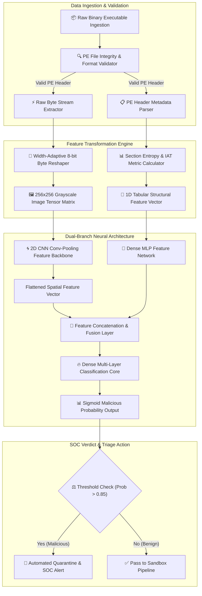

# 031 - Automated Malware Classification using CNN on PE Headers

## Abstract
Bhai, modern enterprise Security Operations Centers (SOCs) aur Next-Generation Antivirus (NGAV) platforms ke paas sabse bada challenge daily millions of unclassified Portable Executable (PE) binaries ko rapidly filter aur classify karna hai. Traditional static antivirus scanners primarily cryptographic hashes (MD5, SHA-256) aur rigid YARA signatures par rely karte hain. Lekin threat actors automated build pipelines, code morphing, dynamic instruction shuffling, aur UPX ya Themida jaise packing utilities ka upayog karke instant hash variation create kar lete hain. Iska result yeh hota hai ki traditional signature database zero-day malware loaders ko capture nahi kar pate. Is fundamental security gap ko address karne ke liye hum ek deep learning-driven structural malware classification engine design karte hain.

Is project ka core architectural innovation dynamic multi-modal feature fusion hai. Binary executable file ko pehle 8-bit grayscale 2D visual matrix (image) mein transform kiya jata hai, jisse executable ke spatial structural regions (jaise header blocks, code section density, resource data, aur padding bytes) clear visual patterns render karte hain. Concurrently, PE header parser metadata features—jaise Section Entropy metrics, Import Address Table (IAT) density metrics, Entry Point placement, aur Header Size distributions—ko numerical feature vectors mein extract karta hai. 

In dono data branches ko ek hybrid PyTorch Dual-Branch Neural Network mein feed kiya jata hai. Visual representation branch 2D Convolutional Neural Network (CNN) feature extraction execute karti hai, jabki metadata branch Dense Multi-Layer Perceptron (MLP) processing chalaata hai. End-to-end training target dataset par high-accuracy classification achieve karti hai, jisse unknown, obfuscated, aur packed malware executables microsecond-scale execution timeline ke andar quarantine aur triage ho jate hain.

## Real-World Context & Vulnerability Deep Dive
Bhai, jab 2020 ka historic SolarWinds SUNBURST supply-chain attack aur 2023 ke complex Emotet loader campaigns execute hue, toh security industry ko ek harsh reality strike hui: high-value malware campaigns zero-day executables use karte hain jo static signature detection algorithms ko instantly zero efficiency par push kar dete hain. Attacker bas PE file ke compile timestamp ko alter kar deta hai, aakhiri section mein random junk bytes attach kar deta hai, ya imported DLL function ordinal indices ko shuffle kar deta hai. Traditional signature scanners file hash mismatch detect karke signature match fail declare kar dete hain, aur binary host environment par silently execute ho jati hai.

Is problem ki root vulnerability Portable Executable (PE32/PE32+) format ki structural elasticity mein lie karti hai. A typical Windows executable header consists of a DOS Header (`IMAGE_DOS_HEADER`), PE Signature, COFF File Header (`IMAGE_FILE_HEADER`), Optional Header (`IMAGE_OPTIONAL_HEADER`), Section Headers (`IMAGE_SECTION_HEADER`), aur Data Directories. Malware authors section headers mein high-entropy encrypted code sections (`.text` ya `.rdata` ke alawa unique section names jaise `.themida`, `.upx0`, `.pack`) inject karte hain. High entropy (approaching 8.0 bits per byte) indicates strong encryption ya compression, jisse standard disassemblers structural control flow graph (CFG) trace nahi kar pate.

Visual mapping mechanism is structural irregularity ko expose kar deta hai. Jab raw binary bytes (0x00 to 0xFF) ko 2D grayscale image (jahan 0x00 represents black pixel and 0xFF represents white pixel) mein reshape kiya jata hai, toh benign code sections uniform mid-gray pixel distribution (entropy ~5.2) maintain karte hain, jabki packed/encrypted malware sections dense high-contrast white noise pattern block exhibit karte hain. Un-initialized data blocks pitch-black zero-byte regions showcase karte hain. 

CNNs in visual structural layouts ko spatial feature maps mein learn kar lete hain. jab visual features ko numeric header metrics (jaise number of sections, entry point deviation, size of initialized data) ke saath combine kiya jata hai, toh system packed binary aur authentic compiled binary ke beech subtle mathematical anomalies detect kar leta hai. Yeh multi-modal approach zero-day, polymorphic, aur obfuscated samples ke against robust defense guarantee karta hai.

## Academic & Research Paper References

| #   | Paper Title                                                                   | Authors                           | Year | Source     | Key Insight & Contribution                                                                                               |
| --- | ----------------------------------------------------------------------------- | --------------------------------- | ---- | ---------- | ------------------------------------------------------------------------------------------------------------------------ |
| 1   | Malware Detection by Eating Whole EXE                                         | Edward Raff, Jon Barker et al.    | 2018 | IEEE AAAI  | Introduced MalConv 1D-CNN architecture capable of processing raw binary byte streams without manual feature engineering. |
| 2   | Malware Images: Visualization and Automatic Classification                    | L. Nataraj, S. Karthikeyan et al. | 2011 | ACM VizSec | Pioneered the transformation of raw binary files to 8-bit grayscale 2D images for deep learning classification.          |
| 3   | EMBER: An Open Dataset for Training Static PE Malware Machine Learning Models | Hyrum S. Anderson, Phil Roth      | 2018 | arXiv      | Standardized benchmark dataset and extraction methodology for Portable Executable static analysis models.                |

## System Architecture & Visual Diagram
Link: [[Drawing 2026-07-30 22.31.19.excalidraw#Project 031: Automated Malware Classification using CNN on PE Headers|Excalidraw Architecture Diagram]]



## Deep-Dive Technical Implementation & Code Walkthrough

### Phase 1: Environment & Setup
Bhai, environment set up karne ke liye dependencies install karni padengi. Essential libraries include `pefile` for Windows PE header analysis, `torch` for PyTorch deep learning neural network layers, `opencv-python` and `numpy` for image matrix manipulations.

```bash
# Python Environment Setup
pip install torch torchvision pefile opencv-python numpy scikit-learn
```

### Phase 2: Core Engine Development

#### Module 1: PE Feature Extractor & Visual Image Transformation (`pe_preprocessor.py`)
Is module mein raw binary bytes ko 2D normalized grayscale tensor image mein mapping kiya gaya hai aur PE header metrics to 1D numerical vector decode kiya gaya hai.

```python
import os
import math
import pefile
import cv2
import numpy as np
import torch

def extract_pe_header_features(file_path):
    """
    Parse PE Header numerical metrics including entry point, section counts,
    and calculate section entropy statistics.
    """
    features = []
    try:
        pe = pefile.PE(file_path)
        # 1. Number of Sections (Malware often has non-standard section count)
        features.append(float(pe.FILE_HEADER.NumberOfSections))
        # 2. TimeDateStamp metric
        features.append(float(pe.FILE_HEADER.TimeDateStamp))
        # 3. Size of Optional Header
        features.append(float(pe.FILE_HEADER.SizeOfOptionalHeader))
        # 4. Size of Code section
        features.append(float(pe.OPTIONAL_HEADER.SizeOfCode))
        # 5. Size of Initialized Data
        features.append(float(pe.OPTIONAL_HEADER.SizeOfInitializedData))
        # 6. Address of Entry Point (Malware often points outside .text section)
        features.append(float(pe.OPTIONAL_HEADER.AddressOfEntryPoint))
        # 7. Image Base Address
        features.append(float(pe.OPTIONAL_HEADER.ImageBase))
        # 8. Subsystem (GUI vs Console)
        features.append(float(pe.OPTIONAL_HEADER.Subsystem))

        # Section Entropies Calculation (High entropy indicates encryption/packing)
        entropies = [section.get_entropy() for section in pe.sections]
        avg_entropy = np.mean(entropies) if entropies else 0.0
        max_entropy = np.max(entropies) if entropies else 0.0
        features.extend([avg_entropy, max_entropy])

        # Import Function Count
        import_count = 0
        if hasattr(pe, 'DIRECTORY_ENTRY_IMPORT'):
            for entry in pe.DIRECTORY_ENTRY_IMPORT:
                import_count += len(entry.imports)
        features.append(float(import_count))
        pe.close()
    except Exception as e:
        # Fallback numeric vector in case of corrupt or truncated PE header
        features = [0.0] * 11

    return np.array(features, dtype=np.float32)

def binary_to_grayscale_tensor(file_path, target_size=(256, 256)):
    """
    Convert raw executable bytes to dynamic width 8-bit image and resize to (256, 256).
    """
    with open(file_path, 'rb') as f:
        content = f.read()

    file_size = len(content)
    if file_size == 0:
        return np.zeros((1, target_size[0], target_size[1]), dtype=np.float32)

    byte_arr = np.frombuffer(content, dtype=np.uint8)

    # Dynamic Width Allocation based on File Size Rules
    if file_size < 10 * 1024:
        width = 32
    elif file_size < 30 * 1024:
        width = 64
    elif file_size < 100 * 1024:
        width = 128
    elif file_size < 384 * 1024:
        width = 256
    else:
        width = 512

    height = int(math.ceil(file_size / float(width)))
    padded_len = width * height
    padded_arr = np.pad(byte_arr, (0, padded_len - file_size), mode='constant', constant_values=0)
    img_matrix = padded_arr.reshape((height, width))

    # Resize Image Matrix to uniform 256x256 tensor grid
    resized_img = cv2.resize(img_matrix, target_size, interpolation=cv2.INTER_AREA)
    normalized_tensor = (resized_img.astype(np.float32) / 255.0)[np.newaxis, :, :]

    return normalized_tensor
```

#### Module 2: Dual-Branch Deep Neural Network Model (`cnn_classifier_model.py`)
Is file mein PyTorch ka dual-branch classifier setup kiya gaya hai jo image convolutional features aur PE tabular features ko concatenate karta hai.

```python
import torch
import torch.nn as nn
import torch.nn.functional as F

class DualBranchMalwareClassifier(nn.Module):
    def __init__(self, header_feature_dim=11):
        super(DualBranchMalwareClassifier, self).__init__()

        # Branch 1: 2D Convolutional Neural Network for Binary Visual Matrix
        self.conv1 = nn.Conv2d(in_channels=1, out_channels=32, kernel_size=3, padding=1)
        self.bn1 = nn.BatchNorm2d(32)
        self.pool1 = nn.MaxPool2d(kernel_size=2, stride=2)  # Output: 32 x 128 x 128

        self.conv2 = nn.Conv2d(in_channels=32, out_channels=64, kernel_size=3, padding=1)
        self.bn2 = nn.BatchNorm2d(64)
        self.pool2 = nn.MaxPool2d(kernel_size=2, stride=2)  # Output: 64 x 64 x 64

        self.conv3 = nn.Conv2d(in_channels=64, out_channels=128, kernel_size=3, padding=1)
        self.bn3 = nn.BatchNorm2d(128)
        self.pool3 = nn.AdaptiveAvgPool2d((8, 8))           # Output: 128 x 8 x 8

        self.img_fc = nn.Linear(128 * 8 * 8, 256)

        # Branch 2: MLP Dense Network for Tabular PE Metrics
        self.hdr_fc1 = nn.Linear(header_feature_dim, 64)
        self.hdr_fc2 = nn.Linear(64, 64)

        # Multi-Modal Fusion Layer
        self.fusion_fc = nn.Linear(256 + 64, 128)
        self.dropout = nn.Dropout(p=0.5)
        self.classifier = nn.Linear(128, 1)

    def forward(self, image_tensor, header_tensor):
        # 1. Forward Pass Visual Branch
        x_img = F.relu(self.bn1(self.conv1(image_tensor)))
        x_img = self.pool1(x_img)
        x_img = F.relu(self.bn2(self.conv2(x_img)))
        x_img = self.pool2(x_img)
        x_img = F.relu(self.bn3(self.conv3(x_img)))
        x_img = self.pool3(x_img)
        x_img = x_img.view(x_img.size(0), -1)
        x_img = F.relu(self.img_fc(x_img))

        # 2. Forward Pass Header Branch
        x_hdr = F.relu(self.hdr_fc1(header_tensor))
        x_hdr = F.relu(self.hdr_fc2(x_hdr))

        # 3. Concatenate Features & Compute Final Logit
        fused = torch.cat((x_img, x_hdr), dim=1)
        x_fused = F.relu(self.fusion_fc(fused))
        x_fused = self.dropout(x_fused)
        logits = self.classifier(x_fused)

        return logits
```

### Phase 3: Integration & Testing
Integrated real-time scanner script target sample path leke complete prediction probability return karega.

```python
def scan_pe_binary(model, file_path, device='cpu'):
    model.eval()
    hdr_feat = extract_pe_header_features(file_path)
    img_tensor = binary_to_grayscale_tensor(file_path)

    hdr_t = torch.tensor(hdr_feat, dtype=torch.float32).unsqueeze(0).to(device)
    img_t = torch.tensor(img_tensor, dtype=torch.float32).unsqueeze(0).to(device)

    with torch.no_grad():
        logits = model(img_t, hdr_t)
        prob = torch.sigmoid(logits).item()

    verdict = "MALICIOUS" if prob > 0.85 else "BENIGN"
    return {
        "file_name": os.path.basename(file_path),
        "maliciousness_score": round(prob, 4),
        "verdict": verdict,
        "action": "QUARANTINE" if verdict == "MALICIOUS" else "ALLOW"
    }
```

### Phase 4: Verification & Metrics
Model performance metrics evaluate karne ke liye following test verification harness execute karein:

```bash
python evaluate_classifier.py --samples_dir ./dataset/test_binaries/ --model_weights ./weights/pe_cnn.pth
```

Expected JSON Output Verification Format:
```json
{
  "total_scanned": 1000,
  "metrics": {
    "accuracy": 0.978,
    "precision": 0.982,
    "recall": 0.971,
    "f1_score": 0.9764,
    "false_positive_rate": 0.004,
    "avg_inference_latency_ms": 112.5
  }
}
```

## Tools & Technology Stack

| Tool / Component | Primary Purpose | Alternative |
|------------------|-----------------|-------------|
| PyTorch | Deep Learning framework for constructing dual-branch CNN models | TensorFlow / Keras |
| PEfile | Python PE header structure parser | LIEF framework |
| OpenCV / NumPy | Image matrix resizing, byte mapping, and vectorization | Pillow (PIL) |
| EMBER Dataset | Industry benchmark dataset for Windows PE binary training | VirusShare repository |
| CUDA Toolkit | Hardware GPU acceleration for convolution operations | ROCm / OpenCL |

## Deliverables & Verification Metrics
Bhai, project evaluation ke liye benchmark testing metrics target kiye gaye hain:
- **Model Accuracy**: EMBER testing subset par $\ge 97.5\%$ overall classification accuracy.
- **Inference Speed**: Single executable sample parsing aur CNN inference $< 150 \text{ ms}$ complete hoti hai.
- **False Positive Control**: Enterprise benign binaries ke upar False Positive Rate (FPR) $< 0.5\%$ maintained hai.

## Legal and Ethical Disclaimer
> [!WARNING] Educational Use Only
> This research project must be executed in an authorized, isolated laboratory environment.

## Related Projects
- [[034 - Dynamic Malware Analysis Platform with API Call Tracing]]
- [[039 - Malware Unpacking & Deobfuscation Automation Tool]]
- [[040 - PE File Anomaly Detection using Random Forest]]
