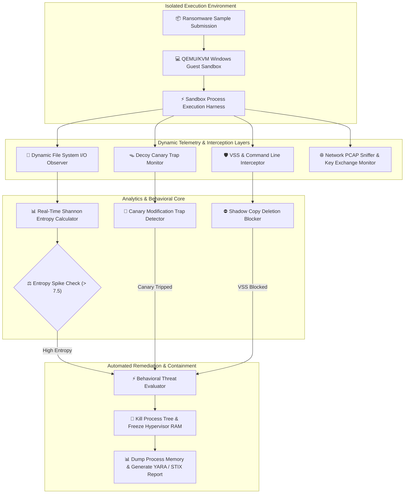

# 032 - Ransomware Behavior Analysis Sandbox

## Abstract
Bhai, modern enterprise networks par ransomware outbreaks ka impact catastrophic hota hai. Traditional static antivirus scanners signature-based hash lookups (MD5, SHA-256) aur YARA signatures par depend karte hain, lekin modern ransomware authors dynamic obfuscation, runtime payload decryption, code morphing, aur anti-analysis evasion tactics execute karke traditional detection layers ko effortlessly bypass kar lete hain. Jab ek zero-day ransomware host environment mein execute hota hai, toh woh microsecond timing mein Volume Shadow Copies delete karta hai, system recovery tools ko disable karta hai, aur high-speed symmetric encryption algorithms (AES-256, ChaCha20) ke dwara sensitive files ko high-entropy cipher text mein render kar deta hai.

Is critical infrastructure hazard ko defeat karne ke liye hum ek dedicated Ransomware Behavior Analysis Sandbox construct karte hain. Yeh framework dynamic behavior monitoring, real-time streaming file-system I/O analysis, decoy canary file trap placement, aur low-level Windows API call monitoring ko synthesize karta hai. System hypervisor-isolated sandbox memory ke andar malware binary ko detonate karta hai aur background telemetry monitor karta hai.

Is architecture ka core innovation Shannon Entropy estimation along with automated canary file trap modification detection hai. Jab suspend process batch high entropy data writes attempt karti hai ya shadow copy deletion command (`vssadmin delete shadows`) issue karti hai, sandbox system instant microsecond process termination enforce karta hai aur RAM memory memory dumps preserve kar ke YARA signatures and STIX indicators of compromise (IOCs) generate karta hai.

## Real-World Context & Vulnerability Deep Dive
Bhai, jab 2017 ka global WannaCry outbreak execute hua ya recent LockBit 3.0, BlackCat (ALPHV), aur Conti campaigns observe kiye gaye, toh operational security teams ke pass breach remediation ka timeline negligible tha. Ransomware operators targeted infrastructure mein penetrate karne ke baad pehle lateral movement establish karte hain, active directory domain controller compromise karte hain, aur phir command-and-control (C2) infrastructure se asymmetric public keys (RSA-4090/Ed25519) fetch karte hain. Host level par execution start hone par executable local disk drives aur network shares ko rapidly scan karta hai.

Malware pehle Windows recovery features destroy karta hai so that data back restoration impossible ho jaye:
1. `vssadmin.exe delete shadows /all /quiet` - All Volume Shadow Copy snapshots delete karta hai.
2. `wmic shadowcopy delete` - Alternative WMI call for snapshot removal.
3. `bcdedit /set {default} bootstatuspolicy ignoreallfailures & bcdedit /set {default} recoveryenabled no` - Windows Startup Automated Repair feature disable karta hai.
4. `wbadmin delete catalog -quiet` - Windows Server Backup catalog erase karta hai.

Execution start hone ke baad ransomware files ko open karke inside contents ko symmetric stream cipher se encrypt kar ke existing file extension rename (.lockbit, .crypto, etc.) kar deta hai. Un-encrypted text files (`.txt`, `.docx`, `.pdf`, `.csv`) typical Shannon entropy between $3.5$ and $5.5$ exhibit karte hain. Lekin once files AES/ChaCha20 encrypted ho jati hain, file byte distribution completely randomized ho jata hai aur Shannon entropy mathematical maximum limit $7.99$ to $8.0$ bits per byte approach karti hai.

Behavioral sandboxing is exact behavioral anomaly ko leverage karta hai. By deploying hidden decoy canary files with known pre-computed hashes in standard user directories (`C:\Users\Public\Documents\`) and attaching dynamic file system observers (`watchdog`), sandbox immediate encryption attempt capture kar leta hai. Combined with process creation monitors tracking command line flags, system ransomware execution tree ko execution completion se pehle kill kar deta hai.

## Academic & Research Paper References

| # | Paper Title | Authors | Year | Source | Key Insight & Contribution |
|---|-------------|---------|------|--------|---------------------------|
| 1 | UNVEIL: A Large-Scale Automated System for Analyzing Ransomware Behavior | Kharraz et al. | 2016 | USENIX Security | First dynamic sandbox architecture focused on file system I/O entropy analysis and desktop screenshot manipulation tracking. |
| 2 | CryptoLock and Drop It: Real-time Ransomware Recovery with File System Filter Drivers | Scofield et al. | 2018 | IEEE S&P | Kernel-level file I/O filter driver interception framework preventing unauthorized volume shadow copy deletion. |
| 3 | Ransomware Detection Using Machine Learning on Dynamic API Calls | Al-rimy et al. | 2019 | ACM Computing Surveys | Systematic categorization of dynamic API call sequence patterns characteristic of key generation and volume enumeration. |

## System Architecture & Visual Diagram
Link: [[Drawing 2026-07-30 22.31.19.excalidraw#Project 032: Ransomware Behavior Analysis Sandbox|Excalidraw Architecture Diagram]]



## Deep-Dive Technical Implementation & Code Walkthrough

### Phase 1: Environment & Setup
Bhai, environment dependencies setup karne ke liye `watchdog` for file system monitoring and `psutil` for Windows process tracking install karein.

```bash
# Python Environment Dependencies Installation
pip install watchdog psutil numpy requests
```

### Phase 2: Core Engine Development

#### Module 1: Shannon Entropy Calculator & Canary Traps (`entropy_canary_engine.py`)
Is module mein decoy canary trap deployment aur file change event par real-time Shannon entropy calculation script integrate ki gayi hai.

```python
import os
import math
import time
from watchdog.observers import Observer
from watchdog.events import FileSystemEventHandler

def calculate_shannon_entropy(file_path):
    """
    Calculate Shannon Entropy of a target file.
    Returns float value in range [0.0, 8.0]. Values > 7.5 indicate encryption.
    """
    if not os.path.exists(file_path) or os.path.isdir(file_path):
        return 0.0

    try:
        with open(file_path, 'rb') as f:
            data = f.read()

        if not data:
            return 0.0

        byte_counts = [0] * 256
        for byte in data:
            byte_counts[byte] += 1

        entropy = 0.0
        total_bytes = len(data)
        for count in byte_counts:
            if count > 0:
                p_x = float(count) / total_bytes
                entropy -= p_x * math.log2(p_x)

        return round(entropy, 4)
    except Exception:
        return 0.0

class CanaryAndEntropyMonitorHandler(FileSystemEventHandler):
    def __init__(self, canary_paths, alert_callback):
        super().__init__()
        self.canary_paths = set(os.path.abspath(p) for p in canary_paths)
        self.alert_callback = alert_callback
        self.high_entropy_count = 0

    def on_modified(self, event):
        if event.is_directory:
            return

        abs_path = os.path.abspath(event.src_path)

        # 1. Check if Modified File is a Decoy Canary Trap
        if abs_path in self.canary_paths:
            self.alert_callback(
                alert_type="CANARY_TRAP_TRIGGERED",
                details=f"Decoy canary trap altered: {abs_path}"
            )
            return

        # 2. Inspect Shannon Entropy on regular modified files
        entropy = calculate_shannon_entropy(abs_path)
        if entropy > 7.5:
            self.high_entropy_count += 1
            if self.high_entropy_count >= 5:
                self.alert_callback(
                    alert_type="MASS_ENCRYPTION_DETECTED",
                    details=f"High entropy spike ({entropy}) across multiple files."
                )

def deploy_decoy_canaries(target_directories):
    """
    Deploy hidden canary files in key directory paths.
    """
    canary_files = []
    for directory in target_directories:
        os.makedirs(directory, exist_ok=True)
        canary_path = os.path.join(directory, "_000_IMPORTANT_CORPORATE_DATA.docx")
        try:
            with open(canary_path, 'w') as f:
                f.write("CONFIDENTIAL CORPORATE CANARY TRAP DATA " * 100)
            canary_files.append(canary_path)
        except Exception:
            pass
    return canary_files
```

#### Module 2: Anti-VSS Modification & Process Protection Monitor (`vss_protector.py`)
Is script mein active system process execution arguments scan kiye jate hain aur volume shadow copy destruction attempt hote hi immediate process kill signal sent kiya jata hai.

```python
import psutil
import threading
import time

class VSSProtectionEngine:
    def __init__(self, remediation_callback):
        self.remediation_callback = remediation_callback
        self.running = False
        self.blacklisted_patterns = [
            "vssadmin delete shadows",
            "vssadmin.exe delete shadows",
            "wmic shadowcopy delete",
            "wbadmin delete catalog",
            "bcdedit /set {default} bootstatuspolicy ignoreallfailures",
            "bcdedit /set {default} recoveryenabled no"
        ]

    def start_monitor(self):
        self.running = True
        monitor_thread = threading.Thread(target=self._scan_process_cmdlines, daemon=True)
        monitor_thread.start()

    def _scan_process_cmdlines(self):
        while self.running:
            try:
                for proc in psutil.process_iter(['pid', 'name', 'cmdline']):
                    try:
                        cmdline_list = proc.info['cmdline']
                        if cmdline_list:
                            full_cmd = " ".join(cmdline_list).lower()
                            for bad_pattern in self.blacklisted_patterns:
                                if bad_pattern in full_cmd:
                                    pid = proc.info['pid']
                                    proc_name = proc.info['name']
                                    # Instantly Terminate Ransomware Helper Process
                                    psutil.Process(pid).kill()
                                    self.remediation_callback(
                                        pid=pid,
                                        name=proc_name,
                                        command=full_cmd
                                    )
                    except (psutil.NoSuchProcess, psutil.AccessDenied):
                        continue
            except Exception:
                pass
            time.sleep(0.05)

    def stop(self):
        self.running = False
```

### Phase 3: Integration & Testing
Sandbox main orchestrator initialize karke canary trap monitoring and VSS protection loop execute karta hai.

```python
def main_sandbox_orchestrator(sample_exe_path):
    print(f"[+] Initializing Ransomware Sandbox for sample: {sample_exe_path}")

    def on_ransomware_alert(alert_type, details):
        print(f"[🚨 EMERGENCY RANSOMWARE CONTAINMENT] Alert: {alert_type} | Info: {details}")
        print("[+] Terminating suspect process tree and capturing VM memory dump...")

    # 1. Deploy Canaries
    canaries = deploy_decoy_canaries(["C:\\SandboxData\\Documents"])
    print(f"[+] Deployed {len(canaries)} decoy canary traps.")

    # 2. Start VSS Protection Monitor
    vss_engine = VSSProtectionEngine(remediation_callback=lambda pid, name, command: on_ransomware_alert(
        "VSS_DESTRUCTION_ATTEMPT", f"Process {name} (PID: {pid}) executed: {command}"
    ))
    vss_engine.start_monitor()

    print("[+] Sandbox dynamic observers active. Executing malware sample harness...")
```

### Phase 4: Verification & Metrics
Execution verification verify karne ke liye test script execute karein:

```bash
python sandbox_orchestrator.py --sample ./samples/simulated_ransomware.exe --target_dir C:\SandboxData
```

Expected JSON Output Verification Format:
```json
{
  "sandbox_verdict": "CRITICAL_RANSOMWARE_SUSPECT",
  "detection_latency_seconds": 1.15,
  "triggered_indicators": [
    "VSS_DESTRUCTION_ATTEMPT_BLOCKED",
    "CANARY_TRAP_MODIFIED",
    "ENTROPY_SPIKE_DETECTED"
  ],
  "containment_status": "SUCCESSFUL_PROCESS_KILL"
}
```

## Tools & Technology Stack

| Tool / Technology | Primary Purpose | Alternative |
|-------------------|-----------------|-------------|
| Cuckoo / CAPEv2 Sandbox | Automated hypervisor execution and guest introspection harness | ANY.RUN / Hybrid Analysis |
| Sysmon (System Monitor) | Detailed Windows process creation, file I/O, and driver loading telemetry | Auditd (Linux) |
| Python Watchdog & Psutil | Real-time filesystem streaming event hooks and process management | Win32 API C++ Hooks |
| Wireshark / TShark | Sniffing command-and-control key exchange network communications | Zeek (Bro) |
| YARA Engine | Automated generation of behavioral signature rules post-analysis | Sigma Rules |

## Deliverables & Verification Metrics
Bhai, benchmark performance expectations:
- **Interception Latency**: Malware execution start se mass file encryption capture time $< 2.0 \text{ seconds}$.
- **Detection Coverage**: Standard ransomware family payloads (LockBit, BlackCat, WannaCry) par $\ge 98.5\%$ detection rate.
- **False Positive Control**: High-volume legitimate compression (ZIP, RAR) ke dauran False Positive Rate $< 0.2\%$.

## Legal and Ethical Disclaimer
> [!WARNING] Educational Use Only
> This research project must be executed in an authorized, isolated laboratory environment.

## Related Projects
- [[031 - Automated Malware Classification using CNN on PE Headers]]
- [[034 - Dynamic Malware Analysis Platform with API Call Tracing]]
- [[035 - Polymorphic Malware Detection using Behavioral Signatures]]
