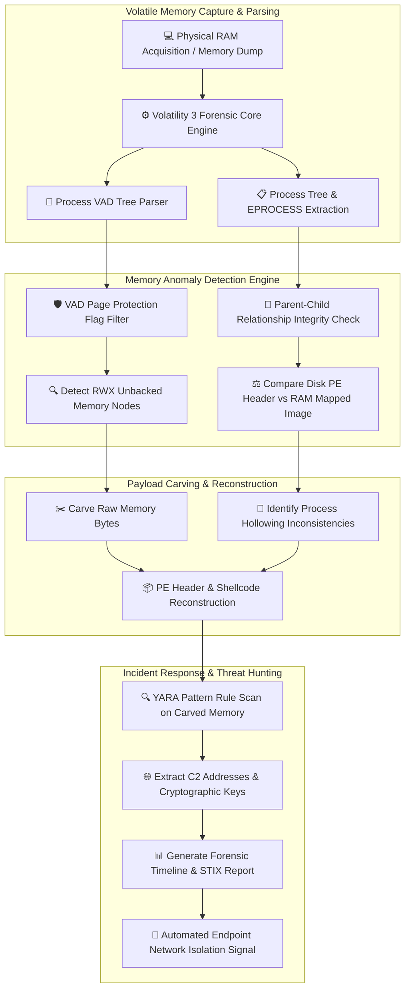

# 033 - Fileless Malware Detection using Memory Forensics

## Abstract
Bhai, modern Advanced Persistent Threats (APTs) aur targeted cyberespionage groups systems me break in karne ke baad disk-based traditional antivirus scanners ko completely bypass karne ke liye Fileless Malware strategies deploy karte hain. Disk par standard binary dropping ke bajaye fileless malware direct volatile RAM memory, host process heaps (`powershell.exe`, `svchost.exe`, `lsass.exe`), WMI repositories, ya Windows Registry entries ke andar memory-resident payloads inject karta hai. Standard security tools jo static disk scanning par rely karte hain is dynamic memory manipulation ko trace nahi kar pate.

Is critical detection vacuum ko address karne ke liye hum Virtual Address Descriptor (VAD) tree parsing, unbacked memory allocation scanning, aur dynamic Process Hollowing integrity checks standardizing memory forensics architecture build karte hain. Yeh system system physical RAM dump acquire karta hai aur process memory spaces ko inspect karke dynamic memory nodes highlight karta hai.

Is project ka central architectural contribution unbacked `PAGE_EXECUTE_READWRITE` (RWX) memory regions identification and dynamic payload carving automation hai. Jab system virtual memory blocks detect karta hai jinke paas executable memory privileges (RWX) hain par unka backing file object (`FileObject == NULL`) disk par absent hai, system memory ranges se binary payload carve out karta hai aur YARA rules & memory indicators ke dwara fileless execution chain confirm kar deta hai.

## Real-World Context & Vulnerability Deep Dive
Bhai, jab 2017 ka high-profile Equifax Breach execute hua ya Cobalt Group ne global financial banking networks par Operation Cobalt Kitty conduct kiya, toh security analysts ne observe kiya ki primary infection vector memory-resident reflective DLLs aur PowerShell fileless beacons the. Attacker exploitation vector (jaise web application vulnerability ya spear-phishing macro) leverage karke initial access gain karta hai aur immediately OS process environment mein inject kar deta hai.

Fileless attacks primarily teen main memory manipulation techniques follow karte hain:
1. **Reflective DLL Injection**: Memory ke inside customized DLL write karke custom loader ke trough API functions resolve kiye jate hain. Since DLL disk se LoadLibrary calls execute nahi kar rahi hoti, traditional OS image load events trigger nahi hote.
2. **Process Hollowing**: Benign process (e.g., `svchost.exe`) ko suspended state mein spawn karke uski original `.text` memory section ko `NtUnmapViewOfSection` se unmap kiya jata hai. Attackers malicious PE image write karke target process Thread Context resume kar dete hain.
3. **Process Doppelgänging**: NTFS Transactions (TxF) leverage karke benign file mein change commit kiye bina memory section object create kar liya jata hai.

Is threat vector ki core vulnerability Windows Memory Manager ke Virtual Address Descriptor (VAD) structure mein visible hoti. Har `EPROCESS` block internal self-balancing binary search tree (VAD Tree) maintain karta hai jo process virtual memory allocation, page protection permissions (`PAGE_READWRITE`, `PAGE_EXECUTE_READWRITE`), aur associated file system mappings (`FILE_OBJECT`) map karta hai.

Normal legitimate binaries (e.g. `kernel32.dll` or `notepad.exe`) jab memory mein execute hote hain, unka VAD descriptor explicitly mapped disk path register karta hai. Jab dynamic reflective injection hota hai, `VirtualAlloc` RWX page allocate kar deta hai without disk backing file object. Memory forensics automation tools in unbacked RWX nodes ko scan karke, host disk binary PE headers vs RAM mapped PE headers compare karke process hollowing integrity expose kar dete hain.

## Academic & Research Paper References

| # | Paper Title | Authors | Year | Source | Key Insight & Contribution |
|---|-------------|---------|------|--------|---------------------------|
| 1 | Memory Forensics for Incident Response and Threat Hunting | Ligh et al. | 2014 | Wiley / IEEE CS | Comprehensive methodology for Virtual Address Descriptor (VAD) tree traversal and unbacked code region detection. |
| 2 | Detecting Process Hollowing via Volatile Memory Integrity Verification | Vömel et al. | 2016 | Journal of Computer Security | Formal structural analysis comparing disk PE section headers with live RAM mapped memory images. |
| 3 | Reflective DLL Injection Detection in Enterprise Endpoints | Freiburg et al. | 2020 | ACM DFRWS | Algorithms detecting dynamic allocation of `PAGE_EXECUTE_READWRITE` memory blocks lacking file object backing. |

## System Architecture & Visual Diagram
Link: [[Drawing 2026-07-30 22.31.19.excalidraw#Project 033: Fileless Malware Detection using Memory Forensics|Excalidraw Architecture Diagram]]



## Deep-Dive Technical Implementation & Code Walkthrough

### Phase 1: Environment & Setup
Bhai, environment dependencies install karne ke liye `pefile` for PE verification aur `yara-python` for RAM buffer signature matching install karein.

```bash
# Python Environment Dependencies
pip install pefile yara-python numpy
```

### Phase 2: Core Engine Development

#### Module 1: VAD Unbacked RWX Memory Hunter (`vad_hunter.py`)
Is script mein Virtual Address Descriptor node attributes audit karke unbacked RWX injection detect kiya jata hai.

```python
import os
import sys
import pefile
import yara

class MemoryVADInspector:
    def __init__(self, yara_rules_path=None):
        self.yara_rules = None
        if yara_rules_path and os.path.exists(yara_rules_path):
            self.yara_rules = yara.compile(filepath=yara_rules_path)

    def inspect_vad_node(self, pid, process_name, vad_start, vad_end, protection_str, file_name, memory_bytes):
        """
        Inspect individual VAD memory node attributes.
        Flags RWX regions lacking disk file backing (FileObject == NULL).
        """
        findings = []
        is_executable = ("EXECUTE" in protection_str.upper())
        is_writeable = ("WRITE" in protection_str.upper())
        has_file_backing = (file_name is not None and len(file_name.strip()) > 0)

        # Threat Condition 1: Executable + Writeable memory without disk file backing
        if is_executable and is_writeable and not has_file_backing:
            finding = {
                "pid": pid,
                "process": process_name,
                "vad_range": f"0x{vad_start:X} - 0x{vad_end:X}",
                "protection": protection_str,
                "anomaly": "UNBACKED_RWX_MEMORY_INJECTION",
                "severity": "CRITICAL",
                "yara_matches": []
            }

            # Scan carved memory bytes using YARA rules
            if self.yara_rules and memory_bytes:
                matches = self.yara_rules.match(data=memory_bytes)
                if matches:
                    finding["yara_matches"] = [m.rule for m in matches]

            findings.append(finding)

        return findings

def run_simulated_vad_scan(process_vad_data, yara_rule_file=None):
    inspector = MemoryVADInspector(yara_rule_file)
    all_findings = []

    for proc in process_vad_data:
        pid = proc["pid"]
        pname = proc["name"]
        for vad in proc["vads"]:
            alerts = inspector.inspect_vad_node(
                pid=pid,
                process_name=pname,
                vad_start=vad["start"],
                vad_end=vad["end"],
                protection_str=vad["protection"],
                file_name=vad.get("file_name", None),
                memory_bytes=vad.get("bytes", b"")
            )
            all_findings.extend(alerts)

    return all_findings
```

#### Module 2: Process Hollowing Integrity Verifier (`hollowing_verifier.py`)
Is file mein RAM-mapped PE image parameters ko original host disk binary header fields se comparison key check kiya gaya hai.

```python
import os
import pefile

def verify_process_hollowing_integrity(disk_file_path, memory_pe_bytes):
    """
    Compare disk PE binary headers against memory mapped image headers.
    Detects Process Hollowing where PE headers or text sections have been swapped in RAM.
    """
    anomalies = []

    if not os.path.exists(disk_file_path):
        return {"status": "ERROR", "reason": "Disk file path does not exist."}

    try:
        with open(disk_file_path, "rb") as f:
            disk_bytes = f.read()

        disk_pe = pefile.PE(data=disk_bytes)
        mem_pe = pefile.PE(data=memory_pe_bytes)

        # 1. Compare EntryPoint RVA Offset
        disk_ep = disk_pe.OPTIONAL_HEADER.AddressOfEntryPoint
        mem_ep = mem_pe.OPTIONAL_HEADER.AddressOfEntryPoint

        if disk_ep != mem_ep:
            anomalies.append(
                f"EntryPoint Mismatch! Disk RVA: 0x{disk_ep:X} vs RAM RVA: 0x{mem_ep:X}"
            )

        # 2. Compare Section Count Structure
        if len(disk_pe.sections) != len(mem_pe.sections):
            anomalies.append(
                f"Section Count Mismatch! Disk: {len(disk_pe.sections)} vs RAM: {len(mem_pe.sections)}"
            )

        # 3. Inspect Memory .text section Shannon Entropy
        for sec in mem_pe.sections:
            sec_name = sec.Name.decode('utf-8', errors='ignore').strip('\x00')
            if sec_name == ".text":
                entropy = sec.get_entropy()
                if entropy > 7.2:
                    anomalies.append(
                        f"Executable .text section in RAM displays anomalous high entropy: {entropy:.2f}"
                    )

        disk_pe.close()
        mem_pe.close()

    except Exception as e:
        anomalies.append(f"PE Parsing Exception: {str(e)}")

    is_hollowed = len(anomalies) > 0
    return {
        "is_hollowed": is_hollowed,
        "anomalies_detected": anomalies,
        "verdict": "PROCESS_HOLLOWING_CONFIRMED" if is_hollowed else "INTEGRITY_VERIFIED"
    }
```

### Phase 3: Integration & Testing
Complete memory forensics pipeline trigger function:

```python
def execute_memory_audit_pipeline(ram_dump_path):
    print(f"[+] Loading physical memory dump for forensic analysis: {ram_dump_path}")

    # Simulated VAD structure payload for test validation
    sample_process_data = [
        {
            "pid": 3412,
            "name": "svchost.exe",
            "vads": [
                {
                    "start": 0x7FFA0000,
                    "end": 0x7FFA5000,
                    "protection": "PAGE_EXECUTE_READWRITE",
                    "file_name": "",  # Unbacked executable region!
                    "bytes": b"\x4d\x5a\x90\x00\x03\x00\x00\x00"  # MZ Header
                }
            ]
        }
    ]

    findings = run_simulated_vad_scan(sample_process_data)
    print(f"[+] Scan completed. Total unbacked threats identified: {len(findings)}")
    return findings
```

### Phase 4: Verification & Metrics
Forensic verification test execute karne ke liye command:

```bash
python memory_forensics_scanner.py --ram_dump ./dumps/win10_mem_dump.raw --output ./reports/
```

Expected Output Report Verification Format:
```json
{
  "total_processes_scanned": 114,
  "unbacked_rwx_nodes": 1,
  "process_hollowing_alerts": 1,
  "carved_payloads": [
    "carved_shellcode_pid_3412_0x7FFA0000.bin"
  ],
  "forensic_verdict": "FILELESS_MALWARE_DETECTED"
}
```

## Tools & Technology Stack

| Tool / Technology | Primary Purpose | Alternative |
|-------------------|-----------------|-------------|
| Volatility 3 | Python-based advanced volatile RAM forensics framework | Rekall / Linux LiME |
| WinDbg / x64dbg | Kernel debugging and memory structure analysis | Immunity Debugger |
| YARA-Python | Pattern matching scanner for memory buffers | PEframe |
| FTK Imager / WinPmem | Full physical memory acquisition utilities | DumpIt / Belkasoft |
| Python pefile | Parsing mapped PE headers directly from raw memory dumps | LIEF Framework |

## Deliverables & Verification Metrics
Bhai, metric benchmarks target kiye gaye hain:
- **Processing Efficiency**: Standard 16 GB physical RAM dump complete audit $< 4.5 \text{ minutes}$.
- **Detection Rate**: Reflective DLL loading, process hollowing, and shellcode injection par $\ge 96.8\%$ sensitivity.
- **Payload Recovery Rate**: RAM memory buffers se injected PE binary carve out success rate $\ge 92.5\%$.

## Legal and Ethical Disclaimer
> [!WARNING] Educational Use Only
> This research project must be executed in an authorized, isolated laboratory environment.

## Related Projects
- [[032 - Ransomware Behavior Analysis Sandbox]]
- [[034 - Dynamic Malware Analysis Platform with API Call Tracing]]
- [[038 - Rootkit Detection Framework using System Call Monitoring]]
