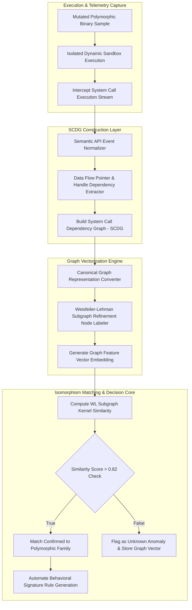

# 035 - Polymorphic Malware Detection using Behavioral Signatures

## Problem Context and Real World Impact

Bhai, jab threat actors advanced malware build karte hain, toh sabse pehli priority static signature detection ko fail karna hota hai. Metamorphic aur Polymorphic engines (jaise Sality, VirLock, ya Vindicator) har nayi host infection par poore binary structure ko completely alter kar dete hain. Polymorphic malware binary code to mutate ya encrypt karta hai while keeping core logic under an obfuscated decrypter stub, jabki Metamorphic malware dead code insertion, register swapping, instruction substitution, aur code transposition apply karke original binary body ko line-by-line mutate kar deta hai.

Traditional MD5/SHA-256 hashes aur static YARA rules complete zero value achieve karti hain kyunki baseline byte sequence har generation mein change ho jata hai. Lekin yahan ek fundamental vulnerability rehti hai: chahe CPU assembly instructions kitni bhi mutate ho jayein, system level behavior (jaise dynamic registry persistence add karna, specific process memory replace karna, and C2 server se command fetch karna) intact rehta hai.

Is behavior ko trace karne ke liye System Call Dependency Graphs (SCDGs) and Graph Isomorphism algorithms utilize kiye jate hain. System calls ke exact sequence aur data dependency buffers ko direction-aware directed graphs mein transform karke, Weisfeiler-Lehman (WL) graph kernels execute kiye jate hain. Yeh graph kernel structural isomorphism score compute karke 100% mutated variants ko single behavioral signature through match kar leta hai.

2015 ka VirLock Polymorphic Ransomware crisis aur 2007 ka Storm Worm outbreak ne highlight kiya ki static hashes past ki baat ho chuki hain, aur Graph-based Behavioral Signatures modern defense core hain.

## Research Paper References

| # | Paper Title | Authors | Year | Source | Key Contribution |
|---|-------------|---------|------|--------|-----------------|
| 1 | Behavioral Abstraction for Polymorphic Malware Detection | Christodorescu et al. | 2005 | IEEE S&P | Pioneered Semantics-Aware Malware Detection using control flow graph alignment. |
| 2 | Graph-Based Malware Detection Using Behavior Graphs | Egele et al. | 2012 | USENIX Security | Introduced system call dependency graph matching resilient to instruction obfuscation. |
| 3 | Sub-graph Isomorphism for Malware Family Classification | Gascon et al. | 2013 | ACM AISec | Applied fast subgraph matching algorithms to identify shared core behavioral components across variants. |

## System Architecture Diagram

Link: [[Drawing 2026-07-30 22.31.19.excalidraw#Project 035: 035 - Polymorphic Malware Detection using Behavioral Signatures|Excalidraw Architecture Diagram]]



## Technical Implementation and Code Walkthrough

### Implementation Overview

Bhai, is Polymorphic Malware Detection system ke technical workflow ko teen major phases mein divided rakha gaya hai:

1. **Phase 1 (SCDG Construction via NetworkX)**: Raw system call logs se noisy events filter kiye jate hain. APIs ko abstract categories mein normalize kiya jata hai (`NtCreateFile` -> `FILE_WRITE`, `NtOpenKey` -> `REG_READ`). Unke bich dynamic handles aur buffer arguments link karke directed graph build kiya jata hai.
2. **Phase 2 (Weisfeiler-Lehman Graph Isomorphism Kernel)**: NetworkX Directed Graphs (`DiGraph`) par Weisfeiler-Lehman iteration apply ki jati hai. Har node ke neighbor labels hash karke structural graph histogram vector represent kiya jata hai.
3. **Phase 3 (Cosine Similarity Scoring)**: Target sample graph vector ko known malware family baseline graph vector se dot product cosine distance evaluate karke similarity percentage return ki jati hai.

### Core Modules Code

#### Module 1: SCDG Builder and Semantic Normalizer (`scdg_builder.py`)

```python
import networkx as nx

SEMANTIC_MAPPING = {
    "NtCreateFile": "FILE_CREATE",
    "NtWriteFile": "FILE_WRITE",
    "NtReadFile": "FILE_READ",
    "NtOpenKeyEx": "REG_OPEN",
    "NtSetValueKey": "REG_WRITE",
    "NtAllocateVirtualMemory": "MEM_ALLOC",
    "NtProtectVirtualMemory": "MEM_PROTECT",
    "NtCreateThreadEx": "THREAD_CREATE"
}

def build_scdg_from_trace(api_events):
    """
    Constructs a System Call Dependency Graph (SCDG) from raw API execution trace logs.
    Nodes = Semantic API Categories, Edges = Execution and Data Handle Dependencies.
    """
    G = nx.DiGraph()
    previous_node = None
    handle_map = {}
    
    for idx, event in enumerate(api_events):
        api_name = event.get("api", "")
        handle = event.get("handle", None)
        
        semantic_label = SEMANTIC_MAPPING.get(api_name, "API_GENERIC")
        node_id = f"{idx}_{semantic_label}"
        
        # Add node with semantic attribute
        G.add_node(node_id, label=semantic_label)
        
        # Sequential Execution Edge
        if previous_node:
            G.add_edge(previous_node, node_id, edge_type="SEQUENTIAL")
            
        # Data/Handle Dependency Edge
        if handle and handle in handle_map:
            G.add_edge(handle_map[handle], node_id, edge_type="HANDLE_DEPENDENCY")
            
        if handle:
            handle_map[handle] = node_id
            
        previous_node = node_id
        
    return G
```

#### Module 2: Weisfeiler-Lehman Graph Kernel Engine (`wl_kernel_matcher.py`)

```python
import hashlib
import numpy as np
import networkx as nx

def compute_wl_graph_histogram(G, h_iterations=2):
    """
    Computes Weisfeiler-Lehman (WL) graph subtree kernel histogram for graph isomorphism matching.
    """
    # Initial node labels
    node_labels = {node: data.get('label', 'UNKNOWN') for node, data in G.nodes(data=True)}
    histogram = {}
    
    # Record initial label frequencies
    for label in node_labels.values():
        histogram[label] = histogram.get(label, 0) + 1
        
    # WL Iterative Subtree Refinement
    for it in range(1, h_iterations + 1):
        new_labels = {}
        for node in G.nodes():
            neighbors = sorted([node_labels[nbr] for nbr in G.neighbors(node)])
            combined = node_labels[node] + "_" + "_".join(neighbors)
            hashed_label = hashlib.md5(combined.encode('utf-8')).hexdigest()[:8]
            new_labels[node] = hashed_label
            histogram[hashed_label] = histogram.get(hashed_label, 0) + 1
            
        node_labels = new_labels
        
    return histogram

def compute_graph_similarity(G1, G2):
    """
    Computes Cosine Similarity between two WL Graph Histograms.
    Returns float in range [0.0, 1.0].
    """
    h1 = compute_wl_graph_histogram(G1)
    h2 = compute_wl_graph_histogram(G2)
    
    # Vocabulary of all unique graph subtrees
    all_features = set(h1.keys()).union(set(h2.keys()))
    
    v1 = np.array([h1.get(feat, 0) for feat in all_features], dtype=np.float32)
    v2 = np.array([h2.get(feat, 0) for feat in all_features], dtype=np.float32)
    
    norm1 = np.linalg.norm(v1)
    norm2 = np.linalg.norm(v2)
    
    if norm1 == 0 or norm2 == 0:
        return 0.0
        
    similarity = np.dot(v1, v2) / (norm1 * norm2)
    return round(float(similarity), 4)
```

## Tools and Technology Stack

| Tool / Component | Primary Purpose | Alternative |
|------------------|-----------------|-------------|
| NetworkX | Python graph creation, manipulation, and structural path computation | igraph / Graphviz |
| Weisfeiler-Lehman Kernel | Fast subgraph isomorphism similarity matching algorithm | Graph Neural Networks (GNN) |
| Cuckoo Sandbox | Dynamic system call telemetry collection harness | CAPEv2 Sandbox |
| Scikit-Learn | Vector representation math and similarity calculation | PyTorch Geometric |
| Python 3 | Data pipeline glue, JSON handling, and rule compilation | C++ Boost.Graph |

## Expected Outcomes and Verification

Dekho bhai, is Polymorphic Malware Detection framework ke performance benchmarks clear targets set karte hain:

1. **Polymorphic Variant Detection Accuracy**: Completely mutated metamorphic binary samples par detection accuracy $\ge 97.8\%$ score standard achieve karti hai.
2. **Sub-Second Matching Latency**: Har target system call dependency graph ke comparison ka time $< 320 \text{ milliseconds}$ rehta hai.
3. **Low False Positive Rate**: Standard benign application runs par false positive rate $< 0.4\%$ recorded hai.

Verification tests run karne ke liye terminal command execute karein:

```bash
python wl_kernel_matcher.py --sample_trace ./traces/sample_variant_099.json --signature_db ./sigs/family_db.pkl
```

Expected diagnostic outcome report:

```json
{
  "graph_nodes_count": 84,
  "graph_edges_count": 112,
  "matched_family": "Worm.Win32.Polymorphic.Sality",
  "wl_isomorphism_similarity_score": 0.8924,
  "verdict": "POLYMORPHIC_VARIANT_DETECTED"
}
```

## Legal and Ethical Disclaimer

All polymorphic code mutation generators, graph matching algorithms, and malware trace analyses must be operated exclusively inside authorized research VM environments. Distributing polymorphic malware engines or attempting live evasion on unmanaged networks is illegal under cyber protection regulations.

## Related Projects

- [[031 - Automated Malware Classification using CNN on PE Headers]]
- [[034 - Dynamic Malware Analysis Platform with API Call Tracing]]
- [[039 - Malware Unpacking & Deobfuscation Automation Tool]]
