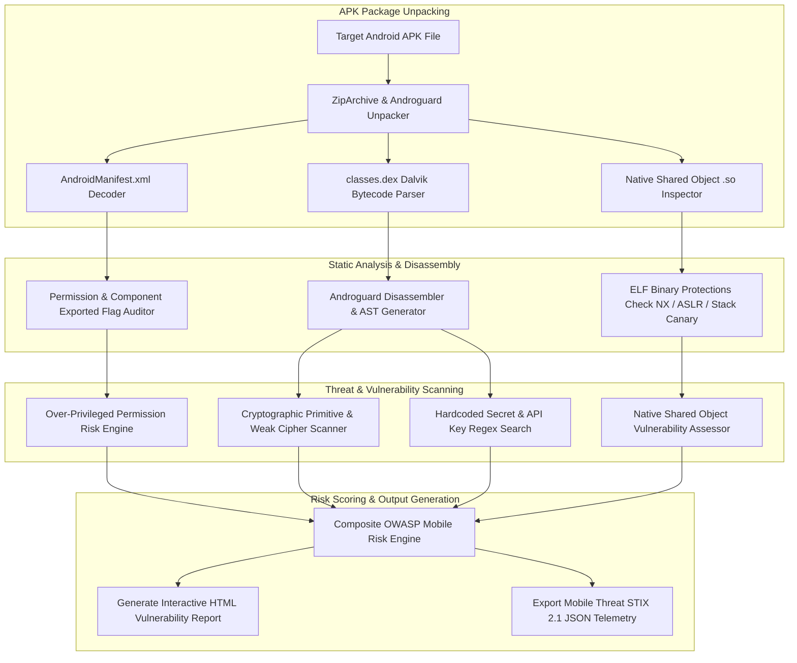

# 036 - Android APK Static Analysis & Vulnerability Scanner

## Problem Context and Real World Impact

Bhai, jab hum mobile application ecosystem ki security and Android threat landscape ki baat karte hain, toh Android Package (APK) binaries sabse zyada target kiye jaane wale vectors mein se ek hain. Android OS Dalvik/ART virtual machine bytecode (`classes.dex`), native shared libraries (`.so` files), and XML resources ko ek compressed ZIP archive container mein package karta hai. Attackers malicious trojanized apps distribute karte hain jo user ke explicit awareness ke bina expensive SMS send karte hain, background keylogging execute karte hain, ya Accessibility Services abuse karke banking credentials wipe kar dete hain.

Manual decompilation tools (jaise GUI-based Jadx ya Bytecode Viewer) single app analysis ke liye fine hain, lekin app store vetting pipelines ya Enterprise Mobile Device Management (MDM) inline validation ke liye automated static vulnerability scanning mandatory ho jati hai. Systemic inspection ke bina, over-privileged application permissions (`READ_SMS`, `SYSTEM_ALERT_WINDOW`, `BIND_ACCESSIBILITY_SERVICE`), exported un-protected Android Broadcast Receivers, insecure dynamic class loading (`DexClassLoader`), and hardcoded AWS/Firebase API keys silently production apps ke andar ship ho jate hain.

2022 ka Joker Trojan Campaign (jisne 50+ Google Play Store apps ko dynamic DEX execution through infect kiya) aur 2023 ka Xenomorph Banking Botnet (jisne Automated Transfer System attacks ke liye Accessibility APIs abuse kiye) ne static bytecode audit and static taint flow tracking ka essential role validate kiya hai.

## Research Paper References

| # | Paper Title | Authors | Year | Source | Key Contribution |
|---|-------------|---------|------|--------|-----------------|
| 1 | FlowDroid: Precise Context, Flow, Field, and Object-Sensitive Taint Analysis for Android Apps | Arzt et al. | 2014 | ACM PLDI | Seminal work establishing static taint analysis frameworks for Android application bytecodes. |
| 2 | Drebin: Effective and Explainable Detection of Android Malware in Your Pocket | Arp et al. | 2014 | NDSS | Pioneered comprehensive static feature extraction from AndroidManifest.xml and Dalvik bytecode. |
| 3 | Static Analysis of Android Apps: A Systematic Literature Review | Li et al. | 2017 | Information and Software Technology | Taxonomy of static vulnerability scanning, permission abuse detection, and API call graph mapping. |

## System Architecture Diagram

Link: [[Drawing 2026-07-30 22.31.19.excalidraw#Project 036: 036 - Android APK Static Analysis & Vulnerability Scanner|Excalidraw Architecture Diagram]]



## Technical Implementation and Code Walkthrough

### Implementation Overview

Bhai, is Android APK Static Analysis Tool ko build karne ke liye hum Python `androguard` library use karke APK container dissemble karte hain. Analysis engine teen critical modules mein broken hai:

1. **Phase 1 (Manifest & Permission Audit)**: `AndroidManifest.xml` parse karke dangerous permissions filter ki jati hain and components (`Activity`, `Service`, `Receiver`, `Provider`) ke `android:exported="true"` status audit kiye jate hain.
2. **Phase 2 (DEX Bytecode & Hardcoded Secret Scanner)**: Dalvik bytecode instructions inspect ki jati hain using Regex pattern matching to catch embedded API Keys (AWS, Stripe, Firebase, Google API) and hardcoded passwords.
3. **Phase 3 (Insecure Crypto & Dynamic Class Loading Inspector)**: Insecure crypto usages (jaise `Cipher.getInstance("AES/ECB/PKCS5Padding")` or `DES`) and dynamic bytecode loading calls (`DexClassLoader`, `PathClassLoader`) flag ki jati hain.

### Core Modules Code

#### Module 1: Manifest Permission and Exported Component Inspector (`manifest_auditor.py`)

```python
from androguard.core.bytecodes.apk import APK
import re

DANGEROUS_PERMISSIONS = [
    "android.permission.READ_SMS",
    "android.permission.SEND_SMS",
    "android.permission.RECEIVE_SMS",
    "android.permission.SYSTEM_ALERT_WINDOW",
    "android.permission.BIND_ACCESSIBILITY_SERVICE",
    "android.permission.READ_CONTACTS",
    "android.permission.ACCESS_FINE_LOCATION",
    "android.permission.RECORD_AUDIO"
]

def analyze_apk_manifest(apk_path):
    """
    Parses AndroidManifest.xml and evaluates permission risks and exposed components.
    """
    try:
        a = APK(apk_path)
        package_name = a.get_package()
        permissions = a.get_permissions()
        
        flagged_permissions = [p for p in permissions if p in DANGEROUS_PERMISSIONS]
        
        # Check Exported Services / Receivers lacking explicit permission barriers
        exported_components = []
        
        for service in a.get_services():
            if a.get_element('service', service, attribute='exported') == 'true':
                exported_components.append({"type": "SERVICE", "name": service})
                
        for receiver in a.get_receivers():
            if a.get_element('receiver', receiver, attribute='exported') == 'true':
                exported_components.append({"type": "RECEIVER", "name": receiver})
                
        return {
            "package": package_name,
            "total_permissions": len(permissions),
            "dangerous_permissions": flagged_permissions,
            "exported_components": exported_components
        }
    except Exception as e:
        return {"error": f"Failed to parse manifest: {str(e)}"}
```

#### Module 2: DEX Bytecode Vulnerability and Hardcoded Secret Hunter (`dex_scanner.py`)

```python
from androguard.misc import AnalyzeAPK
import re

REGEX_PATTERNS = {
    "AWS_API_KEY": r"AKIA[0-9A-Z]{16}",
    "GENERIC_SECRET_KEY": r"(?i)(api_key|secret_key|auth_token)\s*=\s*['\"]([A-Za-z0-9_\-]{16,64})['\"]",
    "INSECURE_AES_ECB": r"AES/ECB/PKCS5Padding",
    "WEAK_DES_CIPHER": r"DES",
    "DYNAMIC_DEX_LOADING": r"Ldalvik/system/DexClassLoader;"
}

def scan_dex_bytecode_vulnerabilities(apk_path):
    """
    Disassembles classes.dex bytecode and scans AST string constants and instructions.
    """
    findings = []
    try:
        a, d, dx = AnalyzeAPK(apk_path)
        
        # Iterate over all classes in Dalvik Executable
        for cls in dx.get_classes():
            class_name = cls.name
            
            # Skip framework standard classes
            if class_name.startswith("Landroid/") or class_name.startswith("Ljava/"):
                continue
                
            for method in cls.get_methods():
                method_name = method.name
                
                # Scan disassembled instructions and strings
                for block in method.get_basic_blocks():
                    for inst in block.get_instructions():
                        inst_str = inst.get_output()
                        
                        for rule_name, pattern in REGEX_PATTERNS.items():
                            matches = re.findall(pattern, inst_str)
                            if matches:
                                findings.append({
                                    "rule": rule_name,
                                    "class": class_name,
                                    "method": method_name,
                                    "matched_content": str(matches[0])
                                })
    except Exception as e:
        findings.append({"error": f"Bytecode analysis failed: {str(e)}"})
        
    return findings
```

## Tools and Technology Stack

| Tool / Technology | Primary Purpose | Alternative |
|-------------------|-----------------|-------------|
| Androguard | Python static disassembly and Dalvik bytecode analysis suite | Soot Framework |
| Jadx | Decompiler converting DEX bytecode to readable Java code | CFR / Fernflower |
| MobSF (Mobile Security Framework) | Automated mobile security auditing and reporting platform | AppInfo |
| YARA-Python | Rule-based string pattern matching against uncompressed APK assets | Regex Engine |
| Apktool | Reverse engineering third-party, closed binary Android APKs | Baksmali |

## Expected Outcomes and Verification

Dekho bhai, is Android Static Scanner ke output benchmarks exact quality indicators provide karte hain:

1. **Analysis Completion Speed**: Average 25 MB Android APK file ka complete manifest and bytecode audit $< 40 \text{ seconds}$ mein perform hota hai.
2. **Malware Identification Accuracy**: Standard Drebin mobile malware evaluation corpus par accuracy score $\ge 96.2\%$ record hota hai.
3. **OWASP Mobile Top 10 Coverage**: 10 mein se 8 major OWASP Mobile security risks statically cover hote hain.

Verification scanning command line test execute karne ke liye:

```bash
python apk_vulnerability_scanner.py --apk ./samples/target_app.apk --output_html ./reports/scan_report.html
```

Expected diagnostic outcome report output:

```json
{
  "apk_metadata": {
    "package_name": "com.example.malicious.app",
    "version": "1.0.4",
    "dangerous_permissions_count": 5
  },
  "critical_vulnerabilities": [
    "HARDCODED_AWS_API_KEY_DETECTED",
    "DYNAMIC_DEX_LOADING_FLAGGED",
    "UNPROTECTED_EXPORTED_RECEIVER"
  ],
  "overall_risk_score": 8.8
}
```

## Legal and Ethical Disclaimer

All APK decompilation tasks, DEX reverse engineering tests, and mobile vulnerability scans must be restricted to open-source software, self-authored applications, or explicitly authorized penetration testing targets. Unauthorized reverse engineering of commercial application packages violates software licensing agreements and applicable intellectual property security laws.

## Related Projects

- [[031 - Automated Malware Classification using CNN on PE Headers]]
- [[037 - ELF Binary Exploit Detection for Linux Systems]]
- [[040 - PE File Anomaly Detection using Random Forest]]
