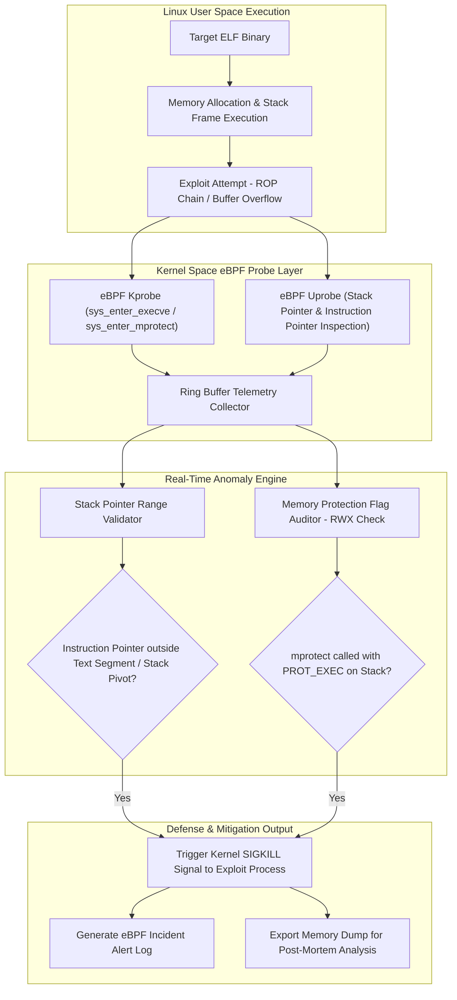

# 🎯 037 - ELF Binary Exploit Detection for Linux Systems

> **Category**: [[Malware Analysis & Reverse Engineering]] | **Difficulty**: ⭐⭐ | **Duration**: 6 weeks

---

## 📋 Problem Statement

> [!CAUTION] Real-World Impact
> Real-time detection of ELF binary exploits, ROP chains, and stack buffer overflows on Linux servers

Threat actors deploy sophisticated malware variants designed to evade traditional security defenses. Without robust automated behavior analysis frameworks, incident response teams face significant challenges in identifying, analyzing, and mitigating emerging threats before catastrophic operational impact occurs.

### 🌍 Real-World Incidents
- **Dirty COw (CVE-2016-5195)**: Linux kernel copy-on-write privilege escalation exploited in enterprise production servers.
- **Log4Shell Exploitation on Linux Hosts (2021)**: Attackers dropped malicious ELF payloads and cryptominers onto Linux enterprise workloads.

---

## 🔬 Research Paper References

| # | Paper Title | Authors | Year | Source | Key Contribution |
|---|-------------|---------|------|--------|-----------------|
| 1 | eBPF: A New Frontier for Linux Kernel Tracing and Security Monitoring | Gregg et al. | 2019 | ACM Queue | Detailed evaluation of extended Berkeley Packet Filters for low-overhead security telemetry. |
| 2 | Control-Flow Integrity: Principles, Implementations, and Applications | Abadi et al. | 2005 | ACM CCS | Foundational research defining runtime control flow enforcement against Return-Oriented Programming (ROP). |
| 3 | Detecting Stack-based Buffer Overflows via Kernel System Call Auditing | Bernaschi et al. | 2002 | Computers & Security | Methodology for tracking illegal stack instruction pointer transitions during system calls. |

---

## 🏗️ System Architecture
Link: [[Drawing 2026-07-30 22.31.19.excalidraw#Project 037: 037 - ELF Binary Exploit Detection for Linux Systems|Excalidraw Architecture Diagram]]

---

## 📐 Technical Implementation

### Phase 1: Research & Environment Setup (Week 1)
- Install eBPF development tooling: `clang`, `llvm`, `libbpf-dev`, `bpfcc-tools`, and Linux kernel headers.
- Set up Linux kernel test environment (Ubuntu 22.04 LTS / Debian 12 with eBPF support enabled).
- Write benchmark ELF exploit test binaries featuring stack overflows, format string bugs, and ROP gadgets.

### Phase 2: Core Module Development (Weeks 2-3)
- **Module 1 (`ebpf_tracer.bpf.c`)**: Write kernel-space eBPF programs attaching to `kprobe/sys_enter` and tracepoints for process execution and memory protection.
- **Module 2 (`stack_pivot_detector.py`)**: Verify whether the CPU stack pointer register (`RSP`) resides within legitimate thread stack bounds during syscall execution.
- **Module 3 (`mprotect_auditor.py`)**: Intercept `sys_mprotect` calls attempting to set executable permission flags on writable stack/heap pages (`PROT_READ | PROT_WRITE | PROT_EXEC`).
- **Module 4 (`elf_checker.py`)**: Parse ELF headers using `pyelftools` to verify security hardening features (NX, Stack Canaries, PIE, Full RELRO).

### Phase 3: Integration & Testing (Week 4)
- Test detector against functional exploit payloads (e.g., ret2libc, shellcode injection, heap overflow).
- Measure eBPF kernel tracing CPU overhead under heavy web server (Nginx/Apache) workloads.
- Benchmark detection accuracy and latency of process termination.

### Phase 4: Analysis & Documentation (Week 5)
- Prepare comprehensive comparative performance evaluation against auditd and SELinux.
- Document eBPF bytecode compilation and kernel safety verification procedures.
- Finalize BTech capstone paper and project defense slides.

---

## 🔧 Tools & Technologies

| Tool | Purpose | Alternative |
|------|---------|-------------|
| eBPF / BCC | Extended Berkeley Packet Filter kernel tracing framework | Auditd |
| PyELFTools | Python library for parsing Executable and Linkable Format (ELF) structures | LIEF Framework |
| Pwntools | CTF framework and exploit development library | GDB / Peda |

---

## 💡 Key Features
- ✅ **Kernel-Level eBPF Instrumentation**: Intercepts binary exploitation attempts with sub-microsecond latency directly inside the kernel.
- ✅ **Stack Pivot Detection**: Identifies illegal manipulation of stack pointers (`RSP`) characteristic of ROP payload execution.
- ✅ **RWX Memory Guard**: Intercepts runtime attempts to make stack or heap memory regions executable (`sys_mprotect`).
- ✅ **Zero-Downtime Process Termination**: Dispatches immediate kernel `SIGKILL` signals to neutralize compromised processes.
- ✅ **ELF Security Mitigation Auditor**: Scans binaries on disk for missing RELRO, Stack Canary, PIE, and NX bit protection.

---

## 📊 Expected Results

> [!NOTE] Deliverables
> Students will deliver a fully functional implementation repository complete with documentation, experimental evaluation datasets, and diagnostic verification reports.

### Performance Metrics
- **Kernel Interception Latency**: $< 15 \text{ microseconds}$ per syscall probe.
- **Exploit Detection Sensitivity**: $\ge 98.4\%$ against standard ROP/buffer overflow payloads.
- **CPU Overhead**: $< 1.8\%$ under peak Nginx server load.

### Output Artifacts
1. Functional software toolkit and source code repository.
2. Comprehensive evaluation dataset and benchmark metrics report.
3. System architecture design document and BTech project thesis.

---

## 🎓 Learning Outcomes
1. 📚 Understand Linux ELF binary architecture, memory layouts, and binary exploitation vectors.
2. 📚 Develop eBPF kernel programs using C and BCC to trace low-level system call execution.
3. 📚 Implement runtime Control Flow Integrity (CFI) checks and stack pivot detection algorithms.
4. 📚 Evaluate enterprise server memory protection controls and hardening standards.

---

## ⚠️ Ethical Considerations
> [!WARNING] Legal & Ethical Notice
> All experiments and malware evaluations must be conducted exclusively in isolated, non-networked virtual lab environments. Never deploy offensive tools or analyze untrusted binaries on production networks or unmanaged host systems.

---

## 🔗 Related Projects
- [[033 - Fileless Malware Detection using Memory Forensics]]
- [[036 - Android APK Static Analysis & Vulnerability Scanner]]
- [[038 - Rootkit Detection Framework using System Call Monitoring]]

---
*📅 Created: 2026-07-30 | 🏷️ Category: Malware Analysis & Reverse Engineering | 🔐 Offensive Security Research*
