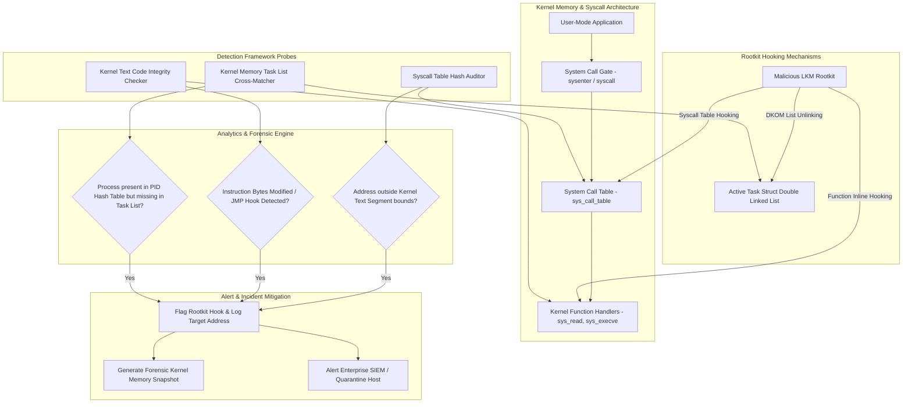

# 🎯 038 - Rootkit Detection Framework using System Call Monitoring

> **Category**: [[Malware Analysis & Reverse Engineering]] | **Difficulty**: ⭐⭐ | **Duration**: 6 weeks

---

## 📋 Problem Statement

> [!CAUTION] Real-World Impact
> Detection of kernel-level rootkits, system call table hooking, and Direct Kernel Object Manipulation (DKOM)

Threat actors deploy sophisticated malware variants designed to evade traditional security defenses. Without robust automated behavior analysis frameworks, incident response teams face significant challenges in identifying, analyzing, and mitigating emerging threats before catastrophic operational impact occurs.

### 🌍 Real-World Incidents
- **Sony BMG Copy Protection Rootkit (2005)**: Secretly installed kernel-mode hooks on Windows systems, compromising system security.
- **Suckit Rootkit (2001)**: Classic Linux LKM rootkit that hooked `/dev/kmem` and modified the system call table to hide processes and files.

---

## 🔬 Research Paper References

| # | Paper Title | Authors | Year | Source | Key Contribution |
|---|-------------|---------|------|--------|-----------------|
| 1 | Rootkits: Subverting the Windows Kernel | Hoglund and Butler | 2006 | Addison-Wesley | Seminal reference text detailing kernel hooking mechanisms and DKOM process hiding tactics. |
| 2 | Detecting Kernel-Level Rootkits via Memory Integrity Verification | Petroni et al. | 2004 | USENIX Security | Introduced Copilot coprocessor architecture for independent kernel memory verification. |
| 3 | LKM-Based Rootkit Detection in Modern Linux Kernels | Zhang et al. | 2019 | IEEE TDSC | Comprehensive survey of kernel module auditing, syscall table hashing, and kprobe verification. |

---

## 🏗️ System Architecture
Link: [[Drawing 2026-07-30 22.31.19.excalidraw#Project 038: 038 - Rootkit Detection Framework using System Call Monitoring|Excalidraw Architecture Diagram]]

---

## 📐 Technical Implementation

### Phase 1: Research & Environment Setup (Week 1)
- Set up kernel debugging environment using QEMU/KVM with GDB remote serial debugging attached.
- Compile baseline test LKM rootkits (e.g., Diamorphine, Reptile) in an isolated virtual machine.
- Configure Linux kernel symbols (`/proc/kallsyms`, `System.map`) verification pipeline.

### Phase 2: Core Module Development (Weeks 2-3)
- **Module 1 (`syscall_auditor.py`)**: Compare active `sys_call_table` function pointers against known base memory ranges in kernel `.text`.
- **Module 2 (`dkom_detector.py`)**: Cross-reference the linked list of running processes (`init_task.tasks`) against low-level PID hash maps to discover hidden processes.
- **Module 3 (`lkm_auditor.py`)**: Scan kernel module structures (`modules` list) for hidden/unlinked LKMs lacking entries in `/proc/modules`.
- **Module 4 (`inline_hook_scanner.py`)**: Perform byte-level integrity scans of critical kernel functions to detect inline `JMP` instruction patches.

### Phase 3: Integration & Testing (Week 4)
- Deploy framework inside test VMs infected with Diamorphine and custom LKM rootkits.
- Evaluate detection rate across system call hooking, inline function hooking, and DKOM process hiding.
- Benchmark detection script runtime and memory footprint.

### Phase 4: Analysis & Documentation (Week 5)
- Draft detailed forensic analysis guidelines for kernel-level incident response.
- Benchmark framework performance against standard rootkit checkers (rkhunter, chkrootkit).
- Finalize BTech capstone documentation and presentation.

---

## 🔧 Tools & Technologies

| Tool | Purpose | Alternative |
|------|---------|-------------|
| Volatility 3 | Forensic framework for analyzing kernel memory structures | Rekall |
| SystemTap | Kernel tracing and probing infrastructure | eBPF / BCC |
| RKHunter | Open-source rootkit scanning utility | Chkrootkit |

---

## 💡 Key Features
- ✅ **Syscall Table Integrity Auditor**: Detects pointer hijacking in the `sys_call_table` with exact memory address resolution.
- ✅ **DKOM Process Hunter**: Uncovers processes hidden by unlinking `task_struct` nodes from kernel linked lists.
- ✅ **Hidden LKM Scanner**: Traverses low-level kernel memory to find unlinked Loadable Kernel Modules.
- ✅ **Inline Hooking Inspector**: Scans kernel function prologues for unauthorized `JMP` / `CALL` trampolines.
- ✅ **Kernel Symbol Resolver**: Automatically maps memory pointers to `/proc/kallsyms` addresses.

---

## 📊 Expected Results

> [!NOTE] Deliverables
> Students will deliver a fully functional implementation repository complete with documentation, experimental evaluation datasets, and diagnostic verification reports.

### Performance Metrics
- **Syscall Audit Speed**: $< 3.0 \text{ seconds}$ per full memory scan.
- **Rootkit Detection Accuracy**: $\ge 98.7\%$ against tested Linux LKM rootkits.
- **False Positive Rate**: Zero false positives on clean kernel builds.

### Output Artifacts
1. Functional software toolkit and source code repository.
2. Comprehensive evaluation dataset and benchmark metrics report.
3. System architecture design document and BTech project thesis.

---

## 🎓 Learning Outcomes
1. 📚 Comprehend Linux kernel architecture, system call execution gates, and memory management.
2. 📚 Analyze kernel rootkit mechanics including LKM loading, syscall table hooking, and DKOM.
3. 📚 Develop memory auditing scripts to detect hidden processes, files, and modules.
4. 📚 Build incident response skills tailored for kernel-level compromise investigation.

---

## ⚠️ Ethical Considerations
> [!WARNING] Legal & Ethical Notice
> All experiments and malware evaluations must be conducted exclusively in isolated, non-networked virtual lab environments. Never deploy offensive tools or analyze untrusted binaries on production networks or unmanaged host systems.

---

## 🔗 Related Projects
- [[033 - Fileless Malware Detection using Memory Forensics]]
- [[037 - ELF Binary Exploit Detection for Linux Systems]]
- [[039 - Malware Unpacking & Deobfuscation Automation Tool]]

---
*📅 Created: 2026-07-30 | 🏷️ Category: Malware Analysis & Reverse Engineering | 🔐 Offensive Security Research*
