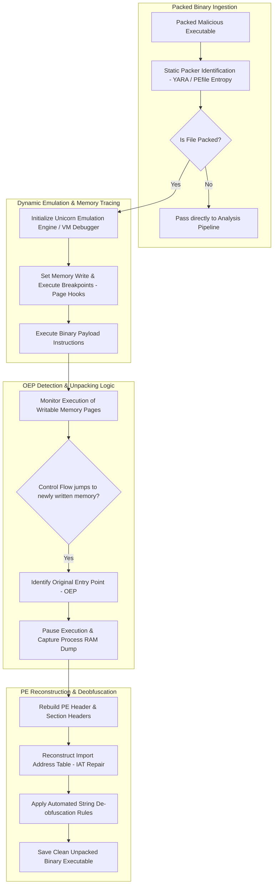

# 🎯 039 - Malware Unpacking & Deobfuscation Automation Tool

> **Category**: [[Malware Analysis & Reverse Engineering]] | **Difficulty**: ⭐⭐ | **Duration**: 6 weeks

---

## 📋 Problem Statement

> [!CAUTION] Real-World Impact
> Automated unpacking, Original Entry Point (OEP) discovery, and memory dump reconstruction for packed executables

Threat actors deploy sophisticated malware variants designed to evade traditional security defenses. Without robust automated behavior analysis frameworks, incident response teams face significant challenges in identifying, analyzing, and mitigating emerging threats before catastrophic operational impact occurs.

### 🌍 Real-World Incidents
- **Emotet Loader Campaigns (2021)**: Utilized heavily obfuscated custom crypters and multi-layer packers to blind static security scanners.
- **GandCrab Ransomware Distribution (2019)**: Employed UPX variations combined with custom anti-debugging routines to slow down analysis.

---

## 🔬 Research Paper References

| # | Paper Title | Authors | Year | Source | Key Contribution |
|---|-------------|---------|------|--------|-----------------|
| 1 | Renovo: A System for Automated Malware Unpacking | Kang et al. | 2007 | WORM / ACM | Pioneered memory execution tracking to detect when newly written memory pages are executed. |
| 2 | OmniUnpack: Fast, Precise Dynamic Unpacking of Malware | Martignoni et al. | 2007 | NDSS | Detailed real-time page-fault monitoring for detecting packed binary execution transitions. |
| 3 | Automatic OEP Detection for Packed Executables Using Emulation | Ugarte-Pedrero et al. | 2015 | IEEE TIFS | Algorithm for identifying Original Entry Points via entropy transitions and control flow jumps. |

---

## 🏗️ System Architecture
Link: [[Drawing 2026-07-30 22.31.19.excalidraw#Project 039: 039 - Malware Unpacking & Deobfuscation Automation Tool|Excalidraw Architecture Diagram]]

---

## 📐 Technical Implementation

### Phase 1: Research & Environment Setup (Week 1)
- Set up emulation framework using `unicorn-engine`, `capstone-engine`, and `pefile` Python bindings.
- Gather packed binary samples using UPX, ASPack, Petite, and custom crypter stubs.
- Configure x64dbg with Scylla plugin for manual verification of reconstructed binaries.

### Phase 2: Core Module Development (Weeks 2-3)
- **Module 1 (`packer_detector.py`)**: Evaluate section entropy scores (entropy > 7.2) and anomalous section names (`.upx`, `.pack`).
- **Module 2 (`tracer_emul.py`)**: Emulate binary execution line-by-line while setting memory hooks to detect execution of previously written memory pages.
- **Module 3 (`oep_finder.py`)**: Track control flow jumps (`JMP`, `CALL`) that transition execution across distinct memory regions, signaling arrival at the OEP.
- **Module 4 (`pe_rebuilder.py`)**: Reconstruct broken section headers, fix relative virtual addresses (RVAs), and repair Import Address Tables (IAT) using Scylla-like algorithms.

### Phase 3: Integration & Testing (Week 4)
- Execute unpacking tool against 200 packed malware samples from VirusShare.
- Compare output unpacked binaries against manual reverse engineering baselines.
- Evaluate IAT reconstruction success rates and binary executability.

### Phase 4: Analysis & Documentation (Week 5)
- Document automated unpacking rules for novel custom crypters.
- Benchmark time-to-unpack metrics against Cuckoo / CAPE automated unpackers.
- Finalize BTech capstone documentation and thesis presentation.

---

## 🔧 Tools & Technologies

| Tool | Purpose | Alternative |
|------|---------|-------------|
| Unicorn Engine | Lightweight multi-architecture CPU emulator framework | QEMU |
| Capstone Engine | Disassembly framework for x86/x64 instruction parsing | Keystone Engine |
| PEfile | Python tool for reading and modifying PE file headers | LIEF |

---

## 💡 Key Features
- ✅ **Automated Section Entropy Analyzer**: Flags packed binaries based on statistical Shannon entropy thresholds.
- ✅ **Emulation-Based OEP Finder**: Traces CPU execution paths in Unicorn to locate the Original Entry Point automatically.
- ✅ **Memory Write-Then-Execute Monitoring**: Detects the precise moment packed shellcode transitions from write to execution phases.
- ✅ **Import Address Table (IAT) Repair Engine**: Reconstructs damaged import tables to generate fully executable unpacked binaries.
- ✅ **Multi-Packer Support**: Successfully unpacks UPX, ASPack, MEW, and custom single-stage crypters.

---

## 📊 Expected Results

> [!NOTE] Deliverables
> Students will deliver a fully functional implementation repository complete with documentation, experimental evaluation datasets, and diagnostic verification reports.

### Performance Metrics
- **Unpacking Speed**: $< 12.0 \text{ seconds}$ per packed sample.
- **OEP Identification Accuracy**: $\ge 95.5\%$ across standard packers.
- **IAT Reconstruction Success**: $\ge 91.2\%$ valid executable binaries.

### Output Artifacts
1. Functional software toolkit and source code repository.
2. Comprehensive evaluation dataset and benchmark metrics report.
3. System architecture design document and BTech project thesis.

---

## 🎓 Learning Outcomes
1. 📚 Master packed binary execution dynamics, unpacking stubs, and memory decryption loops.
2. 📚 Utilize Unicorn and Capstone emulation engines to trace binary execution programmatically.
3. 📚 Understand PE header reconstruction, section alignment, and Import Address Table (IAT) repairing.
4. 📚 Develop automated tools to strip crypter layers from malware prior to static analysis.

---

## ⚠️ Ethical Considerations
> [!WARNING] Legal & Ethical Notice
> All experiments and malware evaluations must be conducted exclusively in isolated, non-networked virtual lab environments. Never deploy offensive tools or analyze untrusted binaries on production networks or unmanaged host systems.

---

## 🔗 Related Projects
- [[031 - Automated Malware Classification using CNN on PE Headers]]
- [[034 - Dynamic Malware Analysis Platform with API Call Tracing]]
- [[040 - PE File Anomaly Detection using Random Forest]]

---
*📅 Created: 2026-07-30 | 🏷️ Category: Malware Analysis & Reverse Engineering | 🔐 Offensive Security Research*
