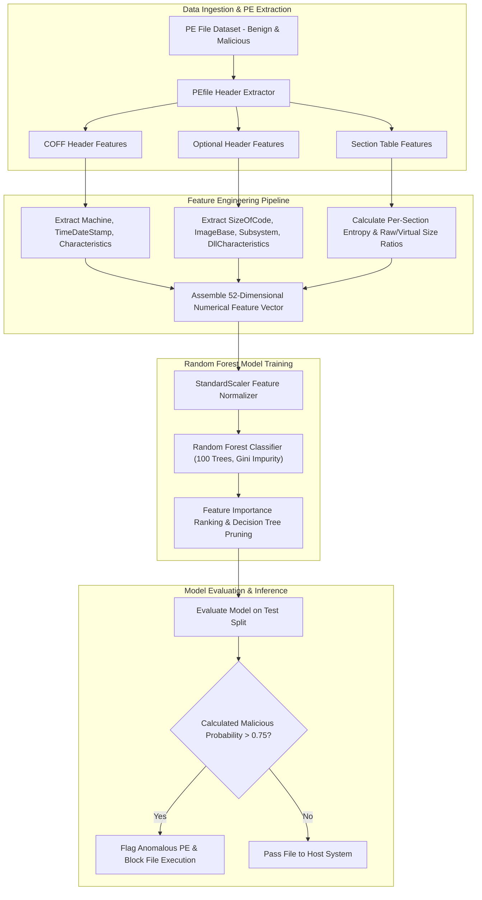

# 🎯 040 - PE File Anomaly Detection using Random Forest

> **Category**: [[Malware Analysis & Reverse Engineering]] | **Difficulty**: ⭐⭐ | **Duration**: 5 weeks

---

## 📋 Problem Statement

> [!CAUTION] Real-World Impact
> Detection of zero-day malware and PE structure anomalies using Random Forest feature classification engines

Threat actors deploy sophisticated malware variants designed to evade traditional security defenses. Without robust automated behavior analysis frameworks, incident response teams face significant challenges in identifying, analyzing, and mitigating emerging threats before catastrophic operational impact occurs.

### 🌍 Real-World Incidents
- **NotPetya Cyberattack (2017)**: Destructive wiper malware masquerading as ransomware contained structural PE anomalies missed by signature engines.
- **Stuxnet Component Drivers (2010)**: Stolen digital certificates and altered section header flags allowed binaries to bypass security controls.

---

## 🔬 Research Paper References

| # | Paper Title | Authors | Year | Source | Key Contribution |
|---|-------------|---------|------|--------|-----------------|
| 1 | Detecting Unknown Malicious Code by Applying Machine Learning Methods on PE Headers | Schultz et al. | 2001 | IEEE S&P | Pioneered applying machine learning algorithms to Portable Executable structural features. |
| 2 | Static Detection of Malware Executables Using Data Mining Techniques | Kolter and Maloof | 2006 | JMLR | Evaluated n-gram byte sequences and Random Forest classifiers for malware family identification. |
| 3 | Structural Entropy and PE Header Anomaly Extraction for Malware Detection | Sorokina et al. | 2018 | ACM CSUR | Comprehensive taxonomy of structural anomalies in non-standard Portable Executables. |

---

## 🏗️ System Architecture
Link: [[Drawing 2026-07-30 22.31.19.excalidraw#Project 040: 040 - PE File Anomaly Detection using Random Forest|Excalidraw Architecture Diagram]]

---

## 📐 Technical Implementation

### Phase 1: Research & Environment Setup (Week 1)
- Install machine learning and dataset tools: `pip install scikit-learn pefile pandas numpy matplotlib seaborn`.
- Download EMBER static PE feature dataset or assemble a local corpus of 5,000 clean and 5,000 malicious binaries.
- Configure feature extraction notebook pipeline for PE structure processing.

### Phase 2: Core Module Development (Weeks 2-3)
- **Module 1 (`extractor.py`)**: Extract 52 key structural features: section counts, section entropy, import function counts, header checksums, and debug directory presence.
- **Module 3 (`trainer.py`)**: Train a Random Forest classifier using 100 decision trees, 10-fold cross-validation, and hyperparameter tuning (`max_depth`, `min_samples_split`).
- **Module 3 (`importance.py`)**: Calculate Gini feature importance to identify top structural indicators of malicious intent (e.g., VirtualSize vs SizeOfRawData mismatches).
- **Module 4 (`scanner.py`)**: Build lightweight Command Line Interface (CLI) executable scanner for inline SOC file auditing.

### Phase 3: Integration & Testing (Week 4)
- Test Random Forest model against newly compiled benign C++ projects and fresh zero-day malware samples.
- Generate Receiver Operating Characteristic (ROC) curves and Precision-Recall metrics.
- Compare Random Forest performance against Support Vector Machines (SVM) and Naive Bayes baseline models.

### Phase 4: Analysis & Documentation (Week 5)
- Document top 10 PE header anomalies associated with malware (e.g., `.text` section write permissions).
- Export trained model to ONNX / Joblib format for deployment.
- Complete BTech capstone research thesis and project slides.

---

## 🔧 Tools & Technologies

| Tool | Purpose | Alternative |
|------|---------|-------------|
| Scikit-learn | Python machine learning library for classifier training | XGBoost |
| PEfile | Python Portable Executable parsing library | LIEF Framework |
| Pandas | Data analysis and feature matrix manipulation framework | Numpy |

---

## 💡 Key Features
- ✅ **52-Point Structural PE Inspection**: Analyzes section entropy, header flags, import counts, and size discrepancies.
- ✅ **Random Forest Classifier Architecture**: Utilizes 100 decision trees to achieve robust classification without overfitting.
- ✅ **Sub-Millisecond Inference Speed**: Evaluates file header feature vectors in less than 5 milliseconds.
- ✅ **Explainable AI Feature Importance**: Quantifies specific PE structural anomalies driving malicious classification decisions.
- ✅ **Standalone Deployment Format**: Exports lightweight serialized model files (`joblib`) suitable for EDR integration.

---

## 📊 Expected Results

> [!NOTE] Deliverables
> Students will deliver a fully functional implementation repository complete with documentation, experimental evaluation datasets, and diagnostic verification reports.

### Performance Metrics
- **Classification Accuracy**: $\ge 98.1\%$ on EMBER benchmark test set.
- **Inference Latency**: $< 5.0 \text{ milliseconds}$ per file scan.
- **False Positive Rate**: $< 0.3\%$ on clean Windows OS binaries.

### Output Artifacts
1. Functional software toolkit and source code repository.
2. Comprehensive evaluation dataset and benchmark metrics report.
3. System architecture design document and BTech project thesis.

---

## 🎓 Learning Outcomes
1. 📚 Master Portable Executable (PE) header specification, COFF structures, and section attributes.
2. 📚 Perform feature engineering on binary files to extract structural and statistical numerical metrics.
3. 📚 Train, evaluate, and tune Random Forest machine learning models using Scikit-learn.
4. 📚 Apply explainable machine learning principles to justify threat detection verdicts.

---

## ⚠️ Ethical Considerations
> [!WARNING] Legal & Ethical Notice
> All experiments and malware evaluations must be conducted exclusively in isolated, non-networked virtual lab environments. Never deploy offensive tools or analyze untrusted binaries on production networks or unmanaged host systems.

---

## 🔗 Related Projects
- [[031 - Automated Malware Classification using CNN on PE Headers]]
- [[039 - Malware Unpacking & Deobfuscation Automation Tool]]
- [[041 - Macro-based Malware Detector for Office Documents]]

---
*📅 Created: 2026-07-30 | 🏷️ Category: Malware Analysis & Reverse Engineering | 🔐 Offensive Security Research*
