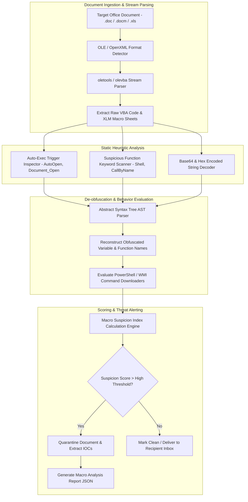

# 🎯 041 - Macro-based Malware Detector for Office Documents

> **Category**: [[Malware Analysis & Reverse Engineering]] | **Difficulty**: ⭐⭐ | **Duration**: 5 weeks

---

## 📋 Problem Statement

> [!CAUTION] Real-World Impact
> Static extraction, heuristic de-obfuscation, and behavior analysis of malicious VBA macros in Microsoft Office files

Threat actors deploy sophisticated malware variants designed to evade traditional security defenses. Without robust automated behavior analysis frameworks, incident response teams face significant challenges in identifying, analyzing, and mitigating emerging threats before catastrophic operational impact occurs.

### 🌍 Real-World Incidents
- **Emotet Malicious Spam Campaigns (2021)**: Distributed weaponized Word documents containing obfuscated VBA macros that downloaded payload loaders.
- **QakBot Banking Trojan Distribution (2022)**: Leveraged Excel 4.0 (XLM) macros embedded in spreadsheet attachments to evade email gateway filters.

---

## 🔬 Research Paper References

| # | Paper Title | Authors | Year | Source | Key Contribution |
|---|-------------|---------|------|--------|-----------------|
| 1 | VBA Macro Detection and De-obfuscation via Static Heuristics | Ligh et al. | 2017 | IEEE Security & Privacy | Taxonomy of obfuscated VBA macro indicators including string concatenation and auto-exec triggers. |
| 2 | Static Analysis of Malicious Office Documents Using oletools | Lagadec | 2019 | ACM Digital Threats | Foundational study on OLE and OpenXML stream extraction algorithms for VBA macro recovery. |
| 3 | Detecting Malicious Macros in Microsoft Office Documents using Machine Learning | Taha et al. | 2020 | Computers & Security | Feature extraction framework for classifying document macros using entropy and suspicious keyword frequency. |

---

## 🏗️ System Architecture
Link: [[Drawing 2026-07-30 22.31.19.excalidraw#Project 041: 041 - Macro-based Malware Detector for Office Documents|Excalidraw Architecture Diagram]]

---

## 📐 Technical Implementation

### Phase 1: Research & Environment Setup (Week 1)
- Install python document security tools: `pip install oletools yara-python olefile pandas`.
- Configure test directory containing benign Office documents and weaponized sample attachments from MalwareBazaar.
- Configure static analysis pipeline scripts using `olevba` and `mraptor` libraries.

### Phase 2: Core Module Development (Weeks 2-3)
- **Module 1 (`stream_extractor.py`)**: Traverses OLE streams (`VBA_Project`) and OpenXML XML structures to extract macro source code.
- **Module 2 (`autoexec_checker.py`)**: Identifies auto-execution entry points (`AutoOpen`, `Workbook_Open`, `Document_Close`).
- **Module 3 (`deobfuscator.py`)**: Solves VBA string obfuscation loops, array XOR operations, and `Chr()` concatenation functions programmatically.
- **Module 4 (`payload_parser.py`)**: Extracts embedded URLs, IPs, and spawned process command lines (`powershell.exe -enc`, `cmd.exe /c`).

### Phase 3: Integration & Testing (Week 4)
- Run macro scanner against a corpus of 1,000 real-world Office documents (Emotet, Qakbot, Trickbot samples).
- Benchmark scan speed (target: under 3 seconds per document).
- Measure true positive detection rate on legacy `.doc` vs modern `.docx` format files.

### Phase 4: Analysis & Documentation (Week 5)
- Document common obfuscation patterns used by major threat actors.
- Publish open-source YARA rule package for detecting weaponized Office macros.
- Finalize BTech capstone documentation and presentation slides.

---

## 🔧 Tools & Technologies

| Tool | Purpose | Alternative |
|------|---------|-------------|
| oletools | Python suite for analyzing Microsoft OLE2 and Office OpenXML files | VBA Deobfuscator |
| olevba | Static macro extraction and heuristic scoring tool | mraptor |
| YARA | Pattern matching Swiss knife for malware researchers | Sigma Rules |

---

## 💡 Key Features
- ✅ **Automated VBA & XLM Extraction**: Pulls hidden macro code from legacy `.doc` and modern `.xlsm` formats.
- ✅ **Auto-Exec Trigger Detection**: Flags automatic execution hooks including `AutoOpen` and `Document_Open`.
- ✅ **Heuristic Obfuscation Unwrapper**: Resolves nested `Chr()`, `Replace()`, and array XOR decoding routines.
- ✅ **PowerShell Payload Carving**: Extracts and decodes hidden Base64 PowerShell downloaders embedded in macro text.
- ✅ **Sub-Second Static Processing**: Classifies document risk in under 3 seconds per file without VM execution.

---

## 📊 Expected Results

> [!NOTE] Deliverables
> Students will deliver a fully functional implementation repository complete with documentation, experimental evaluation datasets, and diagnostic verification reports.

### Performance Metrics
- **Processing Speed**: $< 2.8 \text{ seconds}$ per Office document.
- **Detection Sensitivity**: $\ge 97.9\%$ across Emotet and Qakbot macro variants.
- **False Positive Rate**: $< 0.4\%$ on clean enterprise document templates.

### Output Artifacts
1. Functional software toolkit and source code repository.
2. Comprehensive evaluation dataset and benchmark metrics report.
3. System architecture design document and BTech project thesis.

---

## 🎓 Learning Outcomes
1. 📚 Deconstruct Microsoft OLE2 and OpenXML document storage formats.
2. 📚 Utilize oletools and olevba to extract and de-obfuscate malicious VBA macro code.
3. 📚 Detect common document auto-execution triggers and evasive downloader payloads.
4. 📚 Develop static heuristic detection rules for enterprise email gateways.

---

## ⚠️ Ethical Considerations
> [!WARNING] Legal & Ethical Notice
> All experiments and malware evaluations must be conducted exclusively in isolated, non-networked virtual lab environments. Never deploy offensive tools or analyze untrusted binaries on production networks or unmanaged host systems.

---

## 🔗 Related Projects
- [[031 - Automated Malware Classification using CNN on PE Headers]]
- [[040 - PE File Anomaly Detection using Random Forest]]
- [[045 - Living-off-the-Land Binary (LOLBin) Abuse Detector]]

---
*📅 Created: 2026-07-30 | 🏷️ Category: Malware Analysis & Reverse Engineering | 🔐 Offensive Security Research*
