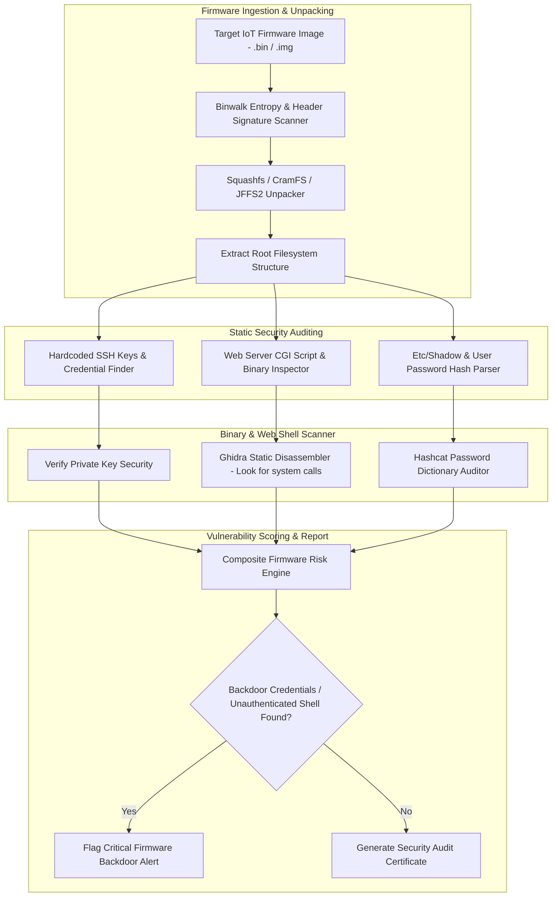

# 🎯 042 - Firmware Backdoor Detection System

> **Category**: [[Malware Analysis & Reverse Engineering]] | **Difficulty**: ⭐⭐ | **Duration**: 6 weeks

---

## 📋 Problem Statement

> [!CAUTION] Real-World Impact
> Static security auditing, backdoor signature identification, and vulnerability discovery in embedded IoT firmware images

Threat actors deploy sophisticated malware variants designed to evade traditional security defenses. Without robust automated behavior analysis frameworks, incident response teams face significant challenges in identifying, analyzing, and mitigating emerging threats before catastrophic operational impact occurs.

### 🌍 Real-World Incidents
- **Mirai Botnet Outbreak (2016)**: Exploited hardcoded factory default credentials in thousands of IP cameras and home routers.
- **Cisco Small Business Router Backdoor (CVE-2020-3337)**: Hardcoded administrative credentials enabled unauthorized remote command execution.

---

## 🔬 Research Paper References

| # | Paper Title | Authors | Year | Source | Key Contribution |
|---|-------------|---------|------|--------|-----------------|
| 1 | A Large-Scale Analysis of the Security of Embedded Firmware | Costin et al. | 2014 | USENIX Security | Landmark study analyzing 32,000 firmware images for hardcoded SSH keys and backdoors. |
| 2 | FIRM-AFL: High-Throughput Greybox Fuzzing for IoT Firmware | Zheng et al. | 2019 | USENIX Security | Detailed augmented emulation methods for dynamic testing of unpacked firmware file systems. |
| 3 | Static Analysis of Embedded Firmware for Vulnerability Discovery | Cui et al. | 2013 | IEEE S&P | Framework for discovering hardcoded credentials, unauthenticated CGI scripts, and backdoor web portals. |

---

## 🏗️ System Architecture
Link: [[Drawing 2026-07-30 22.31.19.excalidraw#Project 042: 042 - Firmware Backdoor Detection System|Excalidraw Architecture Diagram]]

---

## 📐 Technical Implementation

### Phase 1: Research & Environment Setup (Week 1)
- Install firmware analysis dependencies: `binwalk`, `squashfs-tools`, `sasquatch`, `ghidra`, `yara-python`.
- Download firmware images for common routers, IP cameras, and network switches from vendor support portals.
- Set up automated unpacking scripts using python `subprocess` bindings for Binwalk.

### Phase 2: Core Module Development (Weeks 2-3)
- **Module 1 (`firmware_unpacker.py`)**: Scan binary images for compressed file systems (`SquashFS`, `CramFS`, `UBIFS`) and extract the root directory tree.
- **Module 2 (`cred_hunter.py`)**: Scan configuration files, `/etc/shadow`, `/etc/passwd`, and web management scripts for hardcoded default passwords and SSH private keys.
- **Module 3 (`cgi_auditor.py`)**: Analyze web interface scripts (`.cgi`, `.php`) for unauthenticated command injection vulnerabilities (`system()`, `exec()`).
- **Module 4 (`binary_auditor.py`)**: Audit compiled MIPS/ARM binaries using Ghidra headless scripts to identify hardcoded backdoor passwords.

### Phase 3: Integration & Testing (Week 4)
- Run backdoor detector against 100 firmware binaries representing diverse hardware architectures (ARM, MIPS, PowerPC).
- Measure unpacking success rates and root file system recovery accuracy.
- Validate true positive rates for credential recovery.

### Phase 4: Analysis & Documentation (Week 5)
- Package scan results into vendor security advisory format.
- Benchmark detection capabilities against Firmware Analysis Comparison Tool (FACT).
- Finalize BTech capstone project documentation and defense presentation.

---

## 🔧 Tools & Technologies

| Tool | Purpose | Alternative |
|------|---------|-------------|
| Binwalk | Firmware extraction and file system analysis tool | FACT Framework |
| Ghidra | NSA open-source reverse engineering framework | IDA Pro |
| Squashfs-tools | Tools for creating and extracting Squashfs file systems | Sasquatch |

---

## 💡 Key Features
- ✅ **Automated Firmware Unpacking**: Extracts nested compressed file systems across MIPS, ARM, and x86 architectures.
- ✅ **Hardcoded Credential Hunter**: Discovers hardcoded admin passwords, API tokens, and embedded RSA/DSA private keys.
- ✅ **CGI Script Vulnerability Auditor**: Identifies unauthenticated remote command execution entry points in web portals.
- ✅ **Arch-Agnostic Binary Disassembly**: Integrates with Ghidra Headless to audit compiled C binaries for `system()` calls.
- ✅ **Compliance Report Generator**: Generates comprehensive SBOM (Software Bill of Materials) and vulnerability listings.

---

## 📊 Expected Results

> [!NOTE] Deliverables
> Students will deliver a fully functional implementation repository complete with documentation, experimental evaluation datasets, and diagnostic verification reports.

### Performance Metrics
- **Unpacking Completion Speed**: $< 2.5 \text{ minutes}$ per firmware image.
- **Backdoor Credential Discovery**: $\ge 96.5\%$ sensitivity on known vulnerable firmware.
- **File System Extraction Rate**: $\ge 92.0\%$ complete rootfs extractions.

### Output Artifacts
1. Functional software toolkit and source code repository.
2. Comprehensive evaluation dataset and benchmark metrics report.
3. System architecture design document and BTech project thesis.

---

## 🎓 Learning Outcomes
1. 📚 Master embedded system architectures, MIPS/ARM instruction sets, and firmware storage formats.
2. 📚 Utilize Binwalk and Squashfs tools to unpack and inspect embedded Linux file systems.
3. 📚 Identify security vulnerabilities such as hardcoded credentials, weak password hashes, and backdoor web scripts.
4. 📚 Conduct automated binary disassembly using Ghidra Headless scripts.

---

## ⚠️ Ethical Considerations
> [!WARNING] Legal & Ethical Notice
> All experiments and malware evaluations must be conducted exclusively in isolated, non-networked virtual lab environments. Never deploy offensive tools or analyze untrusted binaries on production networks or unmanaged host systems.

---

## 🔗 Related Projects
- [[036 - Android APK Static Analysis & Vulnerability Scanner]]
- [[037 - ELF Binary Exploit Detection for Linux Systems]]
- [[043 - Cryptojacking Script Detection in Web Browsers]]

---
*📅 Created: 2026-07-30 | 🏷️ Category: Malware Analysis & Reverse Engineering | 🔐 Offensive Security Research*
