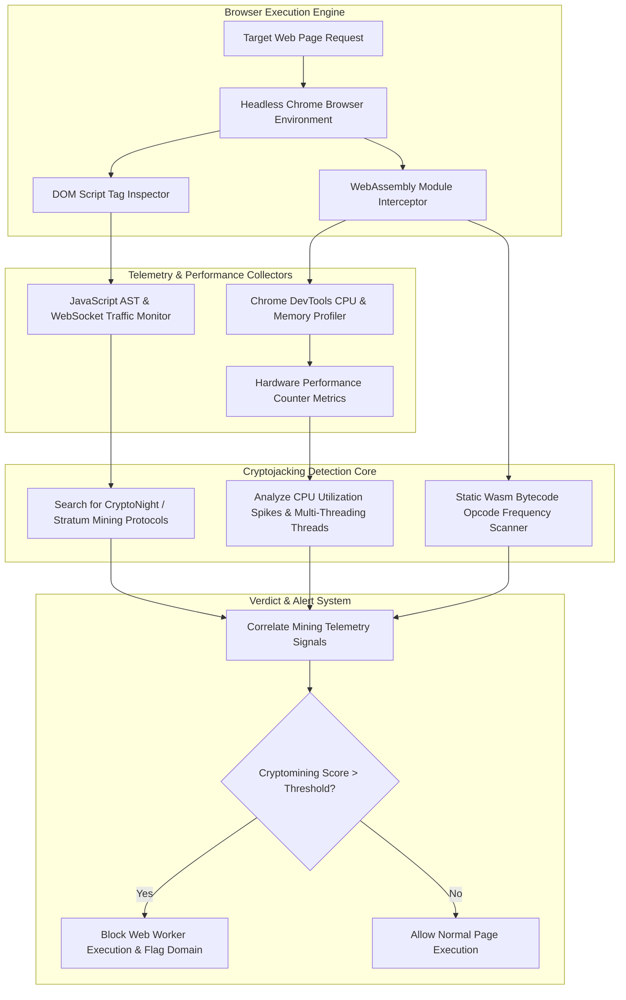

# 🎯 043 - Cryptojacking Script Detection in Web Browsers

> **Category**: [[Malware Analysis & Reverse Engineering]] | **Difficulty**: ⭐⭐ | **Duration**: 5 weeks

---

## 📋 Problem Statement

> [!CAUTION] Real-World Impact
> Detection of unauthorized browser-based cryptojacking scripts and WebAssembly mining engines in real-time

Threat actors deploy sophisticated malware variants designed to evade traditional security defenses. Without robust automated behavior analysis frameworks, incident response teams face significant challenges in identifying, analyzing, and mitigating emerging threats before catastrophic operational impact occurs.

### 🌍 Real-World Incidents
- **Coinhive Outbreak (2017-2019)**: Thousands of compromised websites secretly embedded Coinhive JavaScript miners to mine Monero using visitor CPU.
- **LA County Court Web Cryptojacking (2018)**: Official court portals compromised with malicious WebAssembly cryptomining scripts.

---

## 🔬 Research Paper References

| # | Paper Title | Authors | Year | Source | Key Contribution |
|---|-------------|---------|------|--------|-----------------|
| 1 | Out-of-Sight, Out-of-Mind: Detecting Web-Based Cryptojacking in the Wild | Hong et al. | 2018 | ACM CCS | Landmark measurement study introducing hardware performance counter metrics for cryptojacking detection. |
| 2 | MineSweeper: An In-Browser Cryptojacking Detection System | Kharraz et al. | 2019 | USENIX Security | Detailed execution profiling of WebAssembly primitives used in cryptomining algorithms. |
| 3 | Capsule: Detecting In-Browser Cryptojacking via WebAssembly Bytecode Analysis | Rodriguez et al. | 2021 | IEEE TIFS | Static and dynamic analysis methodology for identifying CryptoNight algorithms in Wasm binaries. |

---

## 🏗️ System Architecture
Link: [[Drawing 2026-07-30 22.31.19.excalidraw#Project 043: 043 - Cryptojacking Script Detection in Web Browsers|Excalidraw Architecture Diagram]]

---

## 📐 Technical Implementation

### Phase 1: Research & Environment Setup (Week 1)
- Install browser automation and WASM analysis tools: `npm install puppeteer`, `pip install wasm-parser scikit-learn`.
- Configure headless Chrome instances with Chrome DevTools Protocol (CDP) performance monitoring enabled.
- Collect baseline datasets of normal web pages vs pages running Coinhive, CryptoLoot, and WebMinePool scripts.

### Phase 2: Core Module Development (Weeks 2-3)
- **Module 1 (`browser_monitor.js`)**: Puppeteer script capturing WebSocket network frames, Web Worker spawns, and CPU utilization levels.
- **Module 2 (`wasm_auditor.py`)**: Parse intercepted `.wasm` bytecode binaries to count cryptographic bitwise opcode frequencies (`xor`, `rotl`, `i64.add`).
- **Module 3 (`protocol_checker.py`)**: Intercept WebSocket messages searching for Stratum mining protocol JSON frames (`mining.subscribe`, `mining.submit`).
- **Module 4 (`classifier.py`)**: Train a Random Forest classifier using CPU usage metrics, thread counts, and Wasm opcode distributions.

### Phase 3: Integration & Testing (Week 4)
- Test detector against 500 benign websites (including high CPU video streaming sites) and 200 cryptojacking test cases.
- Measure detection latency (target: flag miner within 10 seconds of page load).
- Evaluate false positive rates on legitimate WebAssembly web applications (e.g., Figma, Unity web games).

### Phase 4: Analysis & Documentation (Week 5)
- Document hardware performance counter signatures characteristic of CryptoNight algorithms.
- Package browser extension prototype for inline user protection.
- Finalize BTech capstone documentation and presentation slides.

---

## 🔧 Tools & Technologies

| Tool | Purpose | Alternative |
|------|---------|-------------|
| Puppeteer | Node.js library to control headless Chrome/Chromium | Playwright |
| Wasm-Parser | Python parser for WebAssembly binary opcode inspection | Wasm-Tools |
| Chrome DevTools Protocol | Low-level browser debugging and telemetry API | WebExtension API |

---

## 💡 Key Features
- ✅ **Headless Browser Telemetry**: Tracks Web Worker thread spawns, CPU utilization, and heap allocation in real time.
- ✅ **WASM Opcode Frequency Inspection**: Detects CryptoNight algorithm signatures inside WebAssembly binaries.
- ✅ **Stratum Protocol Parser**: Intercepts WebSocket network traffic for cryptomining pool authentication frames.
- ✅ **Dynamic Worker Throttling**: Automatically suspends rogue Web Workers consuming excessive CPU resources.
- ✅ **Browser Extension Prototype**: Provides real-time user notification and site blocking capabilities.

---

## 📊 Expected Results

> [!NOTE] Deliverables
> Students will deliver a fully functional implementation repository complete with documentation, experimental evaluation datasets, and diagnostic verification reports.

### Performance Metrics
- **Detection Latency**: $< 8.5 \text{ seconds}$ from initial page load.
- **Mining Identification Accuracy**: $\ge 98.2\%$ across tested cryptojacking scripts.
- **False Positive Rate**: $< 0.5\%$ on legitimate Wasm games and video apps.

### Output Artifacts
1. Functional software toolkit and source code repository.
2. Comprehensive evaluation dataset and benchmark metrics report.
3. System architecture design document and BTech project thesis.

---

## 🎓 Learning Outcomes
1. 📚 Understand WebAssembly architecture, Web Worker execution models, and browser security sandboxing.
2. 📚 Utilize Puppeteer and Chrome DevTools Protocol to capture dynamic browser telemetry.
3. 📚 Analyze WebAssembly bytecode opcodes to detect intensive cryptographic calculation loops.
4. 📚 Develop web extension prototypes to protect endpoints from unauthorized resource hijacking.

---

## ⚠️ Ethical Considerations
> [!WARNING] Legal & Ethical Notice
> All experiments and malware evaluations must be conducted exclusively in isolated, non-networked virtual lab environments. Never deploy offensive tools or analyze untrusted binaries on production networks or unmanaged host systems.

---

## 🔗 Related Projects
- [[036 - Android APK Static Analysis & Vulnerability Scanner]]
- [[042 - Firmware Backdoor Detection System]]
- [[045 - Living-off-the-Land Binary (LOLBin) Abuse Detector]]

---
*📅 Created: 2026-07-30 | 🏷️ Category: Malware Analysis & Reverse Engineering | 🔐 Offensive Security Research*
