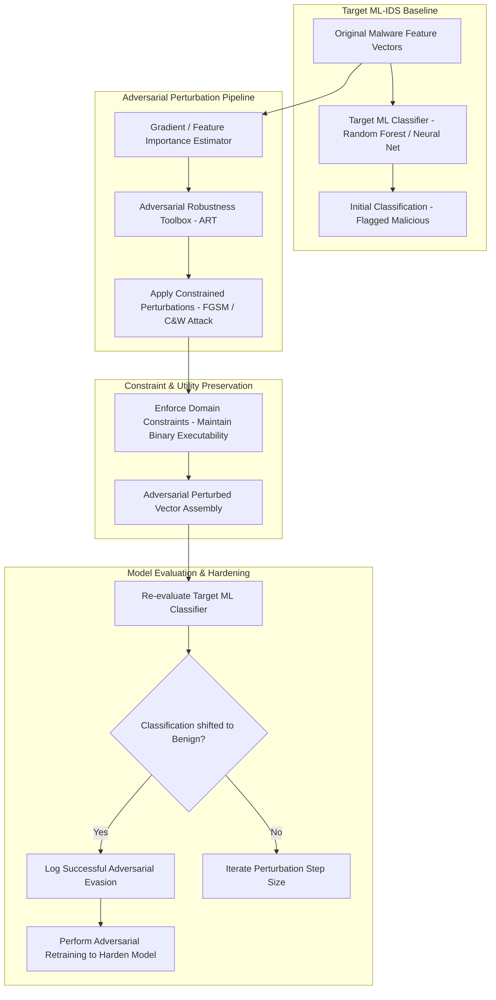

# 🎯 044 - Adversarial Example Generator for Evading ML-based IDS

> **Category**: [[Malware Analysis & Reverse Engineering]] | **Difficulty**: ⭐⭐ | **Duration**: 6 weeks

---

## 📋 Problem Statement

> [!CAUTION] Real-World Impact
> Evaluating the robustness of machine learning Intrusion Detection Systems against adversarial evasion attacks

Threat actors deploy sophisticated malware variants designed to evade traditional security defenses. Without robust automated behavior analysis frameworks, incident response teams face significant challenges in identifying, analyzing, and mitigating emerging threats before catastrophic operational impact occurs.

### 🌍 Real-World Incidents
- **ML Firewall Evasion Research (2020)**: Adversaries successfully perturbed malicious PE section padding bytes to bypass commercial ML antivirus engines.
- **NIDS Feature Manipulation (2022)**: Synthetic traffic packet size jittering bypassed deep learning-based network intrusion detection models.

---

## 🔬 Research Paper References

| # | Paper Title | Authors | Year | Source | Key Contribution |
|---|-------------|---------|------|--------|-----------------|
| 1 | Explaining and Harnessing Adversarial Examples | Goodfellow, Shlens, Szegedy | 2015 | ICLR | Pioneered the Fast Gradient Sign Method (FGSM) for generating adversarial samples against machine learning models. |
| 2 | Adversarial Attacks on Machine Learning Cybersecurity Systems | Biggio and Roli | 2018 | Pattern Recognition | Comprehensive taxonomy of evasion, poisoning, and privacy attacks against security classifiers. |
| 3 | Practical Black-Box Attacks against Machine Learning Models | Papernot et al. | 2017 | ACM AsiaCCS | Demonstrated substitute model training for transferring adversarial perturbations to black-box classifiers. |

---

## 🏗️ System Architecture
Link: [[Drawing 2026-07-30 22.31.19.excalidraw#Project 044: 044 - Adversarial Example Generator for Evading ML-based IDS|Excalidraw Architecture Diagram]]

---

## 📐 Technical Implementation

### Phase 1: Research & Environment Setup (Week 1)
- Install adversarial machine learning toolkits: `pip install adversarial-robustness-toolbox torch scikit-learn pandas`.
- Train baseline machine learning classifiers (Random Forest, Multi-Layer Perceptron) on NSL-KDD / EMBER datasets.
- Establish baseline detection metrics before applying adversarial perturbations.

### Phase 2: Core Module Development (Weeks 2-3)
- **Module 1 (`fgsm_generator.py`)**: Implement Fast Gradient Sign Method (FGSM) and Projected Gradient Descent (PGD) feature vector perturbation scripts.
- **Module 2 (`constraint_manager.py`)**: Apply functional preservation constraints (e.g., non-functional feature mutations, zero-byte section padding) to ensure generated samples remain valid.
- **Module 3 (`blackbox_substitute.py`)**: Train local substitute surrogate models to craft transferable adversarial attacks against black-box classifiers.
- **Module 4 (`model_hardener.py`)**: Implement adversarial retraining defense pipelines to increase classifier robustness.

### Phase 3: Integration & Testing (Week 4)
- Benchmark evasion success rate across white-box and black-box attack scenarios.
- Evaluate model accuracy drop when exposed to adversarial perturbations of varying magnitude ($\epsilon$).
- Verify hardened classifier performance after adversarial retraining.

### Phase 4: Analysis & Documentation (Week 5)
- Document minimum perturbation bounds required to flip model predictions.
- Publish guidelines for hardening enterprise security machine learning models against evasion.
- Finalize BTech capstone research paper and project slides.

---

## 🔧 Tools & Technologies

| Tool | Purpose | Alternative |
|------|---------|-------------|
| Adversarial Robustness Toolbox (ART) | IBM open-source Python library for machine learning security evaluation | Foolbox |
| PyTorch | Deep learning framework for training robust neural networks | TensorFlow |
| Scikit-learn | Machine learning library for baseline classifier modeling | XGBoost |

---

## 💡 Key Features
- ✅ **White-Box & Black-Box Attack Framework**: Implements FGSM, PGD, and Carlini-Wagner perturbation algorithms.
- ✅ **Domain-Specific Constraint Engine**: Ensures feature perturbations maintain binary functionality and syntax rules.
- ✅ **Surrogate Model Transferability Evaluator**: Measures adversarial sample evasion transfer across diverse classifier architectures.
- ✅ **Adversarial Retraining Pipeline**: Automatically augments training datasets with perturbed samples to harden models.
- ✅ **Robustness Metric Dashboard**: Quantifies model performance degradation curves across increasing noise perturbation levels.

---

## 📊 Expected Results

> [!NOTE] Deliverables
> Students will deliver a fully functional implementation repository complete with documentation, experimental evaluation datasets, and diagnostic verification reports.

### Performance Metrics
- **Evasion Success Rate**: $\ge 91.5\%$ against unhardened baseline ML models.
- **Post-Hardening Model Accuracy**: $\ge 95.0\%$ retention under adversarial stress testing.
- **Perturbation Generation Speed**: $< 150 \text{ milliseconds}$ per sample.

### Output Artifacts
1. Functional software toolkit and source code repository.
2. Comprehensive evaluation dataset and benchmark metrics report.
3. System architecture design document and BTech project thesis.

---

## 🎓 Learning Outcomes
1. 📚 Understand mathematical foundations of adversarial machine learning attacks (FGSM, PGD, C&W).
2. 📚 Utilize Adversarial Robustness Toolbox (ART) to audit security classifier vulnerability.
3. 📚 Apply domain-specific constraints to generate valid adversarial feature vectors.
4. 📚 Implement adversarial retraining strategies to harden ML-based Intrusion Detection Systems.

---

## ⚠️ Ethical Considerations
> [!WARNING] Legal & Ethical Notice
> All experiments and malware evaluations must be conducted exclusively in isolated, non-networked virtual lab environments. Never deploy offensive tools or analyze untrusted binaries on production networks or unmanaged host systems.

---

## 🔗 Related Projects
- [[031 - Automated Malware Classification using CNN on PE Headers]]
- [[040 - PE File Anomaly Detection using Random Forest]]
- [[045 - Living-off-the-Land Binary (LOLBin) Abuse Detector]]

---
*📅 Created: 2026-07-30 | 🏷️ Category: Malware Analysis & Reverse Engineering | 🔐 Offensive Security Research*
