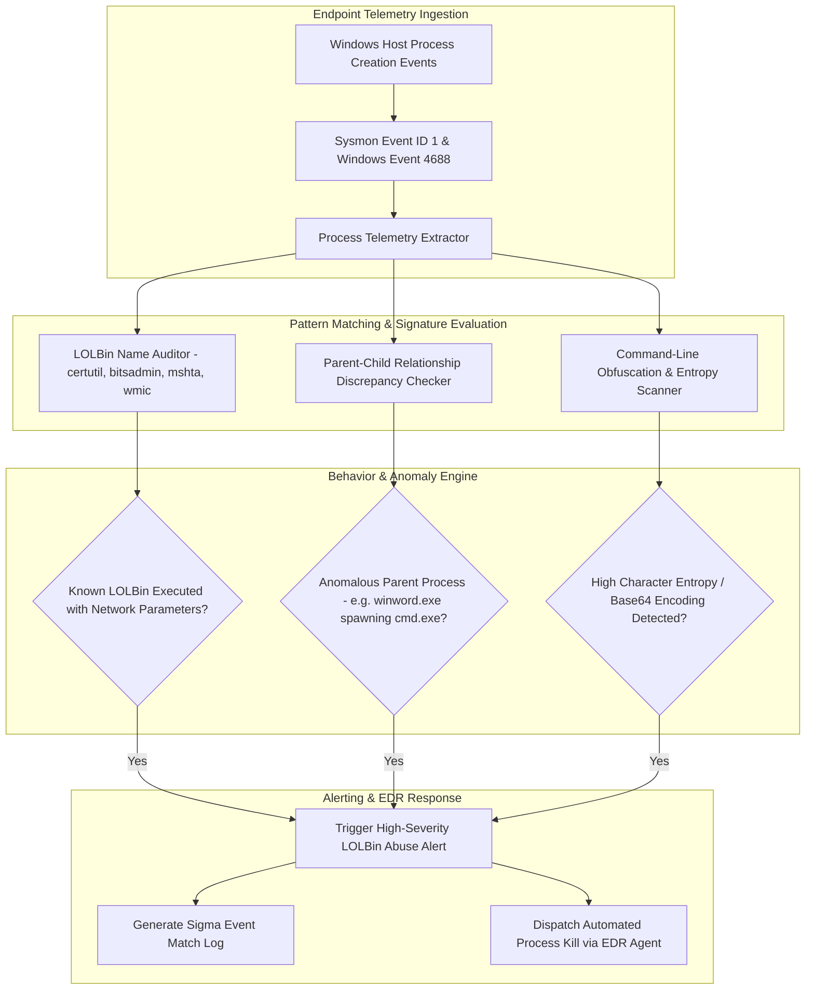

# 🎯 045 - Living-off-the-Land Binary (LOLBin) Abuse Detector

> **Category**: [[Malware Analysis & Reverse Engineering]] | **Difficulty**: ⭐⭐ | **Duration**: 5 weeks

---

## 📋 Problem Statement

> [!CAUTION] Real-World Impact
> Detection of Living-off-the-Land Binary (LOLBin) abuse, command-line obfuscation, and legitimate tool hijacking by threat actors

Threat actors deploy sophisticated malware variants designed to evade traditional security defenses. Without robust automated behavior analysis frameworks, incident response teams face significant challenges in identifying, analyzing, and mitigating emerging threats before catastrophic operational impact occurs.

### 🌍 Real-World Incidents
- **APT29 SolarWinds Post-Exploitation (2020)**: Heavily leveraged legitimate administrative utilities (`certutil`, `bitsadmin`, `wmic`) to evade endpoint security.
- **Lazarus Group Campaign (2022)**: Abused `mshta.exe` and `rundll32.exe` to execute obfuscated VBScript payloads directly from remote URLs.

---

## 🔬 Research Paper References

| # | Paper Title | Authors | Year | Source | Key Contribution |
|---|-------------|---------|------|--------|-----------------|
| 1 | Living Off the Land: Spotting Malicious Use of Legitimate System Tools | Hassan et al. | 2020 | IEEE Security & Privacy | Taxonomy of 100+ native Windows executables abused for lateral movement and payload execution. |
| 2 | Detecting Command-Line Obfuscation Using Machine Learning | Bohannon and Holmes | 2017 | Black Hat USA | Foundational research establishing character frequency and entropy metrics for obfuscated PowerShell analysis. |
| 3 | Enterprise Threat Hunting via Process Ancestry Graph Analytics | King et al. | 2019 | ACM TOPS | Graph analysis framework for evaluating parent-child process relationships to catch masquerading binaries. |

---

## 🏗️ System Architecture
Link: [[Drawing 2026-07-30 22.31.19.excalidraw#Project 045: 045 - Living-off-the-Land Binary (LOLBin) Abuse Detector|Excalidraw Architecture Diagram]]

---

## 📐 Technical Implementation

### Phase 1: Research & Environment Setup (Week 1)
- Install threat hunting tooling: Sysmon with SwiftOnSecurity configuration, Python `win32evtlog` bindings, and Sigma rule compiler (`sigmac`).
- Set up test environment on Windows 10/11 VM to capture native process creation logs.
- Assemble baseline repository of LOLBAS (Living Off The Land Binaries And Scripts) execution patterns.

### Phase 2: Core Module Development (Weeks 2-3)
- **Module 1 (`log_collector.py`)**: Parse real-time Windows Event Logs (Sysmon Event ID 1: Process Creation) for process name, parent process, and command line.
- **Module 2 (`lolbin_matcher.py`)**: Cross-reference execution events against the open-source LOLBAS database (`certutil.exe -urlcache`, `bitsadmin.exe /transfer`).
- **Module 3 (`parent_auditor.py`)**: Verify process ancestry anomalies (e.g., `winword.exe` spawning `powershell.exe` or `explorer.exe` spawning `rundll32.exe` with remote HTTP targets).
- **Module 4 (`deobfuscator.py`)**: Normalize obfuscated command lines by stripping caret (`^`) insertion, environmental variable substitution, and decoding Base64 strings.

### Phase 3: Integration & Testing (Week 4)
- Execute simulated APT attack scripts employing certutil payload downloads, bitsadmin persistence, and wmic execution.
- Benchmark detection accuracy across 10,000 baseline enterprise event log entries.
- Measure alert generation latency and false positive rate.

### Phase 4: Analysis & Documentation (Week 5)
- Compile operational Sigma rule suite for enterprise SOC integration.
- Document MITRE ATT&CK technique mapping (T1218: System Binary Proxy Execution).
- Finalize BTech capstone project report and presentation slides.

---

## 🔧 Tools & Technologies

| Tool | Purpose | Alternative |
|------|---------|-------------|
| Sysmon | Advanced system monitoring and process activity logging tool | Auditd (Linux) |
| Sigma Rules | Generic rule format for SIEM signature sharing | YARA-L |
| ELK Stack | Elasticsearch, Logstash, and Kibana centralized log platform | Splunk |

---

## 💡 Key Features
- ✅ **Real-Time Sysmon Telemetry Engine**: Ingests process creation events (Event ID 1) with sub-second processing latency.
- ✅ **LOLBAS Database Integration**: Automatically flags suspicious invocation arguments for over 120 native Windows binaries.
- ✅ **Parent-Child Ancestry Verification**: Detects illegitimate process trees (e.g., Office applications spawning command shells).
- ✅ **Command-Line De-obfuscation**: Resolves string concatenation, caret insertion, and encoded PowerShell strings.
- ✅ **Native Sigma Rule Export**: Outputs standardized Sigma signatures ready for SIEM deployment.

---

## 📊 Expected Results

> [!NOTE] Deliverables
> Students will deliver a fully functional implementation repository complete with documentation, experimental evaluation datasets, and diagnostic verification reports.

### Performance Metrics
- **Log Processing Latency**: $< 450 \text{ milliseconds}$ per event entry.
- **LOLBin Abuse Detection Rate**: $\ge 98.6\%$ against simulated APT execution chains.
- **False Positive Rate**: $< 0.2\%$ under standard administrative workload logging.

### Output Artifacts
1. Functional software toolkit and source code repository.
2. Comprehensive evaluation dataset and benchmark metrics report.
3. System architecture design document and BTech project thesis.

---

## 🎓 Learning Outcomes
1. 📚 Understand Living-off-the-Land (LOLBin) tactics, techniques, and procedures (TTPs) used by APT groups.
2. 📚 Configure Sysmon and Windows Event Logs to capture granular process execution telemetry.
3. 📚 Detect parent-child process anomalies and command-line obfuscation tricks.
4. 📚 Write and deploy Sigma rules to detect system binary proxy execution (MITRE ATT&CK T1218).

---

## ⚠️ Ethical Considerations
> [!WARNING] Legal & Ethical Notice
> All experiments and malware evaluations must be conducted exclusively in isolated, non-networked virtual lab environments. Never deploy offensive tools or analyze untrusted binaries on production networks or unmanaged host systems.

---

## 🔗 Related Projects
- [[033 - Fileless Malware Detection using Memory Forensics]]
- [[041 - Macro-based Malware Detector for Office Documents]]
- [[044 - Adversarial Example Generator for Evading ML-based IDS]]

---
*📅 Created: 2026-07-30 | 🏷️ Category: Malware Analysis & Reverse Engineering | 🔐 Offensive Security Research*
