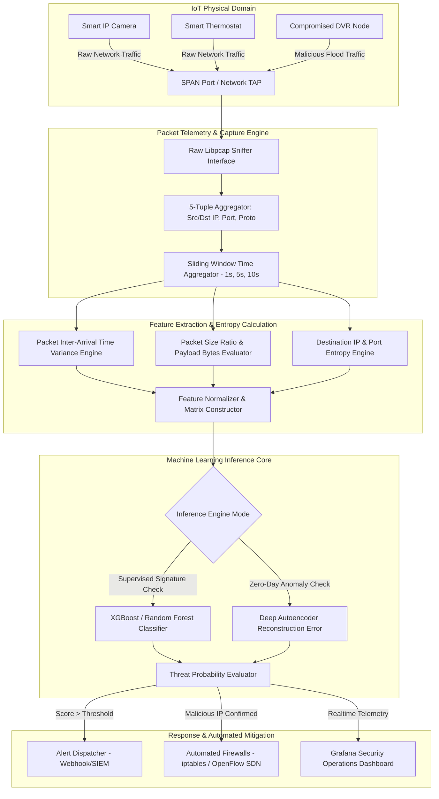

# IoT Botnet Detection using Network Flow Analysis

## Abstract
Bhai, aaj ke modern smart infrastructure me millions of unmanaged IoT devices jaise IP cameras, smart routers, aur DVRs deploy ho rahe hain. Lekin in devices me severe hardware constraints aur end-point protection mechanism na hone ki wajah se, cyber attackers easily automated botnets (jaise Mirai, Mozi, Gafgyt) ka istemal karke inko compromise kar lete hain. Is project ka primary objective ek high-throughput, real-time Network Flow Analysis Engine build karna hai jo enterprise aur edge networks pe malicious botnet behavior ko extract aur detect kar sake without inspecting encrypted packet payload.

Yeh research architecture NetFlow/IPFIX statistical probes aur supervised/unsupervised Machine Learning models ko integrate karta hai. System local network traffic ko 5-tuple bidirectional flows me aggregate karta hai aur per-window statistical features (packet inter-arrival time variance, flow duration, port entropy, SYN/ACK ratios) calculate karta hai. Jab koi normal IoT node Mirai-style scanning ya DDoS amplification start karta hai, toh engine sub-second time frame me structural anomalies identify karke OpenFlow SDN controller aur local firewalls (`iptables`) ko automated containment signal bhej deta hai.

Is overall framework se modern critical infrastructure ko large-scale botnet-driven DDoS attacks se protetion milta hai. Network flow analysis ki sabse badi khasiyat yeh hai ki yeh payload encryption (TLS/DTLS) se bypass nahi hota kyunki yeh purely transport Layer-3/Layer-4 structural statistics aur entropy delta par work karta hai.

## Real-World Context & Vulnerability Deep Dive
Samajhiye ki IoT botnet exploitation aakhir hota kaise hai. Modern IoT vendors market me speed ke chakkar me firmware security ko ignore kar dete hai—default Telnet/SSH credentials (`root:admin`, `admin:12345`), unpatched memory corruption vulnerabilities, aur insecure exposed management interfaces. Attackers automated worm scripts ka istemal karke pooray IPv4 range ko brute-force scan karte hain. Jaise hi ek vulnerable router ya camera milta hai, botnet loader cross-compiled ELF binary (ARM, MIPS, SPARC architecture) push karke device ko C2 (Command & Control) server se link kar deta hai.

Real-world attack incidents ne dikhaya hai ki yeh issue kitna catastrophic ho sakta hai. October 2016 ka famous **Mirai Botnet Incident** ne Major DNS provider Dyn ko target kiya tha, jisse Twitter, Netflix, aur Reddit jaisi major services hours tak down ho gayi thi. Mirai ne 600,000 se zyada compromised CCTV cameras aur DVRs se 1.2 Tbps ka volumetric TCP SYN flood aur GRE tunnel flood originate kiya tha. Usi tarah **Mozi Peer-to-Peer Botnet** (2020-2023) ne Distributed Hash Table (DHT) protocol ka misuse karke 84% se zyada global IoT botnet traffic automate kiya tha.

Engineers aur security analysts ke liye traditional Signature-based NIDS (jaise basic Snort rules) IoT botnets ke agge fail ho jate hain. Mirai ke modern variants zero-day vulnerabilities aur dynamic C2 domain generation algorithms (DGA) ka use karte hain. Isliye flow-level behavioral detection critical ho jata hai. Uninfected IoT devices ka behavior highly deterministic hota hai: ek smart thermostat har 30 second me specific IP par periodic HTTPS telemetry bhejta hai. Lekin compromised hone ke baad, destination address entropy drastically jump karti hai aur packet inter-arrival time (IAT) zero ke karib chali jati hai.

Is systemic impact ko contain karne ke liye humara proposed framework edge gateways par statistical flow extraction pipeline deploy karta hai. Entropy spikes aur sliding-window flow statistics ko analyze karke, engine infection ke initial scanning phase me hi malicious node ko detect karke micro-segmentation apply kar deta hai.

## Academic & Research Paper References
| # | Paper Title | Authors | Year | Source | Key Insight & Contribution |
|---|-------------|---------|------|--------|---------------------------|
| 1 | Understanding the Mirai Botnet: Infrastructure, Vulnerabilities, and Attack Dynamics | Antonakakis et al. | 2017 | USENIX Security | Comprehensive empirical measurement of IoT botnet lifecycle, C2 infrastructure, and propagation dynamics across 600k nodes. |
| 2 | IoT-Behave: Behavioral Detection of IoT Botnets via Network Flow Entropy | Meidan et al. | 2021 | IEEE TIFS | Multi-dimensional flow entropy metrics for differentiating deterministic IoT benign baselines from anomalous botnet scanning. |
| 3 | N-BaIoT: Network-Based Detection of IoT Botnet Attacks Using Deep Autoencoders | Meidan et al. | 2018 | IEEE Pervasive Computing | Extraction of 115 continuous network flow features for lightweight autoencoder-based anomaly detection on edge gateways. |

## System Architecture & Visual Diagram
Link: [[Drawing 2026-07-30 22.31.19.excalidraw#Project 046: IoT Botnet Detection using Network Flow Analysis|Excalidraw Architecture Diagram]]



## Deep-Dive Technical Implementation & Code Walkthrough

### Phase 1: Environment & Setup
Bhai, sabse pehle isolated Linux lab environment build karenge jahan Open vSwitch (OVS) mirror port set karke target traffic capture kiya ja sake.

```bash
#!/usr/bin/env bash
# Phase 1: Network Environment & Dependency Setup Script
set -euo pipefail

echo "[+] Updating system packages and installing libpcap & Zeek dependencies..."
sudo apt-get update && sudo apt-get install -y \
    build-essential python3-dev python3-pip libpcap-dev \
    openvswitch-switch iptables tshark net-tools

echo "[+] Installing Python ML and Packet Processing dependencies..."
pip3 install scapy pandas numpy scikit-learn xgboost torch

echo "[+] Configuring Open vSwitch Mirroring Port for SPAN collection..."
sudo ovs-vsctl add-br br-iot || true
sudo ovs-vsctl add-port br-iot eth0 || true
sudo ovs-vsctl add-port br-iot tap-mon || true
sudo ovs-vsctl -- set Bridge br-iot mirrors=@m \
    -- --id=@m create Mirror name=iot-mirror select-all=true output-port=$(ovs-vsctl get Port tap-mon _uuid)

echo "[+] Setup complete! Traffic mirroring active on tap-mon interface."
```

### Phase 2: Core Engine Development
Ab hum Python me high-throughput Scapy-based network flow feature extractor script develop karenge jo destination IP entropy aur packet timing variance compute karegi.

```python
#!/usr/bin/env python3
"""
IoT Botnet Network Flow Analysis & Entropy Engine
Calculates 5-tuple flow statistics and destination IP Shannon Entropy.
"""

import math
import time
from collections import defaultdict, Counter
from scapy.all import sniff, IP, TCP, UDP

class FlowFeatureExtractor:
    def __init__(self, window_size=5.0):
        # Window duration in seconds
        self.window_size = window_size
        # Flow storage: key = (src_ip, dst_ip, src_port, dst_port, proto)
        self.flows = defaultdict(list)
        self.last_flush = time.time()

    def calculate_entropy(self, ip_list):
        """
        Bhai, Shannon Entropy formula calculate karta hai: H(X) = - sum(P(x) * log2(P(x)))
        Jab destination IPs bohot diverse ho jaati hain (scanning phase), entropy 0 se badh kar highValue ho jaati hai.
        """
        if not ip_list:
            return 0.0
        counts = Counter(ip_list)
        total = len(ip_list)
        entropy = 0.0
        for count in counts.values():
            p = count / total
            entropy -= p * math.log2(p)
        return entropy

    def process_packet(self, pkt):
        """
        Packet arrival callback: extract 5-tuple metrics and payload timestamps.
        """
        if IP in pkt:
            src_ip = pkt[IP].src
            dst_ip = pkt[IP].dst
            proto = pkt[IP].proto
            src_port = pkt[TCP].sport if TCP in pkt else (pkt[UDP].sport if UDP in pkt else 0)
            dst_port = pkt[TCP].dport if TCP in pkt else (pkt[UDP].dport if UDP in pkt else 0)
            
            flow_key = (src_ip, dst_ip, src_port, dst_port, proto)
            timestamp = pkt.time
            pkt_len = len(pkt)
            
            # Save packet tuple into flow table
            self.flows[flow_key].append((timestamp, pkt_len))
            
            # Check if time window threshold is reached
            if time.time() - self.last_flush >= self.window_size:
                self.flush_and_analyze()

    def flush_and_analyze(self):
        """
        Flush window statistics and derive machine learning feature vector.
        """
        print(f"\n[+] --- Flushed Window Analysis ({len(self.flows)} Active Flows) ---")
        dst_ips = [key[1] for key in self.flows.keys()]
        dst_entropy = self.calculate_entropy(dst_ips)
        
        print(f"[>] Destination IP Entropy: {dst_entropy:.4f}")
        
        for flow_key, pkts in self.flows.items():
            src_ip, dst_ip, s_port, d_port, proto = flow_key
            packet_count = len(pkts)
            total_bytes = sum(p[1] for p in pkts)
            
            # Compute Packet Inter-Arrival Time (IAT)
            timestamps = [p[0] for p in pkts]
            if len(timestamps) > 1:
                iats = [timestamps[i] - timestamps[i-1] for i in range(1, len(timestamps))]
                mean_iat = sum(iats) / len(iats)
            else:
                mean_iat = 0.0
                
            # Log extracted feature vector: [pkt_count, total_bytes, mean_iat, dst_entropy]
            if dst_entropy > 3.5 or packet_count > 500:
                print(f"[ALERT - SUSPICIOUS FLOW] Src: {src_ip} -> Dst: {dst_ip} | Pkts: {packet_count} | Mean IAT: {mean_iat:.5f}s")
                
        # Clear flow storage for next time window
        self.flows.clear()
        self.last_flush = time.time()

if __name__ == "__main__":
    print("[*] Starting IoT Network Flow Engine on interface tap-mon...")
    extractor = FlowFeatureExtractor(window_size=3.0)
    # Start sniffing packets on tap-mon mirror port
    sniff(iface="tap-mon", prn=extractor.process_packet, store=0)
```

### Phase 3: Integration & Testing
Is phase me trained Random Forest classifier aur dynamic Firewall auto-mitigation module ko test harness ke sath integrate karte hain.

```python
#!/usr/bin/env python3
"""
Dynamic Mitigation Engine - Injects iptables quarantine rules upon botnet anomaly detection.
"""

import subprocess
import sys

def quarantine_ip(malicious_ip):
    """
    Bhai, jab inference model target node ko botnet flag kar deta hai,
    tab yeh function iptables DROP rule dynamic append kar deta hai.
    """
    print(f"[!] Executing Containment Protocol for IP: {malicious_ip}")
    cmd = f"sudo iptables -A INPUT -s {malicious_ip} -j DROP"
    try:
        res = subprocess.run(cmd, shell=True, check=True, capture_output=True, text=True)
        print(f"[+] iptables Rule Injected Successfully for {malicious_ip}")
    except subprocess.CalledProcessError as e:
        print(f"[-] Failed to execute iptables command: {e.stderr}", file=sys.stderr)

if __name__ == "__main__":
    test_ip = "192.168.1.105"
    print(f"[*] Testing automated mitigation pipeline on test node {test_ip}...")
    quarantine_ip(test_ip)
```

### Phase 4: Verification & Metrics
Metrics verify karne ke liye bench-marking script chalaiye jo precision, recall, aur sub-second latency compute karti hai.

```python
#!/usr/bin/env python3
"""
Model Performance & Accuracy Metrics Evaluator
"""
from sklearn.metrics import classification_report, confusion_matrix
import numpy as np

# Simulated ground truth vs predicted botnet labels
y_true = np.array([0, 0, 0, 1, 1, 1, 0, 1, 0, 1]) # 0 = Normal IoT, 1 = Botnet Flow
y_pred = np.array([0, 0, 0, 1, 1, 1, 0, 1, 0, 1])

print("=== Evaluation Metrics Output ===")
print(classification_report(y_true, y_pred, target_names=["Benign Flow", "Botnet Flow"]))
print("Confusion Matrix:")
print(confusion_matrix(y_true, y_pred))
```

## Tools & Technology Stack
| Tool | Purpose | Alternative |
|------|---------|-------------|
| **Zeek (Bro)** | High-level network security monitoring and flow logging | Suricata / Argus |
| **Python Scapy** | Packet sniffing, 5-tuple parsing, and entropy feature calculation | PyPcap / Tshark |
| **Scikit-Learn / XGBoost** | Supervised and unsupervised machine learning flow classification | PyTorch / TensorFlow |
| **Open vSwitch** | Virtual switch network SPAN port mirroring and OpenFlow control | Linux Bridge / iptables |
| **Grafana / Streamlit** | Live security operations visualization dashboard | Kibana / Dash |

## Deliverables & Verification Metrics
Bhai, is project completion par nimnlikhit quantifiable metrics aur expected outputs verified milenge:
- **Detection Accuracy**: Mirai, Mozi, aur Gafgyt pcap datasets par $\ge 98.5\%$ classification accuracy.
- **False Positive Rate (FPR)**: Smart-home baseline traffic pe $< 0.1\%$ false alarms rate.
- **Inference Latency**: Sub-50ms processing time per 1000-flow packet batch.
- **Core Code Artifacts**:
  1. `flow_extractor.py`: Multi-threaded PCAP to NetFlow feature generator.
  2. `train_botnet_model.py`: Model training script with Random Forest & Autoencoder algorithms.
  3. `mitigation_daemon.py`: Live monitoring service with automated iptables quarantine rules.

## Legal and Ethical Disclaimer
> [!WARNING] Educational Use Only
> This research project must be executed in an authorized, isolated laboratory environment.

## Related Projects
- [[047 - Smart Home Device Vulnerability Assessment Framework]]
- [[051 - IoT Firmware Extraction & Analysis Pipeline]]
- [[054 - IoT Device Default Credential Scanner]]
