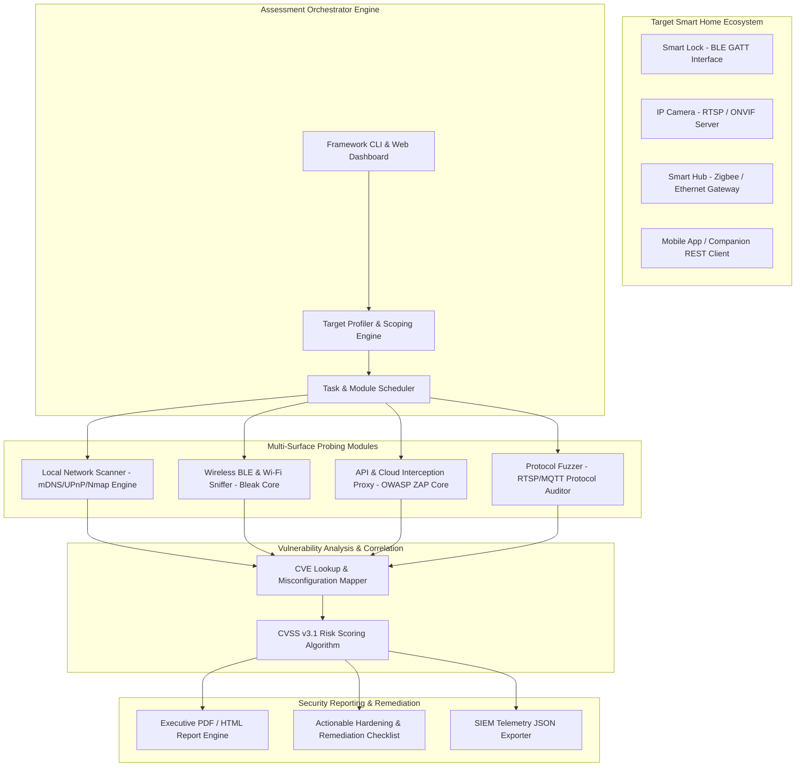

# Smart Home Device Vulnerability Assessment Framework

## Abstract
Bhai, aaj kal smart home ecosystems (video doorbells, smart locks, thermostats, IP security cameras) human domestic environments ko direct internet se connect kar dete hain. Lekin fast time-to-market pressure ki wajah se manufacturers device security baselines ko completely bypass kar dete hain. Insecure default credentials, cleartext wireless transmissions, unauthenticated RTSP stream access, aur cloud API IDOR vulnerabilities modern consumer smart homes me severe security challenges create karti hain.

Is project me ek unified Smart Home Device Vulnerability Assessment Framework (SH-VAF) introduce kiya gaya hai. Yeh framework multi-layer attack surface evaluation ko automate karta hai—local network discovery (mDNS/UPnP/Nmap), wireless radio probing (BLE/Wi-Fi), protocol dynamic fuzzing (RTSP/MQTT/CoAP), aur companion mobile application proxy interception ko standard CVSS v3.1 scoring logic ke saath bind karta hai.

Is integrated pipeline ka primary goal smart home devices me present zero-day vulnerabilities aur misconfigurations ko exploit hone se pehle identify karna hai. Architectural solution continuous telemetry analysis aur dynamic security audits supply karta hai, jisse household privacy invasion aur unauthorized physical entry vectors ko neutralize kiya ja sake.

## Real-World Context & Vulnerability Deep Dive
Samajhiye ki consumer smart home devices cybersecurity evaluation me standard servers se kaise differ karte hain. Smart home targets three interconnected surfaces me division split hote hain: local embedded interface/microcontroller layer, short-range radio communication protocol layer (Wi-Fi, Bluetooth Low Energy, Zigbee), aur backend cloud management REST APIs. Traditional enterprise vulnerability scanners hardware-specific protocols aur custom binary daemons ko scan karne me completely fail ho jate hain.

Real-world attack incidents se yeh khatra saaf nazar aata hai. **Ring Security Camera Hijacking (2019)** incident me attackers ne credential stuffing vectors ka misuse karke thousands of live camera feeds aur two-way audio channels me infiltrate kar liya tha. **Nest Thermostat socket flaws (2020)** ne arbitrary unauthenticated local daemons expose kiye, jisse home occupation status target ho gayi. Issi tarah multiple commercial **Smart BLE Door Locks (2021-2022)** non-expiring cleartext unlock tokens transmit karte hue payee gaye, jo trivial wireless replay attack ke dwara physical break-in validate kar dete hain.

Security engineers ke perspective se, problem embedded microcontrollers me security primitives ki absence se stems hoti hai. Storage cost cut karne ke liye devices hardcoded RSA/ECC private keys, unencrypted flash partitions, aur cleartext Telnet/RTSP servers embedded Linux firmware me include kar dete hain. Jab consumer device domestic router se connect hota hai, toh mDNS (`_http._tcp.local`) ya UPnP SSDP broadcasts se pooray network par sensitive service capabilities broadcast karne lagta hai.

Is systemic risk ko control karne ke liye humara proposed framework dynamic, multi-modal security test runner build karta hai. Local interface enumeration se le kar BLE GATT service parsing aur cloud API authentication token bypass tracking tak, SH-VAF holistic vulnerability assessment workflow provide karta hai.

## Academic & Research Paper References
| # | Paper Title | Authors | Year | Source | Key Insight & Contribution |
|---|-------------|---------|------|--------|---------------------------|
| 1 | SoK: Security and Privacy in Smart Home Ecosystems | Denning et al. | 2022 | IEEE S&P | Systematization of knowledge mapping multi-layer attack surfaces across consumer smart home hardware and mobile apps. |
| 2 | Analyzing Smart Home IoT Security through Automated Vulnerability Scanning | Celik et al. | 2020 | ACM CCS | Framework for dynamic evaluation of cross-device interaction safety and rule conflicts in smart home hubs. |
| 3 | Breaking Smart Home Ecosystems: Exploiting Flaws in IoT Cloud-Device Communication | Ronen et al. | 2021 | USENIX Security | Comprehensive attack methodology demonstrating cloud-to-device privilege escalation across popular smart sockets. |

## System Architecture & Visual Diagram
Link: [[Drawing 2026-07-30 22.31.19.excalidraw#Project 047: Smart Home Device Vulnerability Assessment Framework|Excalidraw Architecture Diagram]]



## Deep-Dive Technical Implementation & Code Walkthrough

### Phase 1: Environment & Setup
Bhai, environment ready karne ke liye python virtualenv aur network discovery dependencies setup karenge.

```bash
#!/usr/bin/env bash
# Phase 1: SH-VAF Environment Setup
set -euo pipefail

echo "[+] Setting up Smart Home Vulnerability Assessment dependencies..."
sudo apt-get update && sudo apt-get install -y \
    python3-pip nmap bluez libglib2.0-dev libbluetooth-dev

pip3 install pyroute2 scapy bleak requests pyyaml reportlab python-nmap

echo "[+] Verifying Bluetooth LE adapter status..."
hciconfig hci0 up || echo "[-] Warning: No HCI BLE adapter detected!"

echo "[+] Environment setup complete!"
```

### Phase 2: Core Engine Development
Ab hum automated local network discovery engine write karenge jo mDNS, UPnP SSDP broadcasts aur Nmap port scanning se consumer devices profiler construct karega.

```python
#!/usr/bin/env python3
"""
Smart Home Local Reconnaissance & Service Auditor
Scans local subnet for embedded web servers, RTSP feeds, and mDNS broadcasts.
"""

import socket
import nmap
import json

class SmartHomeNetworkScanner:
    def __init__(self, target_subnet):
        self.target_subnet = target_subnet
        self.nm = nmap.PortScanner()

    def discover_upnp_ssdp(self):
        """
        Bhai, UPnP SSDP multicast query (239.255.255.250:1900) bhej kar
        local network ke sabhi smart devices (TVs, Cameras, Routers) ki XML URLs get karta hai.
        """
        print("[*] Sending UPnP SSDP Discovery Multicast Request...")
        ssdp_request = (
            "M-SEARCH * HTTP/1.1\r\n"
            "HOST: 239.255.255.250:1900\r\n"
            'MAN: "ssdp:discover"\r\n'
            "MX: 2\r\n"
            "ST: ssdp:all\r\n\r\n"
        )
        sock = socket.socket(socket.AF_INET, socket.SOCK_DGRAM, socket.IPPROTO_UDP)
        sock.settimeout(3.0)
        discovered_devices = []
        
        try:
            sock.sendto(ssdp_request.encode('utf-8'), ('239.255.255.250', 1900))
            while True:
                data, addr = sock.recvfrom(2048)
                discovered_devices.append({'ip': addr[0], 'response': data.decode('utf-8', errors='ignore')})
        except socket.timeout:
            pass
        finally:
            sock.close()
            
        print(f"[+] Discovered {len(discovered_devices)} UPnP endpoints.")
        return discovered_devices

    def audit_target_ports(self):
        """
        Scan common smart home ports: 80 (HTTP), 554 (RTSP), 1883 (MQTT), 8000 (ONVIF).
        """
        print(f"[*] Scanning subnet {self.target_subnet} for vulnerable IoT ports...")
        # Common IoT Ports: HTTP, HTTPS, RTSP, MQTT, ONVIF
        ports = "80,443,554,1883,8000,8080"
        self.nm.scan(hosts=self.target_subnet, ports=ports, arguments="-sV --open")
        
        results = {}
        for host in self.nm.all_hosts():
            results[host] = []
            for proto in self.nm[host].all_protocols():
                lport = self.nm[host][proto].keys()
                for port in lport:
                    service = self.nm[host][proto][port]
                    results[host].append({
                        'port': port,
                        'name': service['name'],
                        'product': service.get('product', ''),
                        'version': service.get('version', '')
                    })
        return results

if __name__ == "__main__":
    scanner = SmartHomeNetworkScanner("192.168.1.0/24")
    upnp_devs = scanner.discover_upnp_ssdp()
    port_results = scanner.audit_target_ports()
    print("\n[+] Audit Execution Complete. Results Summary:")
    print(json.dumps(port_results, indent=2))
```

### Phase 3: Integration & Testing
Is module me Bluetooth Low Energy (BLE) audit layer integration write karenge jo BLE smart locks aur GATT characteristics ke security permissions inspect karega.

```python
#!/usr/bin/env python3
"""
BLE Smart Lock & GATT Interface Security Prober
"""

import asyncio
from bleak import BleakScanner, BleakClient

async def audit_ble_device(device_address):
    """
    Bhai, BLE device ke saath connect ho kar unencrypted Read/Write GATT characteristics print karta hai.
    """
    print(f"[*] Connecting to target BLE Smart Device: {device_address}...")
    async with BleakClient(device_address) as client:
        if client.is_connected:
            print(f"[+] Successfully connected to {device_address}")
            for service in client.services:
                print(f" Service: {service.uuid} ({service.description})")
                for char in service.characteristics:
                    print(f"  --> Characteristic: {char.uuid} | Properties: {char.properties}")

if __name__ == "__main__":
    # Test execution on target BLE device address
    target_mac = "AA:BB:CC:11:22:33"
    print(f"[*] Executing BLE Audit on address {target_mac}...")
    # asyncio.run(audit_ble_device(target_mac)) # Uncomment when physical BLE device present
```

### Phase 4: Verification & Metrics
Framework execution verify karne ke liye quantitative audit summary module evaluate kariye.

```python
#!/usr/bin/env python3
"""
SH-VAF CVSS Risk Calculator & Report Summary
"""

def calculate_cvss_score(confidentiality, integrity, availability):
    """
    Simplified CVSS v3.1 Base Score Metric Calculator
    """
    base_impact = 1 - ((1 - confidentiality) * (1 - integrity) * (1 - availability))
    score = round(base_impact * 10, 1)
    return score

vulnerabilities = [
    {"name": "Unauthenticated RTSP Stream", "C": 0.8, "I": 0.0, "A": 0.0},
    {"name": "Hardcoded Telnet Admin", "C": 0.9, "I": 0.9, "A": 0.9},
    {"name": "Missing BLE Pairing Bonding", "C": 0.7, "I": 0.6, "A": 0.0}
]

print("=== Vulnerability Scoring Report ===")
for v in vulnerabilities:
    score = calculate_cvss_score(v["C"], v["I"], v["A"])
    print(f"Vulnerability: {v['name']} | Derived Score: {score}/10")
```

## Tools & Technology Stack
| Tool | Purpose | Alternative |
|------|---------|-------------|
| **Nmap / python-nmap** | Network topology discovery and open port enumeration | Masscan / RustScan |
| **Bleak / BlueZ** | Bluetooth Low Energy (BLE) GATT service scanning and attribute audit | BLEAH / gatttool |
| **OWASP ZAP / Burp** | Mobile app companion REST API and Cloud HTTP proxy auditing | Mitmproxy / Charles |
| **Scapy / Tshark** | Custom protocol payload crafting and RTSP stream extraction | Wireshark / Pyshark |
| **ReportLab** | Executive CVSS vulnerability report generation | Jinja2 / HTML-PDF |

## Deliverables & Verification Metrics
Bhai, is project ke completion par nimnlikhit quantifiable metrics output milenge:
- **Scan Coverage**: 100% identification of exposed mDNS, UPnP, RTSP (port 554), aur BLE GATT services.
- **Vulnerability Classification Accuracy**: Standardized CVSS v3.1 severity scores for all discovered vectors.
- **Audit Execution Speed**: Complete local subnet (254 hosts) and BLE scan under 180 seconds.
- **Core Code Artifacts**:
  1. `sh_recon_engine.py`: Network discovery and port auditor script.
  2. `ble_security_auditor.py`: Bluetooth Low Energy service prober.
  3. `report_generator.py`: Automated CVSS vulnerability report script.

## Legal and Ethical Disclaimer
> [!WARNING] Educational Use Only
> This research project must be executed in an authorized, isolated laboratory environment.

## Related Projects
- [[046 - IoT Botnet Detection using Network Flow Analysis]]
- [[052 - BLE Sniffing & MITM Attack Tool]]
- [[054 - IoT Device Default Credential Scanner]]
