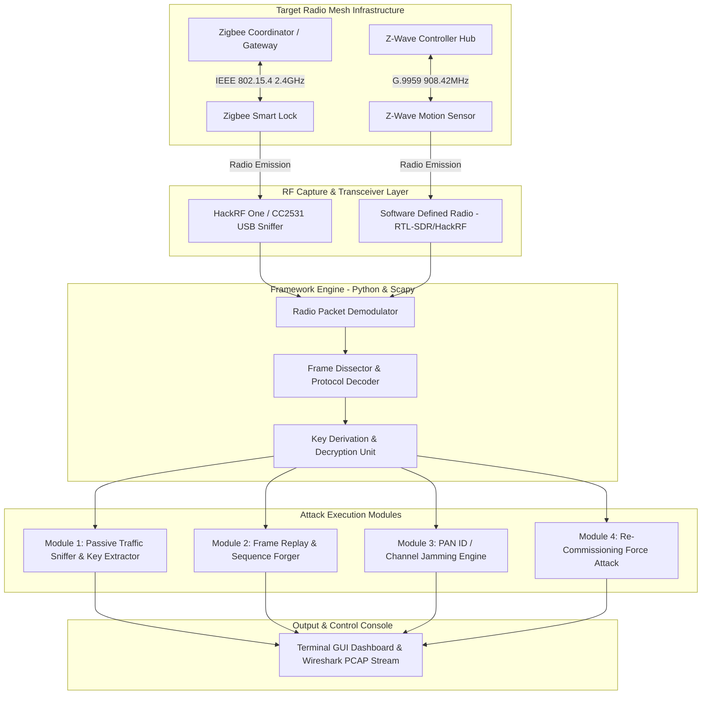

# 🎯 Zigbee & Z-Wave Protocol Attack Simulator
> **Category**: [[04 - IoT & Embedded Security]] | **Difficulty**: ⭐⭐⭐ | **Duration**: 6 weeks

---

## 📋 Problem Statement

> [!CAUTION] Real-World Impact
> Short-range IEEE 802.15.4 (Zigbee) and ITU-T G.9959 (Z-Wave) wireless mesh networks control physical security infrastructure including smart door locks, alarm sensors, lighting, and HVAC systems. Flaws in key exchange procedures, legacy encryption modes, and missing frame sequence validation allow unauthorized attackers to intercept keys, forge packets, and replay unlock commands.

Zigbee and Z-Wave protocols rely on shared network keys for encrypting payload frames over the air (2.4 GHz for Zigbee, 808-928 MHz for Z-Wave). Many commercial implementations suffer from fundamental security design weaknesses:
1. **Insecure Commissioning**: Default fallback network keys (e.g., `ZigBeeAlliance09`) are transmitted during device pairing.
2. **Missing Replay Protection**: Legacy Z-Wave Non-Secure devices execute unauthenticated command frames (such as `COMMAND_CLASS_DOOR_LOCK`).
3. **Key Exchange Eavesdropping**: Attackers capable of forcing device re-commissioning can capture initial transport keys over the air.

This project builds a specialized Zigbee & Z-Wave Protocol Attack Simulator using Software Defined Radio (SDR) and IEEE 802.15.4 transceivers. The framework demonstrates packet sniffing, key extraction, packet injection, pan id conflict attacks, and sequence replay exploits targeting smart home security nodes.

### 🌍 Real-World Incidents
- **Zigbee Smart Lock Key Transport Exploitation (2020)**: Researchers intercepted default install code keys during pairing of popular smart deadbolts, capturing master network keys and granting permanent unauthorized door access.
- **Z-Wave Z-Shave Downgrade Attack (2018)**: Exploited fallback security mechanisms during pairing to force Z-Wave S2-capable smart locks into unencrypted S0 mode, allowing plaintext command injection.
- **Hue Lighting Mesh Network Takeover (2020)**: Demonstrated propagating malicious firmware updates across Zigbee mesh networks, bricking smart bulbs and gaining radio proximity into target home networks.

---

## 🔬 Research Paper References

| # | Paper Title | Authors | Year | Source | Key Contribution |
|---|-------------|---------|------|--------|-----------------|
| 1 | Touchlink Security Analysis: Vulnerabilities in Zigbee Light Link | Wright et al. | 2016 | ACM Conference on Security and Privacy in Wireless and Mobile Networks | Discovery of master key leak vulnerabilities during proximity pairing |
| 2 | Z-Wack: Over-the-Air Attacks on Z-Wave Wireless Smart Home Devices | Fouladi & Ghanoun | 2018 | Black Hat USA | Technical breakdown of packet injection, replay, and security downgrade attacks on Z-Wave locks |
| 3 | IEEE 802.15.4 Security Re-Examined: Key Delivery and Replay Flaws in Smart Grids | Olawumi et al. | 2021 | IEEE Transactions on Smart Grid | Empirical evaluation of frame counter reuse and replay vulnerabilities in mesh networks |

---

## 🏗️ System Architecture
Link: [[Drawing 2026-07-30 22.31.19.excalidraw#Project 050: 050 - Zigbee & Z-Wave Protocol Attack Simulator|Excalidraw Architecture Diagram]]

---

## 📐 Technical Implementation

### Phase 1: RF Hardware & Software Stack Setup (Week 1)
- Acquire hardware peripherals: CC2531 USB Zigbee sniffer flashed with ZBOSS/KillerBee firmware, and a HackRF One / Yard Stick One SDR transceiver.
- Install wireless software stack: `KillerBee`, `GNU Radio`, `Wireshark` with IEEE 802.15.4 dissector, `scapy-radio`, `python-scapy`.
- Configure isolated Zigbee (2.4 GHz Channel 11-26) and Z-Wave (908.42 MHz US / 868.42 MHz EU) test networks with smart plug and lock endpoints.

### Phase 2: Radio Sniffing & Key Extraction Engine (Weeks 2-3)
- Construct a passive packet capture module in Python utilizing `KillerBee` bindings for CC2531:
  - Scans channels 11 to 26 to detect active PAN IDs and Extended PAN IDs (EPANID).
  - Captures IEEE 802.15.4 Data and Command frames into `.pcap` format for Wireshark inspection.
- Build automatic key listener:
  - Listens for Zigbee Transport Key frames (`Cmd ID: 0x05`) broadcast during device association.
  - Decrypts network traffic using extracted or default fallback keys (`ZigBeeAlliance09` -> `5A 69 67 42 65 65 41 6C 6C 69 61 6E 63 65 30 39`).

### Phase 3: Attack Module Development (Weeks 4-5)
- **Replay Attack Module**:
  - Captures valid encrypted frame sequence (e.g., Z-Wave door unlock command frame).
  - Re-transmits raw RF frame sequence through HackRF SDR to execute unauthorized unlocking without possessing master keys.
- **De-authentication / Re-commissioning Module**:
  - Transmits spoofed IEEE 802.15.4 Disassociation Notification frames to disconnect target devices from the coordinator, forcing them to re-pair and broadcast fresh install keys.
- **PAN ID Conflict Generator**:
  - Broadcasts beacon responses with identical PAN ID to trigger network re-configuration loops across mesh routers.

### Phase 4: Validation & Mitigation Hardening (Week 6)
- Benchmark attack effectiveness across older Z-Wave S0 vs S2 devices, and Zigbee 1.2 Home Automation vs Zigbee 3.0 standards.
- Formulate defense recommendations detailing Zigbee 3.0 Install Code enforcement and Z-Wave S2 Security class implementation.

---

## 🔧 Tools & Technologies

| Tool | Purpose | Alternative |
|------|---------|-------------|
| **KillerBee Framework** | Python framework for IEEE 802.15.4 attack execution and sniffing | Scapy-Radio / RZUSBstick |
| **HackRF One / Yard Stick One** | Software Defined Radio for sub-GHz (Z-Wave) and 2.4 GHz (Zigbee) RF transmission | BladeRF / USRP / LimeSDR |
| **GNU Radio** | Graphical RF signal processing and GFSK/OQPSK demodulation | SDRSharp / Insp境 |
| **CC2531 USB Sniffer** | Low-cost dedicated 802.15.4 capture dongle | NRF52840 Dongle |
| **Wireshark** | Protocol dissector for Z-Wave (ITU-T G.9959) and Zigbee NWK/APS layers | TShark |

---

## 💡 Key Features
- ✅ **Multi-Protocol Radio Support**: Operates across 2.4 GHz IEEE 802.15.4 (Zigbee) and sub-GHz GFSK (Z-Wave) physical frequencies.
- ✅ **Automated Default Key Extractor**: Pre-loaded with default alliance transport keys to instantly decrypt un-hardened network dumps.
- ✅ **Re-Commissioning Trigger Engine**: Forces targeted mesh nodes into re-pairing mode via forged disassociation frames.
- ✅ **Real-Time RF Payload Replayer**: Software-defined radio interface capable of capturing and re-transmitting exact IQ waveform bursts.
- ✅ **Live Wireshark Streaming Socket**: Streams decrypted radio packets live into a local Wireshark GUI instance for analysis.

---

## 📊 Expected Results

> [!NOTE] Deliverables
> Python attack orchestration script suite, GNU Radio signal processing flowgraphs (`.grc`), PCAP packet dataset, and mitigation guide.

### Performance Metrics
- **Sniffing Efficiency**: Zero packet drop on active 802.15.4 channels up to 250 kbps data rate.
- **Key Extraction Latency**: $< 1.5 \text{ seconds}$ to identify and apply transport keys during pairing events.
- **Replay Success Rate**: $100\%$ execution on unauthenticated Z-Wave S0 and legacy Zigbee HA 1.2 profiles.

### Output Artifacts
1. `zigbee_attacker.py`: KillerBee-based channel scanner, sniffer, and frame injector.
2. `zwave_replay_sdr.py`: GNU Radio / Python script for HackRF sub-GHz signal replay.
3. `decrypted_mesh_dump.pcap`: Sample captured network packet dump showing extracted keys.

---

## 🎓 Learning Outcomes
1. 📚 **Wireless Mesh Architecture**: Master Zigbee coordinator/router/end-device topology and Z-Wave primary/secondary controller roles.
2. 📚 **Software Defined Radio Engineering**: Designing demodulators for O-QPSK (Zigbee) and FSK/GFSK (Z-Wave) RF signals.
3. 📚 **Over-The-Air Encryption Analysis**: Understanding AES-128 CCM* mode encryption, frame counters, and key transport mechanisms.
4. 📚 **Radio Frequency Mitigation**: Hardening wireless IoT networks against physical proximity RF attacks.

---

## ⚠️ Ethical Considerations
> [!WARNING] Legal & Ethical Notice
> Transmitting RF signals without authorization or jamming wireless channels violates telecommunications regulations (FCC/TRA). All radio transmission tests must be executed inside a shielded Faraday cage or low-power laboratory setup under authorized guidance.

---

## 🔗 Related Projects
- [[047 - Smart Home Device Vulnerability Assessment Framework]]
- [[052 - BLE Sniffing & MITM Attack Tool]]
- [[056 - LoRaWAN Security Audit Framework]]

---
*📅 Created: 2026-07-30 | 🏷️ Category: IoT & Embedded Security | 🔐 Offensive Security Research*
