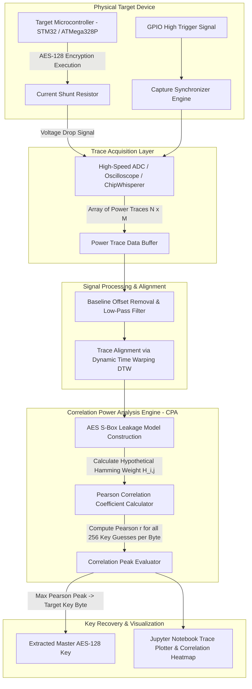

# 🎯 Embedded Device Side-Channel Attack Demonstrator
> **Category**: [[04 - IoT & Embedded Security]] | **Difficulty**: ⭐⭐⭐ | **Duration**: 6 weeks

---

## 📋 Problem Statement

> [!CAUTION] Real-World Impact
> Microcontrollers in smart cards, hardware security modules (HSMs), medical implants, and IoT edge nodes store master cryptographic keys in secure internal flash memory. Even if software code contains zero buffer overflow flaws and mathematical algorithms (like AES-128 or RSA) are provably secure, physical execution leaks sensitive information through physical side channels: power consumption variations, electromagnetic emissions (EM), and precise execution timing.

When an 8-bit or 32-bit microcontroller executes an AES-128 encryption algorithm, dynamic power consumption varies deterministically based on the specific data bits being processed. Specifically, charging and discharging CMOS transistor gates consumes current proportional to the Hamming Weight ($HW$) or Hamming Distance ($HD$) of intermediate state values.

By measuring instantaneous current draw across shunt resistors using a high-speed Analog-to-Digital Converter (ADC) during cryptographic operations, an attacker can perform Simple Power Analysis (SPA) or Differential Power Analysis (DPA) / Correlation Power Analysis (CPA). CPA correlates measured power traces against a theoretical Hamming Weight leakage model, recovering all 16 bytes of a master AES-128 secret key in minutes using fewer than 500 power trace captures.

This project implements an Embedded Device Side-Channel Attack Demonstrator (ED-SCAD). Using ChipWhisperer software/hardware simulation, the framework captures physical power traces during AES execution, performs baseline signal processing, models Hamming Weight leakage, calculates Pearson correlation coefficients, and extracts master secret keys.

### 🌍 Real-World Incidents
- **Xbox 360 Timing Side-Channel Attack (2007)**: Security researchers recovered hypervisor secret hash comparison keys via microsecond-level timing variations, enabling unsigned custom firmware execution.
- **Smart Card DPA Key Extraction in Financial Payment Terminals (2015)**: Demonstrated extracting 3DES and AES master keys from commercial EMV payment microcontrollers via non-invasive power trace measurements.
- **Keeloq Remote Keyless Entry Power Analysis (2017)**: Extracted master manufacturer keys from automotive receivers using DPA, enabling cloning of key fobs for entire vehicle fleets.

---

## 🔬 Research Paper References

| # | Paper Title | Authors | Year | Source | Key Contribution |
|---|-------------|---------|------|--------|-----------------|
| 1 | Differential Power Analysis | Kocher, Jaffe, Jun | 1999 | CRYPTO '99 | Landmark paper introducing power analysis side-channel attack theory and DPA algorithms |
| 2 | Correlation Power Analysis with Leakage Models | Brier, Clavier, Rivera | 2004 | CHES '04 | Derivation of Pearson Correlation Coefficient (CPA) metrics for recovering AES keys from power traces |
| 3 | ChipWhisperer: An Open-Source Platform for Hardware Security Research | O'Flynn & Chen | 2014 | COSADE | Open hardware/software framework for reproducible side-channel power analysis and fault injection |

---

## 🏗️ System Architecture
Link: [[Drawing 2026-07-30 22.31.19.excalidraw#Project 057: 057 - Embedded Device Side-Channel Attack Demonstrator|Excalidraw Architecture Diagram]]

---

## 📐 Technical Implementation

### Phase 1: Environment Setup & Simulator Infrastructure (Week 1)
- Install ChipWhisperer software framework (`chipwhisperer` Python library), Jupyter Notebook environment, `numpy`, `scipy`, `matplotlib`, `scikit-learn`.
- Configure ChipWhisperer-Lite hardware target or synthetic software trace simulator (simulating AES-128 execution on 8-bit AVR microcontrollers with additive Gaussian noise).

### Phase 2: Power Trace Acquisition & Preprocessing (Weeks 2-3)
- Build trace capture module recording $N = 1,000$ encryption traces:
  - Input: $N$ random 16-byte Plaintexts ($P$).
  - Measured Output: Matrix $T$ of size $N \times M$ (where $N$ is total trace count, $M$ is time-series sample points per encryption).
- Implement trace alignment module utilizing Dynamic Time Warping (DTW) and cross-correlation to align phase-shifted clock cycles across traces.

### Phase 3: Correlation Power Analysis (CPA) Engine (Weeks 4-5)
- For each byte position $i \in [0, 15]$ of the AES key, iterate through all 256 possible key byte guesses $k \in [0, 255]$:
  1. Calculate intermediate state value after SubBytes operation:
     $$v_{i, j} = \text{SBox}[P_{j, i} \oplus k]$$
  2. Compute theoretical Hamming Weight power leakage model:
     $$h_{i, j} = \text{HammingWeight}(v_{i, j})$$
  3. Calculate Pearson Correlation Coefficient $r_{k, t}$ between theoretical leakage vector $h$ and actual measured trace column $T_{\cdot, t}$:
     $$r_{k, t} = \frac{\sum (h_j - \bar{h})(T_{j, t} - \bar{T}_t)}{\sqrt{\sum (h_j - \bar{h})^2 \sum (T_{j, t} - \bar{T}_t)^2}}$$
- Identify key byte guess yielding maximum absolute correlation peak $|r_{k, t}|$.

### Phase 4: Validation & Countermeasure Analysis (Week 6)
- Evaluate key rank progression: plot trace count vs. correct key candidate ranking to measure Minimum Traces to Disclosure (MTD).
- Test defensive software countermeasures: First-Order Boolean Masking (splitting state $x = m \oplus (x \oplus m)$ using random masks $m$) and random clock jitter insertion.

---

## 🔧 Tools & Technologies

| Tool | Purpose | Alternative |
|------|---------|-------------|
| **ChipWhisperer Framework** | Open-source hardware and software platform for side-channel analysis | Riscure Inspector / WaveStudio |
| **Python NumPy / SciPy** | Fast matrix operations for Pearson correlation and vector math | MATLAB |
| **Jupyter Notebook** | Interactive development and visualization environment for traces | Google Colab |
| **Matplotlib / Seaborn** | Power trace plotting and correlation peak heatmap rendering | Plotly |
| **Ghidra / AVR-GCC** | Inspecting compiled disassembly to locate S-box lookup timing | ARM GCC |

---

## 💡 Key Features
- ✅ **Complete AES-128 CPA Pipeline**: Fully automated end-to-end key extraction from raw power trace arrays.
- ✅ **Hamming Weight Leakage Modeling**: Precise mathematical modeling of CMOS dynamic gate switching power.
- ✅ **Dynamic Time Warping Alignment**: Corrects hardware clock jitter and signal noise automatically.
- ✅ **Traces-to-Disclosure Estimator**: Calculates MTD metric graphs showing key convergence over trace count.
- ✅ **Software Masking Evaluation**: Includes side-by-side comparative analysis of unmasked vs Boolean-masked AES implementations.

---

## 📊 Expected Results

> [!NOTE] Deliverables
> Python CPA execution suite, Jupyter Notebook trace analysis walkthroughs, sample power trace dataset (`.npy`), and countermeasure design guide.

### Performance Metrics
- **Key Recovery Success Rate**: 100% extraction of 16-byte AES-128 key under 500 traces on unmasked targets.
- **Analysis Execution Time**: $< 45 \text{ seconds}$ to compute Pearson matrix across 1,000 traces.
- **Correlation Peak Margin**: Clear statistical separation ($|r| > 0.8$ for correct key vs $|r| < 0.2$ for incorrect guesses).

### Output Artifacts
1. `cpa_attack_engine.py`: Master correlation power analysis module.
2. `trace_preprocessor.py`: Signal alignment and noise filtering script.
3. `side_channel_analysis.ipynb`: Interactive visualization notebook.

---

## 🎓 Learning Outcomes
1. 📚 **Hardware Side-Channel Principles**: Deep understanding of CMOS power dissipation, Hamming Weight models, and physical leakage.
2. 📚 **Correlation Power Analysis Math**: Master Pearson correlation coefficient calculation across multi-dimensional trace matrices.
3. 📚 **Signal Processing Techniques**: Applying Digital Signal Processing (DSP), low-pass filtering, and Dynamic Time Warping to physical signals.
4. 📚 **Cryptographic Countermeasures**: Designing masking schemes, dual-rail logic, and clock jitter to mitigate physical attacks.

---

## ⚠️ Ethical Considerations
> [!WARNING] Legal & Ethical Notice
> Side-channel analysis tools are designed for security evaluation of hardware microcontrollers. Conduct experiments only on dedicated educational hardware development kits or simulated datasets under authorized research settings.

---

## 🔗 Related Projects
- [[051 - IoT Firmware Extraction & Analysis Pipeline]]
- [[052 - BLE Sniffing & MITM Attack Tool]]
- [[057 - Embedded Device Side-Channel Attack Demonstrator]]

---
*📅 Created: 2026-07-30 | 🏷️ Category: IoT & Embedded Security | 🔐 Offensive Security Research*
