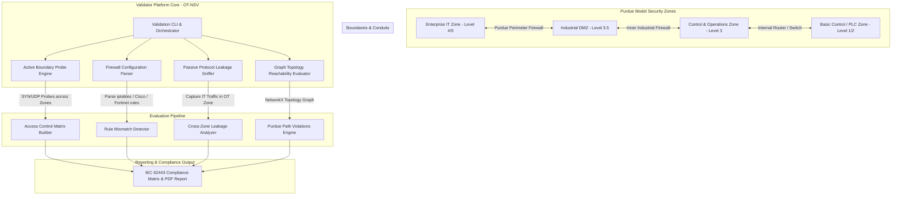

# 🎯 OT Network Segmentation Validator
> **Category**: [[04 - IoT & Embedded Security]] | **Difficulty**: ⭐⭐ | **Duration**: 5 weeks

---

## 📋 Problem Statement

> [!CAUTION] Real-World Impact
> Industrial manufacturing plants, energy facilities, and transport networks rely on strict isolation between corporate Enterprise IT networks (Purdue Model Levels 4-5) and Operational Technology networks (Purdue Model Levels 0-3). Flat networks lacking proper internal firewalls or demilitarized zones (DMZs) allow corporate IT ransomware (e.g., WannaCry, Colonial Pipeline attack) to pivot into critical plant floors, halting physical production.

Compliance frameworks (IEC 62443 / NIST SP 800-82) dictate that OT networks must be partitioned into logical security "Zones" connected exclusively through strictly controlled "Conduits" (DMZ firewalls with unidirectional gateways and deep packet inspection).

In practice, misconfigured switch VLANs, dual-homed engineering laptops, rogue Wi-Fi access points, and permissive firewall rules introduce unauthorized bypass paths between enterprise IT and control zones. Organizations need an automated, non-disruptive validation tool to audit physical/logical network segmentation enforcement continuously.

This project builds an OT Network Segmentation Validator (OT-NSV). The platform actively probes inter-zone boundary paths, audits firewall rule matrices against the Purdue Model architecture, passively maps cross-boundary protocol leakages, and generates IEC 62443 compliance gap reports.

### 🌍 Real-World Incidents
- **Colonial Pipeline Ransomware Breach (2021)**: Compromise of an un-segmented corporate IT virtual private network (VPN) led management to shut down the entire fuel pipeline system due to uncertainty regarding malware spillover into OT billing/control networks.
- **Norsk Hydro Aluminum Plant Cyberattack (2019)**: LockerGoga ransomware spread from IT active directory controllers across unsegmented local subnets into European plant floors, forcing manual plant operation and causing $70M+ in damages.
- **Oldsmar Water Treatment Facility Intrusion (2021)**: Attackers accessed remote access software (TeamViewer) on an IT-connected workstation and modified lye concentration levels due to missing inner OT network segmentation boundaries.

---

## 🔬 Research Paper References

| # | Paper Title | Authors | Year | Source | Key Contribution |
|---|-------------|---------|------|--------|-----------------|
| 1 | Automated Verification of Network Segmentation for Industrial Control Systems | Dondossola et al. | 2019 | IEEE Transactions on Industrial Informatics | Graph-based reachability algorithm for auditing Purdue Model firewall policies |
| 2 | Assessing Network Segmentation in Converged IT/OT Infrastructure | Stouffer et al. | 2021 | NIST Special Publication 800-82 Rev 2 | Framework defining conduits, security zones, and multi-layer firewall audit methodology |
| 3 | Efficacy of Unidirectional Gateways and DMZ Architecture in OT Security | Cherdantseva et al. | 2022 | Computers & Security | Empirical measurement of cross-zone protocol leakage across industrial perimeter firewalls |

---

## 🏗️ System Architecture
Link: [[Drawing 2026-07-30 22.31.19.excalidraw#Project 058: 058 - OT Network Segmentation Validator|Excalidraw Architecture Diagram]]

---

## 📐 Technical Implementation

### Phase 1: Environment Setup & Purdue Network Emulation (Week 1)
- Deploy Docker / GNS3 network emulating Purdue Model security zones:
  - **Zone 1 (Enterprise IT)**: 10.10.0.0/16
  - **Zone 2 (Industrial DMZ)**: 172.16.0.0/24 (Jump box, Historian)
  - **Zone 3 (OT Control)**: 192.168.1.0/24 (HMI, SCADA)
  - **Zone 4 (Process Level 1)**: 192.168.2.0/24 (PLCs, IO)
- Interconnect zones via Linux `iptables` / `VyOS` virtual firewalls.
- Install software stack: `python-networkx`, `scapy`, `nmap-python`, `pandas`, `paramiko`, `reportlab`.

### Phase 2: Configuration Parser & Reachability Graph Engine (Weeks 2-3)
- Build firewall rule configuration parser:
  - Ingests `iptables-save`, Cisco ASA, and Fortinet configuration files.
  - Converts firewall rule tables into a directed graph structure using `NetworkX`:
    - Nodes = Subnets / Security Zones.
    - Edges = Allowed protocol traffic paths (source IP, dest IP, port, action).
- Implement shortest-path reachability algorithms evaluating whether any path exists from Level 4 (IT) to Level 1 (PLC Zone) bypassing the Industrial DMZ.

### Phase 3: Active Probing & Passive Leakage Detection (Weeks 4-5)
- **Active Probing Module**:
  - Sends low-rate TCP SYN / UDP probes targeting common industrial and enterprise ports across zone boundaries.
  - Flags unauthorized cross-zone access paths (e.g., RDP port 3389 open directly from IT to HMI, or Modbus port 502 accessible from IT).
- **Passive Leakage Sniffer Module**:
  - Captures network traffic at OT switch SPAN ports.
  - Detects inappropriate protocol leakage inside control zones (e.g., active Directory Kerberos, NetBIOS, mDNS, or Dropbox cloud traffic appearing inside Level 2 PLC subnets).

### Phase 4: IEC 62443 Compliance & Reporting (Week 5)
- Map identified segmentation violations directly to IEC 62443-3-2 (Security Risk Assessment and System Design) and NIST SP 800-82 requirements.
- Produce automated PDF and HTML executive reports containing interactive NetworkX zone reachability maps, violation matrices, and firewall rule remediation recommendations.

---

## 🔧 Tools & Technologies

| Tool | Purpose | Alternative |
|------|---------|-------------|
| **Python NetworkX** | Graph theory modeling for multi-zone reachability analysis | PyVis / Gephi |
| **Scapy / Nmap** | Custom packet probing across perimeter firewalls | Masscan / RustScan |
| **Linux iptables / VyOS** | Open-source router and firewall for Purdue model emulation | pfSense / Cisco VIRL |
| **Wireshark / TShark** | Passive packet analysis for cross-zone protocol leakage detection | Zeek |
| **ReportLab / Jinja2** | Automated PDF and HTML security compliance report rendering | WeasyPrint |

---

## 💡 Key Features
- ✅ **Graph-Based Reachability Analysis**: Uses `NetworkX` graph algorithms to identify illegal multi-hop paths bypassing DMZ controls.
- ✅ **Multi-Vendor Configuration Parsing**: Supports parsing `iptables`, Cisco ASA, and Fortinet firewall rule sets out of the box.
- ✅ **Non-Disruptive Active Probing**: Ultra-low-rate, rate-limited SYN probing designed specifically to prevent resetting fragile embedded PLCs.
- ✅ **Passive Protocol Leakage Detection**: Identifies enterprise IT broadcasts (SMB, NetBIOS, mDNS) leaking into OT control subnets.
- ✅ **IEC 62443 Compliance Mapping**: Automatically maps segmentation flaws to standardized international OT security requirements.

---

## 📊 Expected Results

> [!NOTE] Deliverables
> Complete Python OT segmentation auditing framework, Purdue model GNS3/Docker topology setup files, sample firewall configs, and IEC 62443 compliance report generator.

### Performance Metrics
- **Graph Evaluation Speed**: Sub-second reachability graph calculation for networks with up to 500 firewall rules.
- **Probing Safety**: Zero packet drops or CPU spikes on emulated PLC interfaces.
- **Leakage Detection Recall**: 100% identification of un-sanitized enterprise broadcast traffic inside OT zones.

### Output Artifacts
1. `ot_segmentation_validator.py`: Main CLI tool.
2. `firewall_config_parser.py`: Multi-vendor firewall rule set parser module.
3. `iec62443_compliance_report.pdf`: Generated visual PDF report output.

---

## 🎓 Learning Outcomes
1. 📚 **Purdue Model Architecture**: Deep understanding of industrial network zoning (Levels 0 to 5) and conduit isolation principles.
2. 📚 **Graph Theory in Cybersecurity**: Modeling network firewall policies as directed graph matrices to perform automated reachability validation.
3. 📚 **Cross-Zone Protocol Risks**: Identifying high-risk administrative protocols (RDP, SSH, SMB) traversing IT/OT perimeters.
4. 📚 **Industrial Security Compliance**: Applying international standards (IEC 62443 and NIST SP 800-82) to real-world infrastructure auditing.

---

## ⚠️ Ethical Considerations
> [!WARNING] Legal & Ethical Notice
> Active network probing against OT switches and firewalls must be performed only during scheduled maintenance windows or on offline staging networks. High-rate packet probing can cause legacy serial-to-Ethernet converters and PLCs to fail.

---

## 🔗 Related Projects
- [[048 - CAN Bus Intrusion Detection for Connected Vehicles]]
- [[049 - MQTT Protocol Security Testing Tool]]
- [[053 - Industrial SCADA-ICS Security Assessment Platform]]

---
*📅 Created: 2026-07-30 | 🏷️ Category: IoT & Embedded Security | 🔐 Offensive Security Research*
