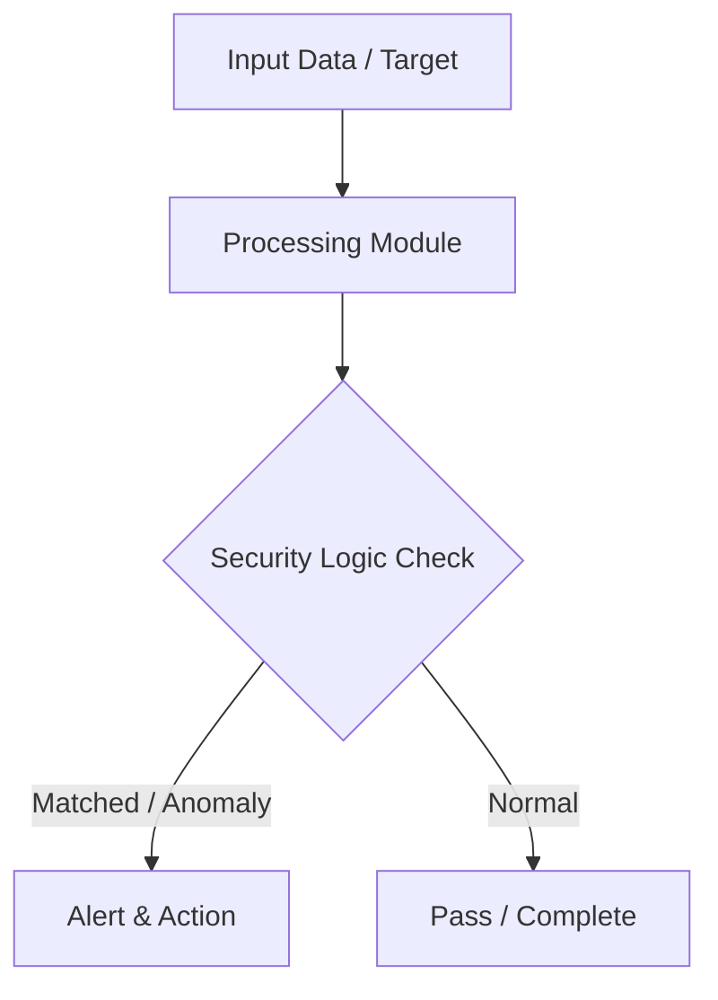

# 001 - Simple File Integrity Monitor (FIM) using SHA-256

> **Category**: Basic Cybersecurity Projects | **Difficulty**: ⭐ Basic | **Duration**: 1-2 weeks

---

## Problem Statement and Real World Impact

Real-world applications me yeh problem kafi common hai. Detecting unauthorized file tampering, unauthorized configuration edits, or ransomware modifications in critical directories.

Jab hum beginner-level cybersecurity practicals ki baat karte hain, toh foundational concepts ko code ke zariye samajhna sabse effective tareeka hota hai. Yeh project ek simple Python script ke zariye is real-world problem ko directly solve karta hai.

---

## Textbook & Paper References

- **Book Reference**: Cryptography and Network Security by William Stallings (Chapter on Cryptographic Hash Functions & SHA-256 Integrity)
- **Research Paper**: A Survey of File Integrity Monitoring Systems (IEEE Security & Privacy, 2018)

---

## System Architecture

Link: [[Drawing 2026-07-30 22.31.19.excalidraw#Project Basic-001: 001 - Simple File Integrity Monitor (FIM) using SHA-256|Excalidraw Architecture Diagram]]



---

## Technical Implementation Code

Python script using hashlib to compute SHA-256 baseline hashes of directory files, store them in JSON, and detect modifications, additions, or deletions.

```python
import os
import hashlib
import json
import time

def calculate_sha256(filepath):
    sha256_hash = hashlib.sha256()
    try:
        with open(filepath, "rb") as f:
            for byte_block in iter(lambda: f.read(4096), b""):
                sha256_hash.update(byte_block)
        return sha256_hash.hexdigest()
    except Exception as e:
        return None

def create_baseline(directory, baseline_file="baseline.json"):
    baseline = {}
    for root, dirs, files in os.walk(directory):
        for file in files:
            full_path = os.path.join(root, file)
            file_hash = calculate_sha256(full_path)
            if file_hash:
                baseline[full_path] = file_hash
    
    with open(baseline_file, "w") as f:
        json.dump(baseline, f, indent=4)
    print(f"[+] Baseline created with {len(baseline)} files.")

def monitor_integrity(directory, baseline_file="baseline.json"):
    if not os.path.exists(baseline_file):
        print("[-] Baseline file not found! Run baseline creation first.")
        return
        
    with open(baseline_file, "r") as f:
        baseline = json.load(f)
        
    current = {}
    for root, dirs, files in os.walk(directory):
        for file in files:
            full_path = os.path.join(root, file)
            file_hash = calculate_sha256(full_path)
            if file_hash:
                current[full_path] = file_hash
                
    # Compare
    for path, old_hash in baseline.items():
        if path not in current:
            print(f"[!] DELETED FILE DETECTED: {path}")
        elif current[path] != old_hash:
            print(f"[!] MODIFIED FILE DETECTED: {path}")
            
    for path in current:
        if path not in baseline:
            print(f"[!] NEW FILE CREATED: {path}")

# Example Usage
if __name__ == "__main__":
    target_folder = "./test_folder"
    os.makedirs(target_folder, exist_ok=True)
    create_baseline(target_folder)
    print("[*] Monitoring directory for changes...")
    monitor_integrity(target_folder)

```

---

## Expected Results & Outcomes

1. Clear understanding of underlying networking, hashing, or system security mechanics.
2. Functional, lightweight Python script ready to execute in a local lab.
3. Verification of security controls against common real-world misconfigurations.

---

## Legal and Ethical Notice

> [!WARNING] Educational Use Only
> Always run these basic projects in your own local testing environment or authorized laboratory network.

---

## Related Index
- [[00 - Basic Cybersecurity Projects Index]]
